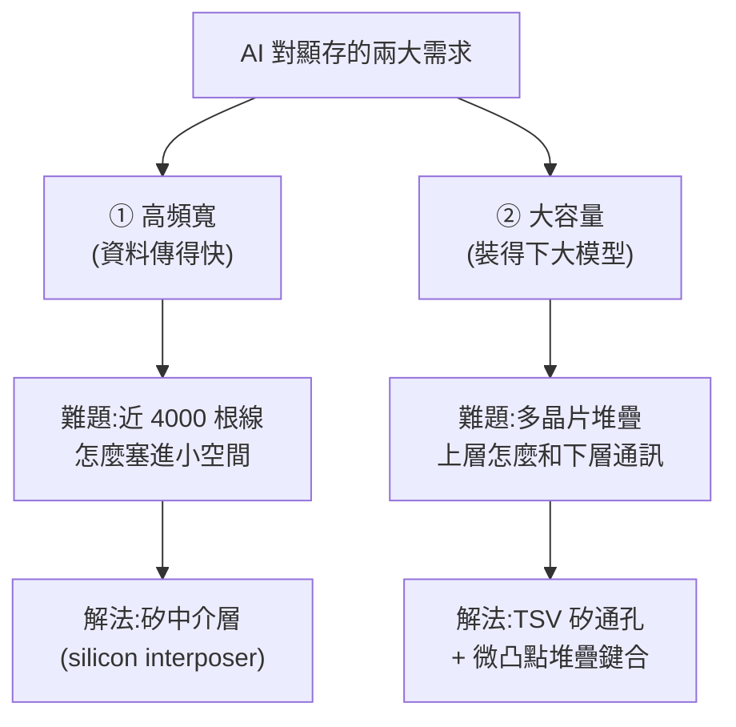
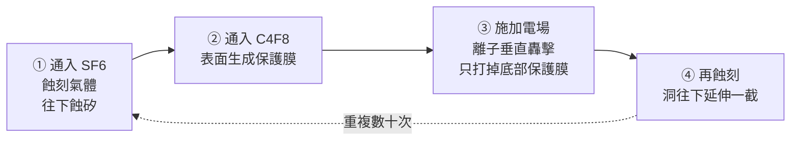
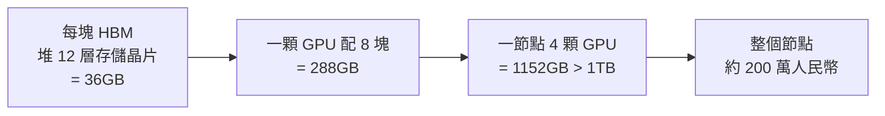

# HBM 高頻寬記憶體原理:矽中介層、TSV、堆疊鍵合一次看懂

> 整理自 YouTube「Redknot-乔红」〈用最好的动画为你讲解--HBM的原理〉(2026-06-18,約 16.7 分鐘)。這支動畫把 **HBM(High Bandwidth Memory,高頻寬記憶體)** 從「為什麼需要它」一路講到「它到底怎麼造出來」——涵蓋頻寬原理、矽中介層、TSV 矽通孔(博世製程)、晶片堆疊與鍵合、散熱、HBM4 路線圖,以及它為何是這波**記憶體漲價的元兇**。HBM 是當前 AI 高階顯卡的「核心剛需」,值得把原理搞清楚。

---

## 一句話總結

家用遊戲卡(如 RTX 5090)的 GPU 周圍排著一圈獨立的 **GDDR 顯存顆粒**;但 AI 資料中心節點(如 NVIDIA GB300)的 GPU 旁邊**看不到那種顆粒**——因為它的顯存是 **HBM**,直接和 GPU **封裝在一起**。HBM 的兩大本事與兩大難題:

**頻寬靠「矽中介層」做超寬位寬;容量靠「TSV + 堆疊」往上疊。** 這兩招就是 HBM 的全部魔法。

---

## 1. 頻寬的本質:頻寬 = 頻率 × 位寬

顯存顆粒和 GPU 之間用**導線**連接,靠**電壓信號**傳資料:高電壓代表 1、低電壓代表 0。要傳 `01010`,線上電壓就是低高低高低。想傳更快有兩條路:

- **提升頻率**:縮短每個電壓信號持續的時間(低高低高 → 擠得更密)。
- **提升位寬(bit width)**:多加幾根導線,把資料**拆開並行傳**。

> **頻寬 = 頻率 × 位寬。** 要提升頻寬,要嘛拉高頻率、要嘛加寬位寬、要嘛兩者都來。

**但在顯存這裡,拉高頻率問題很多**:電壓從低變高(或高變低)不是瞬間完成,要等信號**完全抬起或完全降下**才能進下一個傳輸週期,所以頻率有物理上限;而且頻率一高,**每條資料線之間的干擾會變嚴重**。

> **所以 HBM 的選擇是:放棄拚頻率,改用「極高的位寬」來堆頻寬。**

### GDDR vs HBM 的位寬差距

| | 單顆位寬 | 一張卡/一顆 GPU 的配置 | 總位寬 |
|---|---|---|---|
| **GDDR7**(RTX 5090) | 32 bit | 滿載 16 顆 | 512 bit |
| **HBM3e**(GB300 的 B300) | **1024 bit** | 周圍 8 顆 | **8192 bit** |

HBM 單顆的位寬就是普通 GDDR 的 32 倍。問題來了:**HBM 怎麼做到這麼大的位寬?**

---

## 2. 難題一:近 4000 根導線怎麼布?→ 矽中介層

**1 bit 位寬 = 1 根傳資料的導線。** 而且實際上除了資料線,還要供電線、地址線、時鐘線。算下來:

- 普通 GDDR7(32 bit 資料)實際有 **266 根**導線;更早的 GDDR6 也有 180 根。
- HBM3e(1024 bit)**光資料線就要 1024 根**,加上配套線,總共 **3982 根導線**。

**HBM 的第一個難題:怎麼在這麼小的空間裡接出近 4000 根線?**

### 普通 GDDR 的做法(以及它的天花板)

存儲核心電路做在一片**很薄又很脆**的矽片上,觸點極小,不利後續加工。所以會準備一個**基板**:用**玻璃纖維編織成布 + 浸環氧樹脂固化**而成的硬板。矽片用**倒裝(flip-chip)**方式倒扣在基板上,觸點直連基板,基板內部多層走線把信號引到背面再植上錫球。

基板的電路怎麼做?玻纖布浸環氧樹脂 → 高溫壓成硬板 → 兩面貼銅箔 → 貼感光膜 → 紫外光透過光罩曝光 → 顯影液洗掉未曝光部分 → 泡腐蝕液把裸露的銅蝕掉 → 電路成形。實際封裝基板通常 **4–8 層像千層餅疊起來**,用雷射鑽孔打通各層。

> **但這套工藝的走線密度極其有限**,原因有二:① 玻纖表面坑坑窪窪,貼銅箔/感光膜時難免有氣泡,線做太細碰上氣泡就斷;② 化學藥劑腐蝕**不只縱向、也會橫向側蝕**,線太細側邊會被掏空而斷線。再加上普通顯存最後還要焊到 PCB、再由 PCB 連到 GPU,而 PCB 工藝和基板差不多,密度同樣上不去。

### HBM 的解法:用「矽」當中介層

玻纖基板表面太粗糙,滿足不了近 4000 根線。於是換一種全新材質——**矽**(沒錯,就是用來光刻晶片的矽):

1. 做一片**大矽片**,表面打磨到比鏡子還平整;
2. 用**光刻 + 刻蝕**在矽表面開出精細凹槽,再用**沉積工藝把銅填進去**形成電路;
3. HBM 晶片**直接焊到這片矽上**,GPU 也直接焊上去 → HBM 透過這片大矽和 GPU 互聯。

這片負責「牽線大橋」的大號矽片,就叫 **矽中介層(silicon interposer)**。

> 它**本質上是一片沒有電晶體的晶片**,表面比鏡子還平,所以能用成熟的光刻/刻蝕/薄膜沉積工藝做出極精細的金屬線——線寬不再受限於玻纖基板的「十幾微米」,而能輕鬆做到**1 微米以下、甚至幾百奈米**。同樣面積能容納的走線數量是玻纖基板的**幾十倍甚至上百倍**。布線密度大幅提升,**速度問題解決了。**

---

## 3. 難題二:容量怎麼做大?→ 堆疊 + TSV 矽通孔

AI 對顯存還有個更硬的要求:**容量**。HBM 和 GDDR 面積差不多,但 GDDR7 單顆才 2GB,5090 滿載 16 顆也只有 32GB——玩遊戲夠,但**對 AI 太少**。

解法是 **堆疊(stacking)**:把多個**沒有封裝的存儲裸片**疊起來,**共用底部的矽中介層**,不必擴大底部佔位面積,容量就成倍提升。

**但堆疊最大的問題是:上層晶片怎麼和下層通訊?** 從晶片側面拉導線出來?不可能——每層要拉幾千根線,中介層上根本鋪不開,而且線細到連黃金都拉不出來。工程師的辦法是:

> **在矽片上打洞,穿入銅柱**,每層晶片連到銅柱、再由銅柱連到底部的矽中介層。這種技術叫 **TSV(Through-Silicon Via,矽通孔)**。

### 3a. 怎麼在矽上打 5–10 微米的洞?→ 博世製程(DRIE)

孔徑只有 5–10 微米,用鑽頭絕對不行。業界用 **深反應離子刻蝕(DRIE)**,又叫 **博世製程(Bosch process)**。它的精髓是「**蝕刻 → 保護 → 轟擊**」三步循環:

- **蝕刻**:通入 **SF6(六氟化硫)**,被線圈電離成氟自由基,和裸露的矽反應生成氣態 SiF4,矽被蝕掉。但蝕刻**同時縱向也橫向**,放任下去會蝕成一個大球形空腔,而不是垂直的洞。
- **保護**:所以蝕一段就停,改通 **C4F8(八氟環丁烷)**,電離後的自由基在矽表面**重新聚集形成一層保護膜**。
- **轟擊**:再通 SF6 時,保護膜會擋住蝕刻;而 SF6 電離時除了自由基還會產生**離子**,此時在腔室施加電場**引導離子垂直向下**,轟掉**洞底部**的保護膜(側壁的保護膜因為電場是垂直的而被保留)。底部露出後蝕刻氣體就能繼續向下蝕。

如此「蝕刻—保護—轟擊」反覆,洞就一節一節**垂直往下延伸**。矽片一般有七八百微米厚,但這裡只打約 **100 微米**;之後會把矽片**從背面整個磨薄**讓洞露出來(現在還不磨)。

### 3b. 洞裡怎麼填銅?(三層襯墊 + 電鍍)

打好洞後不能直接灌銅,要先做三層襯墊:

1. **絕緣層**:用氣相沉積(CVD)在洞內壁鍍一層緻密的 **二氧化矽(SiO2)**,像給銅柱套一層陶瓷管,把銅和矽隔開。
2. **阻擋層**:銅原子很不老實,時間久了會往矽裡擴散、破壞矽的晶體結構。所以絕緣層和銅之間還要加一層 **鉭(Ta)或氮化鉭(TaN)**,只有幾奈米厚卻能有效阻擋銅擴散。
3. **銅種子層**:再沉積一層導電的銅種子層,然後把矽片泡進**硫酸銅溶液電鍍**,銅離子在種子層和孔壁上一點點沉積,最後把孔**填滿**。

最後把整片矽**磨薄**,讓孔洞和裡面的銅露出來——一個貫穿、填滿銅的 TSV 就完成了。

### 3c. 微凸點鍵合:把十幾層疊起來

單層晶片做好後,在露出的銅柱表面用光刻+電鍍長出微小的**銅柱凸點**,頂部覆一層薄薄的**錫**,這就是 **微凸點(micro-bump)**。把多個晶片疊在一起、加熱加壓,微凸點上的錫融化焊在一起 → 每層晶片就靠**銅柱 + 微凸點**連起來,上層的資料一路向下穿透,最終傳到矽中介層。HBM 的核心存儲功能就成形了。

---

## 4. 填充與散熱:三家寡頭的兩種流派

堆疊好的晶片**非常脆弱**:每片被磨到幾十微米厚,靠細小的微凸點撐著,像一片**懸空的乾海台**,稍有外力就碎。解法是往晶片間的空隙**做填充**。能量產 HBM 的全球**只有三家**——**SK 海力士、三星、美光**,分兩個流派:

| 流派 | 做法 | 評價 |
|---|---|---|
| **SK 海力士**(MR-MUF) | 把所有晶片**一次性堆好整體加熱**,所有微凸點同時焊接,再放入模具**灌入液態環氧樹脂**流進縫隙,加熱加壓固化 | **更快**(不必逐層焊);焊接時晶片間除了微凸點沒別的東西干擾,**良率更好** |
| **三星 / 美光**(TC-NCF) | 兩層晶片間先夾一層**高分子薄膜**,加熱加壓時薄膜融化、微凸點焊接,冷卻固化,再逐層往上疊 | 一層一層焊,較慢 |

**散熱**是堆疊的大問題(多顆晶片疊在一起)。廠商會多做一些**不傳資料、專門散熱的通孔**;SK 海力士還在環氧樹脂裡**摻入高導熱顆粒**(把樹脂做成類似矽脂的東西)。結果 **SK 海力士的 HBM 散熱效率約是三星的兩倍**,這也讓它成為 HBM 市場霸主,**市佔約 50%**。

---

## 5. 算一筆帳:GB300 節點的容量與成本

把兩招合起來——矽中介層做到 1024 bit 位寬、堆疊做出超大容量:

- 每塊 HBM 堆 **12 層** → **36GB**;
- 一顆 GPU 配 **8 塊** → **288GB**;
- 一個節點 **4 顆 GPU** → **1152GB(超過 1TB)**;
- 這麼一個伺服器節點,**約值 200 萬人民幣**。

---

## 6. 路線圖:HBM4 與「銅銅混合鍵合」

- 目前大規模使用的是 **HBM3e**;各家已開始生產 **HBM4**:位寬來到 **2048 bit**、堆疊 **16 層** → 走線更密、疊得更高。
- HBM4 **仍用微凸點鍵合**,但**很可能是最後一代**:走線越密、微凸點間距越窄,焊接時很可能**把兩個微凸點焊到一起**(短路)。
- **未來方向:去掉微凸點,直接把打磨乾淨的銅怼在一起,讓銅表面發生擴散、融合成一個整體**(即 **銅銅混合鍵合 / hybrid bonding**)。這樣中間不用再填環氧樹脂,走線更密、堆疊更低、散熱更好。
- 但**沒有明確時間點**:幾年前就計畫在 HBM4 上用,結果至今沒用上;頭部企業都在積極布局,拭目以待。

---

## 7. 為什麼 HBM 是這波記憶體漲價的「元兇」?

HBM 有效助力了 AI、提供關鍵算力基礎設施;**但它的生產工藝與設備和傳統 DRAM 高度重疊**——產線就那些,大廠把產能優先轉去做利潤更高的 HBM,就**大量擠占了普通內存(DRAM)的產能**,使整個 DRAM 市場**供不應求、價格大幅上漲**。這也是為什麼「AI 熱」會傳導到你我買記憶體條的價格上。

---

## 應用案例 / 怎麼用這套知識

- **看懂 AI 硬體新聞**:以後看到「HBM3e / HBM4」「12 層 / 16 層堆疊」「位寬 1024/2048 bit」「TSV」「CoWoS(台積電的 2.5D 先進封裝,矽中介層就是它的核心之一)」就知道在講什麼——它們都是在拚「位寬 × 容量」這兩個維度。
- **理解投資題材**:這支影片直接解釋了**記憶體漲價**與 **HBM 三寡頭(SK 海力士 / 三星 / 美光)** 的格局,也點出 SK 海力士靠散熱良率拿下約 50% 市佔。對照本庫投資筆記裡反覆出現的「HBM / 美光 / 記憶體 supercycle」題材,這篇補上**底層工藝為什麼是寡頭壟斷、為什麼難**的硬知識。
- **判斷供應鏈瓶頸**:HBM 難在矽中介層、TSV(博世製程)、堆疊鍵合與散熱——這些是**設備與良率密集**的環節(深刻蝕機、電鍍、混合鍵合機台),也是判斷「誰卡住誰」的關鍵。
- **理解封裝為何成為主戰場**:當電晶體微縮放緩,「**把更多晶片更密地連在一起**」(矽中介層 + TSV + 混合鍵合)就成了延續算力成長的主軸——這正是先進封裝(CoWoS、TGV/TSV)題材的技術根因。

> 延伸對照:本庫 [[nvidia-n1x-vs-x86]]、[[rtx-spark-gb10-soc]](AI 算力硬體)、[[ai-compute-token-economics]](算力與 token 經濟)。

---

## 來源

- Redknot-乔红,〈用最好的动画为你讲解--HBM的原理〉,YouTube:<https://www.youtube.com/watch?v=yF2BY8kQfyo>(2026-06-18,約 16.7 分鐘)
- **該片無字幕,逐字稿以 CPU 版 faster-whisper(`vad_filter=True`、`condition_on_previous_text=False`,small 模型,zh)轉錄取得,非官方字幕**;大量半導體專有名詞(矽 silicon、矽中介層 interposer、TSV 矽通孔、博世製程 / DRIE 深反應離子刻蝕、SF6 六氟化硫、C4F8 八氟環丁烷、鉭 Ta / 氮化鉭 TaN、環氧樹脂、微凸點 micro-bump、混合鍵合 hybrid bonding)與數字(GDDR7 32bit/266 線、HBM3e 1024bit/3982 線/8 顆 8192bit、12 層 36GB、288/1152GB、市佔 50%、200 萬人民幣)依語音+專業常識還原,small 模型對同音字(矽/焊/環氧等)有可觀聽寫誤差、已校正,實際以原片為準。
