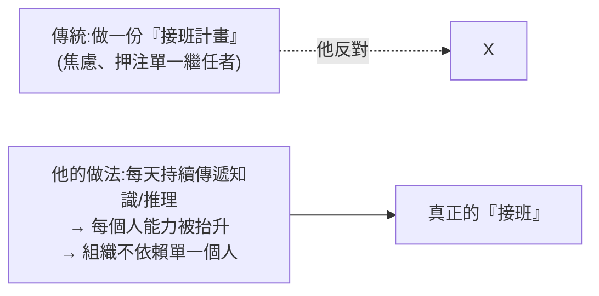

# 黃仁勳談生死與接班:不做「接班計畫」,而是不停傳遞知識

**主題分類:** 科技 / AI 產業 — 領導與願景
**來源:** YouTube〈黃仁勳談生死,和他獨特而豁達的接班人部署〉(Yaay World 雙語頻道,2026-05-26,約 7 分;NVIDIA CEO Jensen Huang 訪談,依逐字稿整理)
**整理日期:** 2026-05-30

> 這是一支以英文訪談為主的短片;以下萃取其中 **可遷移的領導觀** 與他對未來的願景(願景部分屬個人推測,當「他的想像」看)。

---

## 1. 最有價值的一課:接班哲學

黃仁勳出名地說 **「我不相信接班人計畫(succession planning)」**——但不是因為自以為不死,而是把問題往回拆到根:

> **如果你為「接班」焦慮,真正該做的是什麼?把它一路拆解到底,你今天最該做的事就是:盡可能 **頻繁且持續地** 把知識、資訊、洞見、技能、經驗傳下去。**

他怎麼做到:
- **每一場會議都是「推理會議」(reasoning meeting)**——他在團隊面前 **把思考過程攤開推理**,而不只是給結論。
- **知識絕不在他桌上多停留一秒**:他學到任何東西,「還沒學完就已經指給別人——『去搞懂這個,超酷,你會想學』」。
- **持續賦能、抬升身邊每個人的能力。**
- 他期望的結局:**「死在工作崗位上」**(而且最好是瞬間,不要長期受苦)——把「組織不依賴單一個人」當成日常實踐,而非一份文件。

> **可遷移心法:** 「接班」不是挑一個人、寫一份計畫,而是 **把你腦中的判斷與推理持續外化、傳給整個團隊**。組織的韌性來自 **知識擴散**,不是某個繼任者。

---

## 2. 是什麼給他希望

- **對人性的信心:** 他一向相信人的善意、慷慨、同理與能力——「我總是先假設人想做好事、想幫助別人,而我 **一再被證明是對的**,常常還超出預期」(即使偶爾被佔便宜也不改變)。
- **對「可能性」的外推:** 看著現在做得到的事往外推,**太多想解決的問題、想建的東西,如今都在能力(與他有生之年)可及範圍**——「你不可能不對此感到浪漫(romantic)」。

---

## 3. 他的大膽願景(個人推測,當「想像」看)

- 合理可期:**疾病的終結、污染大幅減少、短距離光速旅行**。
- **把人形機器人送上太空船**(他自己的 humanoid),沿途持續自我增強;時機到時,**把他「已上傳到網路的意識」(inbox、所做所說所收集成的 AI)以光速送出去、追上那台機器人**。
- **科學近在眼前:** 理解「生物機器」(人體)可能只要約 5 年、解開神經生物機器(人腦)、攻破理論物理、**解釋意識**——「都在我們可及範圍」。
- 他自承這些對他是「應用導向 + curiosity maxing(把好奇心最大化)」。

---

## 4. 應用案例:把「接班=知識傳遞」落到團隊

- **主管別只交辦結論,開「推理會議」:** 在團隊面前把「為什麼這樣決定、考慮過哪些取捨」講出來,讓判斷力擴散(呼應 [[karpathy-software-3-0]]「不能外包理解」)。
- **知識不囤在自己手上:** 學到有用的東西立刻轉傳、指派、教學,而非等「有空再整理」。
- **把個人判斷外化成可複用資產:** 寫成文件/SOP/skill——這正是 [[building-claude-skills]] 講的「把你多年累積的判斷轉移給 agent/團隊」、[[claude-skills-governance-man-group]] 的「組織 context 就是 IP」。**最好的「接班計畫」是讓你的思考方式人人可得。**

> 一句話:**別把續存賭在一個人身上;把它建在「持續傳遞知識」這個日常習慣上。**

---

## 來源

- [YouTube:黃仁勳談生死,和他獨特而豁達的接班人部署(Yaay World)](https://youtu.be/UPF9Ogid4N0)
