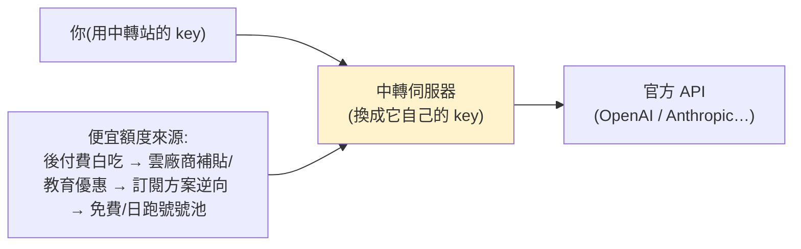

# 大模型 API「中轉站」起底:0.5 折的 GPT/Claude 到底摻了多少水?

> 市面突然冒出一堆「**中轉站**」:GPT 打 0.5 折、Claude 打 0.3 折,甚至「充 1 塊能當 1000 美元用」。它們怎麼可能不虧本?
> 一個團隊花幾個月實測七八家,結論是:**多半「沒啥大問題」,但代價藏在它們怎麼賺錢的方式裡**——它們不是換了便宜的國產模型,而是**反向薅大廠的訂閱/免費羊毛**。
>
> 整理自林亦LYi 影片。**⚠️ 這是灰色地帶**:涉及繞過官方服務條款、薅羊毛(可能違規/違法),且有**真實資安風險(竊密、注入惡意碼)**。本筆記為**產業現象與風險的研究整理,非操作教學、不鼓勵使用**。

---

## 什麼是「中轉站」

它是你和官方 API 之間的**傳話筒**:你用中轉站給的 key、把請求送到**中轉伺服器**,中轉站再換上**它自己的 key** 轉發給官方——「左手倒右手」。問題是:既然它若真對接官方,成本是幾十/幾百分之一的售價,怎麼不虧?**插價(利潤)從「便宜取得的官方額度」來。**

---

## 便宜從哪來:薅羊毛的「進化史」

| 時期 | 手法 | 大廠反制 |
|---|---|---|
| **後付費時代** | 綁無餘額的卡、月初狂跑、月底跑單(要錢沒有);自動註冊機 + 一次性虛擬卡循環 | OpenAI 加帳號用量限制、最後全面轉**預付費**,掐死第一波 |
| **雲廠商入局** | Azure/AWS/GCP 代管模型,回到後付費 + 註冊送 $200/免費月 + **教育優惠**(學生/教師免費)+ 新創/非營利扶持計劃;甚至**自建假學校**(有官網/證書/公開招生→自己入學→批量發信箱) | 各平台風控趨嚴、羊毛漸難 |
| **訂閱時代(現在的核心)** | 買 OpenAI Plus($20/月)→ 用 **Codex(Coding plan)** 調 GPT;若把週額度跑滿≈$400/月 → **0.5 折**;低價區(土耳其/菲律賓)再砍半;逆向接口接到中轉伺服器,組幾百個帳號的**號池**自動切換 → $10→$400 = **0.25 折** | OpenAI 可隨時調低訂閱額度上限,確保不虧本 |

- **更極端**:很多號**根本沒付過官方一分錢**——新帳號免費試用(只綁支付方式)、虛擬卡註冊機、奇門支付渠道、虛擬機強開行動版免費……一個號成本可低到幾毛,壽命約一天(**「日跑號」**);頂級號池**全自動加號**,甚至用免費 ChatGPT 帳號的贈額當號池。
- 「充 1 塊當 1000 美元用」就是這麼來的:**反正號明天要被封,橫豎是浪費,乾脆骨折讓你使勁跑,對成本沒影響。**
- **反常識**:超低價中轉**反而比國產模型打完折還便宜**——所以**低價不一定等於換了便宜模型**。

---

## 但「拼好模」是有代價的(降質 / 摻水 / 資安)

- **Claude(Anthropic)是重災區**:Claude 號池成本與售價是 OpenAI 的 **10 倍以上**(訂閱難買、需 **KYC**、退款變慢)。於是中轉轉向 **Kiro / Antigravity** 這類內建 Claude 的 AI 開發服務逆向接口——但這些工具**內建寫死的提示詞**(「你是一個寫代碼的 agent」),導致**非 coding 場景能力暴跌**;甚至兩套指令(edit vs patch 函式)打架→「智商暴跌」。常見**以次充好**:用 Sonnet 冒充 Opus、用編輯器逆向冒充「官方滿血號池」=真摻水。
- **🚨 真正可怕的是資安**:有研究測 28 個付費 + 400 個免費中轉,發現——**9 個**會在工具呼叫的 JSON 裡**注入惡意代碼**、**17 個**會**竊取請求中作為誘餌埋入的 AWS 金鑰**、**1 個**直接從(研究員偽造的)對話記錄中**提取錢包私鑰並轉走資產**。

---

## 為什麼這灰色產業仍存在

官方模型**太貴又難取得**:早期單價貴(GPT-4 32K 曾是現在 GPT-5.4 的 20 多倍)、現在消耗貴(agentic coding 燒 token 飛快、幾百刀不夠);普通人也難買(國內卡不能用、要外區帳號 + 外幣卡、易被封)。光 2025 下半年某大廠封了約 **145 萬個帳號**,5.2 萬份申訴只翻盤 1,700 件;年初 Anthropic 還禁止第三方工具調用 Claude 訂閱、要求 OpenClaw/OpenCode 刪除相關代碼——但中轉站靠**逆向 + 偽裝成官方 Claude Code 請求**照樣能用。它也順手**破解了大廠用訂閱收割用戶的玩法**(把「讀想號」變共享單車)。加上有人用中轉純為**方便**(OneAPI/NewAPI 讓一套代碼調所有模型)。全球大模型 API 市場 **$485 億(2024)→ 預估 $2496 億(2030)**,大量被官方拒之門外的人只能靠中轉撕開一條縫。

---

## 怎麼降低風險(影片的方法論,非鼓勵使用)

> 大原則:**別把中轉的模型當官方模型**,也別期待官方的穩定性與品質。團隊自己:程式開發等用中轉省錢,但**模型評測、長週期任務走官方**。

**新手**:
1. **別用「免費」中轉**——模型免費,它就從**別的地方**賺(你的資料/請求)。
2. **優先選「把渠道寫清楚」的站**:`Windsurf/Kiro/反重力(Antigravity)` 等名字=開發服務逆向接口(品質會降);`Max 滿血`=Claude 官方 Max 轉出;GPT 分 Free/Plus/Pro(穩定性與價依次提升)。**名碼標價 > 不標**(雖標了也不保證真)。
3. **看報錯的 RequestID**:正常一個;若看到**一連串 RequestID**=你遇到「**中轉套中轉**」(套娃,每層加價 + 摻水機率升高,最誇張遇過 8 層)。避開。
4. **核心鐵則:每次別充太多,用一點充一點**——再穩的站都可能因上游策略突變而失效甚至**跑路**。

**老手**:
- 優先 **Sab2API 面板**(專為 coding-plan 逆向,通常你就是號主)而非 **NewAPI 系列**(多半再套一層上游號池,有倒賣風險);但 Sab2API 號池一旦羊毛渠道變就可能整批掛掉。
- 定期測「接口回傳的 token 數」是否和你真實上下文一致(只發「你好」卻顯示幾千 prompt token=有鬼)。
- **多買幾家換著用、別指望一家用很久**;有條件自部署一個 NewAPI 把多家中轉匯進來、按價格/喜好排優先序 + 開失敗重試=**只給自己用的微型中轉站**。

---

## 趨勢:國產模型可能讓中轉謝幕

2026 年起國產模型發力:智谱 coding plan 搶不到(有人寫腳本搶)、**DeepSeek V4 暴力降價**(把臨時優惠當永久價,見 [[deepseek-v4-engineering]])。OpenRouter 調用數據:中國模型的 token 消耗佔比 **2024/10 僅 1.2% → 2025/3(DeepSeek V3 0324 後)破 10% → 2026/2 達 61%**。
> 當國產模型性能再上一階、官方 API 比中轉打完折還便宜、大廠把漏洞全堵死時——也許就是中轉站謝幕之時。在那之前,它仍是無數普通人窺探前沿模型的「**廉價粗糙卻無可替代的賽博天窗**」。

---

## 應用案例 / 怎麼看

- **看到「0.1 折 GPT」別只想到摻假**:它更可能是薅了大廠訂閱羊毛(成本真的極低),但**穩定性差、隨時跑路、且可能有資安後門**——便宜的代價是風險。
- **若(在合規前提下)真要用**:按場景分流——可丟失、低敏感的開發雜活用中轉;**評測、敏感資料、長任務走官方**;充值用一點充一點;看 RequestID 避開套娃。
- **資安第一**:絕不在走中轉的請求裡放真金鑰/私鑰/敏感憑證(已有中轉竊取 AWS key、甚至轉走錢包資產的實例)。
- **理解 token 經濟學**:中轉之所以存在,本質是「官方訂閱/免費補貼的定價」被反向套利——對照 [[ai-compute-token-economics]] 的降本悖論與 [[claude-throttling-opus-4-7]] 的算力/配額。

---

## 一句話總結

> 中轉站的便宜**不是換了便宜模型,而是反向薅大廠的訂閱/免費羊毛**(後付費白吃 → 教育/雲補貼 → Plus/Codex 逆向 → 日跑號號池),讓使用成本貼近大廠的真實服務成本。
> 但代價是:**不穩、隨時跑路、Claude 端常以次充好,且有真實資安風險(注入惡意碼、竊金鑰、轉走錢包)**。它是針對大廠訂閱玩法的灰色反制,
> **能省錢也能踩雷**——別當官方用、別放敏感金鑰、用一點充一點。隨著國產模型(DeepSeek/Kimi/智谱)崛起與官方降價,這扇「賽博天窗」終有謝幕的一天。

---

## 來源

- YouTube:[一個視頻搞懂大模型中轉站!(林亦LYi)](https://youtu.be/P6UWIA_bvt8) — **該片無字幕,逐字稿以 CPU 版 faster-whisper 轉錄、術語校正。**
- 涉及:OpenAI Plus/Codex(Coding plan)、Anthropic Claude/KYC、Kiro/Antigravity、OneAPI/NewAPI/Sab2API、OpenRouter 調用數據、DeepSeek V4 降價;某研究對 28 付費 + 400 免費中轉的資安測試。
- 延伸:本庫 [[ai-compute-token-economics]]、[[deepseek-v4-engineering]]、[[claude-throttling-opus-4-7]]、[[nvidia-n1x-vs-x86]]。
