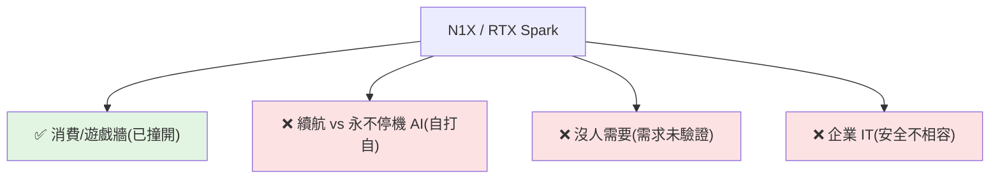

# NVIDIA N1X 能撞開 x86 四十年的城牆嗎?三個變量決定成敗

> Windows 想甩掉 x86 改用 Arm,這條路上**已經倒了三家**(微軟兩次、高通一次)。2026 年 6 月台北 Computex/GTC,
> 黃仁勳掏出 **RTX Spark 平台** 與 **N1X 超級晶片**,說「這第四次不一樣」。問題只有一個:**到底哪個變量真的變了?**
> 答案是:**他換的不是速度,是 CUDA。** 但前方還有三堵他沒打穿的牆。
>
> 整理自 YouTube 頻道「基地」影片。**逐字稿以 CPU 版 faster-whisper 轉錄,專有名詞已校正。**

---

## 為什麼這堵牆四十年破不了:靠的是軟體,不是速度

x86 是 Intel/AMD 把守近 40 年的 PC 處理器架構;整個 Windows 世界幾十年的軟體都是衝著它寫的。
**規格表誰漂亮從不是勝負手,「能不能把老軟體一個不漏地跑起來」才是。** 前三次衝鋒都死在這堵**軟體相容性牆**:

| 挑戰者 | 年份 | 怎麼死的 |
|---|---|---|
| **Windows RT**(Surface RT,用 NVIDIA Tegra) | 2012 | **餓死**:系統鎖死、32 位 x86 老軟體一個都不讓裝、連模擬器都沒給 → 又貴又慢的平板 |
| **Surface Pro X**(SQ1/SQ2) | 2019 | **被翻譯層拖死**:有模擬器(x86-on-Arm)但純軟體硬扛、慢、64 位起初不支援、核心層(防毒/驅動)直接崩 |
| **Snapdragon X Elite** | 2024 | **準備最足卻拿不到 1%**:全球 PC 份額 **0.8%**(約 72 萬台)。兩刀:① 沒生態(高通 NPU 要用自家框架、開發者得重寫)② 內顯帶不動 3D/遊戲 |

> 三具棺材,傷口在同一個地方。

---

## N1X 是什麼怪物

RTX Spark 平台核心 N1X = **Arm CPU + 旗艦 Blackwell GPU + 一大塊統一記憶體**,全塞進一個封裝:

- **GPU**:Blackwell 2.0、48 組 SM = **6144 個 CUDA 核心**(和桌機獨顯 RTX 5070 同數),但整顆(CPU+GPU)功耗只約 5070 單卡(~200W)的一半多;含第五代 Tensor 核心(為 FP4 調過),AI 算力約 **1 PetaFLOP**。
- **記憶體**:最高 **128GB LPDDR5X 統一記憶體**——CPU 與 6144 核心都能直接拿、**零拷貝**,靠 NVLink-C2C 片間互連、頻寬 ~300GB/s。
- **能幹嘛**:在**斷網**情況下,本地跑動一個 **1200 億參數開源大模型**(4-bit 量化約吃 70GB),還能處理 **100 萬 token 上下文**。台積電 3nm。
- 意義:**過去要插電、連網、靠資料中心服務器才搬得動的事,現在搬到你腿上。**

---

## 真正的殺招不是速度,是 CUDA

前三次 Arm 陣營賣的是「續航、輕薄」——但這兩樣**蘋果做到極致、沒人比得過**,再去比就是第四次撞牆、結局寫好。
所以 NVIDIA **把戰場挪走**:它賣的不是更快的處理器,而是 **CUDA**。

- CUDA 是 NVIDIA 計算的軟體平台、**事實標準**:全世界 AI 代碼第一行就默認你插的是 NVIDIA 卡。這是**沒法被替代的軟體壟斷**。
- 過去十年一行行攢下的訓練腳本、`llama.cpp`、TensorRT 推理流水線,到 N1X 上**一行代碼都不用改、直接跑**;拿蘋果(Metal)或高通的本子跑同樣的活,得套翻譯層 → 卡頓、編譯延遲。
- **這叫把開發者「鎖死」**:你的代碼、習慣、全部夾檔都長在 CUDA 上,換平台等於推倒重來。
- **結論**:就算大模型上兩邊打平,**蘋果和高通也永遠給不了你原生 CUDA、一行不改就能跑**——這才是 NVIDIA 捏死人的那張牌。

---

## 但 CUDA 是「自己的城」;攻別人的城還有三堵牆

### ✅ 已撞開:消費/遊戲牆
曾是 Arm 最硬的牆——反作弊引擎(EAC、BattlEye、Denuvo)要鑽進系統最底層,但微軟 **Prism** 模擬器把程式關進沙盒 → 遊戲打不開。
NVIDIA 用 20 年 PC 遊戲影響力**逼廠商出原生 Arm64 版**,RTX Spark 發布當天三大反作弊/版權引擎全部原生;Blackwell GPU 跑 3A 競技 1440p 100fps+;再加 **DLSS 5.0**(用 Tensor 核心神經渲染預測下一幀,繞過 x86 翻譯的 CPU 瓶頸)→ **這堵塌了**。

### ❌ 第一堵:續航 vs「永不停機 AI」自打自
發布會把它誇成兩件互相打架的東西:一邊說**超省電**(待機才壓到個位數瓦)、一邊說能跑**在後台 24 小時自己幹活的 agentic AI**。
但**永遠在背景跑的 AI = 機器永遠閒不下來 → 功耗衝到 ~80W 天花板 → 啃光電池 → 你又得插回牆上插座**。而「續航/移動性」本來正是它說服你拋棄 x86 的投名狀——**這兩張牌擺一起自己拆穿自己**。

### ❌ 第二堵:沒人需要(需求未驗證)
整個 AI 筆電故事壓在一個假設上:**普通人真的想要、且願意為本地 AI 多掏一大筆錢**。但 N1X 用昂貴的台積電 3nm + 海量高端 LPDDR5X,**光主板起步價就 ~$1400**。
如果**雲端 AI 就夠用**(不吃你電池、不用買 128GB 貴記憶體),那對開發者/硬核玩家以外的所有人,本地 AI 筆電的理由當場就沒了。

### ❌ 第三堵:企業 IT 紋絲不動
企業 IT 極度保守,要的是穩定、好管、絕對相容。AVX2 這類高級向量指令在 N1X 模擬層上**只有原生速度的 ~2/3、慢約 33%**(影片視頻渲染/物理模擬/科學計算全靠它)。
更要命的是**端點安全**(CrowdStrike 等)、企業 VPN 驅動、老舊設備管理——全鑽內核最底層,撞上當年弄死 Snapdragon X Elite 的同一道 Arm 相容天花板。**遊戲廠肯為 NVIDIA 移植反作弊,安全廠慢得多、至今沒幾家肯重編**。而**買高端 PC 的大頭是企業批量採購,不是個人玩家**——這關卡住,就掐斷了 NVIDIA 筆電夥伴一大塊收入。

---

## 看小了:真正的戰爭是「兩線作戰」

笔电/消費 PC 只是**邊緣(edge)**。NVIDIA 真正要 Intel/AMD 命的主攻方向在**資料中心**:

- 武器叫 **Vera**(與 RTX Spark 同步):88 個 Olympus 核心、記憶體頻寬頂到 **1.2TB/s**,生來就是給 NVIDIA 自家 AI GPU 系統(如 **Vera Rubin**)當**主控處理器**。
- 這個「主控」位置過去是 **Intel Xeon / AMD** 的高利潤地盤——現在 NVIDIA 來搶這把椅子。

### 但這盤棋未必穩贏:它沒有蘋果的「獨裁」
NVIDIA+Vera 想複製**蘋果 2020 年 M1 + Rosetta 2** 把生態從 x86 平移到 Arm 的那一手。但蘋果能贏靠的是 **獨裁**——硬體它造、系統它寫、能**強令**所有人跟上、軟體不跟就斷你活路。
NVIDIA 面對的是**碎片化的開放生態**:幾十家互相競爭的 PC 廠、一堆守著老軟體的供應商、無數獨立硬體開發者。**沒有皇帝、拔不出聖旨**,只能花錢利誘、求開發者一個個把軟體搬過來 → 注定**更慢、更亂、風險更高**。錢能買最快的硬體與產能,**但買不來時間**。

---

## 兩個劇本(24–36 個月)

- **成功**:CUDA 磁鐵把 x86 牆撞開一道口,開發者/資料科學家/內容創作者為了本地原生跑模型(不用模擬、不付雲端錢)成批湧入,玩家跟上(5070 級效能 + DLSS 5.0)→ **$1000 以上高端筆電的 Windows-on-Arm 份額衝破 30%**,N1X 成內容/AI 工程默認機,x86 被擠回入門檔。
- **失敗(第四具棺材)**:原生 AI 生成很漂亮,但老 x86 軟體被模擬拖慢三層、偶爾內核崩潰;後台 AI 啃電池、便攜全沒;價格勸退普通人;企業 IT 因安全不相容拉黑 → N1X 淪為 AI 研究者手裡的**昂貴玩具**,大盤滾回 Intel/AMD。

---

## 應用案例:不要聽發布會,盯三個信號

判斷它往哪走,看接下來一年**這三個會數出來的信號**(黃仁勋台上喊的不算數):

1. **原生 App 數**:除了 Adobe 等先頭部隊,**主流軟體商肯不肯重編原生 Arm 版**——越多,越說明它在甩開模擬層、能自己站著走。
2. **企業試點**:**財富 500 強 IT 肯不肯批准 N1X 大規模鋪到員工手裡**——過了,才代表 VPN/端點安全那些內核硬骨頭真被啃下。
3. **OEM 補貨**:Dell/HP/Lenovo 會不會把 N1X 產量撐到 **2027 下半年**,還是悄悄把高端機殼換回 x86 晶片。

---

## 一句話總結

> 「黃仁勳這第四次衝鋒,**換的武器確實變了**:不跟你拼一塊省電的晶片,而是租 CUDA、租那群跑 PyTorch / `llama.cpp` 的開發者。」
> 把資料中心級 AI 算力塞進一台筆電本身是奇蹟,但能不能真把 40 年的 x86 軟體牆拆掉,只賭兩樣:**CUDA 生態的引力能撐多久、早期用戶願意忍架構換代的摩擦多久。**
> 武器變了已寫在台面上,剩下寫在那三個信號裡——時間會數給你看。
> (對照 [[ai-compute-token-economics]] 的「本地 vs 雲端、應用層替硬體打工」,以及 [[deepseek-v4-engineering]] 把大模型壓到能在地端跑的效率工程。)

---

## 來源

- YouTube 頻道「基地」:[黃仁勳這次能打破 x86 四十年的壟斷嗎?英偉達 N1X 深度拆解](https://youtu.be/gcCTxeLA6Mg) — **該片無字幕,逐字稿以 CPU 版 faster-whisper 轉錄、專名校正。**
- 涉及:NVIDIA N1X / RTX Spark / Blackwell / DLSS 5.0 / NVLink-C2C / Vera / Vera Rubin;Windows RT、Surface Pro X(SQ1/SQ2)、Snapdragon X Elite、微軟 Prism;Apple M1 + Rosetta 2;反作弊 EAC/BattlEye/Denuvo;CrowdStrike;AVX2。
- 延伸:本庫 [[ai-compute-token-economics]]、[[jensen-huang-succession-and-vision]]、[[deepseek-v4-engineering]]。
