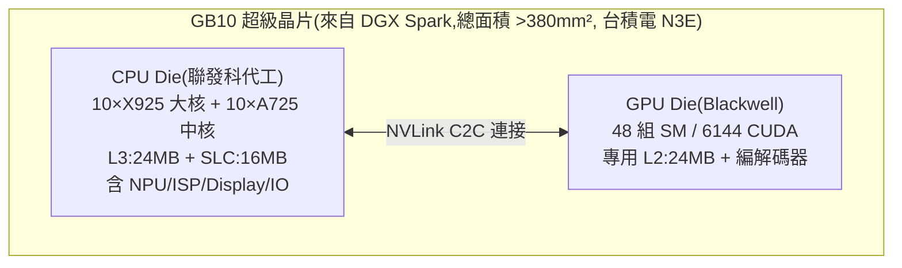

# NVIDIA RTX Spark(GB10 超級晶片)技術解析:最適合本地 AI 推理的 SoC 之一?

> 來源:极客湾 Geekerwan〈可能是最 AI 的 AI PC 平台?NVIDIA RTX Spark PC 技术解析!〉。NVIDIA 在台北 GTC 帶來**第一顆 PC SoC**——GB10 超級晶片(即 N1X,搭載於 RTX Spark)。本筆記拆解它的晶片架構、定位、與 Apple M5 / AMD 的對比、生態優勢與 Win on ARM 隱憂。這顆晶片正是本庫 [[nvidia-n1x-vs-x86]] 與股癌 EP667–668 熱議的主角,本篇補上**硬體技術細節**。

---

## 一句話總結

GB10 **不是輕薄本晶片、也不是打高通 X Elite**,而是一顆**超高性能 SoC**,定位類比 **Apple M5 Pro/Max、AMD Ryzen AI Max+ 395**。它最大的價值是「**接近桌面 5070 的 GPU + 高達 128GB 統一記憶體**」——在 AI 應用對顯存需求暴增的當下,這是**最適合本地 AI 推理的 SoC 之一**。最大變數不在硬體,而在 **Win on ARM 的軟體相容性**。

---

## 晶片架構:雙 die 的「超級晶片」

| 區塊 | 細節 |
|---|---|
| **CPU** | Arm 架構 **10×X925 超大核(2MB L2)+ 10×A725 中核(512KB L2)**;由**聯發科**操刀;分兩組 cluster(5+5 共享 16MB L3、另一組 8MB L3,共 24MB L3)。X925 比天璣 9400 的核略小、供電軌設計更像天璣 9500 → 推測為 PC 持續高頻環境做了後端優化 |
| **GPU** | 熟悉的 **Blackwell 架構,48 組 SM**(≈ 桌面 5070 的 GB205 滿血規模,比 5070Ti 移動版還大);專用 24MB L2(考量記憶體頻寬,這量「不算充裕」) |
| **封裝** | 兩顆 die 透過 **NVLink C2C** 連接,總面積 >380mm²,台積電 **N3E** 製程;片上另有 16MB SLC 快取 |

---

## 定位與對比:跟 M5 Max、AMD Ryzen AI Max+ 395 同級

這類「大 SoC + 巨大統一記憶體」的優勢,是相較「CPU + 獨顯」**能配非常大的統一記憶體**——對 AI 應用意義重大。

| 規格 | **GB10(RTX Spark)** | Apple M5 Max | Apple M5 Pro | AMD Ryzen AI Max+ 395 |
|---|---|---|---|---|
| 最大統一記憶體 | 128GB | 128GB | 128GB | 128GB |
| 記憶體規格 | LPDDR5X-**9400** | LPDDR5X-9600 | LPDDR5X-9600 | LPDDR5X-8000 |
| 位寬 / 頻寬 | 256bit / **300GB/s** | **512bit / 614GB/s** | 256bit / 307GB/s | 256bit / 稍低 |
| GPU 規模 | **48 CU / 6144 ALU** | 40 CU / 5120 ALU | 20 CU / 2560 ALU | 40 CU |

**解讀:**
- **GPU 規模 GB10 最大**(≈ 桌面 5070),加上 **Tensor Core**,吞吐量對其他三者有明顯優勢 → **最適合 AI 推理的 SoC 之一**。
- **但記憶體頻寬只有 M5 Max 的一半(300 vs 614 GB/s)**:推論 **prefill(預填充)速度應比 M5 Max 有優勢**,但 **decode(解碼)速度在頻寬少一半下誰勝未知**。

---

## 真正的勝負手:生態(NVIDIA 的最大優勢)

和上一代 Win on ARM 陣營的高通 X Elite 相比,**NVIDIA 在 PC 平台的生態成熟得多**:

- **AI / 創作軟體棧:** CUDA、TensorRT、OptiX 等一應俱全;推動 **Adobe、Blackmagic Design、Blender、剪映、ComfyUI** 適配,中國開發者走在前列。
- **遊戲:** 對光追、DLSS 支援程度業界難尋對手。
- **本地 AI:** GB205 級 GPU + 128GB 統一記憶體 →「**大概是最適合本地推理的產品**」。

> 作者觀點:正因 NVIDIA 在軟體/AI/遊戲生態的優勢,**RTX Spark 對「Win on ARM 普及」的推動作用,比以前任何晶片都更有希望**。

---

## 最大隱憂:Win on ARM 的相容性

- 非原生 x86 軟體仍需透過 **Prism 模擬層**運行:64 位軟體有 **10–30% 性能損失**,**32 位應用轉譯性能存疑**。
- Windows 陣營不會像 Mac 那樣全員適配 ARM;**目前 Windows 還有大量 32 位應用**,且軟體廠商缺乏做原生 ARM 的動力——這是 Arm CPU 在 Windows 平台躲不掉的問題。

---

## 產品形態與定位:瞄準 MacBook Pro 的高端

NVIDIA 對 RTX Spark 筆電設下嚴格門檻(可見其生態控制力):

- 螢幕:符合 **G-SYNC**、≥100% P3 色域**雙層 OLED**、峰值亮度 **≥1000nits**、刷新率 **≥120Hz**;
- 接口/電池/機身也有高標準,續航要「**全天**」。
- → 規格明顯**對標 MacBook Pro**,首發定位高端、價格不便宜;另有各家 OEM 的小型便攜台式機,**估價 2 萬人民幣往上**,主攻有本地 AI 需求的用戶。

**GTC 現場 Demo:** 原生 Arm 遊戲(心靈殺手 2、永劫無間)DLSS 等運行正常;其他遊戲靠 Prism 轉譯(無法發揮 CPU 全部性能)。網易、完美世界、鷹角、米哈遊、庫洛、騰訊等國內廠商積極支持。另展示 **UE5 黑客帝國 Demo**,靠 GPU 性能 + 巨大統一記憶體流暢運行,**開路徑追蹤仍有約 20fps 預覽**(這類 SoC 中應屬最強)。

---

## 應用案例:誰該關注這顆晶片?

- **本地跑大模型的開發者 / 創作者:** 想在筆電上掛進大參數模型做推理、又不想付雲端 token 費——128GB 統一記憶體 + Blackwell GPU 是目前最對味的單機方案(對照股癌 EP667–668 的「地端 AI 省雲端費用」邏輯,見 gooaye agent 近期立場)。
- **影音/3D 創作:** Adobe、DaVinci(Blackmagic)、Blender、剪映、ComfyUI 已在適配,剪片/算圖/AI 生成可吃到 GPU + 大記憶體紅利。
- **觀望者該等什麼:** 若你的工作流重度依賴**老舊 x86 / 32 位 Windows 軟體**,要等實測確認 Prism 轉譯的損失是否可接受;純 AI 推理 / 原生 Arm 與創作軟體則受益最大。
- **產業意義:** 這是 NVIDIA 從「賣 GPU」走向「賣整台 solution」的關鍵落子,也是 Arm 陣營叩關 x86 PC 的新變量——延伸閱讀 [[nvidia-n1x-vs-x86]](N1X 能否撞開 x86 四十年城牆)。

---

## 來源

- 极客湾 Geekerwan,〈可能是最 AI 的 AI PC 平台?NVIDIA RTX Spark PC 技术解析!〉,YouTube:<https://www.youtube.com/watch?v=wexH7AueOeA>(2026-06-07)
