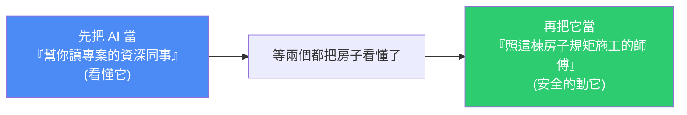
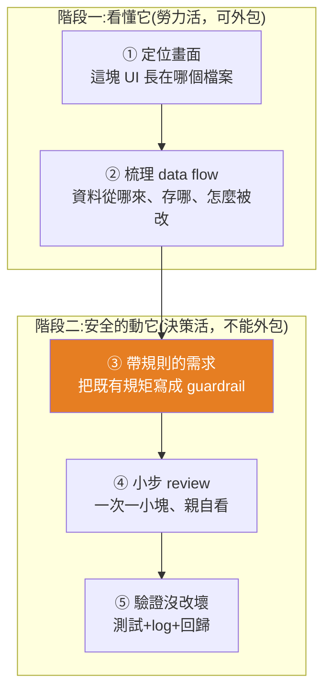

# AI 改 code 一直「改 A 壞 B」?讓 AI 安全接手舊專案(Brownfield)的五個步驟

> Gary Chen(@garytalksstuff)。核心主張:**用 AI 寫全新專案很神,一碰有規模的舊專案就改 A 壞 B——問題從來不是模型不夠強,而是你用它的方法錯了。** 關鍵是把順序擺對:**先看懂,再動手。** 延伸自 [[git-github-for-vibe-coders]]、[[codex-beginner-guide-four-basics]]。

---

## 一、為什麼「照教學做都很順、碰真實專案就水土不服」

先分清兩個名詞:

| | **Greenfield(綠地)** | **Brownfield(棕地)** |
|---|---|---|
| 比喻 | 一塊什麼都沒有的空地 | 一棟別人蓋好、**還有人住在裡面**的房子 |
| 狀態 | 全新專案、沒有歷史包袱;架構/命名/pattern 你自己決定 | 已有既有 code、既有 pattern、沒解的 bug,還有一堆**牽一髮動全身的水管電線** |
| AI 表現 | **最好發揮**(沒有既有規則要遵守,你叫它怎麼蓋就怎麼蓋) | 容易埋地雷 |

> **關鍵洞察:Greenfield 不會永遠是 Greenfield。** Vibe Coding 狂寫一個月,如果過程沒有意識地維持乾淨架構,那個專案就**已經變成 Brownfield 了**——因為裡面大部分的 code 你根本沒讀過。所以不管你是進公司接手別人的專案,還是自己 vibe code 了一個月,**遲早都會面對「一棟住了人、還不能停水停電、但你必須進去改廚房的房子」**。網路教學教的是「空地上蓋新房」,你每天面對的卻是「別人住的房子裡拆牆改管」。

---

## 二、AI 為什麼會埋地雷:它是「沒看過你這棟房子的師傅」

假設你跟 AI 說「幫我加庫存狀態的篩選跟編輯功能」,它幾秒生出一大段 code、畫面看起來也對,你開心送 PR——隔天 QA 說**訂單頁掛了**。這句話在 Greenfield 完全沒問題,但在 Brownfield 等於**把一個從沒進過你家的裝潢師傅一個人丟進廚房、叫他直接搞個流理台出來**。於是 AI 自己看著辦:

- 不知道專案已有一套 **React Query** 的 pattern 在管 API → 自己發明一套新寫法;
- 不知道專案早有一個共用的 **Table 元件** → 又自己重刻一個;
- 最糟的:為了拿商品資料去改了 `useProducts` hook,**但這個 hook 訂單頁也在用** → 它改了資料格式,商品頁修好了、**訂單頁卻爆了**。

> **AI 的每一步看起來都很合理,但它是在一個完全不認識的房子裡憑感覺做事。** 它的手藝可能比你好、React 比你熟,但這些都不重要——**重要的是它不認識這棟房子的管線、不知道哪一面是承重牆、哪根水管接的是樓上鄰居。** 你不先帶它看過一遍,它再厲害,一鎚子下去都可能出事。

**所以順序有講究,而且絕對不能反:**



**大多數人犯的錯,就是把順序反過來、甚至跳過「看懂」,一上來就要 AI 動手,結果它只能憑空臆測、把整棟樓打穿。**

---

## 三、動手前先選路:AI 輔助 vs 純指揮 Agent

同一套五步驟流程,有兩種走法,依你對 AI 的**熟練度與信任度**選(沒有標準答案):

| | **① AI 輔助開發** | **② 純指揮 Agent** |
|---|---|---|
| 主導權 | 在你手上——自己開瀏覽器、翻檔案、貼 code 給 AI | 幾乎不碰檔案、只出一張嘴 |
| AI 角色 | 你手上的**放大鏡**(看得更快更清楚,但走進每個房間的是你) | 讓 agent 自己探勘、自己讀、把報告交回來給你驗收 |
| 工具 | 常用網頁版 AI | Claude Code / Cursor 這種**讀得到整個專案**的 coding agent |
| 適合 | 對 AI 寫的 code 還沒那麼放心 | 對 AI 熟練、信任度高 |

---

## 四、五個步驟:前半「看懂它」、後半「安全的動它」



### 第一步:定位畫面(這塊 UI 到底長在哪個檔案)

- **AI 輔助的土炮但 100% 準確法:** 打開瀏覽器**開發者工具 → 對著要改的畫面右鍵「檢查」**,找一個獨特特徵(特殊 class name、按鈕文字、測試標籤)→ 拿這特徵回編輯器**全域搜尋**,馬上定位是哪個檔案在渲染。找到後丟給 AI:「這是負責商品頁的檔案,幫我分析畫面結構、引入哪些子元件、有沒有看起來是**全站共用**而非本頁專屬的元件?**只分析,不要修改任何 code。**」
- **純指揮:**「畫面上商品列表這塊是哪個檔案在渲染的?幫我找出來、分析元件結構、標出哪些子元件是全站共用的。**這個階段只做分析,不要改任何 code。**」
- **⚠️ 兩條路的指令都強調「只分析、不要改」**——這階段的重點是**探索**。價值是把「我怕改壞」的恐懼**變成一張看得見的地圖**:你會知道自己站在哪個房間、哪些是全站共用資產(以後可重用、但**絕對不能亂改**)。

### 第二步:梳理 data flow(前端最容易出事的不是畫面,是資料)

- **AI 輔助:** 先看 `package.json` 確認用哪套狀態管理(Redux / Zustand / React Query)→ 找對應的 store 或 hooks 資料夾 → 回到畫面元件找觸發資料變動的動作(`dispatch`、`mutate`、`setState`)→ 把畫面元件 + 狀態檔一起丟給 AI:「用白話文解釋這條 data flow:商品列表資料從哪個 API 來?用哪套工具管?管理員編輯庫存時資料怎麼從畫面流回 server?把中間經過的 function **依序列出**。」
  - **⚠️ 必做:請 AI 特別標出「這個 hook 有沒有被商品頁以外的地方用到」。** 網頁版 AI 看不到整個專案,所以你得先在編輯器**全域搜尋這個 hook**、把搜到的檔案一起貼給它,它才答得出來。
- **純指揮:** 一段話交代同樣的問題;agent 讀得到整個 codebase,「還有誰在用這個 hook」它直接就能答。
- **🔑 Gary 最愛的一招(純指揮):** 探勘做完後補一句——「**把你剛剛探勘到的結果做成一頁 HTML**:這個專案的頁面結構、共用元件、data flow,畫成一張架構導覽圖,我要直接用瀏覽器打開來看。」幾分鐘後你就拿到一張**建築藍圖**:哪些元件共用、資料從哪流到哪、哪根水管後面接著別的頁面,一目了然。

> 🔎 **對照本庫:** 這正是 [[reading-code-ai-era-6-techniques]](從進入點、跟著資料走)與 [[codebase-memory-treesitter-knowledge-graph-mcp]](把 codebase 建成可查詢地圖)的實戰版。

### 第三步:帶「既有規則」的需求 —— Brownfield 差最多的一步

從第三步起,兩條路**合流**了。因為前兩步本質是**勞力活(讀 code、找檔案、追資料流),可以外包**;但接下來兩步本質是**決策活(決定什麼絕對不准動、一段改動夠不夠格進這個 codebase),沒有外包版**——agent 可以幫你**起草**,但**起草跟拍板是兩回事**;改壞了被 QA 找、隔天踩雷的是你,不是它。

> **在 Brownfield 裡,你給 AI 的不能是一個空需求,而必須是一個「帶著既有規則的需求」。**

不能只說「幫我加一個庫存篩選」,要把前半場學到的規矩全部寫進去變成它的**邊界(guardrail)**,例如:

```
請在既有的商品頁新增庫存狀態篩選,並讓管理員可以編輯庫存。
動手前,先讀:負責商品資料的 hook、共用元件資料夾、型別定義檔。
要求:
- 沿用專案既有的 React Query pattern
- 重用現成的 Table / Modal / Select 元件
- 只准用 Tailwind
- 【絕對不要動到】全域 routing、權限控管,以及任何被商品頁以外用到的共用 hook
```

那句「**絕對不要動到**」就是把你前半場看懂的東西**變成 AI 的 guardrail**,是整套流程最關鍵的一步。

> **⚠️ 澄清一個很多人搞錯的觀念——Brownfield 裡的 Clean Code:** 不是你自己覺得漂亮的寫法,**而是「跟前人一致」的寫法**。所以 guardrail 第一條永遠是「**照著這個專案原本的樣子寫、沿用前人的 coding style**」——沿用前人風格本身就是最高優先的 Clean Code。

### 第四步:小步 review(不要一次生出整個功能)

規格給對了也不代表 AI 第一次就寫對。**拆成小步,每一步親自 review:**

1. 先叫它**只提出**元件結構 + 資料流的規劃,**先不要寫 code**;
2. 確認方向對了,再讓它**只改**那個商品資料的 hook、加上庫存篩選參數;
3. 改完你也 review 完,再讓它做篩選的畫面;
4. 最後才做編輯庫存的彈出視窗。

**一次只做一小塊,每一塊都在你眼皮底下進行。** review 時 Brownfield 有專屬重點(跟 Greenfield 不同)——**不是只看有沒有 bug**,而是看:這段改動有沒有**偏離既有寫法**(命名、資料夾結構、抓資料放的位置跟前人一不一致)?有沒有**偷偷改到共用檔案**?有沒有**重複造輪子**(又刻了一個早就存在的元件)?

可先交給 AI 初審:「用資深前端工程師的角度 review 這段改動:有沒有偏離既有 React Query 寫法?有沒有動到共用元件?有沒有漏掉 loading / error 狀態處理?」**但 AI 的 review 是初審,終審永遠是你。** 在 production 環境下,除非你已很熟這套 codebase、或它已有很好的 harness 與 context 管理,否則**重要決策先不要外包給 agent**。

### 第五步:驗證沒改壞(直接對付「改 A 壞 B」的恐懼)

這步勞力活回來了,兩條路又分岔;拆成三部分:

1. **先跑專案本來就有的測試** —— 很多人忘記專案早有一整套測試,這是**最快最省力**確認有沒有壞到既有功能的方法。AI 輔助:動手前自己跑一次確認綠燈、動完再跑一次。純指揮:「動手前先跑一次既有測試回報結果,之後每完成一小塊就再跑一次」,**讓跑測試變成 agent 的固定動作**。(專案根本沒測試 → 現在就是叫 AI 補幾條關鍵測試的最好時機。)
2. **看懂別人的 error log** —— Brownfield 經典坑:很多專案有**自己包裝過的錯誤紀錄機制(custom error logging)**——包裝過的 logger、統一的 error code、固定要送某後台的格式。在公司這叫**部落知識(老鳥都懂但沒寫在文件裡)**;而且 **AI 幫你生 side project 時也常順手建一套 error handling,你根本不知道它存在**,結果你隨手寫的 `console.error` 根本沒進那個系統。問 AI:「這專案有自己的錯誤紀錄機制,讀一下 logger 檔案,告訴我:①錯誤最後送到哪?②一筆 log 長什麼樣?③有沒有規定一定要帶哪些欄位?然後示範:我這次的庫存編輯要沿用同一套 logging 該怎麼寫。」**你的錯誤處理要「說專案本來的語言」**——帶對的 errorCode 跟 metadata,才會出現在該出現的地方、debug 才找得到。
3. **回歸測試(regression)** —— 直接對付「訂單頁掛掉」事件:「我動了商品資料的 hook,**列出專案裡所有用到它的地方,逐一確認我的改動有沒有改變它原本的行為**(回傳型別、參數、預設值有沒有變)?如果既有測試有覆蓋到,告訴我該跑哪幾個。」AI 輔助則拿前半場標出的「這 hook 還被誰用到」清單,一個一個回頭驗。**這一句話,就是你跟「改 A 壞 B」的正式和解。**

---

## 五、完整走一次 & 結論

同一個需求「幫我加個庫存篩選跟編輯」,差別只在**這次是先看懂、再動手**,而不是閉著眼把整包 code 丟給它:

1. 先分清這是 **Brownfield**(在別人的房子裡改廚房);
2. 選好路(自己拿放大鏡逐間看房 / 指揮 agent 畫建築藍圖),**拿到那張地圖、標出危險的共用水管**;
3. 把既有規矩(含 coding style)全寫成規格 + guardrail;
4. 讓 AI **一小塊一小塊**寫,每塊用資深眼光**親自 review**;
5. 用**既有測試、看懂的 log、回歸檢查**客觀證明沒弄壞任何人的東西。

> **趨勢:** AI 越強,前面那些分岔步驟會越來越往「純指揮」收斂,總有一天不會再有人手動貼檔案給 AI。身為 AI 原生工作者,**很重要的能力之一是:被丟進一棟陌生專案時,你要知道自己現在需要 agent 幫你探索並帶你理解,而不是直接擼起袖子幹活。**
>
> **但反過來說**——如果你開新專案時**就已經有很好的 harness 與 context 管理**,這些問題其實都不存在,真的只需要出一張嘴。**「有能力搭建專案架構 + 做好 context 管理」,是 vibe coder 晉升 agentic engineer 的關鍵里程碑之一。**

> 🔎 **對照本庫:** 「先看懂再動手、慢下來打地基才最快」呼應 [[ai-coding-three-illusions-opencode]];「把規矩寫成 guardrail/邊界」呼應 [[defining-tasks-not-prompts]] 與 [[gpt-5-6-prompting-guide-openai]](outcome + constraints + 驗證);harness/context 管理則是 [[loop-engineering-when-and-how-gary-chen]]、[[agent-harness-loop-llmops-eval-explained]] 的主題。

---

## 六、重點回顧(TL;DR)

- **改 A 壞 B 不是 AI 不夠強,是你把「動手」擺在「看懂」前面。** AI 是「手藝好但沒看過你這棟房子的師傅」。
- **Greenfield 會退化成 Brownfield**:vibe code 一個月、大半 code 沒讀過,就是 Brownfield。
- **兩種走法**:AI 輔助(你主導、AI 當放大鏡)vs 純指揮 agent(出一張嘴);依熟練度與信任度選。
- **五步驟**:①定位畫面(只分析不改)②梳理 data flow(標出共用 hook,可請 AI 做成一頁 HTML 藍圖)③帶規則的需求(把既有規矩寫成 guardrail,「絕對不要動」是關鍵;Clean Code=跟前人一致)④小步 review(一次一小塊、AI 初審你終審)⑤驗證(既有測試 + 說專案語言的 log + 回歸測試)。
- **前兩步是勞力活(可外包),後兩步是決策活(不能外包)。**
- 終極目標:**建架構 + context 管理**做好,vibe coder 就晉升 agentic engineer。

---

## 來源

- 影片:[AI 改 code 一直改 A 壞 B?你缺的是這五個步驟(Gary Chen @garytalksstuff,2026-07-18,官方 zh-TW 字幕)](https://youtu.be/CMs8YMU6_RM)
  - 作者另在 Patreon 提供完整文章與提示詞模板。
- 延伸(本庫):[給非技術人員的 Git / GitHub](./git-github-for-vibe-coders.md)、[AI 編程的三個致命錯覺](./ai-coding-three-illusions-opencode.md)、[AI 時代怎麼「讀」程式碼:6 個技巧](./reading-code-ai-era-6-techniques.md)、[你不是不會寫 Prompt,是不會定義任務](./defining-tasks-not-prompts.md)、[Codebase-Memory:Tree-Sitter 知識圖譜](../ai-agents/memory-retrieval/codebase-memory-treesitter-knowledge-graph-mcp.md)
