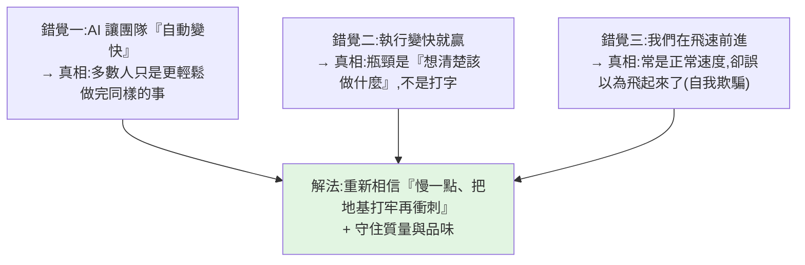

# AI 編程的三個致命錯覺(OpenCode 創辦人 Dax Raad)

> OpenCode 是這波 AI 編程浪潮裡增長最猛的產品之一(MAU 從 65 萬 → 250 萬 → 650 萬,上看 800 萬)。
> 但它的共同創辦人 **Dax Raad**(也是 SST / OpenNext 作者)在訪談裡**沒吹 AI 萬能,反而潑冷水**:
> 當前 AI 編碼工具在真實工程團隊裡製造了**三個致命錯覺**。一個正在吃 AI 紅利的人反過來唱反調,格外值得聽。
>
> 整理自 Best Partners TV 對該訪談的解讀。**⚠️ 觀點屬 Dax Raad 個人**,非定論。

---

## 三個致命錯覺(核心)

### 錯覺一:AI 讓工程團隊「自動變快」?未必
軟體業太大,**多數環境並不是高使命感/高激勵的環境**——很多人就是上班、幹活、回家陪小孩。
你給他一個「能更快做完工作的按鈕」,最自然的結果**不是做十倍工作,而是狂按這個按鈕、做差不多的工作量,把省下的時間留給自己**。
更糟的是:組織裡總有少數**非理性地在乎質量**的人(以前的「質量守門員」),現在其他人都在更快產出 PR,**這些真正在乎的人會被「垃圾 PR 洪流」淹沒**。

### 錯覺二:執行變快就贏?瓶頸從來是「想清楚該做什麼」
- 真正的瓶頸不是寫,是**先想清楚該做什麼**——你完全可能花一年才搞清楚正確方向。
- 他的體感:**以前 95% 精力想「該做什麼」、5% 做出來;現在大概 96% 想、4% 做**——也許執行效率 +20%,但**日常體感絕不是「世界輕鬆了十倍」,它還是一樣難**。

### 錯覺三:我們在飛速前進?——最大的風險是「把自己騙了」
他給團隊的備忘錄(後來在業界廣傳)講了三件事:① 在發布**不值得發布**的功能;② 原始設計有問題就被迫**往上疊補丁,而 LLM 會接著把補丁繼續往下滾**;③ 需要花更多時間**清理代碼**。
> 最重的一句:**「最糟的是,我甚至不覺得這些犧牲真的換來了更快的速度——我覺得我們只是在正常速度前進,卻誤以為自己飛起來了。」**
> 回頭看,OpenCode 也沒比競品快多少。**討論生產力時最大的風險,就是你特別容易把自己騙了。** 對策:重新相信「慢一點、把地基打牢再衝刺」。

> 這和本庫 [[context-engineering-processing-vs-thinking]] 的「瓶頸在你有沒有想清楚意圖」同源,也呼應「生產力幻覺」——你以為產能爆炸,坐下認真看往往沒那麼誇張。

---

## 成本這件事正在壓過來
- 每個工程師每月多花 **$1000–2000** 跑 AI;現在很多公司在「炫耀期」(對外秀「每人每月花 $1 萬跑 AI」顯得未來感),但**這敘事有表演成分、終會過去**,然後出現真正的財務問題。
- 大公司動輒幾千名工程師,每人每月多 $1000 會改寫預算結構;**若無法明確證明產出顯著增加,長期不成立**。
- CTO 的兩難:**不給好工具,最強的人會走**(高端人才有無限機會,天天被 Jira 折磨會離開);但若 AI 的淨結果只是「同樣工作量 + 工程師更開心」,對很多公司不夠(「那你還是回去自己敲吧」)。多數公司其實不在最前沿工具大戰那層——給個 Copilot、額度用完拉倒,也不會立刻被時代拋棄。

---

## 為什麼「開源中立多模型 coding agent」的位置空著、被 OpenCode 拿到?
- **結構性優勢**:做開發者工具的人都是程序員,而**程序員通常很不擅長做 B2C**;但真正大規模成功的開發者工具**本質就是 B2C 產品**,要像做消費品一樣思考。
- 所以 OpenCode 極在意**第一次打開的體驗**(甚至自己從底層做了終端渲染框架)、**降低一切摩擦**(在被企業鎖死的筆電上能不能裝/用)。
- **反直覺的打法**:前五個月它的核心 agent 邏輯其實**不怎麼樣、不是最聰明,但夠用**,且多數用戶一開始感知不到差距。別人是「先做最聰明的 agent 再贏」,**OpenCode 反過來:先把體驗和採用做起來,再把內部能力追上。**
- **Anthropic 封禁反而幫了忙**:Anthropic 想禁用戶在 OpenCode 裡用其訂閱,晚上 9 點默默封禁、沒預溝通沒分階段 →「製造了一個所有人一起討厭你的時刻」,用戶社群直接炸鍋。OpenCode 早知這天會來、不慌,且事前已在談其他公司支持——當天結束前就宣布 **OpenAI 正式支持 OpenCode**。(他們的策略:找一個階段性的「壞人」,把它的競爭對手都團結起來借力推進。)

---

## 品味、質量與「產品腐爛」
- **品味很重要**人人會說,但「**你真的願意為它做那些非理性的事嗎?**」很多偉大產品少做 50% 精細處理,短期商業結果看不太出差異——但**對質量的縱容會像感染一樣擴散:一個地方開始偷懶,最後在所有地方偷懶**。
- 現在空氣裡有股強聲音覺得「代碼/產品不必好,商業能贏就行」——**這念頭一旦進腦子,你就做不出好產品了,因為你不再信這件事**。
- **AI 時代產品腐爛得比以前快**(一個做了一年的產品可能已開始爛),所以**質量反而是更強的區分點**;但質量要體現在公司每個層面,常來自看似不理性的決定(如自己做終端框架——教科書說別重複造輪子,但他們知道 NeoVim 把體驗做到什麼程度,不願交出遠低於那個水準的東西)。
- 他欣賞 **Mitchell Hashimoto**(HashiCorp/Terraform/Ghostty)的觀點:**做產品不是往裡塞功能,而是思考每個新功能會怎樣和舊功能交互**——那才是產品工作的本質。

---

## AI 時代的工程實踐:老派東西回潮
- 工程師職責變成「**把系統弄到足夠安全,讓別人/agent 能安全發代碼**」(測試、防護欄、約定、模式、約束)——但這不新鮮,以前是為初級工程師,**現在只是多了一群「7×24 小時工作的傻子」(coding agent)**。
- 所以**老東西回來了**:他們更重地做 **DDD(領域驅動設計)**、甚至老派設計模式回潮——以前嫌它們繁瑣打字累,**現在不是人手打,缺點被弱化、優點(可靠/模組化/安全/邊界清楚)被放大**。「agent 沒有訓練輪,你就得把訓練輪重新裝回去。」

---

## 應用案例 / 給工程師與團隊的建議

- **評估「AI 讓我們快多少」時:** 別信體感與發布會,**坐下來認真量**——很可能只是「同樣工作量、更輕鬆」。先確認方向對(瓶頸在此),再談執行加速。
- **團隊在疊補丁、發不值得發的功能:** 照他備忘錄——**停下來清理代碼、修原始設計**,別讓 LLM 把補丁繼續往下滾;寧可慢一點打地基。
- **守質量:** 把「重視品味/質量」落實成**具體、看似不理性的決定**(該自己造的輪子就造),因為偷懶會像感染擴散。
- **招人(創業):** 不招 1000 人,招 **20 個真正厲害的**;與其招兩個普通人各發一份薪水,不如合預算**高薪招一個能改變方向的人**。
- **資深工程師保持競爭力:** 軟體工程是可遷移技能,但「**軟體工程師 + 某行業專家**」的組合最強(做農業軟體又真懂農業 = 全球前十檔稀缺)。別把自己變成「純接工單、只加 UI/改接口、從不理解所處行業」的人——理解行業才是最值得抓的機會。呼應本庫 [[three-valuable-ai-skills]]。
- **對 AI 預測保持懷疑:** 熱門預測(如「24–29 歲工程師會最有價值」)背後多是「我會贏、別人會輸」的心理防御(說的人自己常就在那區間);**歷史真正發生的,幾乎從不是當下看起來最顯然的版本。**

---

## 一句話總結

> 在所有人都追求速度的時代,Dax Raad 提醒:**AI 編程最危險的不是它不夠強,而是三個讓你「自我感覺良好」的錯覺**——
> 以為團隊自動變快(其實只是更輕鬆)、以為執行變快就贏(瓶頸是想清楚該做什麼)、以為在飛(其實正常速度卻誤以為飛起來)。
> 真正決定產品能不能活得長的,反而是那些**老派的東西:節制、質量、品味、上下文、對系統後果的敏感**——
> **慢下來、把地基打牢,可能才是最快的路。**

---

## 來源

- YouTube:[AI 编程的三个致命错觉 | OpenCode | Dax Raad(Best Partners TV)](https://youtu.be/z2GFDO4HrZY)(原訪談 [1VqKUrxR2C8](https://www.youtube.com/watch?v=1VqKUrxR2C8))。
- 涉及:OpenCode、SST、OpenNext、Anthropic 封禁事件、Mitchell Hashimoto(HashiCorp/Terraform/Ghostty)、DDD。
- 延伸:本庫 [[context-engineering-processing-vs-thinking]]、[[harness-engineering-evolution]]、[[three-valuable-ai-skills]]、[[claude-throttling-opus-4-7]]。
