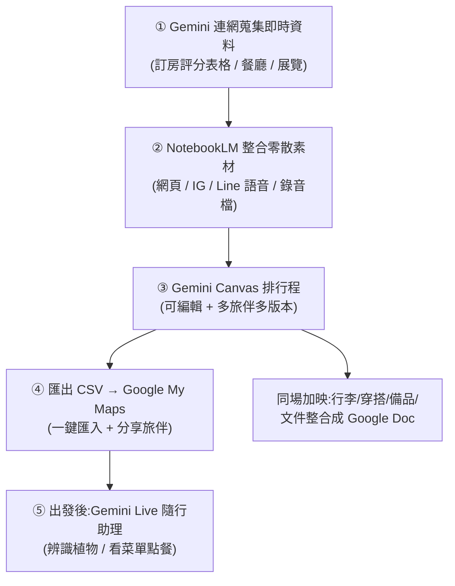

# AI 旅遊規劃組合技:NotebookLM + Gemini + Google My Maps 從 0 到 100

> 來源:泛科學院(JuJu)〈NotebookLM + Gemini 超狂組合技!10 分鐘搞定完美行程!〉。把「排行程排到要跟旅伴斷交」這件事,拆成一條**多工具接力**的 AI 工作流:用對工具做對的事——Gemini 蒐集即時資料、NotebookLM 整合零散素材、Gemini Canvas 排程與調解旅伴衝突、Google My Maps 導航、Gemini Live 當現場隨行助理。

---

## 先講痛點:為什麼旅遊規劃適合用 AI 接力

影片開頭點出旅遊規劃的四大崩潰點,正好對應後面每個工具要解的問題:

| 痛點 | 誰來解 |
|---|---|
| ① 最新資料 AI 還沒抓到,查出來都是舊的 | **Gemini**(直接連 Google 查即時資訊) |
| ② 過去蒐集的資料散落各處(IG/Line/截圖/錄音),很難統整 | **NotebookLM**(整合多來源、只根據你的資料回答) |
| ③ 交叉比對旅伴需求,還沒出遊就先斷交 | **Gemini Canvas**(當裁判生成多版本行程) |
| ④ 當地溝通(辨識、點餐) | **Gemini Live**(現場視訊/語音助理) |

> **核心心法:沒有一個工具全包。** NotebookLM 擅長「整合既有資料」但不擅長「延伸企劃」;要做延伸規劃就換 Gemini。把每個工具用在它最強的環節,串起來才順——這正是 [[multi-tool-ai-workflow]](建立你的多工具工作流)講的「任務需要什麼資料 → 在哪裡 → 哪個 AI 能操作」。

---

## 完整流程圖

---

## 五步驟逐一拆解(每步都附實際 prompt)

### 第 1 步|Gemini 蒐集「即時 + 細節」資料

景點到現場才發現週一公休、餐廳沒先訂、預設一小時卻排隊兩小時——這種**即時細節**靠 Gemini 連網查最快。給它預算、時間、在意的點,叫它**評分 + 做成表格**。

> **實際 prompt:**「住宿預算 2000 元、6/15 有空房、乾淨安全、靠近公共運輸的東京房間,請評分並做成表格給我參考。」
> → 一次列出不同訂房網站價格,不用一個個搜。同理可查餐廳、熱門展覽,整合網友最新回饋。

### 第 2 步|NotebookLM 整合散落各處的素材

把所有零散資料丟進一個 NotebookLM 筆記本:網頁連結、對話截圖、跟朋友/長輩討論的**錄音檔**都行。它整合成一份旅遊推薦,而且**回答只根據你匯入的資料,不會自己黑白來**(降低幻覺)。

> **實際操作:** 丟 9 篇東京旅遊文章 + 一段與朋友的旅遊錄音檔,問:「我們的旅行共同偏好是什麼?哪些景點可能不太適合排?」
> → 還能叫它把整理結果**做成影片**(給不愛看文字的人聽/看)。
> 進階學習法見 [[notebooklm-rapid-learning]](NotebookLM 三提問快速學習)。

### 第 3 步|Gemini Canvas 排行程 + 當旅伴衝突的裁判

NotebookLM 整理完,**接力給 Gemini**(現在 Gemini 左側工具欄有「筆記本」,可直接讀取 NotebookLM 的資料夾,對話即奠基在你匯入的資料上)。打開左下角 **Canvas(畫布)**,生成**可直接編輯**的行程文件。

> **排程 prompt:**「四天三夜在東京,給我文青咖啡廳 + 平價古著店,步行一天不超過一萬步,點跟點之間不超過 30 分鐘。」臨時想改:「行程改成 10 點開始,再加一個書店。」→ 右邊文件即時修改。

**調解旅伴衝突**(本片最實用的一招)——把每個人的需求丟給它生成多版本:

> **裁判 prompt:**「我有三個旅伴:A 喜歡跑咖、步行上限一天一萬步;B 喜歡博物館/文青景點、每天預算 1500 元;C 什麼都好但不要太早起。請依條件生成三個版本行程,每版說明誰的需求被滿足、誰需要妥協,並給出最推薦的行程。」

> 嫌整理需求麻煩?直接把大家討論的**錄音檔/語音訊息丟 NotebookLM**,它會整理成會議紀錄並**標註說話的人**,再接回上面的步驟。影片金句:「**很多溝通衝突來自需求沒有被看見**」,讓 AI 把每個人的需求攤開,就不容易翻船。

### 第 4 步|匯出 CSV → 一鍵匯入 Google My Maps

導航仍是 Google Maps 最方便。不用一個個手動加景點:

> 請 AI 把排好的行程**整理成 CSV 格式**,包含「景點名稱、地址、建議停留時間、營業時間」→ 下載 → 打開 Google My Maps →「匯入」上傳 CSV → 一鍵完成,還能**分享給所有旅伴**。

### 第 5 步(出發後)|Gemini Live 當現場隨行助理

手機 Gemini App 右下角 **Live** 功能,可拍照/講話/視訊即時問:

- **辨識環境:** 對著路邊野花開 Live →「這是什麼花、可不可以採?」→ 認出是長春花(日日春),並警告**全株有毒、不要摘來吃**。歷史建築、景點故事同理。
- **看外文菜單點餐(含特殊飲食):** 對日文菜單開 Live →「幫我看菜單點四人份,一人是台灣**淡奶素**、其他三人都可以,推薦餐點並**用日文幫我跟店員點餐**。」→ 它分別推薦素食/葷食餐點,並產出可念給店員或直接給店員看的**日文點餐句**;關掉視訊還能切回顯示日文。

---

## 應用案例:把同一條流程搬到別的情境

這套「蒐集即時資料 → 整合零散素材 → AI 排程/當裁判 → 匯出可用格式 → 現場助理」的骨架,不只旅遊能用:

- **多人聚餐/揪團活動:** Gemini 查餐廳評分表格 → NotebookLM 整合群組討論錄音 → Canvas 依預算與口味生成多方案 → 匯出清單分享。
- **搬家/採購比價:** Gemini 比價做表 → NotebookLM 整合各家報價 PDF/截圖 → Canvas 排採購順序 → CSV 匯入地圖規劃動線。
- **讀書會/出差行程:** 同樣用「整合既有資料用 NotebookLM、延伸企劃用 Gemini」的分工原則。

> 關鍵不是記住哪個按鈕,而是內化**分工原則**:整合既有資料 → NotebookLM;延伸創造/多版本決策 → Gemini Canvas;即時上網 → Gemini;現場感知 → Gemini Live。

相關筆記:[[notebooklm-rapid-learning]]、[[multi-tool-ai-workflow]]、[[three-valuable-ai-skills]](AI 調度力/工作流設計力)。

---

## 來源

- 泛科學院(主持人 JuJu),〈NotebookLM + Gemini 超狂組合技!10 分鐘搞定完美行程!〉,YouTube:<https://www.youtube.com/watch?v=TN3ZrSQ4DTc>(2026-06-04)
