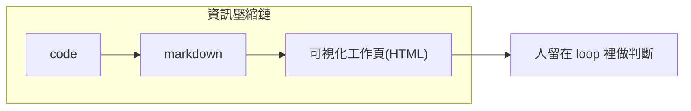

# 為什麼 Anthropic 工程師棄 Markdown 改用 HTML:當「理解」變成真正的瓶頸

**主題分類:** AI / 生產力與工作方法
**來源:** YouTube〈Anthropic 工程師為什麼拋棄 Markdown 改用 HTML 跟 AI 工作?〉(Gary Chen,2026-05-21,約 13 分;依繁中逐字稿整理)
**整理日期:** 2026-05-30

---

## 1. 哈佛研究:AI 讓人「更累」了

HBR(2026/2)追蹤一家 200 人科技公司 8 個月、40+ 場訪談:**AI 沒省事,反而工作量變多、步調變快、空檔被塞滿** → 壓力堆積、認知疲勞、品質下滑、決策變差 → burnout 與離職。

> 像《Four Thousand Weeks》的「現代版薛西弗斯」:不是推石頭,是清 email inbox,剛清空就「叮——你有新訊息」。**「我們用來掌控一切的科技,最後總會把那個『一切』本身變得更大。」** 你省下的時間不會變成休息,會變成下一個任務。

---

## 2. 真正的瓶頸從「產出」變成「理解」

AI 把 **產出成本壓到趨近於零** → 人人能更快做更多 → 能力的證明不再是「做不做得出來」,而是「**你有沒有真的搞懂你做出來的東西**」。產出變便宜,**理解變貴**。

研究指出最累的是 **不斷切換注意力、不斷檢查 AI 產出、開著的任務越來越多**:過去稀缺的是「誰來做」,現在稀缺的是「**誰來看、誰來判斷、誰來確認下一步**」。而且這種 **審核成本無法被量化**(沒多開會、沒多交報表,但腦子一直在切換比對),上級看不到、系統不記錄,於是「表面更有效率,實際累成狗」。

> **對 junior 特別殘忍:** 以前靠整理會議記錄、補文件、寫測試、清資料這些「瑣事」被有判斷力的人盯著、長出判斷力;現在公司把瑣事自動化、順手砍掉 junior 職缺——「每個今年被砍的 junior,都是本來三年後會變成 senior 的人,只是他不會出現了」。但 **學徒制的本質是「逼自己重複理解」,這個機制你自己就建得起來:逼自己搞懂每個你產出的東西,量不重要、深度才重要。**

---

## 3. 解法是「格式」:Markdown 的能力邊界

你跟 AI 大多用 **Markdown** 溝通(純文字、打得開、改得動、可 grep、可 git diff)——Claude Code、OpenClaw 的記憶系統底層就是一堆 markdown(對照 [[markdown-agent-memory]])。**markdown 會贏,贏在它一直站在人這一端。**

但 AI 越強,要被人讀懂的東西越多越複雜,**markdown 最先撐不住**:Anthropic 工程師 Thariq 的文〈The Unreasonable Effectiveness of HTML〉說「超過 100 行的 markdown 自己就讀不下去」。markdown 放不了圖、不能並排對比兩個方案、不能讓你動手調參數。

> **解法:用 HTML 當輸出格式**(瀏覽器打開、能放圖/表格/互動)。不是要你學前端,是讓 AI 把產出直接做成「一頁打開就能用」的東西。**HTML 不是更高級的 markdown,而是另一種工作介面**:markdown 適合承載文字,HTML 適合承載 **狀態、關係、對比、互動**。

---

## 4. 應用案例:HTML 工作頁的三種用法(把高耗腦的審核變成一眼能懂)

1. **拿來比較:** onboarding 畫面不確定怎麼呈現 → 叫 AI 一次生 6 個版本(版面/交互/資訊密度不同)排進同一頁、各標清楚取捨,**並排掃一眼就能比**。(markdown 只能逐個文字描述,你得在腦中把畫面拼回來——那個拼的動作就是審核成本。)
2. **拿來理解:** 看不懂公司的 rate limiter → 叫 AI 讀完 code 產一頁 explainer + 流程圖 + 「有哪些坑」區塊,甚至出 10 題選擇題確認你抓到重點。**同樣資訊量,更快理解並決策(低耗能審核)。**
3. **拿來決策:** 30 張 Jira 單要重排優先序 → 叫 AI 做一個可 **拖拉卡片** 的網頁、先幫你排好,你像玩遊戲一樣拖拽分欄,按一個鈕就把結果 **轉成一段 prompt 貼回 Claude** 繼續執行。

> 三個用法的共同點:**不生成更多東西塞給你看,而是把複雜資訊變成「能看、能比較、能下決定」的介面。** 不是用 HTML 全面取代 Markdown——要文字整理用 Markdown,要快速看懂狀態/比較方案/做決定用 HTML 工作頁。

**「不用讀完每一行」早就是常態:** CTO 看測試有沒有過、PM 直接拿產品來用、CEO 看幾個關鍵數字——都靠「一個對的介面」驗證真正重要的那幾件事。你跟 AI 的關係一樣:**問題不是逼自己讀完 AI 吐的每個字,而是有沒有一個夠好的介面,用最低力氣驗證該驗證的東西。**

---

## 5. AI Builder 怎麼脫穎而出:proof 要跟著 work 一起走

AI 時代產出太便宜,履歷/職稱/作品集越來越不能證明你真的懂(AI 能生出有模有樣的 prototype,但你答不出「為什麼選這架構、壓力測試會怎樣、自己改一段改不動」)。真正稀缺的是 **把理解跟作品綁在一起**,能清楚回答四個問題:

1. 你做的東西 **是什麼**?
2. 你 **為什麼** 選這個做法?
3. 這東西在 **什麼情況下會壞**?
4. 你在這次實作中 **學到了什麼**?

> **能力證明:不要只追求更多產出,而是更深的理解;不要讓作品跟解釋分開,讓解釋本身變成產出的一部分;不要只靠靜態標籤(履歷/頭銜),用一個個「可驗證的完成紀錄」公開展示你怎麼判斷、取捨、理解。** 呼應 [[karpathy-software-3-0]]「你可以外包思考,不能外包理解」——當 AI 把世界壓縮得越來越快,你的價值是「**我能做判斷,而且我能證明我理解自己交付了什麼**」。

---

## 來源

- [YouTube:Anthropic 工程師為什麼拋棄 Markdown 改用 HTML 跟 AI 工作?(Gary Chen)](https://youtu.be/BhHMGRcbPkQ)
