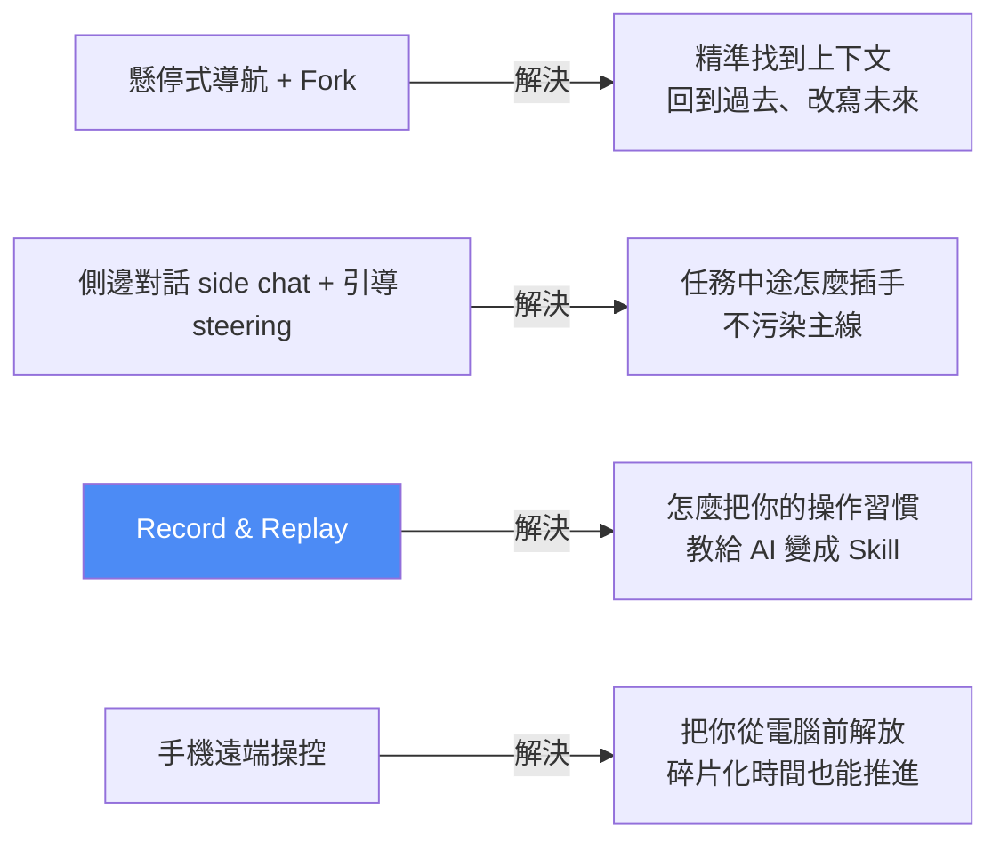

# Codex 2.0 新功能實戰:懸停導航 + Fork、側邊對話/引導、Record & Replay、手機遠端操控

> Gary Chen(@garytalksstuff)接續他的 Codex 新手入門影片,講 Codex 2.0 幾個「不只是多一個按鈕、而是改變你跟 AI 工作節奏」的更新。重點不在功能列表,而在**這些功能日常怎麼用**。延伸自 [[codex-beginner-guide-four-basics]]。

---

## 一句話總覽

Codex 這輪更新讓它越來越像一個「**能長時間陪你工作、跨裝置接續、把人類示範變成技能**」的 Agent Workspace。四組更新各解決一個痛點:

---

## 一、懸停式導航欄 + Fork:回到過去、改寫未來

- **懸停式導航欄**:在很長的 Codex 對話裡,把滑鼠移到對話區左側空白的橫線上,會跳出小視窗**預覽附近幾輪對話**(你說了什麼、Codex 怎麼回),點一下直接跳回那段——不用一直往上滑、也不用靠記憶猜哪一輪講過。
- **真正的價值是搭配 Fork**(前一支影片提過):每則回覆下方都有**分叉按鈕**,可以從那個時間點**複製出一條一模一樣、保留前面上下文的對話**,但從這點之後讓兩條 session 往不同方向走。

> 🔎 **應用案例:** 專案來回二十幾輪(前面說「首頁標題保守一點」、中間「第三屏別太 sales」),到最後畫面壞了、要找出是哪一輪改壞的並重做,又不想把過去上下文全部重看——就用**懸停式導航找到 context 髒掉的節點 → 從那裡 Fork 一條 session**,等於開了一個「小的平行宇宙」重試一次,原本那條保留不動。

---

## 二、側邊對話(side chat)vs 引導(steering):兩種「插手」方式

主任務正在跑時,你有兩種介入方式,關鍵差別在**要不要污染主線上下文、要不要打斷心流**:

| | **側邊對話 side chat** | **引導 steering** |
|---|---|---|
| 目的 | 只是想**理解**、問補充問題 | 真的要**改方向**、立刻調整本次任務 |
| 對主線 | **不打斷、不污染**主線上下文 | 直接介入正在跑的任務 |
| 桌機操作 | 右上角「切換側邊面板」開一條支線 | 對話框補 Follow-up,用 **Command+Enter** 送出(按純 Enter 只是排隊等下一輪) |
| CLI 對應 | `/side`、`/by the way` 兩個 slash command(本質同一個東西) | — |
| 生活比喻 | Codex 在忙,你不打亂他心流,改**聯絡他的助理**獨立回答 | Codex 方向走偏,你**直接敲他辦公室的門**把他導回正軌 |

> ⚠️ **注意:** 側邊對話若主任務跑很久、有重新連線或關過 App,**可能會消失**。所以它適合拿來問問題;真的有重要結論或決定改方向,還是要**貼回主線**。
>
> 🔎 **判斷範例:** Codex 幫你改產品頁時——無關緊要的小問題(「你剛剛那段有什麼優點其實可以保留?」)放**側邊對話**;但若你看到它開始大改首頁、而你只想先修手機版 Overflow 和 CTA 文案,別在旁邊問「你為什麼改首頁」,要**直接用引導**說「先別重寫首頁,先修手機版 Overflow 和 CTA 文案」,在它浪費更多時間和 Token 前糾正。

**新手最常犯的錯**:把所有想法都丟回主線,想到一件加一句、想到另一件又補一段,最後 Codex 收到一堆互相打架的要求,任務開始變形。有了兩個區域就能**把問題分流**:只想理解 → 側邊對話;真要改方向 → 引導。

---

## 三、Record & Replay(重頭戲):讓 AI 看著你的螢幕學流程

**解決的痛點**:普通人想讓 Codex 學會自己的日常工作流省時間,但**不會寫乾淨的 Prompt、也不會自己做 Skill**。

**邏輯**:錄製你的螢幕操作 → Codex 分析 → 把流程整理成一個**專屬 Skill**;以後觸發關鍵詞,它就照這份流程「**1 比 1 模仿你的步驟**」完成一系列工作。很多 workflow 不是難在技術,而是難在「我平常就這樣做,但我不知道怎麼講」。

- **安裝**:左上角「外掛程式」搜尋 `Record & Replay` 並點選 Plugin。
- **觸發三種方式**:slash、`@`、或直接在聊天框打「錄製我的操作並學習,把紀錄變成可復用的 Skill」。最長可錄 **30 分鐘**,你只要照平常流程正常操作一次。
- **⚠️ 錄完別急著相信它學會了**,做兩件事驗證:
  1. **打開 Skill 看**它有沒有抓到正確流程;
  2. **讓它真的跑一次**確認能完成,跑偏就用自然語言調整(它甚至有機會把流程整理得更清楚、重跑時修掉不穩定的步驟)。

> 🔎 **應用案例 A(單工具重複流程):** 每週要做社群發文提案簡報——開 Canva 選固定模板、依主題生成 5 頁、匯出 PPT、上傳 Google Drive、最後在 Gmail 草擬給主管的信。錄一次,之後叫它「用 XX Skill 跑一次」即可。**理解成手把手教實習生**:叫他看著你螢幕做一遍,他回頭整理流程再問你「是不是這個意思」。

> 🔎 **應用案例 B(跨 AI 工具接力,更進階):** AI 水果影片創作者,想把爆款短片改寫成水果主題。錄製流程:①**先講清楚整條流程的目的**(「用 Gemini 分析爆款影片 → 用 Claude 重新發想水果腳本 → 結果整理到雲端 Excel」,這句很重要,能避免它製作 Skill 時跑偏)→ ②示範:開 Gemini(多模態分析影片:講什麼、逐段摘要、為何好看)→ 複製分析貼進 Claude(不照抄角色,抽取節奏/鏡頭邏輯/冒險感改成水果世界,用表格輸出:幕/秒數/場景/主角穿著表情/鏡頭角度)→ 貼到 Excel。之後給一支新影片說「用水果影片改寫 Skill 跑一次」,Codex 就知道**先交給 Gemini 理解畫面、再交給 Claude 創意改寫、最後自己整理成 Excel**,不用人肉在多個 AI 工具間反覆橫跳。
>
> (註:Gary 補充,模型互通其實可用 CLI / Plugin 做更好的串接,見他另一支 [[cross-model-review-claude-codex-harness]];Record & Replay 的價值在於**非技術人員也能用最暴力直接的方式**讓 AI 看操作學流程。)

**⚠️ 侷限(Record & Replay 不是魔法)**:它本質依賴 Codex 的 **Computer Use**(靠螢幕視覺識別模擬遊標/鍵盤),實測**每一步要十幾秒思考**,所以**不能幫你打槍戰遊戲、搶演唱會門票**。只適合「**固定、重複、有明確步驟**」的流程(每週做一次的整理、每次用同樣方式產的報告、每次把某工具輸出轉成固定格式),不適合非常複雜或有即時性需求的任務。

---

## 四、手機遠端操控:從電腦前解放

不是最新功能,但 Gary 自己最近常用。**透過手機裡的 ChatGPT App 直接連線到你的 Codex**,遠端派任務、看進度、補指令——不只收通知,而是能**從手機開始任務、接續任務、批准操作、看結果**,還支援 File Previews、側邊對話、Inline Review Comments,像一個遠端控制面板。

- **連線方法**:設定 → 連線 → 開啟「可控制此電腦的裝置」並允許連線 → 右上角新增 → 出現 QR Code → 手機掃描即完成。

> 🔎 **應用案例:** 出門前讓 Codex 幫你整理「台北市 25–35 歲上班族對植物奶沖泡飲購買意願」的市場研究報告;通勤路上用手機看檔案預覽,發現第三段太繞,留一個 **Inline Review Comment**「第三段改短一點、直接講結論」;到公司時它已調整好。**對長任務差別很大**——以前離開電腦要一直守著檢查,現在能在外面把小決策先做完,任務進度不會因你離開而拖慢或中斷。

**⚠️ 兩個要講清楚的前提/侷限:**
- **手機只是把指令送過去,不取代工作環境**:真正跑 code、讀檔、改 repo、執行 terminal 仍發生在你的電腦或 Cloud Environment;**主機必須開著、連網、Codex 能連上去**,否則一切免談。
- **手機端打不開電腦的 `localhost:3000`**:localhost 是「這台設備自己」,手機打 localhost:3000 只會找手機自己(手機上根本沒跑那個預覽頁)。合理做法是**讓 Codex 在 host(你的電腦)上用 in-app browser / Browser Use 打開頁面、截圖或回報結果**,你在手機看回傳結果再給下一步 feedback。

---

## 五、更大的圖:工作型態從「親手做」變「掌舵」

Gary 的觀察(呼應 2026-05 Business Insider 報導「AI 開發者出門把筆電留一條縫、讓 Agent 在背景繼續跑」):AI Agent 成熟後,工作會**更碎片化**——

> 以前你坐在電腦前一路把事情做完;現在比較像**你在掌舵**,很多 Agent 在不同地方幫你跑任務,跑到一半回來問你「這裡選哪個方案?這個操作可否批准?測試失敗要不要換做法?」。你不一定每秒都在打字,但會**一直需要做判斷**——像老闆聽不同人回報,真正花時間的不是親手做事,而是**等對方做到一個節點、再由你決定下一步**。手機就成了在外面看進度、補要求、做決策的「遠端指揮台」。

> 🔎 **對應本庫觀點:** 這正是 [[voice-input-ai-context-transformation]]、[[defining-tasks-not-prompts]] 講的「人往判斷與方向移動、執行交給 AI」;也和 [[long-running-agents-goal-evaluation]] 的長任務治理同一條線。

---

## 六、重點回顧(TL;DR)

| 功能 | 一句話 | 關鍵操作 / 侷限 |
|---|---|---|
| 懸停式導航 + Fork | 找到髒掉的上下文節點,分叉出平行宇宙重試 | 移到左側橫線預覽;每則回覆下的分叉按鈕 |
| 側邊對話 side chat | 不污染主線地「插嘴問一句」 | `/side`、`/by the way`;久跑/重連可能消失 |
| 引導 steering | 立刻把跑偏的任務導回正軌 | 桌機 **Command+Enter** 送出才算引導,純 Enter 只是排隊 |
| Record & Replay | 錄螢幕操作 → 自動變成可復用 Skill | 錄完務必「看 Skill + 真跑一次」驗證;靠 Computer Use,每步十幾秒,只適合固定重複流程 |
| 手機遠端操控 | 用 ChatGPT App 連 Codex 當遠端指揮台 | QR Code 連線;主機須開機連網;手機打不開電腦的 localhost:3000 |

---

## 來源

- 影片:[Codex 新功能教學,Record & Replay、對話快搜、Fork、手機遠端操控一次講清楚(Gary Chen @garytalksstuff,2026-07-12,官方 zh-TW 字幕)](https://youtu.be/pJR6I9_06e4)
- 延伸(本庫):[Codex 新手指南:四基本功](./codex-beginner-guide-four-basics.md)、[Cross-Model Review:Claude 跟 Codex 自動互審](../ai-agents/applications/cross-model-review-claude-codex-harness.md)、[語音輸入 x AI 的 context 轉換](./voice-input-ai-context-transformation.md)
