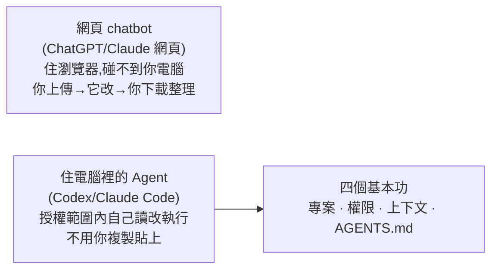

# Codex 新手指南:駕馭「會動你檔案的 AI Agent」的四個基本功

> 整理自 YouTube「Gary Chen」〈Codex 新手教學,非技術人員也能上手的 AI Agent 新手指南〉(2026-06-14,約 18 分鐘)。這是給**完全不寫程式的人**的入門教學:Codex 不是「桌面版 ChatGPT」,而是一個**會鑽進你電腦、替你讀檔改檔做事的 agent**。核心是四個「駕馭任何 agentic 工具都要會」的基本功——**專案、權限、上下文、AGENTS.md**。
>
> 一句話:**把 Codex 當 ChatGPT 用,像買了一台特斯拉、卻只拿來聽廣播。**

---

## 一句話總結

- **Codex vs ChatGPT 的根本差別**:ChatGPT 你得上傳、下載、整理收尾(做事的還是你,它碰不到你電腦);**Codex 直接讀檔、改檔、做表格、做簡報、甚至架網站**,是個會在你電腦裡幹活的 agent。
- 這種 agent 又分**桌面 app** 與**終端機(CLI)** 兩種;本片只講對非技術者最友善的桌面 app。Claude Code / Claude Cowork 是同道理(OpenAI vs Anthropic 各自的 agent)。Codex **有免費版**(有 ChatGPT 帳號就能用)、體驗順手、額度便宜大碗。
- **正因為它碰得到你的檔案,你不能像聊天機器人那樣丟一句話就走人——得先學會怎麼駕馭它。**

---

## 四個基本功(全片核心)

用「籌備一場小型線下講座」當例子跑一遍:

### ① 專案(Project)
**你在哪個資料夾叫出 Codex,那個資料夾就是它的工作區**,它只在這範圍內讀/改/增/刪。所以先開一個「講座籌備」資料夾,把活動說明、報名名單、講者介紹、圖片、簡報範本都丟進去。

> **關鍵**:不是把整台電腦交給 AI,而是**先圈一塊範圍**。要它處理某檔案時,直接**拖資料夾 / 貼完整路徑 / 用小老鼠(@)附加檔案**,別只丟關鍵字讓它在整台電腦大海撈針(慢、又白白燒 token)。把檔案歸好類、名字取清楚,說穿了就是 **context engineering**——就算沒有 AI 你本來也該這樣做,到了 agent 時代只會更重要。

### ② 權限(新手最該搞懂的)
決定 Codex 能在你電腦上玩多大,三種模式:

| 模式 | 白話 |
|---|---|
| **要求核准**(預設,最保守) | 只能讀檔+討論;要動任何檔案、跑任何指令都先問你 |
| **待我核准**(大部分人用) | 在交給它的工作資料夾內可自己讀改跑;**只有碰資料夾外或連網才停下問你** |
| **Full Access**(完全放行) | 連網、整台電腦都能碰、不再問;CLI 外號 **YOLO** |

> **權限是雙面刃**:越高越省事,但搞不清楚它在幹嘛時,一個動作就能捅大簍子。**聰明做法:保守起手 → 讓它問你 → 被問煩了當下就切更高權限或「本階段不要再問」**。熟了可開 Full Access 圖順暢,但用 **AGENTS.md 把不可逆操作鎖死**(如寫一條「不要刪除原始檔」)——不過這仍是用自然語言限制 agent,有風險,還是要小心。

### ③ 上下文(Context)
= AI 視野內能讀到的資料(你說過的話、給的文件)。**越多不代表越好**——讀的東西一多,它能思考的空間被壓縮、焦點易模糊(像你一次丟助理十份文件、二十條規則、三個任務還一直改方向)。

> **一個階段做完就清腦袋**:讓 Codex 先總結目前狀態 → 開新 session 或輸入 **`/compact`** 壓縮上下文。介面會顯示上下文用量,**作者習慣到 80% 就手動壓一次**(別等 100% 被迫自動壓,容易把重要的東西漏掉)。

### ④ AGENTS.md(專案的規則書)
等同 Claude Code 的 **CLAUDE.md**。在資料夾放一份,寫下偏好與雷點:「用繁體中文輸出、不要刪原始檔、改文件前先說明改哪裡、報名名單一律輸出 Excel、做完附處理摘要」。每次在這專案開 session,Codex 都先讀它、當最高指導原則。

> **精神:重要的事講一次就好。** 但有個新手坑——**別寫太多**(每開 session 都要讀整份,規則越肥、真正拿來思考任務的空間被吃越多、品質反而掉)。只放「每次都一定要知道的最低限度背景與規矩」,較長的操作流程**做成 Skill**、要用再叫。可以先用一陣子,再叫 Codex 根據你們的合作**幫你生成 AGENTS.md**(比從零硬寫好用)。
>
> **AGENTS.md vs Memory**:AGENTS.md 是你**親手寫的員工守則**(專案規定、跟資料夾走);Memory 是 **AI 私下對你的觀察筆記**(越來越懂你,但可能**過度解讀**——你上週試個框架後來沒用,它卻以為是長期習慣,所以要**定期清**:直接問「你記了我哪些」再叫它刪)。**個人長期偏好交給 Memory,專案規則與地雷寫進 AGENTS.md。**

---

## Codex 實際能做什麼 + 進階三功能

**日常任務(最容易有感)**:掃描資料夾並重命名(把「final_真的最後版」改成「202606_講座活動說明」)、整理表格(**訣竅:講目的**——不說「整理名單」而說「整理一份**等下要拿來寄確認信**的名單」,它就懂把信箱/出席擺前面)並**產出處理日誌**(改了什麼、哪些資料缺漏——「不要只叫它做完,要它留紀錄,你才驗收得了」)、串 Gmail 寫客製確認信、做簡報草稿、用 **Planning Mode** 做活動頁(別一上來叫「做一個網站」容易做歪,**先叫它列計畫**,更進階讓 Codex **扮 PM 反過來問你**到規格清楚再動手)、用 image 2 生主視覺、用**視覺化註解**點網頁元素直接講怎麼改 = 這就是 **vibe coding**。

**再往上三個功能**:
- **Skill**:把一套跑通、你滿意的 SOP 存起來(讀報名資料→整理名單→產邀請信→活動狀態報告→復盤摘要),下次辦類似活動不用重講。
- **外掛程式**:一鍵串第三方 app(Gmail 搜信/寫草稿、Drive 讀改雲端文件)。
- **自動化**:把每天固定的制式任務排程(每早九點檢查報名表更新 Excel、每天撈沒回信的人寫 follow up)。**別覺得任務小沒必要交給 AI——一件瑣事只花五分鐘,但「記得去做」的心智成本絕不只五分鐘;自動化是解放你的腦子。**

---

## 最容易被忽略的:Codex 不只是助理,也是你的家教

很多非技術者覺得「這是工程師用的、我不敢碰」。作者(和那位完全不寫程式的運營夥伴)最大的心得是:**Codex 也是你隨叫隨到的家教**——

- 拿到一個複雜、不知怎麼用的 Skill → 丟給 Codex 問「這是做什麼的、什麼情況觸發」,再告訴它你的工作內容、問「該怎麼改才適合我」。
- 要裝一個新工具 → 以前得啃 GitHub README、卡在某個畫面就不會了;現在直接說「你先幫我裝好,然後一步步教我怎麼用,順便給我一張注意事項與小技巧的表」。**你 vibe 的同時,其實也在學。**

> **你是 agent 的管理者**:不能丟了任務就預設它生出你腦中那個完美版本。要像帶新同事——**先給背景、講清楚目標、看它的計畫、最後驗收**;做錯時別只丟「我不喜歡,重做」,要說**哪裡不對、為什麼、下次類似情況怎麼判斷**。你越這樣帶,它越像真的懂你做事方式的夥伴,而不是每次從零亂猜。這樣用下去,Codex 會慢慢變成一套**你可以不斷訓練、校正、沉澱的工作系統**。

---

## 應用案例 / 新手上手五步

1. **記住 Codex 是「能進你工作環境、直接動你檔案的 AI Agent」**,不是桌面版 ChatGPT。
2. **先搞懂四基本功(專案/權限/上下文/AGENTS.md)**——這是駕馭**任何** agentic 工具的基礎,不管你用 Codex 還是 Claude Code 都要會。
3. **拿它處理本地文件、表格、網頁、郵件、簡報**這些最容易有感的日常任務(重命名混亂檔名、整理 Excel + 處理日誌、寫確認信、Planning Mode 做活動頁)。
4. **用順了再搭自己的 Skill、串常用外掛、把每天雜事交給自動化排程。**
5. **記住它也是家教**:會的事叫它做,不會的先叫它教你、學會了再叫它幫你做。

> 延伸對照:本庫 [[cross-model-review-claude-codex-harness]](Claude×Codex 互審的自建 harness)、[[building-claude-skills]](Skill 實戰)、[[claude-md-12-rules]](CLAUDE.md/AGENTS.md 規則怎麼寫)、[[markdown-agent-memory]](Markdown 當記憶)、[[loop-engineering-when-and-how-gary-chen]](把重複雜事做成可控 loop)、[[function-calling-mcp-cli-tool-evolution]](CLI/桌面 agent 的差別)。權限那段呼應 [[prompt-injection-5-techniques-defenses]] 的「CLI 不能裸奔」。

---

## 來源

- Gary Chen(@garytalksstuff),〈Codex 新手教學,非技術人員也能上手的 AI Agent 新手指南〉,YouTube:<https://youtu.be/xFPiU5sit7g>(2026-06-14,約 18 分鐘)
- 本文依該片**官方 zh-TW 字幕**整理。提及:Codex 桌面 app(免費版、@ 附檔、`/` 指令、Fork 分支、視覺化註解)、四基本功、Planning Mode、image 2 圖像生成、Skill / 外掛程式 / 自動化、Memory vs AGENTS.md;作者另有 Codex Playbook(Patreon)。
