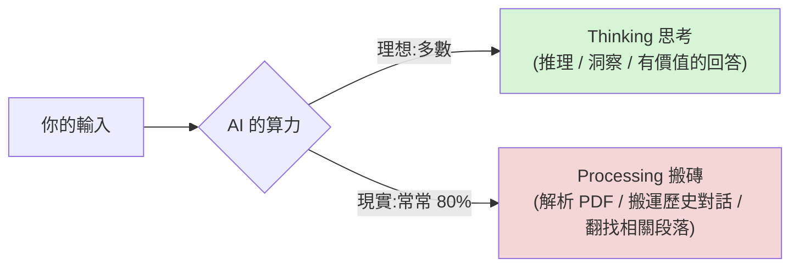

# 你可能用錯 AI 了:Processing vs Thinking 與三層 token 效率陷阱

> 同一個模型,用不同的互動方式,**產出可以差十倍**。這支影片把「會不會用 AI」拆成一個核心概念
> (**processing vs thinking**)和三個由淺到深的陷阱,本質上講的都是 **context engineering**——
> 在 AI 開始工作前,把它需要的上下文整理好,不多不少、剛好足夠。
>
> 整理自 Gary Chen(@garytalksstuff)影片逐字稿。作者自述一天工作 8 小時、其中 6 小時都在跟 AI 講話。

---

## 核心概念:Processing vs Thinking

用一個比喻:你請了一個很強的麥肯錫顧問,但每次開會都把公司十年的檔案堆到桌上叫他「先翻一下」。
一小時會議他花 40 分鐘翻資料,只有 20 分鐘真正幫你思考——**你付了一小時顧問費,只有 1/3 產生價值。**

AI 一模一樣:

- **Processing(搬磚)**:AI 花算力「消化你的輸入」——解析 PDF、搬運 60 輪前講過的話、在一大堆 token 裡翻找相關的那一小段。
  這些不需要智慧,但**每個動作都在燒你的 token**。
- **Thinking(思考)**:AI 在**乾淨的 context** 下做推理、產生洞察,給你真正有價值的回答。**這才是你付錢買的東西。**

> 大部分人的用法讓 AI 約 **80% 算力花在 processing、只有 20% 在 thinking**。你以為在讓 AI 幫你想事情,
> 其實大部分錢是讓 AI 搬磚。**token 燒得越兇,通常代表 AI 花越多時間在搬磚。**

這個「開工前先把上下文整理到剛好足夠」的能力,業界叫 **context engineering**。下面三個層級沒做好就會出問題。

---

## 三層陷阱(對應:AI 怎麼讀檔、怎麼記對話、怎麼找答案)

### 層級一(初階):不懂 AI 怎麼讀你的檔案

場景:拖三份 PDF 進對話說「幫我整理重點」。兩個你沒注意到的成本:

1. **PDF 不是乾淨文字**:解析時連頁首頁尾、表格殘留、排版標記一起吃進來,token 通常**膨脹兩三成**,排版越複雜越多。
2. **進了對話歷史就每輪重送**:到第 10 輪,你等於為同一份文件**付了 10 次的錢**——這才是真正燒錢的地方。

**怎麼處理**(看任務需要多少細節):

- **先摘要再開工**:對話前期讓 AI 把文件濃縮成重點摘要 → **開新對話只帶摘要**繼續。適合延伸討論、決策、brainstorm 這類不需逐字細節的情境。
- **先轉成 AI 友善格式**(Markdown / JSON)再給完整文件:可開一個額外 session 專門做格式轉換,讓 AI 無痛讀取。
- **需要完整細節時**(合約審閱、數據核對、逐段翻譯)就把完整文件放進去,**不要為省 token 犧牲品質**。

> 重點不是「少用 token」,而是「**不要浪費 token**」。在生產環境或身為 AI Engineer,擁有 **token efficiency** 概念會讓你脫穎而出。

### 層級二(中階):不懂 AI 怎麼記你的對話

對話跑到 30、40 輪,突然覺得 AI 變笨、變慢——不是大哉問,**就是你的對話太長了**。

關鍵事實:**AI 模型本身沒有記憶。** ChatGPT / Claude 的 memory 是產品層額外包裝,底層機制跟直覺不同。
把對話想成一份**共享文件**:你一句、AI 一句,全寫進去;每次送新訊息,系統不是只送新那句,而是**把整份文件從頭到尾複製一份重送給模型讀一遍**。

- 你第 1 輪那句話,到第 30 輪已被重讀 30 次;第 10 輪丟的 PDF,到第 30 輪也被讀了 20 次。
- 每一輪要讀的都比上一輪多,因為文件一直變長 → 聊越久,**每輪處理量加速上升**,於是後面變慢、變笨(其實是「被塞太多東西開始恍神」)。

**Claude vs ChatGPT 的根本差異:**

| | 舊對話處理 | 體感 |
|---|---|---|
| **ChatGPT** | 自動壓縮較舊內容 | 跑 100 輪跟 10 輪感受差不多 |
| **Claude** | 達上限前**保留完整對話歷史**,每次重讀 | 第 5 輪幾千 token、第 30 輪飆到 4 萬、第 50 輪破 8 萬 |

所以從 ChatGPT 搬來的人常覺得「Claude 是 AI 界奢侈品、同樣 $20 怎麼特別容易用完」——不是錯覺,
是 Claude 完整保留對話、後端每輪處理量更大、成本結構更貴,用量上限自然設得更嚴。

**怎麼避開**:不是機械式數輪數,而是**有意識管理對話長度**。完成一個階段性任務就是開新對話的好時機;
開新對話前請 AI 幫你**總結進度與關鍵決定**,把摘要帶進新對話——不丟失 context,也不讓歷史無限膨脹。

### 層級三(進階):不懂 AI 怎麼找你要的答案

踩這坑的通常是技術強、自己在建 agent 系統的人:每次呼叫塞 200K token context、system prompt 寫 15K、
參考文件沒索引全炸進去。

- 呼應作者另一支談 **skills** 的影片提到的 **漸進式披露(progressive disclosure)**:用不到的東西就不載入,需要時再給。
- AI **不會自動跳過不相關的部分**:給 200K 它就處理 200K。大量雜訊會**稀釋注意力**;真正需要的那段若埋在中間,
  找到它的準確度明顯下降——業界叫 **Lost in the Middle**。所以這不只浪費錢,**產出品質也變差**。
- 「資訊給得多不如給得巧」。沒意識到的人一天花 $50–100,說服自己「最高端模型就是燒錢」;
  但同樣工作量,索引做好、context 控好,一天可能只要 $10–15。

**修正方式:**

1. **建索引系統**:像一本書的目錄——不為找一段內容把整本書讀完,而是先翻目錄定位再翻過去。索引幫 AI 建目錄,
   讓它知道「什麼資訊在哪裡」,需要時才去讀那一段。
2. **prompt caching**(用 API 建 agent 時):比喻成早餐店跟老闆說「照舊」,不用每次重述「蛋餅加起司、蘿蔔糕煎焦」。
   把 system prompt 等**不變內容**標記為「讀過了、沒變、不用再讀」,穩定內容的處理成本可降到**原本的 1/10**。

---

## 別矯枉過正:給太少一樣慘

重點不是一味壓縮。給太少 = 「**買彩券**」:隨便丟幾句話,期待 AI 通靈猜中你要什麼,產出不如預期就一直重試,
偶爾中一次但長期品質不穩。作者體感:**前面花時間把意圖想清楚,才是真正省時間的做法。**

> **所以重點不是多或少,是對不對:**
> - 給太多 → AI 在搬磚(processing)
> - 給太少 → 你在買彩券
> - 甜蜜點 → 恰到好處的 context,讓 AI 專注在 thinking
>
> 而且模型只會越來越強、越來越貴,**你今天的壞習慣,到下一代模型代價只會更高。**

---

## 應用案例

- **整理多份報告做決策**:先讓 AI 把每份 PDF 濃縮成重點,開新對話只帶摘要進去討論;需要逐字核對的條款才放完整原文。
- **長對話變鈍**:做完一個階段就請 AI 總結「進度 + 關鍵決定」,帶著摘要開新對話,而不是在同一條 40 輪的對話裡硬撐。
- **自建 agent 一天燒 $50+**:把參考文件加索引、用 progressive disclosure 只在需要時載入、對固定 system prompt 開 prompt caching,常能把成本砍到 1/3 以下、順便提升回答準確度(避開 Lost in the Middle)。

---

## 一句話總結

> **"AI isn't a tool skill, it's a management skill."**
> 你怎麼管理給 AI 的輸入、管理對話長度、管理 context 品質,決定了 AI 是在幫你**思考**還是幫你**搬磚**。
> 搞懂 AI 怎麼消化你的輸入,就是搞懂你最重要的工作夥伴喜歡什麼溝通方式——這其實是最基本的 people skill。

---

## 來源

- Gary Chen(@garytalksstuff)YouTube:[You might be using AI wrong: Three mistakes that everyone from beginners to AI engineers makes](https://www.youtube.com/watch?v=FQ81w5UO9u8)
- 相關概念:context engineering、progressive disclosure、Lost in the Middle、prompt caching。
