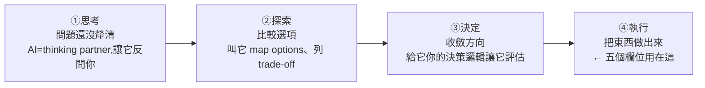

# 你不是不會寫 Prompt,是不會「定義任務」:五個欄位把需求寫成 AI 接得住的 brief

> 來源:Gary Chen(@garytalksstuff)〈你不是不會寫 Prompt,是不會定義任務〉。模型已經從「實習生」升級成「senior partner」(Opus 4.8、GPT-5.5、各家 agent 都能自己讀檔、改程式、驗證、重新規劃),但多數人的 prompt 還停在去年。這支影片講清楚:**你卡的不是文筆,是還沒想清楚「要什麼」。** 用 **目標 / 背景 / 素材 / 邊界 / 完成定義** 五個欄位,把模糊需求寫成一份 brief。

---

## 一句話總結

**寫提示詞 ≠ 定義任務。** 提示詞是「文筆」(把話講漂亮,是地板、人人得會);定義任務是「思考力 + 溝通力」(決定產出的高度)。你最後丟給 AI 的還是一份 prompt,差別在裡面裝的是「**動作指令**」(幫我做個這個)還是「**一份定義完整的任務(brief)**」。**只要把任務想清楚,prompt 是自動長出來的**——而這層 AI 替你補不了,因為「它能幫你問,不能替你想」。

---

## 為什麼舊的 prompt engineering 過時了

- **去年的模型是「實習生」**:不夠聰明,你得把每一步寫死(用什麼格式、分幾段、語氣、要不要 emoji),少寫一條就出錯。Prompt engineering 那套本質是「**把任務拆細到實習生不會搞砸**」。
- **現在的模型是「senior partner」**:你不會跟資深同事說「打開 Excel、在 A1 輸入這個、選 B 欄右鍵 Format Cells」;你會說「我們下季要做這個決策,這份分析要支撐它,背景大概這樣,這些素材可用,這些底線別碰,給我建議」——**給大方向,剩下他自己判斷,甚至會反過來挑戰你**。
- **關鍵分辨**:過時的是「把 prompt 當操作手冊寫」,不是「把話講清楚」(後者永遠重要)。**AI 會挑戰你的是「內容」,不會質疑你的「意圖」。**

> **反直覺的觀察**:公司裡 AI 用得最好的,通常不是技術最強的工程師,而是**本來就會帶人的主管**——因為他們習慣「先把任務想清楚再交辦」。純技術、習慣自己幹活的人,反而花很多時間精修 prompt 措辭,但任務本身一直含糊。

---

## 動手前先判斷:你在哪個階段?

大部分人把四階段**混在一起**:還在「思考」就叫 AI 寫完整 draft → 你連自己的 thesis 都沒有,它只能生出「誰都會寫但沒觀點」的版本。**AI 不會幫你分清階段**,你給什麼它就做什麼;被打臉幾次後,要學會下指令前先停一下問「我現在在哪個階段?」。下面的五欄位專給**執行階段**用。

---

## 五個欄位(以 SaaS 競品分析實戰示範)

**爛 prompt**:「幫我做一份 X 工具的競品分析,分析五家主要競品,列出 features、定價、優缺點。」→ 看起來不爛,但跑出來很扁(feature 從官網抄、定價可能寫錯、優缺點不知哪來)。**因為你定義的是「動作」,不是「工作」。**

| 欄位 | 精神 | brief 版怎麼寫(競品分析) |
|---|---|---|
| **①目標** | 不是動作,是**成品/決定**——這東西出現後我要拿它幹嘛 | 「我們下季要做產品方向決策,這份分析要支撐它:USP 該往『更易用』還是『更便宜』,最後給明確建議方向+理由」 |
| **②背景** | 一個聰明但不熟你公司的同事,需要知道什麼才不會搞錯方向 | 「年營收 200 萬美金、focus 中小企業行銷自動化、客戶 50 人以下、常嫌我們複雜又貴、去年動過一次價市場反應不好——分析要納入考慮」 |
| **③素材** | 它能用的材料範圍:主要/次要/**不能碰** | 「主要=這三家競品官網+產品文檔(連結附下);次要=我整理的用戶評論;**不要用網路二手評論文章(多是付費 SEO);找不到就留白,不要編造**」 |
| **④邊界** | 哪些事不要做/不碰/不能假設(幾乎都是「不要」) | 「不要編造 ARR/user count/growth rate;不要建議改付費等級架構(公司政策);不要 buzzword 滿天飛、只有形容詞沒取捨」 |
| **⑤完成定義** | 什麼產出算結束、什麼時候停(definition of done) | 「先給 outline:三家關鍵差異+建議聚焦的 USP 方向+判斷邏輯;**不要直接寫完整報告,先給框架等我審過再下一步**;markdown、每段 3–4 個 bullet」 |

**幾個關鍵心法:**
- **目標**:AI 看到「動作」就用 average 的方式做(它不知道你拿來幹嘛);講清「要支撐什麼決策」,它會自動把焦點收斂到對的維度(易用 vs 便宜)。
- **背景**:不是補充資訊,是**決定 AI 用什麼角度看任務**——知道你不是大企業 SaaS、客戶嫌什麼、價格踩過雷,它就不會輕率丟「降價搶市」這種建議。
- **素材**:範圍從 5 家**收斂成 3 家**(收斂本身就是定義任務);**「找不到就留白不要編造」超重要**——AI 預設「你問就要答」,找不到會編一個聽起來合理的塞進去,你拿著它編的定價去開會就精彩了。
- **邊界 = 牆**:目標/背景/素材是「方向」,邊界是「牆」。像跟室內設計師說「要北歐風」(方向)還要說「絕對不要榻榻米、不要木地板」(牆)。多數人只給方向不給牆 → AI 自由發揮空間太大。問自己:「它做出什麼我會說『這不是我要的』?」先寫下來。
- **完成定義**:「**先給框架不要直接寫完整報告**」是最值錢的一條 checkpoint——方向不對可以直接調,不用等它寫完 30 頁才重來(省時間省 token)。**微管理(how)≠ 成品規格(what)**:叫它用 markdown、每段 3–4 bullet 是「what」(本來就該你定),不是手把手規定每一步的「how」。

> **不是每個任務都要寫滿五欄。** 判斷標準只有一個:**做錯重來貴不貴。** 會拿去開會的、agent 要自己跑半小時的、產出要交到別人手上的 → 值得先花 10 分鐘寫 brief。「多花 10 分鐘,但不用重跑三輪」,這帳怎麼算都划算。

**產出差異**:爛 prompt 跑出「A/B/C/D/E 五家平鋪到底、長得幾乎一樣,看完還是不知道往哪走」;brief 版先回一版**可以直接拿去開會的框架**:「若往『更易用』走,最該對標 B(onboarding 只 3 步,正打你客戶最常抱怨的『上手太複雜』);但 B 定價比你高,若同時想搶『更便宜』會打架,建議二選一、偏向易用,因為你的用戶評論裡抱怨複雜遠多於抱怨價格。」

---

## 為什麼 AI 不能替你補這層

- AI 被設計成「**回覆快、要 helpful**」,收到 prompt 的本能是**馬上行動**,沒有人類的社交緩衝、不會回頭問。你給它含糊的「做競品分析」,它就立刻還你一份含糊的「市面上有這五家、各有優缺點」——看起來完整,實際空洞。
- 你可以叫它「不確定先向我釐清」,有些 agentic 產品也內建這行為。**但它問你的問題,答案還是只能從你腦袋出來**——「它幫你問,沒辦法替你想」;叫 AI 反問,頂多把 brief 從**申論題變填空題,空格還是你填**。
- **AI 是一面鏡子**:你餵它模糊,它就把你那份沒想清楚的指令原封不動反射成 generic 的東西還你。
- 跟真人共事其實一樣:你跟下屬說「把簡報做好一點」,他也只能猜。差別是同事**有能力回頭問**(但那需要勇氣、不怕被覺得「連這都不懂」,所以很多下屬也跟 AI 一樣含糊做完)。**「把任務想清楚」這件事,只能你自己扛。**

---

## 應用案例 / 這其實是「管理能力」

- **同一份 brief,餵 AI、餵下屬、餵外包廠商都通用**。你在練的是兩件跟 AI 無關的事:**思考力**(逼自己想清楚要什麼、要支撐什麼決定、什麼算好)+ **溝通力**(把它翻譯成另一個聰明對象能懂的形式)。AI 只是把你缺這兩件事的代價照得特別清楚。
- **可直接套用的自檢五問**(下指令前過一遍,最好寫下來):
  1. **目標**:我拿這個成品要幹嘛?
  2. **背景**:一個聰明的陌生人接手前,需要知道什麼?
  3. **素材**:我要它根據什麼做?(哪些別讓它自己上網找)
  4. **邊界**:它做出什麼我會說「這不是我要的」?
  5. **完成定義**:什麼東西出現在我眼前,我就可以收工?
- **佐證**:微軟 × LinkedIn 2024 Work Trend Index——最會用 AI 的人,差別不是 prompt 多炫,而是**動手前更常先停一下、想清楚這任務該怎麼交給 AI**。那不是 prompt 技巧,是一種溝通習慣。
- **本庫互連**:[[task-decomposition-agentic-workflow]](把人的 SOP 拆成 agent 跑得動的 workflow,是這套「定義任務」的 agent 工程版)、[[context-engineering-processing-vs-thinking]](別讓 AI 搬磚)、[[three-valuable-ai-skills]](工作流設計力/獨立思考力)、[[model-agnostic-ai-workflow]](按任務選模型)、[[claude-dynamic-workflows]](把定義好的任務交給 workflow 編排)。

> **結語**:Prompt engineering 是 2026 的**基本功**,不會有人因為你 prompt 寫得好給你掌聲;真正拉開差距的是**定義任務的能力,而它本來就是管理的一環**。「提示詞是你打進框框裡的那些字;定義任務,才是讓那份工作能被完成的東西。」

---

## 來源

- Gary Chen(@garytalksstuff),〈你不是不會寫 Prompt,是不會定義任務〉,YouTube:<https://youtu.be/KNP9Mr1rUQY>(2026-06-11)
- 引用:Microsoft × LinkedIn, Work Trend Index(2024)。
