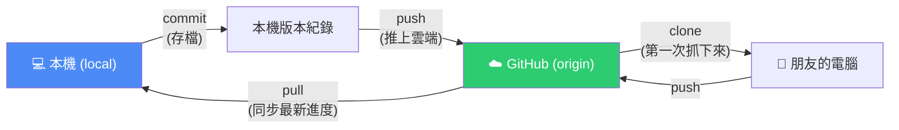
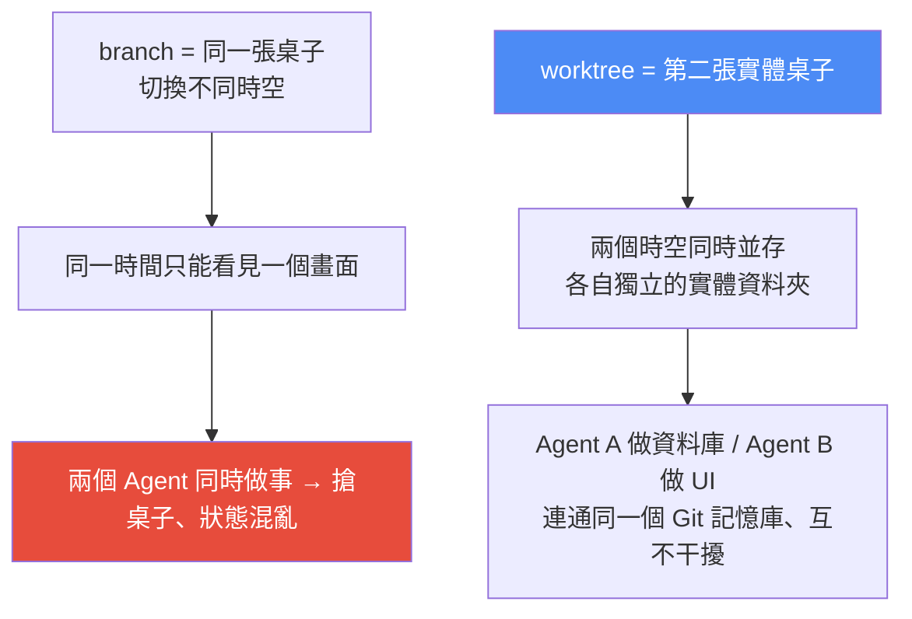
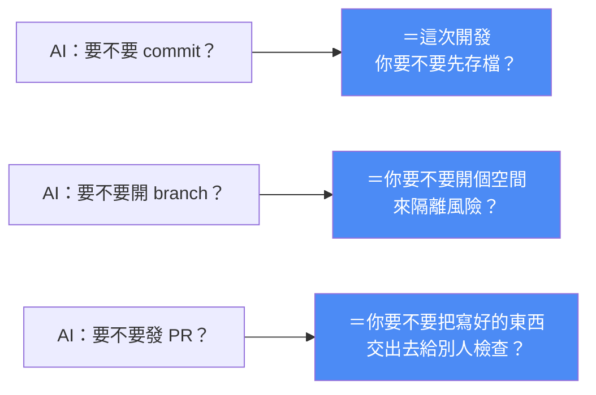

# 給非技術人員的 Git / GitHub:Vibe Coding 必學的基礎技能

> Gary Chen(@garytalksstuff)用白話 + 一個「Gary 做記帳軟體」的連續案例,把 Git/GitHub 的核心概念串起來。核心主張:**你不需要變成 Git 專家、不用硬背指令,但你要聽得懂 AI 在問什麼**——因為當 Claude 或 Cursor 問「要不要 commit?要不要開 branch?要不要發 PR?」時,它其實是在問你三個**產品決策**。

---

## 一、最該先分清楚的兩個東西

| | **Git** | **GitHub** |
|---|---|---|
| 是什麼 | 幫你在**本機端**管理程式碼版本的**工具** | 在**雲端**儲存和管理程式碼的**網站** |
| 白話 | 「幫這個資料夾記錄每次改了什麼」 | 「程式碼專用的 Google Drive」 |

**為什麼不能像 Google Drive 一樣直接把資料夾拖上去?** 因為 GitHub 是拿來**協作與追蹤程式碼進度**的,**它不收單純的檔案,只接收已經做好版本紀錄的專案**。所以上傳前,你得先在自己電腦裡幫程式碼建立這套紀錄系統——那就是 `git init`(白話:「嘿 Git,請開始幫我追蹤這個資料夾裡的所有變動」)。

> 🔎 **為什麼 Vibe Coder 特別需要 Git:** 沒有 Git 時,AI 幫你加新功能卻把原本好好的程式改壞了——**最崩潰的是你根本不知道 AI 剛剛動了哪些檔案,也不知道怎麼回到上一個正常狀態**。有了 Git,不管 AI 怎麼亂改,你隨時能回溯。

---

## 二、核心動作:一個「存檔 → 上傳 → 協作」的循環

### commit —— 打大魔王前的手動存檔

- **對應的念頭:**「我好不容易把登入功能搞定,想先建立一個版本紀錄,萬一 AI 之後又改壞,我能退回現在這個正常狀態。」
- **價值:** 幫程式碼建立一個**絕對安全的檢查點**。只要 commit 了,這份正常狀態就被永久封存——**就算 AI 發瘋把程式碼全刪了或改得亂七八糟,都能瞬間還原**。
- **⚠️ 最重要的觀念:`commit` 不是上傳、不是把東西放到 GitHub 上。** commit 只是單純在你自己的電腦裡,幫目前狀態留一份紀錄。
- **當 Claude Code 問「要不要 commit?」時,它其實是在問:** 現在這個好好的狀態,**你要不要先存個檔、買個保險?**
- **你也可以主動說:**「現在這版測試都沒問題,幫我 commit 一下,並在訊息裡寫清楚這次修改了什麼。」

### push —— 真正把存檔推上雲端

- **對應的念頭:**「電腦裡已經有滿意的版本了,該丟到網路上備份、順便分享給朋友。」
- **`commit` 跟 `push` 完全是兩回事**:commit 只在自己電腦存檔;**push 才是真的把存好的檔案推送到雲端 GitHub**。
- **看到那串「很長的指令」不用怕**——`push 到 origin main` 白話翻譯:

| 術語 | 白話 |
|---|---|
| `remote` | 遠端的地址(相對的 `local` = 你電腦本地的資料夾) |
| `origin` | 通常指你在 GitHub 上的那個專案資料夾 |
| `main` | 這個專案目前的**官方正式版** |
| **合起來** | 「請幫我把現在寫好的這個正式版本,傳送到雲端的那個專案資料夾裡」 |

> 🚨 **push 之前所有 Vibe Coder 都必須知道的事——金鑰外洩:**
> 案例裡 Gary 的記帳軟體藏了一把串接金流的 **API 金鑰**。**把金鑰想像成你家大門的鑰匙**——跟著程式碼一起 push 到 GitHub,等於**把鑰匙公開貼在網路上**,任何人都能撿去用、甚至盜刷信用卡。
> **關鍵差別:程式被 AI 改壞了還有救;金鑰一旦外洩流傳出去,那就真的救不回來了**——只能整把作廢重新申請(像信用卡被盜刷只能掛失補發)。
> **解法:`.gitignore`**——告訴 Git「這些特定檔案請不要追蹤、絕對不要上傳」。**你根本不用自己記哪些該擋**,直接跟 Claude Code 說:「幫我確認 `.env` 檔、密碼還有各種金鑰或機密檔案,都已經放進 `.gitignore` 裡面,絕對不要 commit 上去。」

### clone vs pull —— 協作的兩個動作

- **clone**(朋友第一次加入專案):把專案抓到自己電腦。
  - **⚠️ `clone` ≠ GitHub 網頁上的 `Download ZIP`**:按 Download ZIP 抓下來的**只是一包純檔案,裡面完全沒有被 Git 追蹤的紀錄** → 之後改了程式**沒辦法同步回 GitHub**。用 clone 才等於正式加入這個專案(只要專案主把你加成協作者,之後上傳都很輕鬆)。
- **pull**(平常同步別人的最新進度):把 GitHub 上最新版本的程式碼抓下來、同步到自己電腦。

> **合作的基礎循環:** 第一次加入 → `clone`;同步別人進度 → `pull`;自己改好存檔 → `commit`;送上雲端 → `push`。

---

## 三、branch 與 worktree:一張桌子 vs 兩張桌子

### branch(分支)—— 同一張桌子的「平行時空切換按鈕」

- **目的很單純:** 讓**正在開發中、還不穩定的功能**,跟**已經寫好、很穩定的功能**徹底分開,井水不犯河水。`main` 這條主線代表**穩定運行中**的程式碼。
- **「我已經會 commit 了,直接在 main 上改,壞了退回上一個 commit 不就好?」** —— 不行,因為 **AI 寫比較複雜的大功能時通常不會一次寫對,而是反覆試錯改好幾次**。你一直在 main 上讓它改,**在試錯期間你的程式就一直處於半壞掉的狀態**。這時朋友突然想看你的軟體、或你發現畫面有拼字錯要緊急修正 → 非常尷尬,**因為你這條作為專案門面的 main 現在根本跑不動**。
- **比喻:** 專案資料夾是一張**神奇辦公桌**,branch 是桌旁的**平行時空切換按鈕**——按 `main` 桌上是穩定版;按新功能 branch,桌上瞬間變成開發中的草稿。**草稿被 AI 改爛了,最壞就是把 branch 刪掉、切回 main,而 main 毫髮無傷。**
- **怎麼指揮 AI:**「先幫我從 main 開一條新的 branch,專門用來做這次的資料庫功能;之後所有的改動都幫我 commit 在這條 branch 上,**絕對不要動到 main**。」

### worktree —— 直接去 IKEA 再買第二張桌子

- **branch 的致命傷:** 雖然能切換不同狀態,但**你終究只有一張辦公桌,同一時間只能顯示一個平行時空**。硬叫兩個 AI 同時在這唯一的桌子上做事(一個看資料庫藍圖、一個看 UI 設計稿),它們會**為了搶這張桌子的顯示狀態而大打出手**——你明明在資料庫的 branch 上,裡面卻混進了修改 UI 的 commit,Git 狀態變得非常混亂。
- **worktree = 第二張實體的桌子**:跟 Claude Code 說要開 worktree,它會在你電腦裡**生出一個全新的實體資料夾**,讓兩個時空**同時並存**。
- **最棒的是:這些桌子連通同一個 Git 記憶庫** → Agent A 去第一張桌子負責資料庫 branch、Agent B 去第二張桌子負責 UI branch,**各司其職、平行開發效率拉滿、完全不互相干擾**。
- **為什麼現在才紅:** 以前工程師不太用 worktree(一個人沒三頭六臂,一次專心做一件事);但**身為 Vibe Coder,你很可能同時開兩三個 AI Agent 平行工作**,而不是呆呆排隊等一個做完換下一個。

> 🔎 **對照本庫:** 平行開多個 agent 的治理,可對照 [[claude-dynamic-workflows]]、[[cross-model-review-claude-codex-harness]]。

---

## 四、PR 與 merge:把成果交出去檢查、收回主線

- **PR(Pull Request)= 一份「改動提案」**。功能寫完、正式合併進 main 之前,先開 PR 送到 GitHub 讓大家審核這次的改動合不合理。
- **不用自己動手**,直接跟 agent 說:「幫我把這條 branch 開一個 PR,內容說明這次做了什麼功能、改了哪些檔案、還有要怎麼測試它。」
- **merge** = 大家檢查沒問題後,把變動正式合併回主線 main(在 GitHub 網頁按 Merge 按鈕)。

> 🚨 **新手最容易誤會的地方:合併發生在雲端網頁,你電腦本機裡的 main 不會自動通靈跟著變。**
> 很多人以為在 VS Code / Cursor 裡看到的程式碼就是 GitHub 上最新版本——**其實不是,你看到的永遠是你電腦本機目前的狀態**。
> **所以每次有新功能被合併進 main 後,一定要切回本機的 main、叫 agent 再執行一次 `pull`**,手動把雲端最新版本拉下來。這樣你下次開新 branch 才是從最新進度出發,**而不會一直活在一個過時的舊版本裡**。

### conflict(衝突)—— 不是世界末日,是 Git 在等你下產品決策

**什麼時候發生:** 你跟朋友剛好改到同一個檔案的同一個地方,或兩個 AI Agent 剛好動到同一段核心邏輯 → **Git 發現同一段程式碼出現兩個完全不同的版本,它不知道該聽誰的。**

**AI 怎麼處理:** Git 會在檔案裡留下特殊標記,把兩邊打架的程式碼上下並列;AI 分析兩個版本各自想做什麼,通常用三種方式合併:

| 方式 | 說明 | 例子 |
|---|---|---|
| **① 二選一** | 判斷出某一版才是最新邏輯,或你原本的寫法有 Bug 剛好被朋友修好 → 捨棄舊的、只留正確的那邊 | — |
| **② 兩邊都留** | Git 比較死板,**只要同一行被兩個人動過就判定為衝突**,但 AI 看得懂這其實只是新增不同項目 | Gary 在清單最後一行加「理財分類」、朋友也在最後一行加「日常分類」→ AI 把兩個項目都保留、湊進同一個選單 |
| **③ 打掉重練幫你改寫** | 兩邊邏輯硬拼在一起程式會出錯 → AI 看懂雙方目的後,**乾脆把那段重寫一遍**,用新寫法把兩邊功能順順接起來 | — |

**⚠️ 但 AI 終究不知道你的產品規劃。** 如果雙方改的邏輯**在產品邏輯上互相衝突**,AI 就會卡住不知道該選哪種方法。**這時你要做的不是自己下去改程式,而是給出明確的產品決策:**

> 「幫我解掉這個 conflict,分類列表的邏輯**以朋友的為主**,但是把我的『理財分類』**移到右邊的進階選單**裡面。」

只要你把**取捨的方向與規則**講清楚,AI 就會自己挑最適合的合併方式接合起來。

---

## 五、AI 把程式改壞了怎麼救?

| 情境 | 動作 | 白話 |
|---|---|---|
| **還沒 commit** —— AI 改了一大堆檔案,你跑一下發現完全不對 | **`restore`** | **一鍵讀檔**,回到上一次的遊戲存檔點,就當作剛剛 AI 亂寫的事完全沒發生過 |
| **已經 commit 了** —— 順手存檔後才驚覺那次 commit 根本是錯的 | **`revert`**(較安全) | **不是偷偷把歷史紀錄刪掉**,而是**新增一個反向的 commit** 去抵消前面那次錯誤的改動 |

> **為什麼 `revert` 在協作時特別安全:** 所有人都能在歷史紀錄裡看到「有加錯東西、然後又被抵消掉」的完整過程,而不會覺得某段進度怎麼突然憑空消失。

**這些指令你都不用硬背**——發現 AI 改壞時直接說:「剛剛這次的改動我不要了,請幫我回到上一個正常的版本。」**AI 會自己判斷現在的狀態,決定該用 `restore` 還是 `revert`。**

---

## 六、總結:你不用當 Git 專家,但要聽得懂 AI 在問什麼

**完整流程回顧(Gary 的記帳軟體):**
1. 程式可備份到 **GitHub**(雲端倉庫);上傳前必須先設定 **Git**(本機版本管理)。
2. **commit** = 幫當下狀態留存檔快照;**push** = 把電腦裡的存檔推送到雲端(先用 `.gitignore` 擋掉金鑰!)。
3. 朋友加入用 **clone**;朋友上傳新進度後用 **pull** 拉回。
4. 要大改功能 → 開一條 **branch** 當安全的實驗沙盒。
5. 要同時讓好幾個 AI 做不同事 → 用 **worktree**,讓每條 branch 有自己的實體資料夾。
6. 功能寫完測試過 → 開 **PR** 給人 review → **merge** 收回 main → **記得回本機 `pull`**。
7. 遇到 **conflict** → 不是世界末日,是 Git 在等你下**產品決策**。
8. AI 改壞 → 還沒 commit 用 **restore**;已 commit 用 **revert**。

> **Gary 的收尾:** 「或許對你來說 Git 是一堆難背的火星文指令,**但你只要有能力指揮就可以了**。只要你能把這些概念**對應到它可以幫你解決開發上的什麼問題**,一切也會變得非常好理解。**你不需要在今天就逼自己變成 Git 專家**,但你要知道 AI 問你那些問題時,它其實在問什麼——只要這些判斷你聽得懂,**你用 AI 開發就會踏實很多**。」

---

## 來源

- 影片:[給非技術人員的 Github 教學,Vibe Coding 必學的基礎技能(Gary Chen @garytalksstuff,2026-07-15,官方 zh-TW 字幕)](https://youtu.be/atqcAb7MFAM)
  - 作者另在 Patreon 提供「27 個日常情境 ↔ Git 指令 ↔ 給 AI 的提示詞」對照表,以及一組檢查專案 Git 健康度的提示詞。
- 延伸(本庫):[Codex 新手指南:四基本功](./codex-beginner-guide-four-basics.md)、[Codex 2.0 新功能實戰](./codex-2-record-replay-mobile-remote.md)、[AI 編程的三個致命錯覺](./ai-coding-three-illusions-opencode.md)、[Claude Dynamic Workflows](../ai-agents/foundations/claude-dynamic-workflows.md)
