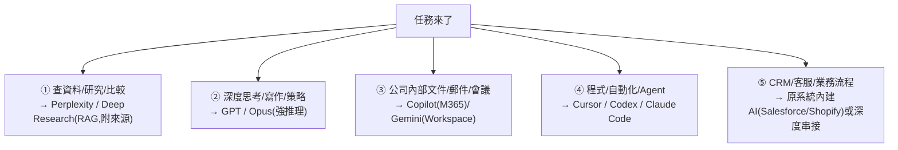

# 別追「最強 AI」:用一張分工地圖建立你的多工具工作流

**主題分類:** AI / 生產力與工作方法
**來源:** YouTube〈如果你還在靠一個最強 AI 做萬能打雜工,你要學學「多工具工作流」了〉(Gary Chen,2026-05-13,約 16 分;依繁中逐字稿整理)
**整理日期:** 2026-05-30

---

## 1. 反直覺核心:問錯問題了

如果你還在問「哪個 AI 工具最強」就問錯了。**排行榜會過期**,真正拉開差距的是 **Multi-Tool Workflow(多工具工作流)**——判斷「這個任務該交給哪一種工具」。

> **把 AI 工具看成一間公司團隊:** 你不會問「哪個員工最強」,而是「這件事該派誰做」;不會每天把整間公司換掉,而是 **建立分工系統**。財務報表不會叫設計師做,寫程式不會找小編。

**用錯工具的兩個問題:** ①**context 不齊**(它看不到你的 Google Drive / CRM / 訂單,就只能猜——一個看得到完整資料的普通 AI,常比看不到資料的頂級模型更有用);②**只有腦、沒有手**(需要搜尋/讀檔/改檔/跑測試/串 API 的任務硬塞進聊天框,看起來有回答、其實沒完成工作)。

---

## 2. AI 分工地圖:五類任務

| 類別 | 優先工具 | 為什麼 |
|---|---|---|
| ① 查資料/研究 | Perplexity 類(RAG) | 先檢索再生成、附來源、減幻覺;**弱點:不適合深度觀點推演** |
| ② 思考/寫作/策略 | GPT / Opus | 把混亂變清楚、觀點變論證、草稿變可發表;像「策略編輯/思考搭檔」 |
| ③ 內部文件 | Copilot / Gemini Workspace | 關鍵不是模型智商,而是 **它能不能碰到你的工作現場(資料在哪、有沒有權限)** |
| ④ 程式/自動化 | coding agent | 瓶頸不是會不會回答,而是 **能不能進工作環境讀檔/改檔/跑測試/自修錯** |
| ⑤ 業務流程 | 原系統 AI | chatbot 沒接到 CRM/訂單就是「會講話的玩具」 |

**核心原則:資料在哪裡,AI 就應該盡量在哪裡工作。** 一直把公司資料複製貼到外部 chatbot 再貼回來,有資安/版本/效率問題,AI 就不是真正進入工作流、只是外部問答窗口。

---

## 3. 應用案例:做一支「AI Agent 趨勢」影片的生產線

1. **Perplexity / Deep Research** 整理近期重要發布(Microsoft/OpenAI/Anthropic 做了什麼)。
2. 把資料交給 **Claude / GPT** 找出背後主軸(也許主軸不是「誰發布什麼」,而是「AI 競爭從模型競賽轉向協作與自動化」)。
3. 再請它寫成 **口播稿**(標題、hook、段落架構)。

> 這不是「叫 AI 生文章」,而是 **設計一條內容生產線、指揮一群在各自領域發光的 AI coworker**。其餘範例:自動化流程(抓 Gmail → 整理 → 寫 Notion → 發 Slack)諮詢用 ChatGPT、真要寫 script 跑測試交給 coding agent;改網站功能 ChatGPT 給範例、Cursor/Claude Code 進專案實改。**coding agent 很強但不能完全放手——你定義任務、AI 執行初稿、你 review 差異、AI 修正、你做最後驗收**(尤其涉及資料/安全/付款/權限)。

---

## 4. 選工具前先問三個問題(判斷公式)

1. **這個任務需要什麼資料?**(公開網路?公司內部文件?客戶資料?程式碼?歷史訂單?)——**先問要什麼資料,不要先問工具。**
2. **這個資料在哪裡?**(網路 / Google Drive / SharePoint / Notion / Slack / Salesforce / GitHub / Shopify / 本機)——能直接碰到資料的 AI 通常更適合。
3. **這個 AI 能不能直接幫你操作?**(不只能讀,還要能更新 CRM、發通知、查訂單、依權限控制回答)——AI 的價值從「回答問題」走向「完成任務」。

> 合起來:**任務需要什麼資料 → 資料在哪裡 → 哪個 AI 能直接讀取/操作那裡。** 於是你會知道:先丟 Perplexity 找資料 → 丟 Claude 推理 → ChatGPT 打磨語氣 → Claude Code 實作自動化 → 內部文件給 Copilot → 客服流程回到 Zendesk/Shopify。

**新的 AI literacy = routing judgment(分流判斷力):** 模型 vs 模型的對決是巨頭的事;**你要在意的是人跟人之間「能不能把對的任務交給對的工具」的差距。** 工具會越來越多,但你的判斷與選擇邏輯才是核心競爭力——也讓你不被工具綁架、被焦慮挾持。

> 與本 repo 關聯:這是 [[three-valuable-ai-skills]]「AI 調度力」的擴充版;⑤ 業務流程與「資料/權限/責任」呼應 [[enterprise-ai-adoption-race]];④ coding agent 的 review 心態呼應 [[karpathy-software-3-0]]。

---

## 來源

- [YouTube:如果你還在靠一個最強 AI 做萬能打雜工(Gary Chen)](https://youtu.be/QHHTcYBEIEo)
