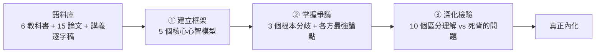

# NotebookLM 三提問:把一學期壓縮到 48 小時的快速學習法

**主題分類:** AI / 生產力與學習方法
**來源:** 商業周刊(原文出自《數位時代》,蘇柔瑋撰;基於 Ihtesham Ali 在 X 的貼文,逾 400 萬次瀏覽)
**整理日期:** 2026-05-29

---

## 1. 核心洞見

一位 MIT 研究生把 **6 本教科書、15 篇研究論文與所有講義逐字稿** 丟進 NotebookLM,只靠 **三個關鍵提問**,在 **48 小時內** 壓縮完一整學期、通過高難度資格考。

> 決定成效的關鍵不是「內容多寡」,而是「**提問品質**」。
> 「多數人把 NotebookLM 當高級螢光筆;這些學生把它當成 **讀過所有相關文獻的私人家教**。」

---

## 2. 三步驟快速學習法

### 第一步:建立知識框架(抽取心智模型)
- **前置:** 上傳完整語料(教科書、論文、講義逐字稿)建立語料庫。
- **關鍵提問:** **「這個領域所有專家共享的 5 個核心心智模型(mental models)是什麼?」**
- **效果:** 直接汲取專家的認知骨架,從龐雜文獻抽出 **結構** 而非流水帳。後面所有細節都掛在這 5 個骨架上。

### 第二步:掌握學界爭議與共識(畫出知識地圖邊界)
- **關鍵提問:** **「這個領域的專家在哪 3 個地方存在根本分歧?各方最強的論點是什麼?」**
- **學習邏輯:** 先摸清知識地圖輪廓,**分清「已定論」與「開放議題」**。
- **效率:** 號稱「20 分鐘內建構出完整學術脈絡」,相當於多數學生數月的學習。

### 第三步:深化理解與檢驗掌握度(用好問題逼出真理解)
- **關鍵提問:** **「生成 10 個能區分『深度理解』與『死背知識』的問題。」**
- **具體做法:**
  - 花約 6 小時、運用參考資料作答。
  - **每答錯一題就追問理由與遺漏之處**。
  - 刻意面對難題、從錯誤中修正,鞏固長期記憶(檢索練習 + 針對性糾錯)。

---

## 3. 為什麼有效

| 一般人做法 | 這套方法 |
|---|---|
| 把 AI 當「高級螢光筆」,劃重點、要摘要 | 把 AI 當「讀完所有文獻的私人家教」,逼它輸出結構與爭議 |
| 從第一頁讀到最後一頁(流水帳) | 先拿骨架(心智模型)→ 再補邊界(爭議)→ 最後檢驗 |
| 被動接收摘要 | 主動用「理解型問題」自測 + 糾錯 |
| 內容愈多愈安心 | **提問品質** 決定成效 |

關鍵在於:**先框架、後細節**;**分清定論與爭議**;以及用 **檢索練習(retrieval practice)** 而非重讀來鞏固記憶——這三點都是學習科學公認有效的原則。

---

## 4. 應用案例

- **面試惡補(無語料):** 下週要面試「向量資料庫」。① 先問 5 個核心心智模型(嵌入、相似度度量、ANN 索引、召回 vs 延遲取捨、與關鍵字檢索互補)。② 再問 3 個爭議(向量 vs 混合檢索、HNSW vs IVF、自建 vs 雲服務)。③ 出 10 題理解型問題(如「什麼情況純向量檢索會輸給 grep?」——正好對應本 repo 的 [[grep-vs-vector-agentic-search]]),作答後針對錯題深挖。
- **研究生資格考(有語料):** 把指定書單與論文丟進 NotebookLM,跑三提問,72 小時內從零到能與口試委員討論開放議題。
- **轉職進入新產業:** 把產業報告、法規、白皮書建成語料庫,用三提問快速建立「這個產業的專家怎麼想」的框架,而非死記名詞。
- **搭配本 repo 的 skill:** 已把這套方法寫成 Claude skill `rapid-learning`(放在 [claude_marketplace](https://github.com/shooter2062424/claude_marketplace)),要快速學東西時直接讓 Claude 扮演那位「私人家教」帶你跑三階段。

---

## 5. 一句話心法

> **學得快不是因為讀得多,而是因為問得好。** 先要骨架、再要爭議、最後用會逼出理解的問題自測並糾錯。

---

## 來源

- [商業周刊:MIT 研究生如何用 NotebookLM 三個提問,把一學期壓縮到 48 小時](https://www.businessweekly.com.tw/focus/blog/3020978)
