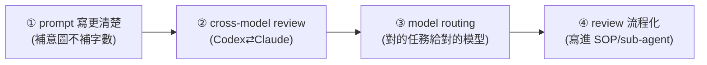

# Opus 4.7 不是更強的 4.6,是另一種模型:四個該跟著升級的工作流

**主題分類:** AI / 生產力與工作方法
**來源:** YouTube〈Opus 4.7 不是更強的 4.6,是另一種模型〉(Gary Chen,2026-04-28,約 21 分;依繁中逐字稿整理)
**整理日期:** 2026-05-30

---

## 1. 核心:不是變笨,是「變得不好合作」

升級 Opus 4.7 後很多人覺得「更難用」。但 **變笨(capability 退步,benchmark 全面下滑)** 與 **變難合作(behavior 改變,benchmark 反而上升、但互動體感變糟)** 是兩回事——**4.7 是後者**。Notion 實測 4.7 多步驟任務比 4.6 進步 14%、更少 token、tool error 只剩 1/3;Rakuten 內部 SWE benchmark 解決的 production task 是 4.6 的 3 倍。

> **關鍵改變:4.7 更遵從你寫的字面意思,不替你腦補沒講的部分。** Anthropic 文件明寫「模型不會推測你沒提的需求」。以前對 4.6 說「把文章變成三句話」,它順手給你粗體標題 + highlight + 收尾(推測你要發社群);4.7 就 **只給三句話**。
>
> **兩面性:** 好處=可控性高(production pipeline 不會慢慢飄走);壞處=門檻變高(以前 prompt 寫很爛模型還幫你補,現在 **還你一個爛的東西**——你終於被迫看到自己寫 prompt 的水平)。方向呼應 [[karpathy-software-3-0]]「越強的模型越不需要細節指揮,給成功標準讓它自己想辦法」。

---

## 2. 三個「難用」痛點

1. **更遵從、更少腦補:** 寫作變「乾」(沒有自然鋪陳/transition/收尾);coding 只改你指定的 function(不順手整理 import/命名/dead code);長任務走到沒交代的步驟會停下或跳過;**你內心預期的「成品感」沒了**(丟半成品還你半成品)。
2. **更貴(標價沒漲但帳單漲):** ① 新 **tokenizer** 讓同段文字多算約 **30%–47%** token(Simon Willison 實測 1.29–1.47 倍);② **adaptive thinking** 拿掉 thinking budget、模型自己決定燒多少 output token。→ **容錯空間變小,亂跑亂試的代價變高。**
3. **自我檢查不可靠(最重要、最多人忽略):** 4.7 更敢直接下結論、說「我做完了」。作者對照測試(埋陷阱、無人介入):4.7 **有時宣稱做完、實際沒處理到**(report 與實際做的事對不上);且 **Claude 自評偏高、GPT 自評偏低**——`Opus 對自己過分樂觀`。對高風險任務是災難(叫 Opus review 自己的 production code/財務分析/對外稿,它說 OK 其實有它沒看出的問題)。

---

## 3. 解法不是降回 4.6(方向回不去),而是讓 workflow 跟著升級

### ① 調 prompt:寫更清楚,不是更長
加「請仔細、請完整」對 4.7 沒意義(它本來就會)。該補的是 **意圖**,四件事:**任務目的 / 給誰看 / 好的產出長什麼樣(success criteria)/ 一定要避開的錯誤**。
> 例:「把文章變三句話」→「目的是發在我的 Twitter,讀者是 AI 圈 builder、時間很少,第一句沒讓他們看到重點就會滑掉。」給場景/讀者/判斷標準,它自己決定要不要 punchy。**這 30 秒就是 4.7 在逼你別偷懶講清楚要什麼**(你身為需求方都講不清,怎麼委派給 agent?)。

### ② Cross-model review(必要,非 nice-to-have)
模型對 **自己** 的產出有偏誤(太樂觀/太悲觀),但對 **另一個模型** 的產出偏誤消失。作者每個重要任務走 **producer → reviewer** 兩段:寫架構/長 chain → Claude 當 producer、Codex reviewer(抓 oversell);寫精準 patch/isolated function → Codex producer、Claude reviewer(平衡 undersell)。做法:copy diff 給另一個模型「以資深工程師角度 review 這個 PR」,或讓主 agent 直接呼叫另一個模型 review 再交回修。**適用範圍很廣**:coding、研究摘要、論點邏輯、財務/資料分析(小數點/關鍵數字)、對外稿。

### ③ Model routing(了解 benchmark 後的工程決策)
- **4.7 強項:** 多步驟/長 agentic 任務(SWE-bench 80.8→87.6)、深度知識工作(GDPval 1753,遠高於 GPT-5.4 的 1674、Gemini 3.1 Pro 1314)、視覺辨識(54.5%→98.5%)。Hex/Harvey/Databricks 都驗證。
- **4.7 弱項:** Web research(BrowseComp 83.7→79.3,GPT/Gemini 領先)、Terminal 任務(Terminal-Bench 落後 GPT-5.4 近 6 分)。
- **作者分工:** 深度 coding + 知識整合 → Claude 4.7;純 execution / terminal → Codex;web research → Gemini 3.1 Pro / GPT;**review 一定跨模型**。(呼應 [[multi-tool-ai-workflow]] 的分工地圖。)

### ④ 把 review 流程化(最難但最重要)
憑感覺 review = 賭博。最簡版三步:**主 agent 產出 → cross-model review → 人類 final pass**,寫進 SOP。投資重點不在 prompt 而在 **infrastructure**(建 cross-model review 的 template/sub-agent、固定 checklist、自動化 pipeline 小工具)。作者例:Claude 寫實作計劃 → 在 terminal 呼叫 Codex 做 **至少兩輪** review(review 可無限做,要自設收手點;兩輪通常夠抓大問題,再多邊際效益快速遞減)。

---

## 4. 應用案例 & 最重要的 takeaway

- 跨多檔、需看完整 codebase 的 refactor → **Claude 4.7**(multi-step persistence 強,不會半路宣布完工)。
- 小工具 / utility script / isolated function → **Codex**(便宜快、範圍清楚時精準度夠,沒必要燒 4.7 token)。
- 30 篇論文 literature review → **Gemini 3.1 Pro** 抓取初整 → **Claude 4.7** 整合成結構化文件。

> **你不只是在用模型,而是在建一套自己的 AI 生產系統。** 模型會換、會升級、會被取代,但 **系統建得好,下個模型來只要換中間那一塊,整個 pipeline 還在。** 別把自己綁在某個模型上。
>
> 四件事:**prompt 補意圖不補字數 / 高風險任務 cross-model review / model routing / review 流程化**。以前模型替你做的判斷、補的細節、做的檢查,現在都還給你了——「丟一句 prompt 就拿到完美結果」本來就是假象,4.7 只是把它戳破。**不是 4.7 難用,是你不能再用舊方法用它。**
>
> (花絮:Anthropic 產品總負責人 Mike Krieger 在 4.7 發表前三天才從 Figma 董事會退下——同週 Anthropic 發了打對台的 Claude Design,見 [[claude-design-review]],屬利益迴避。)

---

## 來源

- [YouTube:Opus 4.7 不是更強的 4.6,是另一種模型(Gary Chen)](https://youtu.be/WOMdoiy9Qas)
