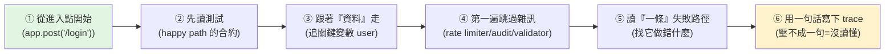

# AI 時代怎麼「讀」程式碼:6 個技巧(KodeKloud)

> 當 Claude / Cursor 幫你寫好大多數程式碼的初稿,**「讀程式碼」就變得比「寫」更值錢**——
> 寫越來越便宜,但**讀懂程式碼、抓出模型漏掉的 edge case** 才是難的部分。問題是:多數工程師被訓練成會「寫」,
> 卻沒被訓練「讀陌生 codebase」——一拿到就像讀小說一樣**從上往下捲**,幾分鐘後還是不知道在幹嘛。
>
> 整理自 KodeKloud 影片(英文,~4 分鐘),以幾乎每個後端都有的 **login endpoint** 為例(3 個檔、50–60 行)。

---

## 核心心法:程式碼是「誰呼叫誰」的圖,不是從頭讀到尾的故事

### ① 從「進入點」開始,不是檔案最上面
別為了讀而讀地去開 user model、middleware 資料夾。**找處理「進來的請求」那一行**——本例是 `routes/auth.js` 裡的 `app.post('/login')`,那是外部世界進入這段程式的地方。**從這裡往外順著呼叫走**,因為程式碼是「誰呼叫誰」的圖,不是從上讀到下的故事。

### ② 先讀測試,再讀實作
打開 `auth.test.js` 找 **happy path 測試**:一個 5 行的測試 post email+password、預期回 **200 + body 帶 token**。**這就是合約**(credentials 進、token 出)。測試不是全貌,但給你一個「讀任何原始碼之前」的起點。

### ③ 跟著「資料」走,不是跟著「函式」走
打開 login handler,**追那個最重要的變數**——本例是 `user`,看它的旅程:
- 用 request 裡的 email **誕生**(查出 user)→ 提交的密碼用 `bcrypt.compare` 跟 `user.password_hash` **比對** → `user.id` **打包進一個簽名的 JWT**(通常帶到期時間)→ token **回傳**。
- 核心登入流程,大概 **30 秒**就懂了。

### ④ 第一遍跳過你不需要的東西
直接**走過** rate limiter、audit log、其他 validator——除非它們會**改變請求、擋住流程、或正好解釋你在查的 bug**,否則先跳過。
> **多數工程師死在這**:一碰到 helper 就覺得有義務點進去,結果花掉一堆不必要的時間。
> 但 middleware/validator 常決定「handler 到底會不會執行」,所以不能永遠跳——只是「**在你還在描繪整體形狀時**」先跳過。

### ⑤ happy path 清楚後,只讀「一條」失敗路徑
快樂路徑告訴你**程式碼做了什麼**;失敗路徑告訴你**它做錯了什麼**。以登入為例,問兩個簡單問題(都是資安):
1. **email 存在 vs 不存在時,錯誤訊息長得一樣嗎?** 若不一樣 → 攻擊者能輕易辨別哪些帳號是真的(**帳號枚舉 account enumeration**)。
2. **「密碼錯」的回應,有沒有比「查無此人」更慢?** 若回應時間有差 → 攻擊者能用**時序差(timing attack)**測出哪些 email 已註冊,即使錯誤訊息一模一樣。

### ⑥ 沒人做、但最關鍵:用「一句話」寫下這條 trace
本例:「**用 email 找到 user → 用儲存的 hash 檢查密碼 → 用 user id 簽一個 JWT → 回傳它。**」
> **如果你沒辦法把剛讀的東西壓成一行,你就是『沒讀懂』,只是『看過』而已。**

---

## 應用案例

- **review AI 寫的 PR:** AI 寫初稿後,用這 6 招快速建立心智模型——從進入點 → 看測試合約 → 追關鍵變數 → 跳雜訊 → 挑一條失敗路徑找它漏掉的 edge case(正是 AI 最常漏的:帳號枚舉、timing attack 這類)。呼應 [[ai-coding-three-illusions-opencode]]「讀 > 寫、AI 沒讓你自動變快」。
- **接手陌生 codebase:** 別從上往下捲;找 route/handler 進入點順著呼叫圖走,配合 [[codegraph-code-and-tui]]/[[tree-sitter]] 這類「給你一張呼叫圖」的工具會更快。
- **面試/上手新專案:** 練「把一段流程壓成一句話」的能力——壓得出來才代表真懂,壓不出來就回頭再讀。
- **教初級工程師:** 直接給這 6 步當 checklist,治「一碰 helper 就鑽進去、捲完還是不懂」的通病。

---

## 一句話總結

> AI 時代「讀程式碼」比「寫」更值錢。讀的訣竅不是從頭讀到尾,而是:
> **從進入點開始 → 先看測試合約 → 跟著關鍵資料走 → 第一遍跳過雜訊 → 只挑一條失敗路徑找它做錯什麼 → 最後用一句話寫下 trace。**
> 壓不成一句話,就代表你只是「看過」、沒「讀懂」。

---

## 來源

- YouTube:[How to Read Code in the AI Era (6 Techniques)(KodeKloud)](https://youtu.be/4t8QcDdrL6Y)
- 延伸:本庫 [[ai-coding-three-illusions-opencode]]、[[context-engineering-processing-vs-thinking]]、[[codegraph-code-and-tui]]、[[tree-sitter]]、[[three-valuable-ai-skills]]。
