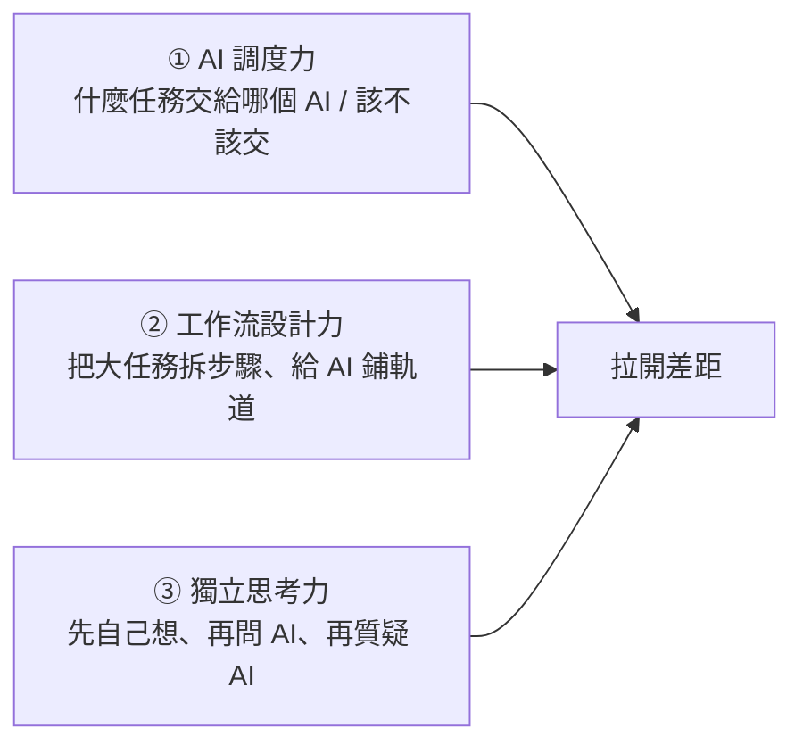

# AI 時代真正拉開差距的三種能力

**主題分類:** AI / 生產力與工作方法
**來源:** YouTube 影片〈AI時代,真正拉開差距的3種能力!〉(李廠長來了,2026-05-23,約 11 分;本筆記依繁中逐字稿整理)
**整理日期:** 2026-05-25

---

## 0. 前提

「會用 AI 聊天」如今就像十年前履歷寫「熟練 Office」——只是 **及格線**。要甩開別人,靠的是底下三種、**都有研究數據支撐** 的能力。

---

## 1. AI 調度力:知道什麼任務交給誰

高手不糾結「哪個 AI 工具最好」,而是知道 **什麼任務該交給誰**(像好老闆懂得分派):

| 工具 | 最擅長 |
|---|---|
| **ChatGPT** | **複雜指令**——十幾項要求一條不漏,「掉鏈子」機率最低(例:優化招聘評分表)。 |
| **Gemini** | **多模態綜合**——同時丟會議錄影 + PPT + 白板照,一次提煉重點與待辦。 |
| **Claude** | **寫**(文案/程式碼)——初稿質量最高、改動最少;給它看過你以前的東西能模仿你的語氣風格。 |
| **Perplexity** | **快速查資料**——「查了就走」的需求幾秒給答案並附出處。 |

(影片觀察:同一份十幾條要求的任務,Gemini 表面 OK 但逐條核對會發現悄悄漏掉好幾條;ChatGPT 較不會漏。)

### 該不該交給 AI?問三個問題
1. 這件事我 **自己做要多久**?
2. **AI 做對的機率** 多高?
3. 用 AI(從下指令到檢查結果)**總共要多久**?

> **原則:最適合交給 AI 的,是「你自己做很慢 + AI 成功率高 + 你能輕鬆檢查結果」的事。**
> - 例(該交):一堆亂數據整理成表格——自己 2 小時,AI 15 分鐘且成功率高 → 果斷交。
> - 例(別交):回覆主管問「上週跟客戶談的方案」——你 3 分鐘就能回,要 AI 回還得花十幾分鐘解釋背景,自己更快。

---

## 2. 工作流設計力:給 AI 鋪軌道

別「一句話丟進去等結果」。**吳恩達(Andrew Ng)的測試:**
- GPT 用 **單一提示詞** 從頭寫程式到尾,成功率僅 **48%**。
- 改成 **拆步驟**(寫 → 執行 → 除錯 → 修復),同一個模型,成功率飆到 **95%**。
- **變量不是模型變強,而是流程變了。** 像高鐵:前期鋪軌道最費力,軌道好了列車就又快又穩。

### 三步驟做法
1. 拿出你 **每週重複做** 的一件事(週報、發信、數據整理),拆成一個個小步驟。
2. 對每個小步驟自問:**完全交給 AI?和 AI 一起做?還是自己做?**
3. 優先把「**完全交給 AI**」的步驟,設計專門的提示詞與工作流——投入最少、回報最大。

(作者例:把影片「標題」與「正文」分開、給標題單獨設計提示詞,標題質量明顯提升。)

---

## 3. 獨立思考力:最容易被忽略的一個

聽起來矛盾(前面要你交給 AI),但關鍵是 **別跳過自己思考的過程**。多項研究示警:

- **MIT Media Lab(2025):** 三組寫作文(ChatGPT / Google / 純自己),戴腦電圖。**用 ChatGPT 那組大腦神經連接與認知活躍度最低**;且 **停用後** 大腦連接仍比其他兩組弱很多 → 稱為 **「認知負債」**(現在省下的腦力,以後要還)。像健身戴舉重腰帶,每次都戴,核心肌群會越來越弱。
- **麥吉爾大學:** 長期依賴 GPS 的司機,負責空間記憶的腦區水平下降,脫離 GPS 幾乎不會認路。
- **微軟 × 卡內基美隆:** 過度依賴 AI 的知識工作者會跳過關鍵思考(不再質疑假設、不再核實來源),遇到 AI 處理不了的情況反而手足無措。
- **放射科 2,700+ 診斷研究:** 先看 AI 診斷再判斷的醫生易被帶偏;**先自己判斷、再用 AI 二次核對** 的醫生準確率明顯更高。
- **世界銀行:** 在 **結構化引導** 下用 AI 輔導學習 6 週,效果相當於傳統方式 2 年。

> 結論:AI 讓你變聰明還變笨,**取決於你怎麼用**。把 AI 當教練/對手來 **檢驗和挑戰自己的想法**,會更強;只丟給它等結果,就會變笨。

### 兩個具體建議
1. **問 AI 前先自己想:** 先花幾分鐘寫下你的判斷,再去問 AI——變成「用 AI 驗證自己」而非被動接受答案。
2. **拿到答案別急著用:** 先問「我怎麼驗證它是對的?」「有沒有反面論據?」逼大腦真正參與。

---

## 4. 五條馬上能做的行動清單

1. 遇到任務先花 **10 秒** 判斷:AI 做 / 我做 / 協同做?
2. 若你只用一個 AI 工具,本週把至少一個任務 **換到更適合的另一個工具**。
3. 找一件每週重複的工作,**拆步驟**,看哪些可交給 AI 自動完成。
4. 明天起,每次用 AI 前 **先花 3 分鐘寫下自己的想法**。
5. 每次拿到 AI 回答,**至少問一次「怎麼驗證這答案是對的?」**

> 一句話:**AI 是工具,能讓你跑得更快,但方向盤必須握在自己手裡。**

> 與本 repo 關聯:第 2 點「拆步驟鋪軌道」正是 [[12-factor-agents]]、[[ai-harness-explained]] 在工程層面的個人版;模型分工選擇也呼應 [[function-calling-mcp-a2a]] 的協作思路。

---

## 來源

- [YouTube:AI時代,真正拉開差距的3種能力!(李廠長來了)](https://youtu.be/pyqUiHyz_-c)
