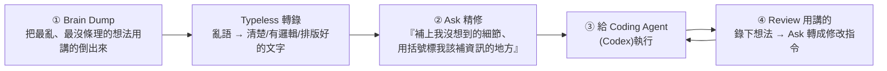

# AI 時代最被低估的技能:語音輸入,以及「把世界看成一場 context 轉換遊戲」

> 整理自 YouTube「Gary Chen」〈語音輸入 x AI 怎麼用?AI 時代最被低估的工作技能!ft. Typeless〉(2026-07-07,約 12 分鐘)。這支不講 prompt、不講 Claude/Codex,而講一個「作者幾乎每天用、但 99% 的人忽略」的技巧——**語音輸入**。表面是工具介紹,底層是一個視角:**知識工作者本質是 context 的搬運者與轉化者,而 AI 讓這種轉換的成本趨近於零。**
>
> ⚠️ 影片含 Typeless 工具推廣(作者有分潤);本筆記聚焦方法與觀念,工具僅為載體。

---

## 一句話總結

**語音輸入不是配角,是 AI 時代與 AI 協作的核心技能之一**——因為它同時解決兩件事:**① 效率**(說話比打字快 3 倍)與 **② context 的豐富度與精準度**(打字有成本、你會下意識壓縮省略,而那些被略過的細節正好定義了你的品味)。而全片真正的重點不是語音輸入,是**「把世界看成一場 context 轉換遊戲」的視角**。

---

## 1. 為什麼語音輸入在 AI 時代這麼重要

- **效率**:史丹佛研究指出**說話比打字快 3 倍**——同樣時間能指派給 Agent 的任務多 3 倍(打字要 9 小時的工作量,語音 3 小時做完)。
- **context 的豐富度與精準度(更重要)**:**打字是有成本的**,你會下意識想省力、能少打一個字就少打,結果丟給 AI 的永遠是「被大腦壓縮、精簡過的版本」。**用講的幾乎沒有摩擦力**,可以很自然地把背景、脈絡、還有你打字時偷懶想略過的小細節全倒出來——而**對 AI 來說,正是這些「你以為不重要」的細節,定義了你的品味、以及成果是否符合你的預期。**

---

## 2. 實戰工作流(語音 + Codex 從 0 到 1 做個人網站)

1. **Brain Dump(先把想法全講出來)**:開發初期把所有想法用講的做 brain dump——這時想法最雜、最沒條理。**若用打字,會不自覺邊打邊修、邊打邊篩,很多腦中很粗略、卻最能代表你品味的想法,就在「想把句子打通順」的過程中被遺忘了。** 用講的相反:沒有摩擦力,你不會陷入一直審查自己說得是否合邏輯/通順,只需專注把想法講出來。
2. **轉錄免精修**:Typeless 把混亂語言直接轉成清楚、有邏輯、排版好的文字,**跳過精修文字與排版的繁瑣過程**;中英夾雜與專有名詞也能準確轉錄。(對比 Apple Dictation:中英切換不準、常漏字、要修好幾輪。)
3. **Ask 功能——不急著送 prompt,先讓它幫你想更深**:brain dump 後**不要馬上送出**,選取轉錄文字、按 `Control+Space` 觸發 **Ask**,說「這是要給 coding agent 的提示詞,幫我補上我沒想到的細節,並在你覺得我該補資訊的地方用括號標起來」。它會用括號標出可補充處 → **引導你做更深入的思考、訓練你把意圖表達清楚**(正是作者一直強調的:告訴 AI 你到底想要什麼)。來回調整讓資訊更完整,產出更符合想像。
   - 同一個 Ask 也拿來:**回客戶 Email**(口述完 → 請它照你的語氣與本意轉成專業信)。
4. **不懂的名詞即時查(不打斷心流)**:開發中 AI 常丟一堆看不懂的名詞。以前要切出去開 GPT 打字搜尋、心流就斷了;現在直接 `Control+Space` 問 Typeless「這什麼意思?用白話解釋」→ 秒回、不切視窗、不打字。(研究:工作被打斷後要 **23 分鐘**才能恢復專注 → 每用一次就等於省 23 分鐘。)
5. **Review 也用講的**:大部分人討論完/review 完就忘了,頂多記兩句、或花時間重新回想再轉成 prompt。作者**用 Typeless 把 review 的想法錄下來**(和同事討論、或自己看著產出 brain dump),再用 Ask 轉成「給 coding agent 的清楚修改指令」。同法可套用:客戶會議 → Codex 提示詞、一堆混亂想法 → 完整提案。
6. **走路捕捉靈感**:Typeless 有手機版(吵雜處辨識也不錯)。「做產品這麼多年,最好的想法幾乎沒有一個是坐在電腦前想出來的,都是在走路、洗澡時冒出來的」,而靈感保鮮期超短。**Codex 手機版 / Claude Code remote control + Typeless mobile** → 邊遛狗散步邊對手機講話,Agent 邊聽邊工作。作者現在一半工作時間都在走路。

> **效率帳**:每天打 1 萬字約 2 小時,用講的只要 30 分鐘 → 一天省 1.5 小時、一週省近一個工作天。**但**有些人就是喜歡安靜打字幫助思考——這只是作者的個人習慣。

---

## 3. 核心觀念:世界是一場「context 轉換遊戲」

> 全片真正的重點**不是語音輸入、不是 AI coding、也不是 Typeless 怎麼用**,而是**這個視角本身**。

- **知識工作者說穿了就是 context 的搬運者與轉化者**:產品經理把一場 meeting 變成一個軟體上線;你把腦中一團模糊想法變成遞給老闆的簡報——**本質都是同一件事:把一種形式的 context 轉換成另一種形式的**。一旦用這視角看世界,它無所不在(和朋友閒聊 → 旅行計畫;洗澡念頭 → 創業起點;甜言蜜語 → 生日情書)。
- **人的角色**:人是這世界裡「**負責捕捉 context 並賦予它意義**」的角色。**AI 讓 context 之間的轉換變得前所未有地容易**,那留給人類的是什麼?——**你一路累積的失敗與成功、獨一無二的價值觀與信念、選擇做什麼/不做什麼的判斷力。**
- 「從想法到成果,在人類歷史上從來沒有像現在這麼容易過」;語音輸入 + AI 工具讓**「腦中念頭化為行動的成本低到幾乎等於零」**——這是作者眼中「軟體/AI 最浪漫的地方」。

---

## 應用案例 / 怎麼用這套思路

- **把語音輸入變成和 AI 協作的預設輸入法**:遇到「要給 agent 交代任務、要 review 產出、要回信、要記靈感」時,先**用講的 brain dump**(別急著打字省略細節),再讓工具轉錄+精修。省時之外,更關鍵是把「你以為不重要的細節」也交給 AI——那才是符不符合你品味的關鍵。
- **善用「Ask / 反問補資訊」逼自己想清楚意圖**:別直接送 prompt,先請工具「標出我該補充的地方」——這訓練的是本庫 [[defining-tasks-not-prompts]] 一直講的「表達意圖」能力,和 [[loop-engineering-when-and-how-gary-chen]] 的「先定義清楚再執行」同源。
- **保護心流:不懂的詞就地問,不切視窗**(每次省 ~23 分鐘的重新專注成本);review 一律錄下來再轉指令,別讓珍貴的 context 討論完就蒸發。
- **移動辦公新範式**:手機版語音 + Codex/Claude Code 遠端,把「走路/散步」變成捕捉靈感與指派任務的時間——呼應 [[codex-beginner-guide-four-basics]](Codex 桌面/手機)與 [[cross-model-review-claude-codex-harness]] 的自建工作流。
- **最該內化的是那個視角**:把日常工作重新理解成「context 轉換」——meeting→文件、需求→提示詞、想法→提案,都是同一件事;人的價值在於「捕捉並賦予意義、以及判斷做什麼不做什麼」,把重複的轉換交給 AI。
- **工具選用提醒**:Apple Dictation 免費但中英切換弱;Typeless 準且會修冗詞、自動排版,但**會讀取螢幕上下文**輔助轉錄(社群曾有隱私爭議)——若工作對資安要求嚴格,先查它的資安認證再決定。

> 延伸對照:[[defining-tasks-not-prompts]](表達意圖)、[[codex-beginner-guide-four-basics]]、[[loop-engineering-when-and-how-gary-chen]]、[[cross-model-review-claude-codex-harness]]、[[three-valuable-ai-skills]](AI 調度力/工作流設計力)。

---

## 來源

- Gary Chen(@garytalksstuff),〈語音輸入 x AI 怎麼用?AI 時代最被低估的工作技能!ft. Typeless〉,YouTube:<https://youtu.be/5XeVLt9WejM>(2026-07-07,約 12 分鐘)
- 本文依該片**官方 zh-TW 字幕**整理。提及工具/研究:Typeless(語音轉錄 + Ask 功能 + 手機版,含分潤連結與資安爭議說明)、Apple Dictation、Codex、Claude Code remote control;史丹佛「說話比打字快 3 倍」、「工作被打斷需 23 分鐘恢復專注」等研究依影片轉述。
