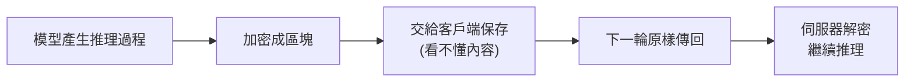
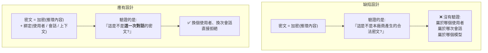

# 加密的推理過程為什麼保不住:一個「全域金鑰 + 可攜載體」的架構教訓

> 整理自 arXiv 論文 **《Stealing Reasoning Traces from Proprietary LLM APIs》**(arXiv:2608.09867v1,2026-08-10)。
> 作者:Alexander Panfilov、David Schmotz、Ilia Shumailov、Luca Beurer-Kellner、Joachim Schaeffer、Ameya Prabhu、Jonas Geiping、Maksym Andriushchenko。

> ✅ **重要前提:這是經過負責任揭露(responsible disclosure)的學術安全研究,且廠商已修補。** 論文自述:**截至 2026 年 8 月,論文 Figure 1 的結果已無法重現**——各家在收到揭露後已部署緩解措施。
>
> ⚠️ 本文**只整理架構層面的設計教訓與防禦作法**,不記錄任何可操作的攻擊步驟、標記格式或工具流程。目的是把這個案例當成**系統設計的反面教材**來讀。

---

## 一句話總結

**廠商把推理過程加密,是為了保護智慧財產;但那份密文被設計成「可以在會話、使用者、模型之間互換的可攜載體」,於是加密保護的只有「內容不被路人讀懂」,沒有保護「這段密文只屬於這一次對話」。**

---

## 一、背景:為什麼推理過程要加密

現在主流的推理模型會產生一段「思考過程」(chain-of-thought)。對廠商來說,這段東西很敏感:

| 為什麼要藏 | 說明 |
|---|---|
| **智慧財產** | 推理軌跡是訓練成果的直接展現,曝光等於送給競爭者做**蒸餾(distillation)** 的教材 |
| **安全** | 思考過程中可能出現最終回答裡不會出現的危險內容 |
| **產品體驗** | 未經整理的思考過程雜亂,不適合直接呈現 |

但**推理過程又必須跨輪次保留**——多輪對話、agent 的長流程,都需要模型「記得自己剛才想過什麼」。

於是廠商採取的作法是:**把推理過程加密成一個區塊,交給客戶端保存,下一輪再原樣傳回來。** 客戶端看不懂內容,但可以攜帶它。



**設計動機完全合理。問題出在細節。**

---

## 二、⭐ 核心缺陷:一把全域金鑰,一個沒有身分的密文

論文的核心觀察是:這些加密區塊**使用單一的全域金鑰做加密與驗證**。

後果是:**同一個廠商生態系內,這些密文在不同會話、不同使用者、甚至不同模型之間,是完全相容且可互換的。**

論文的 Table 1 系統性地記錄了跨模型相容性,涵蓋 Claude、GPT、Gemini 三個家族——例如 Claude 家族裡「任一模型的思考軌跡幾乎都能被任一其他模型接受」,GPT 與 Gemini 生態內也存在類似的廣泛相容性。

### 這為什麼是問題

密文本身沒有回答一個關鍵問題:**「你是誰、你屬於哪一次對話?」**



> **這是一個經典的密碼學使用錯誤,不是密碼學本身的錯誤。**
> 加密解決了「機密性」,但**沒有解決「上下文綁定」**。而在一個「密文由不可信的客戶端保管並回傳」的架構裡,後者才是真正的安全邊界。

---

## 三、論文列出的四類風險(只記錄性質與規模)

論文以此為基礎,論證了四個方向的風險。以下**只描述風險性質與作者報告的量化結果**,不涉及作法。

| # | 風險 | 論文報告的規模 |
|---|---|---|
| **1** | **繞過反蒸餾保護**,取得高階模型的專有推理內容 | 作者估算解碼 1 萬份軌跡的成本約 **$720** |
| **2** | **公開分享的 session log 洩漏私密資料** | 見下表 |
| **3** | **推理過程中的危險內容**可能與最終回答不一致 | 以 HarmBench 提示詞驗證 |
| **4** | **經由加密酬載的隱形提示注入** | 顯示可跨模型規模轉移 |

### 第 2 項的數字最值得注意

作者從 GitHub 與 Hugging Face 蒐集了 **6,708 份公開的 agent 執行軌跡**,涵蓋 **315,320 個推理區塊**:

| 項目 | 數量 |
|---|---|
| 含隱私外洩的區塊 | **1,028 個(0.3%)** |
| 洩漏敏感項目的 session | **328 個(4.9%)** |
| API 金鑰 | 62 |
| 密碼 | 33 |
| 存取權杖 | 24 |
| 私鑰 | 7 |
| 個人 email | 30 |
| IP 位址 | 6 |
| **合計隱私資產(含 benchmark)** | **912 項** |

> **⚠️ 這一項的教訓對一般開發者最直接:很多人把 agent 的完整執行紀錄公開到 GitHub 或 Hugging Face,以為「加密的部分是安全的」。**
> **它不是「安全的」,它只是「當下讀不懂的」。**

### 實驗規模

- **廠商**:Anthropic、OpenAI、Google
- **模型**:Claude(Opus 4.8、Sonnet 5/4.6/4.5、Haiku 4.5、Fable 5)、GPT(5.6 Sol/Terra/Luna、GPT-5、GPT-5-mini、o4-mini)、Gemini(3.1 Pro、3 Pro、Robotics 1.6、3.5 Flash、3 Flash、3.1 Flash Lite)
- **受控實驗集**:AIM E 2025、Codeforces(120 題程式題)、Humanity's Last Exam
- **研究投入**:約 **$30,000** 的 API 額度

---

## 四、⭐ 論文提出的緩解措施(這才是可帶走的部分)

作者提的方案分五個層次,**從「治本」到「治標」排序**:

### ① 架構層(治本):不要把可攜的密碼學資產交出去

> **改成伺服器端保存推理過程,客戶端只拿一個不透明的識別碼。**

這是最徹底的修法。因為**根本問題不是「加密得不夠強」,而是「不該把一個可以獨立驗證的密碼學物件交給不可信的一方保管」**。

換成識別碼之後,客戶端手上那串東西**在伺服器之外毫無意義**,也就沒有「可攜」這件事了。

### ② 密碼學層:上下文綁定的 AEAD 封套

如果一定要讓客戶端保管,那就**把身分綁進去**:

> 使用 **context-bound AEAD envelope**,把**使用者 ID、對話 ID、提示詞歷史**一起納入 MAC 的計算;跨 session、跨使用者的重放**直接拒絕**。

```
❌ 舊:  MAC(推理內容)                    → 只驗「是不是我發的」
✅ 新:  MAC(推理內容 ‖ 使用者 ‖ 會話 ‖ 上下文) → 驗「是不是這一次對話的」
```

> **這一行就是整篇論文最可複製的工程結論。**

### ③ 基礎建設層:閘道隔離與異常偵測

- 在 **API gateway 做跨模型隔離**——A 模型的軌跡不該被 B 模型接受
- 對可疑的重放模式做**流量速率與異常偵測**

### ④ 廠商側:可撤銷

**主動追蹤並使已洩漏的軌跡簽章失效。** 意即這類憑證要有「撤銷清單」的概念,而不是永久有效。

### ⑤ 模型層(最弱):針對性拒絕訓練

訓練模型拒絕特定形式的萃取請求。

> ⚠️ 作者自己把這一層放在最後是有道理的——**它是行為層的補丁,繞過方式無窮無盡。** 依賴模型「不配合」來當安全機制,永遠比不上讓攻擊在架構上不可能。

### ⚠️ 作者誠實承認的結構性極限

論文最後有一句話值得單獨記下來:

> **被查詢的那個模型,必然得解密並處理這些推理 token。**

所以**推理軌跡最多只能做到「半隱藏」**。只要模型自己要用,就存在一條讓它顯形的路徑。**加密能提高門檻,但不可能提供絕對的保密。**

---

## 五、負責任揭露的過程

- 論文發表前已向**受影響的主要模型 API 廠商、Microsoft、Hugging Face** 揭露完整技術細節與初步發現。
- **所有模型廠商都確認收到。**
- 論文特別對照:一份 2026 年 5 月揭露的前作(論文引用 9)當時**廠商並未承認任何安全影響**。
- **關鍵結果:截至 2026 年 8 月,Figure 1 的結果已無法重現**——廠商在揭露後已部署緩解措施。

> **這個對照本身就是一個教訓:同樣的問題,在有了完整證據與量化規模之後,處理態度完全不同。** 安全研究裡「能不能重現、規模多大」往往比「有沒有理論風險」更能推動修補。

---

## 應用案例

### 案例 1|⭐ 檢查你自己系統裡有沒有同構的問題

這個缺陷的抽象形狀是:

> **把一個「自我驗證的憑證」交給不可信的一方保管,而該憑證沒有綁定使用它的上下文。**

這在一般 Web 系統裡到處都是。拿這張表逐項檢查:

| 你系統裡的東西 | 有綁使用者嗎 | 有綁會話嗎 | 有時效嗎 | 能撤銷嗎 |
|---|---|---|---|---|
| JWT / session token | | | | |
| 簽章過的 URL(下載連結、預簽 S3) | | | | |
| 前端保存的加密狀態 blob | | | | |
| 密碼重設 / 邀請連結 | | | | |
| Webhook 簽章 | | | | |
| **任何「客戶端保管、伺服器驗證」的資料** | | | | |

**任何一格是空的,就是一個可以被重放的洞。**

⚠️ 最常見的錯誤心態正是這篇論文的核心:「**它是加密的,所以它是安全的。**」
加密保證的是「別人讀不懂」,**不保證「別人不能拿去用」**。這兩件事需要完全不同的機制。

### 案例 2|不要公開 agent 的完整執行紀錄

論文從公開 repo 撈到 6,708 份 agent 軌跡、挖出 912 項隱私資產,這是**現在就會發生**的實際風險。

實務建議:

- **預設不要把 agent 的原始 session log 推上公開 repo。** 你以為看不懂的部分,別人有辦法看懂。
- 若要分享執行紀錄(做 demo、報 bug、發論文),**只分享你親眼看過的那部分文字**,把所有結構化的原始欄位剝掉。
- 在 CI 加一條檢查:阻擋含有大量 base64 樣態長字串的檔案進版控。
- **回頭檢查你過去分享過的東西。** 揭露後廠商雖已修補,但已經公開的舊資料是收不回來的。

> 對照本倉庫的作法:所有筆記都是**人工整理過的繁中文字**,逐字稿與音訊都在 scratchpad 用完即刪、從不進版控——這剛好避開了這個坑,但那是慣例的副產品,不是刻意設計的。**值得把它變成明確規則寫進 `CLAUDE.md`。**

### 案例 3|把「上下文綁定」寫進你的簽章設計

實作層面的可抄結論:

```python
# ❌ 只證明「這是我發的」
mac = HMAC(key, payload)

# ✅ 證明「這是我發給『這個人』在『這次會話』用的」
aad = f"{user_id}|{session_id}|{purpose}|{expires_at}"
ciphertext, tag = AEAD_encrypt(key, payload, associated_data=aad)
# 驗證時 aad 必須由伺服器「從當下請求重新推導」,
# 絕不能從客戶端傳來的值裡讀。
```

⚠️ **最後那行註解是最容易搞錯的地方**:如果 `user_id` 是從客戶端送來的欄位讀的,那綁定形同虛設——攻擊者連 `user_id` 一起換掉就好。**綁定的值必須來自伺服器已驗證的狀態。**

### 案例 4|評估「模型層防禦」的優先序

論文把「訓練模型拒絕」放在緩解清單的最後,這個排序值得內化:

| 層級 | 防禦效力 | 為什麼 |
|---|---|---|
| **架構層**(不交出可攜資產) | 最強 | 攻擊在結構上不可能 |
| **密碼學層**(上下文綁定) | 強 | 繞過需要破解密碼學 |
| **基礎建設層**(閘道隔離、異常偵測) | 中 | 提高成本,但有繞過空間 |
| **可撤銷** | 中 | 事後補救,不防事前 |
| **模型行為層**(拒絕訓練) | **最弱** | 繞過方式無窮盡 |

> **凡是把「模型不會配合」當成主要安全機制的設計,都應該被降級成「縱深防禦的最外層」,而不是唯一那道牆。**

### 案例 5|「半隱藏」這個概念可以推廣

作者承認的結構性極限——**被查詢的模型必然得解密並處理那些 token**——是一個更普遍的原則:

> **任何需要被系統自己使用的秘密,對這個系統的操作者而言最多只能是「半隱藏」。**

同構的例子:

- **DRM**:播放器必須解密才能播放,所以內容終究會以明文形式存在於某處。
- **前端的 API 金鑰**:再怎麼混淆,瀏覽器得用它發請求,就得能還原它。
- **白箱密碼學**:攻擊者控制執行環境時,金鑰終究要進到運算單元。

**設計時要問的不是「能不能藏住」,而是「藏不住的時候,損失有多大、能不能撤銷」。**

---

## 重點回顧(TL;DR)

1. **廠商加密推理過程是為了保護 IP 與安全,動機合理。** 問題不在加密,在**綁定**。
2. **⭐ 核心缺陷:單一全域金鑰,導致密文在會話、使用者、模型之間完全可互換。** 密文能證明「這是本廠商產生的」,**卻無法證明「這屬於這一次對話」**。
3. 論文以 Table 1 系統性記錄了 Claude / GPT / Gemini 三個家族內的跨模型相容性。
4. **四類風險**:繞過反蒸餾、公開 log 的隱私外洩、推理中的危險內容、隱形提示注入。
5. **最貼近一般開發者的數字**:6,708 份公開 agent 軌跡、315,320 個推理區塊 → **328 個 session(4.9%)洩漏敏感項目**,含 62 個 API 金鑰、33 組密碼、24 個存取權杖、7 把私鑰。
6. **⭐ 最可複製的工程結論**:用 **context-bound AEAD**,把**使用者 ID、對話 ID、上下文歷史綁進 MAC**;而綁定的值**必須由伺服器從當下請求重新推導**,不能讀客戶端送來的。
7. **治本方案是架構層**:伺服器端保存,客戶端只拿不透明識別碼——**根本不要把可攜的密碼學資產交出去**。
8. **模型行為層的拒絕訓練被列在最後**,因為繞過方式無窮盡。**別把「模型不配合」當成主要安全機制。**
9. **作者誠實承認結構性極限**:模型必然要解密才能使用,所以推理軌跡**最多只能「半隱藏」**。這個原則同樣適用於 DRM、前端金鑰、白箱密碼學。
10. ✅ **已負責任揭露,廠商已修補**——論文自述截至 2026 年 8 月 Figure 1 結果已無法重現。但**已經公開在網路上的舊軌跡收不回來**,值得回頭檢查自己分享過什麼。

---

## 來源

- [Stealing Reasoning Traces from Proprietary LLM APIs — arXiv:2608.09867](https://arxiv.org/abs/2608.09867)(2026-08-10)
- [論文 HTML 全文](https://arxiv.org/html/2608.09867v1)

> 本文為架構設計與防禦面的知識整理,**刻意不記錄任何攻擊的操作細節**。論文已完成負責任揭露且廠商已部署緩解措施;引用此文的目的在於「可攜憑證必須做上下文綁定」這個通用工程教訓,而非重現其結果。
