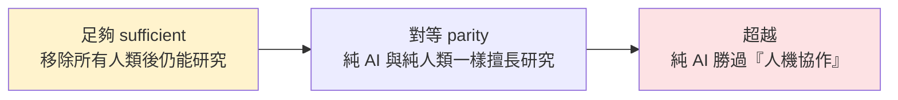

# RSI(遞迴自我改進)是新的 AGI:Anthropic 為何呼籲全球按下暫停鍵

> 全球 AI 競賽全力加速時,身處第一線的 **Anthropic 卻提出反方向呼籲**:警告 AI 系統正接近「**能在無人監督下自我改進**」的臨界點,
> 呼籲頂尖實驗室考慮一項**協調一致的協議**,暫停或至少放慢前沿模型開發,好讓制度與對齊研究跟上。
> 核心概念是 **RSI(Recursive Self-Improvement,遞迴自我改進)**——TechCrunch 說「RSI 是新的 AGI」。
>
> 整理自 TechOrange 文章(2026-06-05),原始資料來源:Anthropic、VentureBeat、TechCrunch、Financial Times、SiliconAngle。

---

## 一、Anthropic 的呼籲與「為什麼是現在」

- 部落格由 Anthropic 內部研究主管 **Marina Favaro** 與政策主管 **Jack Clark** 撰寫;他們認為模型進展正逼近 RSI,**有些模型可能短短兩年內就具備這能力**。
- 主張:全球至少該**保留一個可選項**——必要時讓前沿開發能以**可驗證方式**放慢/暫停,讓社會制度與 AI 對齊研究跟上技術速度。

### 讓它戒慎的內部訊號(數據)
| 指標 | 數字 |
|---|---|
| 合併進生產程式庫、**由 Claude(非人類)寫的 code** | **>80%**(2026/5);Claude Code 2025/2 研究預覽前還是個位數 |
| 每位工程師每季交付 code 量 | 增為 **8 倍**(vs 2021–2025 基準) |
| **AI 優化訓練 code 的加速** | 2025/5 Opus 4 ~**3×** → 2026/4 **Claude Mythos Preview ~52×**(熟練人類達 4× 通常要 4–8 小時) |
| 最開放、無明確規格的工程任務成功率 | 2026/5 達 **76%**(半年 +50 個百分點) |
| 自主修錯 | 2026/4 Claude 交付 **800+ 修正**,把某類 API 錯誤降為**千分之一**(人類估計要 **4 年**) |

> Anthropic 也坦言「程式碼行數不是完美指標」,但這確實顯示 **AI 已開始大幅改變研發節奏**——尤其是 **AI 在「研發 AI」** 這件事上的進步。

---

## 二、RSI 到底是什麼

- **TechCrunch**:「RSI 是新的 AGI」——同樣想像空間大、同樣難精準界定。指一套**能持續自我升級**的 AI;一旦 AI 管理升級循環的能力勝過人類,整個過程就變成**封閉迴圈**,只受限於它能取得的**運算資源**,人類不再必要、甚至不再有幫助。
- **Financial Times**:用「**飛輪效應**」——自學的 AI 不斷打造更強、更高效的新版本,一代接一代。
- **Anthropic 的定義最直接**:RSI 是一套**能完全自主設計並開發自身後繼者**的 AI 系統。

### 它「算不算」RSI?Cotra 的三個里程碑
喬治城 CSET 主任、OpenAI 前董事 **Helen Toner** 提醒:**純用 AI 工具做 AI 研究 ≠ RSI**,因為經典定義是「**不需要任何人類**」。引 METR 研究者 **Ajeya Cotra** 的里程碑:

> Cotra 認為 AI 已**很接近「足夠」門檻**。

---

## 三、產業競賽:RSI 成了新流行語

- 「遞迴」已成 AI 圈最新流行語,**兩家新創直接以此命名**,更多公司把 RSI 寫進藍圖——就像之前的 AGI,RSI 成了「AI 急速起飛」的代名詞,儘管定義仍分歧。
- **人物與目標**:
  - **Demis Hassabis**(Google I/O):「我們正站在**奇點的山腳下**」。
  - **Sam Altman**:設目標 **2028/3 前**打造「**真正的自動化 AI 研究員**」。
  - **Andrej Karpathy**:稱 RSI 是「**最終魔王關**」,斷言「**只是工程問題,而且一定會成功**」;他目前已**加入 Anthropic** 做預訓練。
- **新創與募資**:
  - **Recursive Superintelligence**(Richard Socher 等,2026/5 創立,明確以 RSI 為目標):成立數月即以 **40 億美元估值募得 6.5 億美元**。
  - **Adaption**(Sara Hooker)推 **AutoScientist**,自動化前沿模型訓練。
  - **Disarray**(Doris Xin)的自訓 ML 代理,在一場 **Kaggle 競賽拿 28 面獎牌**,擊敗許多人類訓練的代理。
- **保守一方**:Google CEO **Sundar Pichai** 相對保守——「以人們描述 RSI 的方式,我們**還沒真正到那裡**」。

---

## 四、目前最大的缺口:方向判斷 /「研究品味」

Anthropic 承認:Claude 已能在**明確目標下**執行複雜任務(最佳化訓練 code、修 bug、加速實驗);但在「**選哪些問題值得研究、哪些結果可信、何時該放棄某條路線**」這些**研究品味**上,**人類仍有明顯優勢**。

- **內部喜憂參半**:Mythos 預覽調查中,18 位 Anthropic 工程師有 5 位認為,工具鏈再改進可望**很快取代一名 L4 工程師**(能無人監督承接複雜專案的中階)。但 Claude 主要弱點:**自我管理長達一週的模糊任務、理解組織優先順序、品味、驗證與認識論能力**。

> 這正好呼應本庫 [[ai-coding-three-illusions-opencode]](Dax Raad:「**agent 是規模的放大器,不是品味的替代品**」)與 [[long-running-agents-goal-evaluation]]——**瓶頸不在執行,而在判斷與品味**。

---

## 五、為什麼這會改寫競賽規則 + 警告

- 當 AI 開始大幅承接 **AI 本身的研發**,比拚重點或許從「**誰 GPU 多**」轉向「**誰能最快建立『AI 研發 AI』的飛輪**」。
- 但飛輪能轉多快、多遠仍未知:
  - **Apollo Research** 負責人 **Marius Hobbhahn**:所有人都在衝刺,「**卻沒有人知道該如何安全地做到**」。
  - 牛津大學教授 **Michael Wooldridge**:這概念「**非常接近《魔鬼終結者》的劇情**」,「能走多遠目前並不清楚」。

---

## 應用案例 / 怎麼看

- **判斷「RSI 到了沒」別只看 demo**:用 Cotra 的「足夠/對等/超越」三門檻問——**移除所有人類後它還能研究嗎?** 純用 AI 工具加速研究還不算 RSI。
- **看一家實驗室的「自我研發」進度**:盯「AI 寫的 code 佔比、AI 加速訓練的倍數、無規格任務成功率、能否自我管理一週的模糊任務」這幾個訊號,而非單看模型 benchmark。
- **人的價值往哪走**:既然 agent 在「執行」上飆升、缺口在「研究品味/方向判斷」,個人與團隊該把力氣放在**選題、驗證、判斷可信度**——呼應 [[reading-code-ai-era-6-techniques]]、[[ai-coding-three-illusions-opencode]] 的「讀懂與判斷 > 產出」。
- **政策視角**:Anthropic 的主張是「保留**可驗證放慢/暫停**的選項」——這是治理層面值得追蹤的一條線(對照 [[safety-evaluation-crisis]] 的「評測跟不上能力」)。

---

## 一句話總結

> **RSI = 能完全自主設計並開發自身後繼者的 AI**;一旦成真,AI 研發 AI 形成飛輪,競賽從「比 GPU」變成「比誰先轉動飛輪」。
> Anthropic 用自家數據(Claude 寫 >80% 生產 code、優化訓練加速到 ~52×)說它可能**兩年內**逼近,因此反向呼籲**保留可驗證暫停的選項**。
> 目前唯一明顯的人類護城河,是 **「研究品味」——選題、判斷可信度、何時放棄**;而所有人衝刺時,「**沒人知道如何安全地做到**」才是最大的未知。

---

## 來源

- TechOrange:[RSI 是新的 AGI:矽谷追逐的最終魔王關,為何讓 Anthropic 呼籲全球按下暫停鍵?](https://techorange.com/2026/06/05/ai-rsi-agi-recursive-self-improvement/)
- 原始來源:Anthropic 部落格(Marina Favaro、Jack Clark)、VentureBeat、TechCrunch、Financial Times、SiliconAngle;提及 Demis Hassabis、Sam Altman、Andrej Karpathy、Helen Toner、Ajeya Cotra(METR)、Sundar Pichai、Marius Hobbhahn(Apollo Research)、Michael Wooldridge。
- 延伸:本庫 [[safety-evaluation-crisis]]、[[long-running-agents-goal-evaluation]]、[[ai-coding-three-illusions-opencode]]、[[reading-code-ai-era-6-techniques]]。
