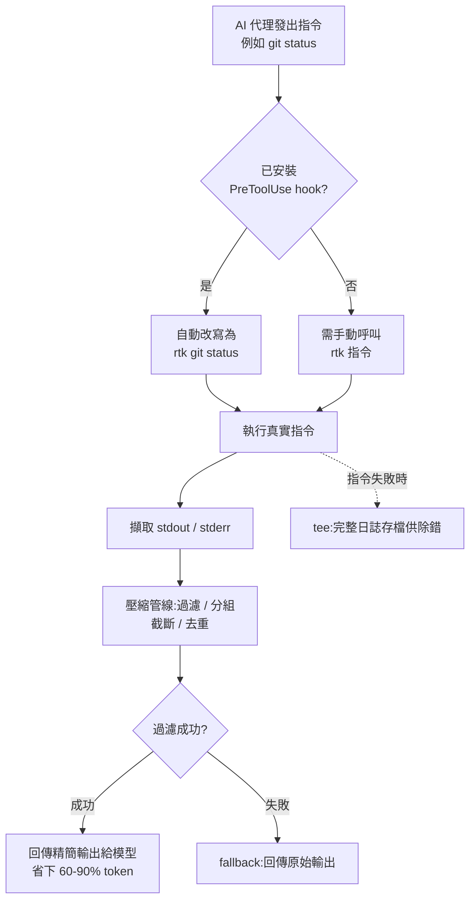

# RTK(Rust Token Killer)深入研究報告

**主題分類:** AI / 節省 Token 的開發者工具
**研究對象:** [rtk-ai/rtk](https://github.com/rtk-ai/rtk)
**官方網站:** https://www.rtk-ai.app/
**研究日期:** 2026-05-22

---

## 1. 摘要

RTK(「Rust Token Killer」)是一個開源的命令列 **代理(proxy)** 工具,夾在 AI 編碼助理與 shell 之間。當代理執行一般開發指令(`git status`、`cargo test`、`grep`、`npm install`…)時,RTK 會先執行真正的指令,接著 **過濾並壓縮輸出**,才把結果回傳到模型的上下文視窗。

主打數據是:在常見開發指令上 **降低 60–90% 的 LLM token 消耗**,以 **單一 Rust 二進位檔、零執行期相依** 的形式交付,每次呼叫 **額外負擔 <10 毫秒**。在一段具代表性的 30 分鐘 Claude Code 工作階段(混合 TypeScript / Rust 專案)中,專案回報 token 從 **約 118,000 降到約 23,900(整體約降 80%)**。

核心洞見:對 LLM 而言,大多數 CLI 輸出都是 *雜訊*(樣板訊息、進度條、重複行、通過的測試紀錄、空白)。把雜訊去掉既能 **降低 API 成本**,也能 **延長可用上下文視窗**,讓代理能進行更長的工作階段才需要壓縮(compaction)。

---

## 2. 它解決什麼問題

AI 編碼代理的運作方式,是讀取終端機輸出再餵回模型上下文。原始指令輸出冗長,且大多與模型決策無關:

- 測試套件印出上千行,但代理只需要 **失敗** 的部分。
- `git status` / `git diff` 噴出大量內容,真正重要的只有 **變更的路徑或 diff 區塊**。
- `ls`、`find`、`grep` 可能回傳又長又重複的清單。
- 建置 / lint 工具在少數幾行 **錯誤** 周圍堆滿進度、耗時與成功訊息。

每一行都讓 token 成本付出兩次:模型讀它一次,並間接擠佔上下文視窗、迫使更早截斷 / 壓縮。RTK 的論點是:用一個確定性的、理解指令語意的過濾器,就能移除約 89% 的雜訊,而不失去代理真正需要的訊號。

---

## 3. 運作原理(架構)

### 3.1 指令代理模式
RTK 採 **指令代理** 結構。`main.rs` 用 **Clap** 解析呼叫,透過 `Commands` enum 將指令路由到對應工具 / 生態系的 **專屬過濾模組**。每個過濾器:

1. 執行底層的真實指令(例如 shell 出去跑 `cargo test`)。
2. 擷取 stdout / stderr。
3. 把輸出送進 **壓縮管線**。
4. 將精簡後的結果回傳給呼叫者(代理)。

### 3.2 過濾管線
共有四種核心策略(依各指令輸出形態調校):

| 策略 | 作用 |
|---|---|
| 智慧過濾 | 丟掉雜訊行(進度、時間戳、通過的案例、橫幅)。 |
| 分組 | 把相似 / 相關項目彙整成精簡摘要。 |
| 截斷 | 保留最相關的脈絡,修掉長尾。 |
| 去重 | 收合重複 / 相同的行。 |

### 3.3 fallback 與「tee」安全機制
- **fallback 模式:** 過濾若因任何原因失敗,直接回傳 *原始* 輸出——RTK 應只負責瘦身,絕不弄壞工作流程。
- **失敗時 tee:** 指令失敗時可把完整未過濾輸出存到磁碟,讓代理(或人)在真的出錯時檢視完整日誌。此為可設定的「tee」模式。

### 3.4 透明自動改寫 hook
這是最重要的使用體驗。執行:

```
rtk init --global      # 或:rtk init -g
```

會在代理(預設為 Claude Code / Copilot)中安裝一個 **PreToolUse hook**。該 hook 會在執行 *之前* **透明地把 Bash 指令改寫** 成對應的 `rtk` 版本(`git status` → `rtk git status` 等)。代理照常下達一般指令,RTK 攔截並壓縮輸出。專案稱此做法可達成「100% RTK 採用率」,且模型完全不需改變行為。

> **注意:** Claude Code 的 *內建* 工具(Read、Grep、Glob)會繞過 Bash hook。要在這些工作流程上獲得節省,代理必須明確呼叫 `rtk read` / `rtk grep`,或被引導去用 shell。

### 3.5 指標 / 追蹤
有一個 **以 SQLite 為基礎的追蹤** 層(`src/core/tracking.rs`)記錄節省 token 的指標,使用者可透過 `rtk gain` 指令查看實際成效。

### 3.6 指令流程圖



---

## 4. 原始碼結構(實際 clone 驗證)

> 以下為在本機 `git clone` rtk-ai/rtk(Apache-2.0)後,逐目錄確認的真實結構。

```
src/
├── main.rs            # Clap 進入點;將子指令路由到對應過濾模組
├── core/              # 執行骨架與共用機制
│   ├── runner.rs      # 指令執行骨架:擷取原始輸出 → 過濾 → 輸出 → 記錄
│   ├── stream.rs      # 串流/擷取式執行(capture / streaming / passthrough)
│   ├── toml_filter.rs # 宣告式 TOML 過濾引擎
│   ├── tracking.rs    # SQLite 節省指標(history.db)
│   ├── tee.rs         # 失敗時保存完整輸出並附提示
│   ├── truncate.rs    # 全域截斷上限(errors/warnings/list/inventory)
│   └── filter.rs · config.rs · telemetry.rs · utils.rs …
├── filters/           # 59 個「宣告式」.toml 過濾器(make/gradle/terraform/helm…)
├── cmds/              # 「程式化」過濾模組(複雜解析,各含 README + //! 文件)
│   └── system/ git/ rust/ go/ js/ python/ ruby/ dotnet/ jvm/ cloud/
├── hooks/             # hook 安裝與 `rtk rewrite`(init.rs · rewrite_cmd.rs · permissions.rs)
├── discover/          # `rtk discover`:掃描 session log 找優化機會 + 改寫規則 registry
├── analytics/         # `rtk gain`:節省統計彙整
├── parser/            # 共用解析器
└── learn/             # 教學/學習輔助
```

另有頂層 `hooks/` 目錄存放各代理的 hook 腳本(`claude/`、`copilot/`、`cursor/`、`cline/`、`windsurf/`、`codex/`、`opencode/`…)。**兩種過濾途徑並存**:簡單的「去雜訊」用 `src/filters/*.toml` 宣告式規則;需要結構化解析的(如 grep 分組、git diff)用 `src/cmds/*` 的 Rust 模組。

---

## 4.5 實作深入剖析:程式如何運行、過濾、輸出、偵測(附真實程式碼)

> 本節片段均節錄自 rtk 原始碼(於本機 clone 後逐檔閱讀),並標註檔案位置。

### A. 一條指令的生命週期(執行骨架 `src/core/runner.rs`)

每個過濾模組共用同一套骨架:**計時開始 → 執行真實指令並擷取輸出 → 套用過濾函式 → 輸出(可選 tee 提示)→ 記錄節省**。三種模式:`Filtered`(擷取後整批過濾)、`Streamed`(邊串流邊過濾)、`Passthrough`(不過濾直接轉送)。核心片段:

```rust
// 失敗時可「跳過過濾、回傳原始輸出」——避免出錯時把關鍵訊息濾掉
if opts.skip_filter_on_failure && exit_code != 0 {
    print!("{}", result.raw_stdout);
    eprint!("{}", result.raw_stderr);
    timer.track(&cmd_label, …, raw, raw);          // 原始 == 過濾後,節省 0
    return Ok(exit_code);
}
let filtered = filter_fn(text_to_filter);          // 套用該指令的過濾器
print_with_hint(&filtered, raw, label, exit_code); // 輸出 + 可選 tee 提示
timer.track(&cmd_label, …, raw_for_tracking, &filtered); // 記錄(原始 vs 過濾)
```

`RunOptions` 旗標決定行為:`skip_filter_on_failure`(失敗顯示原始)、`filter_stdout_only`(只過濾 stdout)、`inherit_stdin`(支援管線輸入如 `cat f | rtk wc`)、`tee_label`(啟用失敗存檔)。

### B. Hook 如何「透明改寫」指令

安裝的 hook 是一個**很薄的委派腳本**(`hooks/claude/rtk-rewrite.sh`),所有改寫邏輯都在 Rust 端(`rtk rewrite` → `src/discover/registry.rs`)。流程:Claude Code 執行 Bash 前觸發 PreToolUse hook → 腳本以 `jq` 取出指令 → 呼叫 `rtk rewrite "<cmd>"` → 依**退出碼**決定處理方式:

| 退出碼 | stdout | 意義 |
|---|---|---|
| 0 | 改寫後指令 | 找到改寫且無權限規則 → 自動允許 |
| 1 | (無) | 無 RTK 對應 → 原樣放行 |
| 2 | (無) | 命中 deny 規則 → 交給 Claude Code 原生 deny |
| 3 | 改寫後指令 | 命中 ask 規則 → 改寫但仍讓使用者確認 |

退出 0 時,腳本回傳 PreToolUse JSON,把指令換成改寫版並標記允許(節錄 `rtk-rewrite.sh`):

```bash
jq -c --arg cmd "$REWRITTEN" \
  '.tool_input.command = $cmd | {
     "hookSpecificOutput": {
       "hookEventName": "PreToolUse",
       "permissionDecision": "allow",
       "updatedInput": .tool_input } }' <<<"$INPUT"
```

**安全設計(`src/hooks/rewrite_cmd.rs`):** 先檢查 deny/ask **再**改寫(連非 RTK 指令也涵蓋);且「無任何規則」的預設(`Default`)必須對應 **exit 3(ask)而非 0(allow)**——否則任何沒設權限的指令都會被自動放行,破壞最小權限原則(對應 issue #1155)。

**改寫規則(`src/discover/rules.rs`)** 是一張靜態表,每條規則含正則、目標指令、可改寫前綴與各子指令的預估節省:

```rust
pub struct RtkRule {
    pub pattern: &'static str,        // 例:^(?:git|yadm)\s+(status|log|diff|…)
    pub rtk_cmd: &'static str,        // "rtk git"
    pub rewrite_prefixes: &'static [&'static str], // ["git","yadm"]
    pub category: &'static str,
    pub savings_pct: f64,
    pub subcmd_savings: &'static [(&'static str, f64)],
    …
}
```

複合指令(含 `&&`、`||`、`;`、`|`)會被 lexer 切段、**逐段獨立改寫**,再替換前綴(`git status` → `rtk git status`);遇 heredoc、`gh --json/--jq`、`cat` 特殊旗標等會跳過改寫以免破壞輸出。

### C. 過濾邏輯:兩套機制 + 截斷上限

**機制一:宣告式 TOML 過濾器(`src/filters/*.toml`,共 59 個)。** 用正則描述「刪哪些行、保留多少、全刪光時印什麼」,引擎為 `src/core/toml_filter.rs`。完整範例(`make.toml`):

```toml
[filters.make]
match_command = "^make\\b"
strip_lines_matching = [
  "^make\\[\\d+\\]:",        # 刪掉 Entering/Leaving directory
  "^\\s*$",                  # 刪空白行
  "^Nothing to be done",
]
max_lines = 50
on_empty = "make: ok"        # 全被刪光時,只回一句「make: ok」
```

部分過濾器用 `match_output` 做**短路**:整段輸出命中某模式就壓成一句話(如 `ok (build succeeded)`、`ok (synced)`),並用 `unless` 當**安全閥**——只要出現 `error`/`warning` 就不短路,確保失敗訊息永不被吞掉(見 rsync、swift-build、bundle、poetry、uv、brew、dotnet)。

**機制二:程式化 Rust 過濾器(`src/cmds/*`)。** 給需要結構化解析的指令。例如 `rtk grep` 其實在底層呼叫 **ripgrep(rg)**,把結果**依檔案分組**、截斷過長行、套用上限,輸出 `file:line:content` 格式讓代理好解析(`src/cmds/system/grep_cmd.rs`)。

**全域截斷上限(`src/core/truncate.rs`)** 體現「錯誤最該被看到」的哲學:

```rust
pub const CAP_ERRORS: usize = 20;     // 錯誤:最該保留,給最多
pub const CAP_WARNINGS: usize = 10;   // 警告:訊號密度較低
pub const CAP_LIST: usize = 20;       // 扁平清單(PR、服務、套件)
pub const CAP_INVENTORY: usize = 50;  // 清查類(pip list、docker images)
```

**安全網彙整:** ① `skip_filter_on_failure`(失敗回原始)② `on_empty`(全刪光時的占位訊息)③ `unless` 守衛(有錯就不短路)④ 過濾失敗 fallback 回原始。

### D. 輸出與 tee:失敗也不丟資料(`src/core/tee.rs`)

輸出時除了印過濾結果,還可把**完整未過濾輸出**存檔。`should_tee` 條件:功能開啟、模式為 `Failures`(預設,僅失敗)/`Always`、且原始輸出 ≥ **500 bytes**。存到 `~/.local/share/rtk/tee/{epoch}_{slug}.log`(單檔上限 1 MB、保留最新 20 個),並在輸出末尾附提示:

```
[full output: ~/.local/share/rtk/tee/1700000000_cargo_test.log]
[see remaining: tail -n +22 ~/.local/share/rtk/tee/…]
```

代理拿到的是精簡版,但**真要除錯時完整日誌仍在**。

### E. 系統如何「偵測」與「計算節省」

**Token 估算是啟發式,不是真 tokenizer(`src/core/tracking.rs`):**

```rust
pub fn estimate_tokens(text: &str) -> usize {
    (text.len() as f64 / 4.0).ceil() as usize   // 約每 4 bytes 一個 token
}
```

> ⚠️ 用的是 **UTF-8 byte 長度**,所以中文/多位元組文字會被高估;原始碼註解也明說「要精確請接你 LLM 的 tokenizer」。

**追蹤儲存於 SQLite(`~/.local/share/rtk/history.db`,WAL 模式 + busy_timeout,支援多個 Claude 並行)。** `commands` 表每筆記:`timestamp、original_cmd、rtk_cmd、input_tokens、output_tokens、saved_tokens、savings_pct、exec_time_ms、project_path`。節省計算:

```rust
let saved = input_tokens.saturating_sub(output_tokens);
let pct = if input_tokens > 0 { saved as f64 / input_tokens as f64 * 100.0 } else { 0.0 };
```

超過 **90 天**的紀錄每次寫入時清理;passthrough 指令記為 `0/0` 以免稀釋統計。**`rtk gain`(`src/analytics/gain.rs`)** 把各筆加總,算 `avg_savings_pct`,並附 `by_command`、`by_day` 分解(可依專案路徑過濾)。

**`rtk discover` 如何找優化機會(`src/discover/`):** 它**不是掃 shell history**,而是掃 **Claude Code 的 session 紀錄** `~/.claude/projects/<專案>/*.jsonl`:解析每行 JSON,抓出 `tool_use` 為 `Bash` 的指令,並用 `tool_use_id` 對回 `tool_result`(取得**真實輸出長度**與是否錯誤);再以 `classify_command`(用 `RegexSet` 取最具體規則)估算每個指令可省多少 token,產出「你最該為哪些指令裝 RTK」的報告。輸出長度缺失時才退回各類別平均值(如 cargo test 預設 500)。

---

## 4.6 大量真實範例(before → after)

> 以下皆取自各過濾器 `*.toml` 內建的 `[[tests.*]]` 測試案例(input/expected),為**真實**對照,非杜撰。

### 建置工具

**make**(`^make\b`,刪 Entering/Leaving 與空白,3→1 行):
```
make[1]: Entering directory '/home/user'      gcc -O2 foo.c
gcc -O2 foo.c                            →
make[1]: Leaving directory '/home/user'
```

**dotnet build**(命中 `0 Warning(s)/0 Error(s)` 短路,~11→1 行):整段 Microsoft 橫幅 + restore + `Build succeeded` → **`ok (build succeeded)`**。

**xcodebuild**(刪 25+ 種建置階段前綴 `CompileSwift`/`Ld`/`CodeSign`/`builtin-`…,~13→1):全部編譯細節 → **`** BUILD SUCCEEDED **`**。

**mvn**(刪 `[INFO] ---`/`Building`/`Downloading`,6→3):只留 `BUILD SUCCESS` + 耗時 + 完成時間。

**gradle**(刪 `UP-TO-DATE`/`NO-SOURCE`/daemon 行,6→3):只留實際執行的 `:app:test` 與 `BUILD FAILED`。

**swift build**(`Build complete!` 短路、但有 `warning:/error:` 則不短路)→ **`ok (build complete)`**。

**gcc/g++**:連結錯誤**原樣保留**(錯誤永不刪):
```
/usr/bin/ld: /tmp/main.o: undefined reference to 'missing_func'
collect2: error: ld returned 1 exit status
```

### Linter / 型別檢查

**biome / oxlint / ty**:乾淨時把 `Checked N files`/`Finished in…`/版本橫幅刪光 → **`biome: ok`**(或 `All checks passed!`);**有診斷則逐字保留**。

**yamllint / shellcheck / hadolint / markdownlint**:只刪空白行,**所有診斷與 `^-- SCxxxx` caret 指標完整保留**(只壓縮排版,不丟訊號)。例如 shellcheck 7→6 行(僅移除中間空白)。

### 基礎設施 / 網路

**terraform plan / tofu plan**(刪 `Refreshing state`/state lock/`# … unchanged`,~10→4 行,`on_empty="… no changes detected"`):
```
Acquiring state lock...                  Terraform will perform the following actions:
Refreshing state... [id=vpc-abc]           # aws_instance.web will be created
Refreshing state... [id=sg-123]    →       + resource "aws_instance" "web" {}
Releasing state lock...                  Plan: 1 to add, 0 to change, 0 to destroy.
Terraform will perform the following …
  …
Plan: 1 to add, 0 to change, 0 to destroy.
```

**ping**(刪每封包行,`tail_lines=4` 只留統計,~8→3 行):
```
PING example.com (93.184.216.34): 56 …    --- example.com ping statistics ---
64 bytes from … icmp_seq=0 time=14.2 ms → 4 packets transmitted, 4 received, 0.0% loss
… (4 個封包行) …                          round-trip min/avg/max = 13.8/14.0/14.2 ms
--- statistics ---  …
```

**rsync**(`total size is` 短路成 `ok (synced)`,~7→1;有 `error/failed/No such file` 則原樣)。
**helm**(刪 glog `W0000` 警告)、**iptables**(刪 Docker 管理鏈 `Chain DOCKER`/`BR-`)、**systemctl status / df / du / ps**(刪空白、套 `max_lines`)。

### 套件管理(下載/安裝雜訊 → 一句話)

**uv sync**(`Audited N packages` 短路,2→1):
```
Resolved 42 packages in 123ms
Audited 42 packages in 0.05ms     →     ok (up to date)
```
**bundle install** → `ok bundle: complete`;**poetry install**(刪 Downloading/Installing,~8→2);**composer install** → `ok (up to date)`;**brew install**(刪 `==> Downloading/Pouring` 與 `###` 進度條)→ `ok (already installed)`。

### 其他 CLI

**ansible-playbook**(刪 `ok:`/`skipping:`,只留 `changed:`/`failed:`/PLAY RECAP,~13→7)。
**ollama run**(刪 ANSI 與 Braille spinner `⠋⠙⠹`,4→1):只留模型回覆那一行。
**gcloud / jira / jq**:刪空白、`truncate_lines_at` 截長行、`max_lines` 套上限(大型 JSON 才會被截)。

> 由表可見最大降幅來自**短路型**過濾器(dotnet ~11→1、xcodebuild ~13→1、bundle ~7→1)與**逐項剝除型**(ping、ansible、xcodebuild);而 linter/型別檢查多採「只刪空白、保留全部診斷」的保守策略。

---

## 5. 支援的指令範圍

橫跨以下類別共 100+ 指令:

- **檔案操作:** `ls`、`cat`/`read`、`grep`、`find`、`diff`、`tree`、`wc`
- **Git 工作流程:** `status`、`log`、`diff`、`add`、`commit`、`push`(例如 push 只回傳簡短的 `ok main`)
- **測試執行器:** `jest`、`vitest`、`pytest`、`cargo test`、`go test`、`rspec`(通常 **只顯示失敗**)
- **建置 / lint:** `tsc`、`eslint`、`cargo clippy`、`ruff`、`mypy`、`rubocop`、`golangci-lint`
- **套件管理:** `npm`、`pnpm`、`pip`、`bundle`、`dotnet`
- **雲端 / 容器:** AWS CLI、Docker、Kubernetes(`kubectl`)
- **VCS 託管 CLI:** GitHub CLI(`gh`)、Graphite(`gt`)

---

## 6. Token 節省基準

官方回報數據(專案自行量測,視為廠商宣稱):

| 來源 / 範圍 | 降幅 |
|---|---|
| 整體,30 分鐘 Claude Code 工作階段(約 118k→約 23.9k) | **約 80%** |
| 跨 2,900+ 真實指令的平均雜訊移除 | **約 89%** |
| `cargo test` | **約 91.8%** |
| 測試執行器(整體) | 約 90% |
| `git add` / `commit` / `push` | 高達 **約 92%** |
| `git status` | **約 80.8%** |
| `find` | **約 78.3%** |
| `grep` | **約 49.5%** |

宣稱的效能目標:啟動額外負擔 **<10 毫秒**、記憶體 **<5 MB**、節省 **60–90%**。

---

## 7. 安裝與使用

**安裝**(多種方式):
```
brew install rtk                                   # Homebrew
cargo install --git https://github.com/rtk-ai/rtk  # Cargo
curl ... | sh                                      # 快速安裝腳本(Linux/macOS)
# 或從 GitHub Releases 下載預編譯二進位(macOS / Linux / Windows)
```

**設定透明 hook:**
```
rtk init -g                 # 預設 Claude Code / Copilot
rtk init -g --agent gemini  # 或 cursor、cline、windsurf 等
```

**直接使用(不透過 hook):**
```
rtk git status
rtk read src/main.rs
rtk grep "TODO" src/
rtk cargo build
rtk pnpm list
```

**分析與探索:**
```
rtk gain        # 顯示 token 節省統計
rtk discover    # 找出更多可優化的機會
```

**設定:** `~/.config/rtk/config.toml`(TOML)。支援指令排除清單與 tee 模式(失敗時保存完整未過濾輸出)。

---

## 8. AI 工具整合模式

RTK 透過三種機制支援 13+ 種代理平台:

1. **Hook 式**(Claude Code、GitHub Copilot):PreToolUse hook 透明改寫 Bash 指令。
2. **外掛式**(OpenCode 等):用 TS / Python 外掛在執行前攔截指令。
3. **指示式**(Windsurf、Cline):以專案範圍的規則檔指示代理優先使用 `rtk`。

相容於:Claude Code、Cursor、Gemini CLI、Aider、Copilot,以及「任何會讀取終端機輸出的 AI 助理」。

---

## 9. 工程慣例(出自 CLAUDE.md)

- **語言:** Rust(約佔程式碼 92%)。
- **不使用 async** — 刻意採單執行緒(維持二進位小而快)。
- **`anyhow::Result` + `.context()`** 進行錯誤傳遞。
- **嚴格禁止 `unwrap()`** 於正式程式碼。
- **`lazy_static!`** 用於所有 regex 樣式。
- 提交前要求 **零 clippy 警告**。
- **品質關卡:** `cargo fmt --all && cargo clippy --all-targets && cargo test --all`。
- 透過 `bash scripts/test-all.sh` 跑冒煙測試。

這是一個紀律嚴明、效能優先的程式碼庫——對一個全部價值都建立在「近乎零成本中介層」的工具而言,十分貼切。

---

## 10. 專案現況與治理

- **熱度:** 約 52.8k GitHub stars、約 3.2k forks、175+ releases(高動能專案)。
- **核心團隊:** Patrick Szymkowiak(創辦人)、Florian Bruniaux、Adrien Eppling。
- **社群:** Discord + 開放 GitHub 貢獻。

> **授權與遙測(已由 clone 直接確認):** `LICENSE` 檔確認為 **Apache License 2.0**(先前某第三方部落格宣稱 MIT,**有誤**)。遙測為 **可選加入(opt-in)**:原始碼有 `src/core/telemetry.rs` 與 `docs/TELEMETRY.md`,以 `rtk telemetry` 子指令管理;預設不傳送,且不含原始碼、路徑或個資。

---

## 11. 評析

**優點**
- 針對真實且日益擴大的成本痛點(代理 token 開銷),提出簡單且確定性的解法。
- 零設定的「透明 hook」是正確的 UX——不需重訓模型或改 prompt。
- 安全設計:fallback 回原始輸出 + 失敗時 tee,理論上不會弄壞工作流程。
- 逐指令調校比通用文字摘要更可靠(沒有幻覺風險;它是確定性過濾,而非用 LLM 壓縮另一個 LLM 的輸入)。

**限制 / 需權衡的風險**
- **本質上有損。** 由過濾器決定什麼是「雜訊」;過於激進的過濾可能丟掉代理其實需要的一行(例如某個能解釋後續失敗的警告)。fallback 只在 *指令* 失敗時觸發,不會在 *資訊* 遺失時觸發。
- **內建工具繞過。** 在 Claude Code 中,Read/Grep/Glob 會跳過 hook,所以節省取決於代理是否選擇走 shell。
- **廠商自報基準。** 60–90% 是專案自己的數字;實際節省高度取決於工作型態(以檔案讀取為主 vs 以跑測試為主,差異很大)。
- **維護面積。** 100+ 指令 × 多種輸出格式 = 隨工具版本變更而持續需要維護解析器。

**結論。** RTK 是針對「代理 token 膨脹」務實且工程紮實的解答。對於大量進行代理式編碼(尤其是測試 / 建置 / git 迴圈密集)的團隊,其成本與上下文視窗的節省很可能相當可觀。正確的採用方式是 **量測你自己的 `rtk gain`**,而非直接套用標題百分比;並保持失敗時 tee 開啟,確保除錯時仍能取得完整日誌。

---

## 12. 對「節省 Token」這個領域的意義

RTK 體現了一個值得追蹤的更廣模式:**在 I/O 邊界做確定性、理解工具語意的輸出壓縮**,而非用 LLM 做摘要。可遷移的關鍵想法:

- 在 **冗長的來源處**(指令本身)就壓縮,而不是等它已經進到上下文才處理。
- 對工具輸出 **優先用確定性過濾** 而非模型摘要——更便宜、更快、且不會幻覺出錯誤訊息。
- 永遠保留一條 **無損逃生口**(原始 fallback / tee),讓壓縮永不阻礙除錯。
- **逐工作型態量測** 實際節省,而非相信全域平均。

---

## 來源

- [rtk-ai/rtk — GitHub](https://github.com/rtk-ai/rtk)
- [RTK — Rust Token Killer(官網)](https://www.rtk-ai.app/)
- [rtk/CLAUDE.md at master](https://github.com/rtk-ai/rtk/blob/master/CLAUDE.md)
- [rtk/INSTALL.md at master](https://github.com/rtk-ai/rtk/blob/master/INSTALL.md)
- [rtk/CONTRIBUTING.md at master](https://github.com/rtk-ai/rtk/blob/master/CONTRIBUTING.md)
- [I Tried RTK (Rust Token Killer) — jangwook.net](https://jangwook.net/en/blog/en/rtk-rust-token-killer-llm-cost-optimization-guide-2026/)
