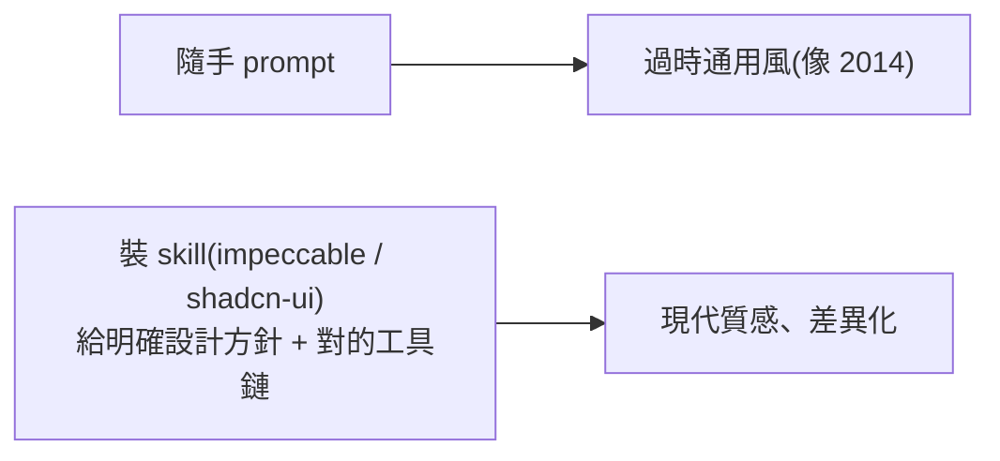

# 用 Claude Code 零程式碼做網站:突破 AI 預設風格、捲動動畫、設計策略

**主題分類:** AI / 應用 — AI 網頁設計工作流
**來源:** YouTube〈前端工程師失業倒數?AI 一句話就能生出整個網站〉(Debug Tuboshu,2026-03-18,約 8.5 分;依逐字稿整理)
**整理日期:** 2026-05-30

> 📌 本影片的方法已整理成 Claude Code skill `modern-web-design`(放在 [claude_marketplace](https://github.com/shooter2062424/claude_marketplace) 的 `web-design-tools` plugin)。

---

## 0. 核心一句

不用寫程式,用 **Claude Code + skill** 能做出電商/點餐/數據後台等 14+ 種網站,甚至復刻 Awwwards 得獎動畫站。但 **「動畫特效再炫都不是重點,搞懂網站是做給誰看的更重要」**。

---

## 1. 為什麼 AI 隨手做的網站「像 2014 年」

影片用 AI 重做 1995→2018 各年代風格網站,發現:**隨意一個 prompt,Claude Code 會做出 2014 年以前的風格**(table→CSS float→Bootstrap→扁平化)。原因是 **模型訓練資料大量學了那個時期**。

> **學到兩件事:① 隨意 prompt = 2014 風;② 要靠 skill 才能再優化網站風格。** 影片示範裝 `impeccable` skill(避免 AI 一直做類似風格)與 `shadcn-ui` skill(可複製貼上的 React 元件,建在 Radix UI + Tailwind 之上)。

---

## 2. 快速生常見站型:別從零寫

用 shadcn-ui 一口氣做出 **電商、點餐、音樂串流、旅遊規劃、醫療預約、聊天室、數據分析後台**,有些完整度高到可直接用。
> **心法:要做市面常見站型,千萬別從頭來——直接請 AI 起一個底最快。**

---

## 3. 復刻 Awwwards 動畫網站(Extract → 換素材 → 重製)

Awwwards = 全球最佳網頁設計獎,動畫站(Lottie / ScrollTrigger / Three.js)**直接丟 Claude Code 容易失敗**(做出「很像又不太像」)。影片作者自製 **extract 工具**:把元素圖下載 + 找每個元素的定位與 CSS → **clone 出約 95% 像** → 再微調。
> **但不能照抄:必須客製化**(狗→貓→火箭→燈泡換主題)做出自己的版本。**3D 模型 = 模型 + 材質**,可請 Gemini 生新材質替換、或用 Hyper3D 從多圖生成模型(效果要「抽卡」)。

---

## 4. 不用 3D 模型也能做捲動動畫(關鍵技巧)

**洞見:使用者不會真的轉動 3D 模型,只是隨捲動播放固定動作 → 用「逐幀圖序列 + ScrollTrigger」就好。**

管線:**主體圖 → 影像生成(Google Whisk,給「炸裂」prompt)→ 首尾幀生影片(Google Flow,首=完整、尾=炸裂,給「絲滑轉場」prompt)→ ezgif 拆幀 → 整包丟 Claude Code 套 ScrollTrigger 邊滑邊讀圖**。成果:滑動時漢堡內餡一幀幀炸出來。
> 同流程可做:樹生長、書中跑出角色、投影機投影、冰箱打開展示生鮮、市區白天→夜晚……想得到都能做。

---

## 5. 應用案例:同一品牌,三種設計策略(最重要)

工作室網站展現特效功力,但 **代價是效能差、無障礙低**。影片用同樣內容拆三版,示範「對的網站取決於受眾與目標」:

| 版本 | 邏輯 | 結構重點 | 追蹤指標 |
|---|---|---|---|
| **A 讓客戶來找你** | 看到→信任→理解→行動(說服漏斗) | Hero 價值 / Trust Bar / Projects / Services / Process / Awards+證言 / CTA | CTA 點擊率、聯絡表單完成率 |
| **B 讓人看懂你在幹嘛** | 敘事(像雜誌/書),做差異化 | Hero 定位 / Ch.1 Motion / Ch.2 Craft / Ch.3 System / Ch.4 Collaboration / 用問句 CTA | 閱讀深度(進站 vs 滑到底看完) |
| **C 最快看懂重點** | 拿掉裝飾,品牌價值還剩什麼;最短路徑 | Hero / Trust Bar / 三精選作品 / 簡潔服務列表 / CTA;只用簡單 CSS 互動 | 行動裝置聯絡轉換率(耐心僅 5 秒) |

> **回歸本質:不要過度包裝、過度追求動畫特效。** 先定「給誰看、要達成什麼、怎麼算成功」,再決定要不要、哪裡放動畫。

---

## 6. 使用工具一覽

Claude Code、shadcn/ui、Lottie、Three.js、Hyper3D(圖生 3D)、Google Whisk(影像)、Google Flow(首尾幀生影片)、Gemini(生材質)、ezgif(影片拆幀)。

> 與本 repo 關聯:設計工具趨勢見 [[claude-design-review]]、[[google-cloud-ai-agent-trends-2026]];skill 製作方法見 [[building-claude-skills]];「skill 影響 Claude Code 表現」呼應 [[markdown-agent-memory]] 的漸進式披露。

---

## 來源

- [YouTube:前端工程師失業倒數?AI 一句話就能生出整個網站(Debug Tuboshu)](https://youtu.be/ipvuIOaN5wA)
