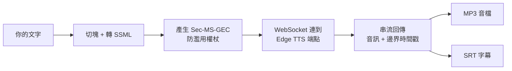
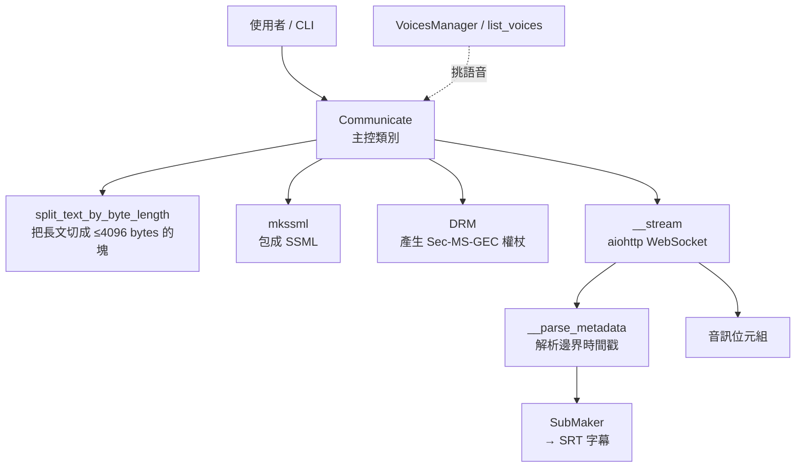
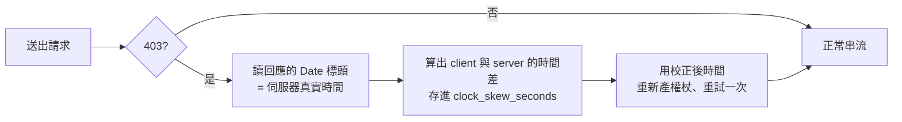

# edge-tts:免金鑰白嫖 Microsoft Edge 線上語音合成的 Python 套件

> 原始碼整理自 [rany2/edge-tts](https://github.com/rany2/edge-tts)(GPL-3.0,本文照慣例 `git clone` 後通讀 `src/` 全部原始碼再整理)。**edge-tts 是一個 Python 套件 + CLI**,讓你**不需要 Windows、不需要 Edge 瀏覽器、也不需要任何 API 金鑰**,就能呼叫微軟 Edge「大聲朗讀(Read Aloud)」背後的線上 TTS 服務,把文字合成成 MP3,還能順便產出 SRT 字幕。它是 Python 生態裡最常被拿來當「免費 TTS 後端」的套件之一(`g-tts` 的對手),被 Home Assistant、Podcastfy 等專案當底層引擎。

---

## 一句話總結

edge-tts 的本質是:**逆向了微軟 Edge 瀏覽器朗讀網頁時呼叫的那個 WebSocket 端點**,在 Python 裡偽裝成 Edge 把 SSML 丟過去、把回傳的音訊串流接回來。整個套件不到 2000 行,真正的「魔法」集中在兩件事:**① 用一個寫死的 `TrustedClientToken` + 每 5 分鐘輪替的 `Sec-MS-GEC` SHA256 雜湊權杖騙過伺服器的防濫用檢查;② 把音訊串流和「字邊界 / 句邊界」時間戳一起接回來,順手生成字幕。**



---

## 為什麼會有這個專案:它在「白嫖」什麼?

微軟 Edge 瀏覽器有個「大聲朗讀」功能,用的是品質相當好的 **Neural(神經網路)語音**,而且支援**數百種語言/口音**(光中文就有台灣、香港、大陸多種)。這個功能背後是 `speech.platform.bing.com` 的一個線上服務——**Edge 朗讀時其實是連到微軟雲端把文字合成成語音再播出來的**。

edge-tts 做的事就是:**把瀏覽器與這個雲端服務之間的通訊協議重現出來**,讓任何 Python 程式都能直接用。所以它有幾個很實際的好處:

- **完全免費、不用註冊、不用 API key**(對比 Azure 官方 TTS 要開帳號、綁信用卡、算字數計費);
- **跨平台**:Linux / macOS / Windows 都能跑,不需要真的裝 Edge;
- **語音品質高**:用的就是微軟商用級的 Neural voices。

> ⚠️ 但這也是它的**根本風險**:它依賴的是一個**未公開、未授權的內部端點**。微軟隨時可以改協議、加強防濫用、甚至封掉——專案 README 與 issue 區也反覆出現「某天突然 403」的狀況(下面會講它怎麼應對)。拿來做**個人專案 / 原型 / 自用**很香,但**別把商業產品的命脈壓在上面**。

---

## 整體架構:套件長什麼樣

專案分成兩個可安裝的命令 / 套件:

| 套件 | 角色 | 關鍵檔案 |
|---|---|---|
| **`edge_tts`** | 核心:文字 → 語音的所有邏輯 + `edge-tts` CLI | `communicate.py`(658 行,絕對核心)、`drm.py`、`voices.py`、`submaker.py` |
| **`edge_playback`** | 薄包裝:呼叫 `edge-tts` 產檔後立刻用播放器放出來 | `edge_playback/__main__.py` |

公開 API(`import edge_tts` 後可用的)只有 5 個東西,非常精簡:

```python
from edge_tts import (
    Communicate,    # 主角:文字 → 音訊串流
    SubMaker,       # 把邊界事件 → SRT 字幕
    VoicesManager,  # 依屬性(語言/性別)挑語音
    list_voices,    # 列出所有可用語音
    exceptions,     # 自訂例外
)
```



---

## 核心流程拆解:一段文字怎麼變成 MP3

以最常見的用法為例,完整一圈:

```python
import asyncio, edge_tts

async def main():
    communicate = edge_tts.Communicate("你好,世界!", "zh-TW-HsiaoChenNeural")
    await communicate.save("hello.mp3", "hello.srt")  # 音訊 + 字幕一起存

asyncio.run(main())
```

`Communicate` 內部發生的事,照原始碼順序:

### 1. 文字前處理(`__init__`)

```python
self.texts = split_text_by_byte_length(
    escape(remove_incompatible_characters(text)),
    4096,
)
```

- **`remove_incompatible_characters`**:服務不支援某些控制字元(最重要的是**垂直定位字元 vertical tab**,常出現在 OCR 過的 PDF 裡),會把 ASCII 0–8、11–12、14–31 換成空白,否則服務會報錯。
- **`escape`**:XML 跳脫(`&` → `&amp;` 等),因為等下要塞進 SSML。
- **`split_text_by_byte_length(..., 4096)`**:服務對單次請求有長度上限,所以**長文要切塊**。這個切塊函式寫得很講究,優先在「自然邊界」斷開,且保證三件事不被破壞:
  1. 每塊**不超過 4096 bytes**;
  2. 不切在 **UTF-8 多位元組字元中間**(`_find_safe_utf8_split_point`,逐位元組往回試 decode);
  3. 不切在 **XML 實體中間**(`_adjust_split_point_for_xml_entity`,例如不能把 `&amp;` 切成 `&am` + `p;`)。

  斷點優先序:先找**換行**,沒有再找**空白**,都沒有才退而求其次找安全的 UTF-8 位元組邊界。

### 2. 包成 SSML(`mkssml`)

每一塊文字被包成微軟要的 SSML(Speech Synthesis Markup Language):

```xml
<speak version='1.0' xmlns='http://www.w3.org/2001/10/synthesis' xml:lang='en-US'>
  <voice name='Microsoft Server Speech Text to Speech Voice (zh-TW, HsiaoChenNeural)'>
    <prosody pitch='+0Hz' rate='+0%' volume='+0%'>你好,世界!</prosody>
  </voice>
</speak>
```

> 注意 `voice name` 那串長格式。你在 CLI 寫的是 `zh-TW-HsiaoChenNeural`,但 `TTSConfig.__post_init__` 會用正則把它**改寫成微軟 Edge 實際送出的長格式** `Microsoft Server Speech Text to Speech Voice (zh-TW, HsiaoChenNeural)`——這也是「重現瀏覽器行為」的細節之一。

**關於自訂 SSML**:作者明說**已移除自訂 SSML 支援**,因為微軟會擋掉任何「不像 Edge 自己會產生的 SSML」——服務只允許**單一 `<voice>` 裡單一 `<prosody>`**。所以你能調的就只有 `--rate`(語速)、`--volume`(音量)、`--pitch`(音調)三個 prosody 參數,格式分別被正則嚴格限定為 `+50%` / `-50%` / `+10Hz` 這種。

### 3. 過防濫用檢查:`Sec-MS-GEC` 權杖(整個專案最關鍵的逆向)

連 WebSocket 時 URL 帶了三個防濫用參數:

```python
f"{WSS_URL}&ConnectionId={connect_id()}"
f"&Sec-MS-GEC={DRM.generate_sec_ms_gec()}"
f"&Sec-MS-GEC-Version={SEC_MS_GEC_VERSION}",
```

`WSS_URL` 裡寫死了一個 **`TrustedClientToken = "6A5AA1D4EAFF4E9FB37E23D68491D6F4"`**(從 Edge 逆向得到的固定值)。光有它還不夠,微軟後來加了 **`Sec-MS-GEC`** 動態權杖(2024 年那波 403 的元兇),`drm.py` 的 `generate_sec_ms_gec()` 重現了它的演算法:

```python
ticks = DRM.get_unix_timestamp()   # 現在時間(可校正時鐘偏移)
ticks += WIN_EPOCH                 # 換算到 Windows 檔案時間紀元(1601-01-01)
ticks -= ticks % 300               # 向下取整到「最近的 5 分鐘」
ticks *= S_TO_NS / 100             # 換成 100 奈秒為單位的 ticks
str_to_hash = f"{ticks:.0f}{TRUSTED_CLIENT_TOKEN}"
return hashlib.sha256(str_to_hash.encode("ascii")).hexdigest().upper()
```

**白話**:把「現在時間(對齊到 5 分鐘)」接上那個固定 token,做 **SHA256** 再轉大寫十六進位。因為對齊到 5 分鐘,**同一個 5 分鐘窗口內權杖固定、每 5 分鐘換一次**,藉此和伺服器「對時」。

這帶出一個經典坑:**如果你電腦的時鐘不準**,算出來的權杖窗口就和伺服器對不上 → 拿到 **403**。所以 `drm.py` 有一套**時鐘偏移自動校正**:



`handle_client_response_error` 從 403 回應的 `Date` 標頭解析出伺服器時間,算出偏移量累加到 `DRM.clock_skew_seconds`,下次 `get_unix_timestamp()` 就自動補上。這個「**先試、403 再對時重試**」的模式在 `communicate.py`(串流)和 `voices.py`(列語音)裡都有,是專案能長期穩定運作的關鍵韌性設計。

另外還有個 `headers_with_muid()` 會塞一個隨機 `muid` Cookie,進一步模仿瀏覽器。

### 4. WebSocket 串流與雙軌資料(`__stream`)

連上後先送兩則訊息:`speech.config`(設定輸出格式為 **`audio-24khz-48kbitrate-mono-mp3`**、要不要邊界事件)和 SSML 本身。然後 `async for` 不斷收訊息,分兩種:

- **TEXT 訊息**:可能是 `audio.metadata`(**邊界時間戳**,字幕用)或 `turn.end`(這塊結束)。
- **BINARY 訊息**:前 2 bytes 是 header 長度,後面就是 **MP3 音訊位元組**。

每收到一塊就 `yield` 出去(串流式,不必等全部合成完),呼叫端可即時寫檔或播放。

### 5. 邊界時間戳 → 字幕(`SubMaker` + offset 補償)

服務會回報每個字 / 每句的 `Offset`(起始)和 `Duration`(長度),單位是 **100 奈秒 ticks**。`SubMaker.feed()` 把這些換算成 `timedelta` 存成字幕 cue,最後 `get_srt()` 輸出標準 SRT。

這裡有個**長文才會踩到的精妙修正**。長文被切成多塊、每塊各自一個 WebSocket session,每塊的 offset 都從 0 開始,所以**第二塊以後的時間戳要加上前面所有塊的累計時長**(`offset_compensation`)。早期版本用「metadata 累加」來算,但會因為 AI 朗讀的不定長靜音 + 微軟回報的整數溢位而**飄移**。現在改成 `__compensate_offset()`——**直接用累計的音訊位元組數換算**:

```python
# 輸出是 48 kbps 固定位元率(CBR),所以位元組↔時間是精確整數運算
ticks = total_bytes * 8 * 10_000_000 // 48_000
```

因為 MP3 是固定位元率,「**已經產生多少 bytes 音訊**」就能精確反推「**到第幾秒了**」,比信任伺服器回報的時間戳更穩。這是個很漂亮的工程取捨:**用自己能精確掌握的量(位元組數)取代不可靠的外部資料(伺服器時間戳)**。

---

## 同步 vs 非同步:給不熟 asyncio 的人留的後門

整個套件底層是 **`asyncio` + `aiohttp`**(WebSocket 串流天生適合非同步)。但作者體貼地給了同步包裝,讓不想碰 async 的人也能用:

```python
# 非同步(推薦,效率最好)
async for chunk in communicate.stream(): ...
await communicate.save("out.mp3")

# 同步(內部用 ThreadPoolExecutor 跑一個 event loop 再用 Queue 把結果搬出來)
for chunk in communicate.stream_sync(): ...
communicate.save_sync("out.mp3")
```

`stream_sync` 的實作就是開一條執行緒跑 `asyncio` event loop、透過 `queue.Queue` 把非同步產出的 chunk 一個個搬回主執行緒 `yield`,遇到 `None` 哨兵就結束——是「**把 async generator 轉成 sync generator**」的標準手法,值得學起來。

---

## 挑語音:`list_voices` 與 `VoicesManager`

```python
import asyncio, edge_tts

async def main():
    # 方法一:直接列出所有語音(數百個)
    voices = await edge_tts.list_voices()

    # 方法二:用 VoicesManager 依屬性篩選
    vm = await edge_tts.VoicesManager.create()
    zh_female = vm.find(Gender="Female", Language="zh")   # 所有中文女聲
    twn = vm.find(Locale="zh-TW")                          # 指定台灣中文

asyncio.run(main())
```

`VoicesManager.find()` 的實作是一行字典子集比對 `kwargs.items() <= voice.items()`——把你給的條件當「必須全部滿足」來篩。可篩的欄位包括 `Gender`、`Language`(語言碼如 `zh`)、`Locale`(完整地區碼如 `zh-TW`)等。

CLI 對應:`edge-tts --list-voices` 會用 `tabulate` 印成漂亮的表格(名稱 / 性別 / 內容類別 / 語音個性)。

---

## 兩個命令列工具

```bash
# edge-tts:產檔
edge-tts --text "你好,世界!" --voice zh-TW-HsiaoChenNeural \
         --write-media hello.mp3 --write-subtitles hello.srt

# 調語速/音量/音調(負值要用 = 號避免被當成參數)
edge-tts --rate=-50% --text "慢慢說" --write-media slow.mp3

# 從檔案讀文字(- 代表 stdin)
edge-tts --file article.txt --write-media article.mp3

# edge-playback:產檔 + 立刻播放(自動清暫存檔)
edge-playback --text "Hello, world!"
```

`edge-playback` 是個薄包裝:它把參數轉交給 `edge-tts` 子行程產出暫存 MP3 + SRT,再播放。**播放器策略**:非 Windows 平台需要裝 [`mpv`](https://mpv.io/);**Windows 預設用內建的 `win32_playback`**(走 Windows API,不必裝 mpv),除非你加 `--mpv`。播完用 `finally` 清掉暫存檔(可用環境變數 `EDGE_PLAYBACK_KEEP_TEMP` 保留、`EDGE_PLAYBACK_DEBUG` 印出檔名)。

---

## 應用案例 / 怎麼用這套思路

- **給文章 / 部落格做「聽的版本」**:把 Markdown 去掉標記後丟給 `edge-tts --file`,產出 MP3 放到網站,讀者可以用聽的。
- **影片旁白 / 自動配音**:用 `Communicate` 產音訊 + `SubMaker` 同步產 SRT,**音畫字幕一次到位**,接到剪輯流程。對照本庫的 YouTube 筆記流程——我們是反過來用 Whisper 把「語音 → 字幕」;edge-tts 是「文字 → 語音 + 字幕」,正好是另一半。
- **無障礙 / 螢幕朗讀**:給視障使用者或閱讀困難者把任意文字念出來,免費且語音自然。
- **Podcast 自動生成**:`Podcastfy` 這類專案就拿 edge-tts 當 TTS 後端,把文章變成雙人對談 podcast。
- **語言學習素材**:用 `VoicesManager` 挑各國母語者語音,把單字/句子批次合成成發音範例(`tts-samples` 專案就是在做這個)。
- **智慧家庭語音**:Home Assistant 的 `hass-edge-tts` 整合讓你用免費高品質語音做門鈴/通知播報。
- **逆向工程的學習範本**:這個專案本身就是「**如何乾淨地重現一個瀏覽器的私有 API**」的好教材——固定 token + 時間雜湊權杖 + 時鐘偏移校正 + 先試後重試的韌性設計,都很值得抄進你自己接「半公開端點」的程式裡。

---

## 風險與限制(務必知道)

1. **依賴未授權的內部端點**:微軟沒有承諾這個服務對外開放,**隨時可能變更或封鎖**。歷史上已多次因 `Sec-MS-GEC` 之類的防濫用機制更新而集體 403,得等作者跟進。**別用在不能中斷的商業關鍵路徑**。
2. **無自訂 SSML**:不能做多語音對話、停頓標記、音素級控制等進階效果——只能調 rate/volume/pitch。需要這些就得用 Azure 官方 TTS 或本地模型(如 [[voxcpm-report]])。
3. **要連網**:它是雲端服務,**離線完全不能用**;隱私敏感的文字會送到微軟伺服器。
4. **可能有速率限制 / 濫用封鎖**:大量請求容易被擋,商用級量體請走官方付費 API。
5. **授權**:專案是 **GPL-3.0**,把它嵌進你的程式要留意授權傳染性(雖然當作獨立 CLI 子行程呼叫通常較單純)。

> 想要「**完全離線、可商用、可自訂**」就往本地神經 TTS 走(見本庫 [[voxcpm-report]]);想要「**免費、零設定、品質高、但靠微軟臉色**」edge-tts 就是首選。兩者是互補關係。

---

## 來源

- rany2/edge-tts(GitHub,GPL-3.0):<https://github.com/rany2/edge-tts>(本文依 `src/edge_tts/` 與 `src/edge_playback/` 全部原始碼整理,clone 後已刪除暫存)
- 關鍵實作參考檔案:`communicate.py`(切塊/SSML/WebSocket 串流/offset 補償)、`drm.py`(`Sec-MS-GEC` 權杖與時鐘偏移校正)、`constants.py`(端點與 `TrustedClientToken`)、`voices.py`(語音清單與篩選)、`submaker.py` + `srt_composer.py`(字幕生成)。
- `Sec-MS-GEC` 演算法緣由討論:edge-tts issue #290(原始碼註解標註的來源)。
