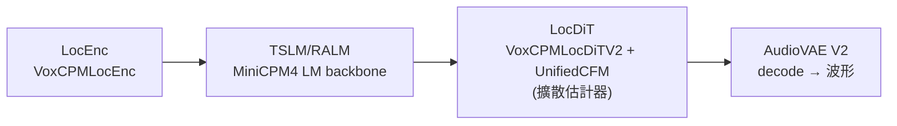

# VoxCPM:無分詞器、可「用文字描述設計聲音」的開源 TTS

**主題分類:** AI / 語音合成(TTS)
**研究對象:** [OpenBMB/VoxCPM](https://github.com/OpenBMB/VoxCPM)
**內容性質:** 已 `git clone` 讀完整原始碼(`core.py` / `cli.py` / `model/voxcpm2.py` 等)後整理
**整理日期:** 2026-05-25

---

## 1. 是什麼

OpenBMB 開源的文字轉語音(TTS)系統。最新版 **VoxCPM2 為 2B 參數模型**,特點是 **直接生成連續語音表示、繞過離散分詞(tokenizer-free)**,以追求更自然的表達。Apache-2.0 授權,**商用免費**,HuggingFace 與 ModelScope 皆可下載。

---

## 2. 技術架構

無分詞器的 **擴散自迴歸(diffusion autoregressive)** 架構,在 AudioVAE V2 潛空間運作,四階段管線:



**讀原始碼後對應到實際模組(`model/voxcpm2.py` 的 `VoxCPM2Model`):**
- `feat_encoder = VoxCPMLocEnc(...)` —— 對應 **LocEnc**(區域特徵編碼)。
- `lm = MiniCPMModel(MiniCPM4Config)` —— 對應 **TSLM / RALM** 的自迴歸語言模型骨幹(MiniCPM4)。
- `estimator = VoxCPMLocDiTV2(...)` 包進 `UnifiedCFM`(conditional flow matching)—— 對應 **LocDiT**,即「不分詞、直接在連續潛空間做擴散」的關鍵。
- `audio_vae = AudioVAEV2` —— 潛空間 encode/decode,支援 **streaming_decode**(邊生成邊解碼出 chunk)。

---

## 3. 四大能力

| 能力 | 說明 |
|---|---|
| **文字轉語音** | 標準 TTS,支援用自然語言描述風格。 |
| **語音設計** | 從文字描述「無中生有」造出全新聲音,**不需參考音頻**,可指定性別、年齡、音色、情感。 |
| **可控克隆** | 從短音頻克隆聲音,並用風格指導調整情感、語速、表現力。 |
| **終極克隆** | 結合參考音頻 + 其文本,保留每個聲學細節。 |

**多語言:** 支援 30 種語言,含中文方言(四川話、粵語、吳語等)。

---

## 4. 效能指標

- **Seed-TTS-eval:** 英文 WER 1.84%、中文 CER 0.97%。
- **多語言 ASR:** 30 語言平均 WER/CER 1.68%。
- **推理速度:** RTX 4090 上 RTF ≈ 0.3;以 Nano-vLLM 加速可至 ≈ 0.13。

---

## 5. 使用方式(讀 `core.py` / `cli.py` 後的真實介面)

### Python API
唯一對外類別就是 `VoxCPM`(`__init__.py` 只匯出它)。核心方法 `generate()` 的關鍵參數:

```python
from voxcpm.core import VoxCPM
import soundfile as sf

tts = VoxCPM.from_pretrained("openbmb/VoxCPM2-2B")   # 會自動從 HF 下載權重
wav = tts.generate(
    text="哈囉,這是 VoxCPM 的測試。",
    prompt_wav_path=None,        # 連續模式:提供「參考音檔 + 其逐字稿」
    prompt_text=None,            #   prompt_wav_path 與 prompt_text 必須同時給或同時 None
    reference_wav_path=None,     # 語音克隆:用 ref_audio token「結構性隔離」,可單用或疊加 prompt
    cfg_value=2.0,               # classifier-free guidance 引導強度
    inference_timesteps=10,      # 擴散步數(越多越精細、越慢)
    normalize=False,             # 是否先跑文字正規化
    denoise=False,               # 是否用 ZipEnhancer 對 prompt/參考音去噪
    retry_badcase=True,          # 壞例自動重試
)
sf.write("out.wav", wav, tts.sample_rate)
# 串流:for chunk in tts.generate_streaming(text=...): ...  # 逐塊吐 numpy 波形
```

**穩健性細節:** `generate()` 內建 **badcase 重試**——以「音訊長度 / 文字長度」比值是否超過 `retry_badcase_ratio_threshold=6.0` 判斷是否生成異常(吃螺絲/拉長),最多重試 `retry_badcase_max_times=3` 次;`from_pretrained` 載入後還會先跑一句暖身合成。

### CLI(`voxcpm` 指令,VoxCPM2-first)
四個子命令:`design`(用文字描述造聲音)、`clone`(克隆參考音)、`batch`(讀文字檔批次合成)、`validate`(驗證)。也支援 `--lora-path` 掛 LoRA 微調權重。

### 其他
- **Web UI:** `python app.py --port 8808`。
- **微調:** `conf/` 下有 `voxcpm_finetune_all.yaml`(全參數)與 `voxcpm_finetune_lora.yaml`(LoRA)三個版本(v1 / v1.5 / v2)。
- **生產部署:** Nano-vLLM 或 vLLM-Omni 提供高吞吐量服務。

---

## 6. 應用案例

- **客服 / 有聲書「指定旁白聲線」:** 用 `clone` 子命令(或 `generate(reference_wav_path="narrator.wav")`)餵 10–30 秒旁白樣本,即可用同一聲線把整本文字稿批次轉成語音(`batch` 讀 `.txt`),`retry_badcase` 自動處理偶發吃螺絲。
- **遊戲 / 動畫「無素材造角色聲」:** 用 `design` 子命令以自然語言描述(如「沙啞、年長、男性、緩慢」)**無中生有** 一個全新聲音,不需任何參考音檔——適合需要大量 NPC 配音又沒有真人素材時。
- **多方言內容在地化:** 同一段文字用不同方言(四川話/粵語/吳語)各跑一次,做地區化語音版本。
- **即時互動(低延遲):** 用 `generate_streaming()` 邊生成邊播放,搭配 AudioVAE 的 `streaming_decode`,在 RTX 4090 上 RTF≈0.3(Nano-vLLM 可到≈0.13),適合語音助理即時回應。

---

## 來源

- [OpenBMB/VoxCPM (GitHub)](https://github.com/OpenBMB/VoxCPM)
