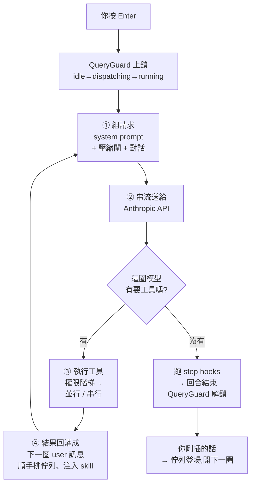
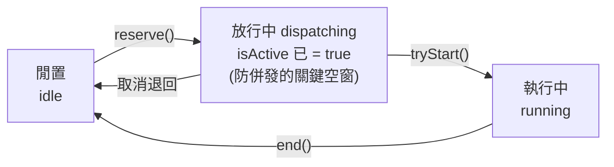
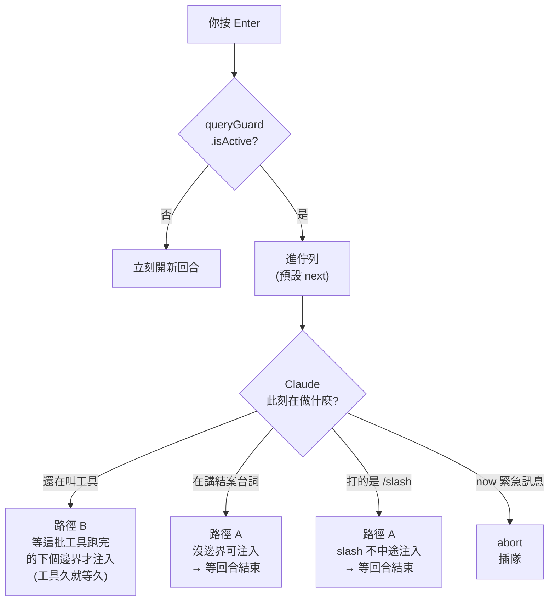
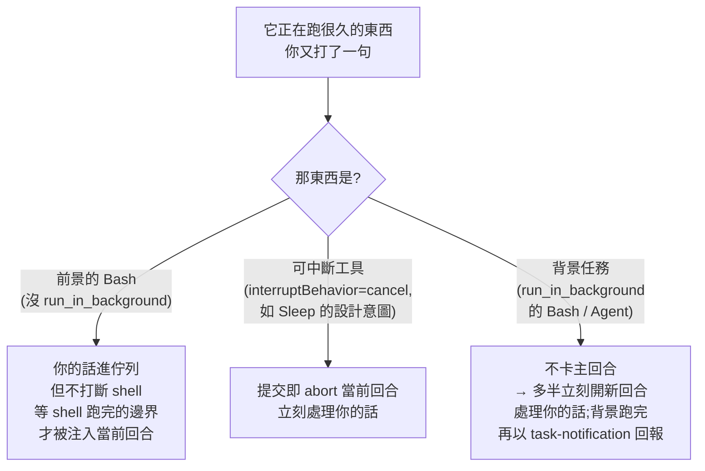

# 一句 prompt 的一生:Claude Code 原始碼徹底拆解(從你按 Enter 到綠燈收工)

> 這篇不照「子系統」分章,而是**跟著一句真實的 prompt 走一條完整的時間線**——從你按下 Enter 那一刻,到 Claude 跑完測試、回合結束。每經過一個「步驟」,該登場的機制(harness 迴圈、佇列、system prompt、權限、工具並行、skill、MCP、子 agent、壓縮)就**在它真正發揮作用的那一秒被拆開來深講**,並標清楚它跟前後步驟怎麼咬合。CCB(二開版)的群控/Remote/Web Search/Poor 等擴充,也**折進它接管的那一站**,而不是另開一塊。
>
> 目標有兩個、同等重要:**看懂它為什麼這樣設計**、以及**有能力自己改它的 code**。所以每一站都有三件事:真實程式碼片段(逐行註解在講什麼)、為什麼這樣做(不這樣會怎樣 / 踩過什麼事故 / 代價)、以及**這站想改要動哪裡、會踩什麼雷**。
>
> **素材**:兩個 repo,都已 clone 到本機讀完再刪、未進本庫。
> 1. **官方原始碼(npm sourcemap 外洩)**:`yasasbanukaofficial/claude-code`(2026-03-31,Chaofan Shou 發現官方 npm 包忘了把 `.map` 加進 `.npmignore`,`sourcesContent` 把整包 TS 原碼塞在裡面)。1900+ 檔。**架構主體。**
> 2. **CCB(Claude Code Best / 踩踩背)**:`claude-code-best/claude-code`,社群完整復刻官方並擴充企業/好玩功能。3300+ 檔。**看同一具引擎還能長出什麼。**
> 為了精讀動用了 **13 個 fan-out agent**(8 個讀官方各子系統 + 5 個讀 CCB),所有 `檔案:行號` 都是真的。

---

## 序幕:週五下午,你按了 Enter

週五下午四點,你想在下班前把一件煩了很久的事做掉:這個專案的測試還在用老舊的 `unittest`,你早就想換成 `pytest`。你打開 Claude Code,敲下一行字、按 Enter:

> 「**幫我把這個專案所有測試從 unittest 改成 pytest,跑一次確認綠燈**」

游標閃了一下。終端開始有東西冒出來。**就在你按下 Enter 到第一個字出現的這短短一瞬間,以及接下來它改檔、跑測試、回報綠燈的幾分鐘裡,Claude Code 內部其實上演了一齣 12 幕的戲。** 這篇就是那齣戲的逐幕慢動作——而你,就是那個按下 Enter 的人,我們會一路跟著你這句話走到底。

期間你還會做幾件很真實的事:**它跑到一半你又補一句話**(這會牽出它最巧的佇列設計)、**它派了個分身去改 20 個檔**、**對話長到快爆掉**——每一件都正好踩到一個關鍵機制,我們就在它登場的那一幕把它拆開來看。

先給你一張「這齣戲的舞台」——**整個 Claude Code 的本體,其實就是一個 async generator 的 `while(true)`**(`src/query.ts`,1729 行),外面包一層 driver(`QueryEngine.ts`)。你以為很神的工具、skill、子 agent,都只是「每一圈餵給這個迴圈的東西不一樣」:



> **一句話心法**:Claude Code = 「**把對話+工具結果反覆回灌給模型,直到模型不再要求工具**」的迴圈。所有難點都在「每圈餵什麼、何時壓縮、工具怎麼安全並行、你插話怎麼排」。

---

## 步驟 0 — 按下 Enter 的前 0 毫秒:那把同步鎖

大幕拉開。第一幕短到你以為什麼都還沒發生——你手指剛離開 Enter 鍵,連第一個字都還沒冒出來。但 Claude Code 已經先做了一件事:**上一把鎖,免得你手一快、它就分裂成兩個。**

入口是 `REPL.tsx` 的 `onSubmit`,它先算一個布林:

```ts
// REPL.tsx:3343 —— submitsNow 為真才「立刻跑」,否則排隊
const submitsNow = !isLoading || speculationAccept || activeRemote.isRemoteMode
```

現在沒別的 query 在跑,`submitsNow=true`,走 `executeUserInput`。但在它碰到**第一個 `await` 之前**,就同步做了一件全系統最關鍵的事——把一把叫 `QueryGuard` 的鎖從 `idle` 推到 `dispatching`。為什麼需要這把鎖、為什麼是**三**個狀態而不是兩個?

```ts
// utils/QueryGuard.ts:38-101 —— 三態 state machine
reserve(): boolean {                    // idle → dispatching
  if (this._status !== 'idle') return false
  this._status = 'dispatching'; this._notify(); return true
}
tryStart(): number | null {             // dispatching → running
  if (this._status === 'running') return null
  this._status = 'running'; ++this._generation; this._notify(); return this._generation
}
end(generation: number): boolean {      // running → idle(只有同一代才能關)
  if (this._generation !== generation) return false
  if (this._status !== 'running') return false
  this._status = 'idle'; this._notify(); return true
}
get isActive(): boolean { return this._status !== 'idle' }   // dispatching+running 都算「忙」
```



**為什麼要 `dispatching` 這個中間態**:從「決定要跑」到「query 真的啟動」之間有一段 async 空窗。如果這段時間 guard 還是 `idle`,你**手快連按兩次 Enter** 時,第二次提交會看到 `idle`、誤判「現在沒事我可以跑」,於是同時啟動**兩個** query、把對話搞亂。`reserve()` 在第一個 `await` 前就同步把狀態推成 `dispatching`,讓 `isActive` 立刻變 `true`,把競爭者擋去排隊。`generation` 計數器則解決另一個競態:被 `end()` 的必須是「自己這一代」,避免一個 stale 的 `finally` 把後來啟動的新 query 給關掉。

> **想改**:這把鎖是「立刻跑 vs 排隊」的總開關,下一刻就會用到它。要改判定一定要記得 `isActive` 涵蓋 `dispatching`+`running` 兩態——只檢查 `running` 就會在空窗期漏掉併發。

---

## 步驟 1 — 如果此刻 Claude 正在跑、你又打了字:佇列怎麼排(你的核心問題)

先把這一刻講透,因為它正是你問的「**有時 queue 住等上一個、有時上一個還在跑就接手**」。假設 Claude 已經在改測試了,你又補一句「順便把 CI 設定也更新一下」。

### 1a — 一個 module 級的「統一佇列」,獨立於 React

```ts
// utils/messageQueueManager.ts:53-108 —— 佇列本體完全不在 React state 裡
const commandQueue: QueuedCommand[] = []
let snapshot: readonly QueuedCommand[] = Object.freeze([])   // 凍結快照,給 useSyncExternalStore
const queueChanged = createSignal()
function notifySubscribers(): void {
  snapshot = Object.freeze([...commandQueue]); queueChanged.emit()
}
const PRIORITY_ORDER: Record<QueuePriority, number> = { now: 0, next: 1, later: 2 }
export function dequeue(filter?: (cmd: QueuedCommand) => boolean): QueuedCommand | undefined {
  let bestIdx = -1, bestPriority = Infinity
  for (let i = 0; i < commandQueue.length; i++) {              // 不是純 FIFO,是「優先序感知」
    const cmd = commandQueue[i]!
    if (filter && !filter(cmd)) continue
    const priority = PRIORITY_ORDER[cmd.priority ?? 'next']
    if (priority < bestPriority) { bestIdx = i; bestPriority = priority }  // 嚴格 < ⇒ 同級保 FIFO
  }
  if (bestIdx === -1) return undefined
  const [dequeued] = commandQueue.splice(bestIdx, 1); notifySubscribers(); return dequeued
}
```

**為什麼放 module 級而不放 React state**:原始碼註解明說是要「繞過 Ink(終端 React 渲染器)的 context 傳遞延遲造成的漏通知」。Ink 的 render 排程不可靠,如果佇列靠 React context 傳播,dequeue 後的 effect 可能不 re-run,**排隊的 prompt 會永久卡死**。改用 `useSyncExternalStore` 訂閱一個外部 store,同步 `emit` 才能保證每次變動都 re-render。

三個優先級的分工(這是「不會插隊亂套」的根基):

| 優先級 | 數字 | 誰用 | 語意 |
|---|---|---|---|
| `now` | 0 | 遠端 chat client、steering | **中斷當前回合**插隊 |
| `next` | 1 | **你在輸入框打的字** | 你的輸入永遠排在系統訊息前面 |
| `later` | 2 | 任務通知、背景 agent 完成通知 | `enqueuePendingNotification` 預設值 |

`later` 給通知是刻意的——註解寫「user input is never starved by system messages」(你的輸入永遠不被系統訊息餓死)。

### 1b — 按 Enter 的那一刻,唯一的分流點

```ts
// utils/handlePromptSubmit.ts:313-386 —— 「排隊 vs 立即」就這一個 if
if (queryGuard.isActive || isExternalLoading) {
  if (mode !== 'prompt' && mode !== 'bash') return         // 只有 prompt/bash 能排隊
  if (params.hasInterruptibleToolInProgress) {              // 若當前工具全是可中斷的(如 Sleep)
    params.abortController?.abort('interrupt')              // → 提早結束當前回合好馬上處理
  }
  enqueue({ value: finalInput.trim(), mode, pastedContents, skipSlashCommands, uuid })
  onInputChange('')                                         // 清空輸入框、顯示在佇列預覽
  return
}
// guard 不忙 → 直接執行(步驟 0 的路徑)
await executeUserInput({ queuedCommands: [cmd], ... })
```

### 1c — 進了佇列後,兩條消費路徑 = 你看到的兩種行為

**路徑 A|回合「之間」才排空(= 你看到的「queue 住等上一個」)**

```ts
// hooks/useQueueProcessor.ts:35-67 —— 只在 query 結束後才排空佇列
const isQueryActive = useSyncExternalStore(queryGuard.subscribe, queryGuard.getSnapshot)
const queueSnapshot = useSyncExternalStore(subscribeToCommandQueue, getCommandQueueSnapshot)
useEffect(() => {
  if (isQueryActive) return            // ← 有 query 在跑就什麼都不做
  if (hasActiveLocalJsxUI) return
  if (queueSnapshot.length === 0) return
  processQueueIfReady({ executeInput: executeQueuedInput })   // guard 變 idle 才會跑到這
}, [queueSnapshot, isQueryActive, ...])
```

只有整個 query 結束、guard `end()` 回 `idle`、`isQueryActive` 翻 `false`,這個 effect 才 re-run,排空佇列、**開一個全新回合**。排空時的批次策略也有巧思:

```ts
// utils/queueProcessor.ts:61-86 —— slash/bash 單發,其餘同 mode 合併
const isMainThread = (cmd) => cmd.agentId === undefined     // 只取主執行緒的,不吞子 agent 的通知
const next = peek(isMainThread)
if (isSlashCommand(next) || next.mode === 'bash') {
  void executeInput([dequeue(isMainThread)!])               // 單發:保 per-command 錯誤隔離/exit code
} else {
  const cmds = dequeueAllMatching(c => isMainThread(c) && !isSlashCommand(c) && c.mode === next.mode)
  void executeInput(cmds)                                   // 批次:多則排隊訊息合併成「一個」回合
}
```

**路徑 B|回合「中途」即時注入(= 你看到的「上一個還在跑就接手」)**

主迴圈每跑完一圈工具、要發下一次 model 請求前,會順手把佇列裡屬於自己、非 slash 的指令撈出來,**當成 attachment 塞進「當前這個回合」**:

```ts
// query.ts:1570 —— mid-turn drain:把排隊的 prompt 注入當前回合
const queuedCommandsSnapshot = getCommandsByMaxPriority(sleepRan ? 'later' : 'next')
  .filter(cmd => isSlashCommand(cmd) ? false                 // slash 排除(要走 processSlashCommand)
                : (isMainThread ? cmd.agentId === undefined : ...))
for await (const attachment of getAttachmentMessages(..., queuedCommandsSnapshot, ...)) {
  yield attachment; toolResults.push(attachment)             // 變成本回合的一則 user 訊息
}
```

```ts
// utils/attachments.ts:1044-1058 —— 只有 prompt / task-notification 兩種 mode 會被中途注入
const INLINE_NOTIFICATION_MODES = new Set(['prompt', 'task-notification'])
```

### 1d — 所以「排隊 vs 立刻」到底看什麼



| 你輸入當下 Claude 正在… | 行為 | 機制 |
|---|---|---|
| **多步工具迴圈中間**(還會再叫工具) | **幾乎立刻接手** | 路徑 B:`query.ts:1570` 注入當前回合 |
| **最後一段純文字回覆**(不再叫工具) | **排隊等回合結束** | 路徑 A:沒有後續迭代邊界,只能等 `useQueueProcessor` |
| 你打 **slash command**(`/model`…) | **排隊等回合結束** | 中途注入排除 slash,要走 `processSlashCommand` |
| 指令是 **`now` 優先級** | **abort 當前操作插隊** | 見下方 headless steering |

互動模式(TUI)裡你打的 prompt 一律 `next` 優先級,**沒有「真正打斷正在進行的回合」這回事**——路徑 B 的「注入當前回合」只發生在「回合本來就還沒結束(還在叫工具)」時順手撈。真正的「打斷插話」只有 headless / 遠端的 `now` 優先級才有:

```ts
// cli/print.ts:1858-1961 —— headless 模式的真 steering:now 訊息一到就 abort
subscribeToCommandQueue(() => {
  if (abortController && getCommandsByMaxPriority('now').length > 0) abortController.abort('interrupt')
})
while ((command = dequeue(isMainThread))) {                 // drain 迴圈:連續 prompt 合併成一次 ask()
  if (command.mode === 'prompt') {
    while (canBatchWith(command, peek(isMainThread))) batch.push(dequeue(isMainThread)!)
    if (batch.length > 1) command = { ...command, value: joinPromptValues(batch.map(c => c.value)) }
  }
}
```

> **跨子系統咬合**:這個佇列是整個 process 共享的(主執行緒 + 同進程子 agent)。每個迴圈只撈「給自己的」(主執行緒撈 `agentId===undefined`,子 agent 撈自己的 id),所以**子 agent 永遠看不到你的 prompt 串流**——這條規則在步驟 10(子 agent)會再用到。

### 1e — CCB 把這條輸入管線接出去:群控 + Channels

這一站正是 CCB 動手腳的地方——**它幾乎不改迴圈,只把「輸入從哪來」接出去**:

- **群控(Pipe IPC + LAN)**:每個 CCB 實例開一個 NDJSON 的 Unix domain socket(Win 用 Named Pipe);同機靠 `~/.claude/pipes/registry.json` + 檔案鎖(`writeFile` 的 `wx` flag = `O_CREAT|O_EXCL`)選 main/sub,main 角色綁穩定的 `machineId`(Win 讀 registry MachineGuid、Linux 讀 `/etc/machine-id`)而非啟動順序,所以 main 崩了同機 sub 能無縫 `main-recover`。跨機用 **UDP multicast beacon**(多播組 `224.0.71.67`、埠 `7101`,每 3 秒廣播、15 秒逾時)做零配置發現,`TTL=1` 只在同網段。你 `/pipes` 勾選目標後,**你打的 prompt 被廣播到遠端 slave 執行**——而它走的正是上面這個同一套 `now/next/later` 佇列,`now` 級會 `abort` 插隊。
- **Channels**:讓一個 MCP server 把外部 IM(Telegram/Discord/飛書/微信)訊息**推進正在跑的會話**——server 發 `notifications/claude/channel`,handler `wrapChannelMessage` 包成 `<channel>` 標籤(meta key 過 `SAFE_META_KEY` 正則防 XML 注入)後 `enqueue({priority:'next'})` 進**同一個佇列**,`SleepTool` 1 秒內醒來處理。**等於你不在終端,別人也能餵 prompt 進來。**

> **想改 queue**:① 改「排隊 vs 立即」動 `handlePromptSubmit.ts:313`;② 新增優先級動 `messageQueueManager.ts:151` 的 `PRIORITY_ORDER`(`dequeue` 用嚴格 `<` 保 FIFO,改 `<=` 會壞);③ 讓互動模式也能 `now` 插話,仿 `print.ts:1858` 在 REPL 訂閱佇列;④ **鐵律**:任何 mutation 都要呼叫 `notifySubscribers()`,漏掉排隊 prompt 永久不處理。

### 1f — 岔題一下:那如果你打的是 `/model`、`/compact` 這種 slash 指令?

上面的佇列只處理「要送給模型的話」。但你打的若是 `/` 開頭的指令(`/model` 切模型、`/config`、`/compact`、`/clear`…),它走的是**完全不同的一條路**——`processSlashCommand` 流水線,**根本不進 `query()`、不送給模型**。這解釋了三件事:

- **為什麼 slash 一定排隊等回合結束**(步驟 1d 的表格那一列):它不是「給模型的訊息」而是「改 Claude Code 自己的設定/狀態」,中途注入(路徑 B)明確把它排除(`query.ts:1570` 的 `.filter(cmd => isSlashCommand(cmd) ? false : ...)`)。
- **為什麼這樣才對**:`/model` 改的是「下一個回合用哪個模型」這種全域狀態,如果硬塞進當前回合當文字,模型只會困惑「你叫我 /model 幹嘛」。把它隔離成獨立流水線,你打的 prompt 才永遠優先於這類設定指令。
- **skill 與 slash 是親戚**:步驟 8 會看到,**一個 skill 本質上就是一個 `type:'prompt'` 的 Command**,跟 slash command 共用同一套 `Command` 抽象與 `findCommand` 查找——差別只在 skill 會被模型自動觸發,slash 由你手動打。

> **想改 slash**:新增一個 slash 在 `commands/<name>/` 建檔並註冊進 `commands.ts`;要改「哪些 mode 能排隊」動 `handlePromptSubmit.ts` 的 `if (mode !== 'prompt' && mode !== 'bash') return`(目前 slash 在這之外、由別條路處理)。

### 1g — 那如果它正在跑一個「很久」的 shell 或背景任務?你的下一句會被吃進來嗎?

這是上面那張圖沒畫出來的邊界情形,而答案**取決於那個長跑的東西是「前景阻塞工具」還是「背景任務」**:



**逐一說清楚:**

- **前景的長跑 Bash(最常見)**:Bash 沒有定義 `interruptBehavior`,預設就是 **`'block'`**(`StreamingToolExecutor.ts:235`)。所以你按 Enter 時,`handlePromptSubmit` 看到 `hasInterruptibleToolInProgress` 為 false → **只 `enqueue`、不 abort**。那個 `npm install` / `pytest` 繼續跑、不會被你的話打斷;你的話在佇列裡等。**等 Bash 跑完、主迴圈走到下一個工具迭代邊界(`query.ts:1570`),你的話才被當 attachment 注入當前回合。** 換句話說:**會被吃進來,但要等那個 shell「跑完」,不是在它跑的當下立刻接走。**(這也是為什麼上面那張圖我把「幾乎立刻」改成「工具久就等久」。)
- **可中斷工具(設計上的例外)**:`hasInterruptibleToolInProgress` 的判定是「**當前執行中的工具『全部』都是 `interruptBehavior()==='cancel'`**」(`StreamingToolExecutor.ts:254` 的 `executing.every(... === 'cancel')`)。這是為 **Sleep 這種「等待」工具**設計的——你在它 sleep 時打字,理應立刻把 sleep 砍掉處理你的話,而不是傻等。命中時 `handlePromptSubmit.ts:321` 會 `abortController.abort('interrupt')` 中止當前回合、馬上處理。⚠️ **註:在這份外洩快照裡,實際上沒有任何工具把 `interruptBehavior` 設成 `cancel`**(連 SleepTool 目錄只剩 `prompt.ts`),所以這條「打字即中斷」路徑目前是**休眠的**;但機制與設計意圖如上(Sleep=可中斷、Bash=阻塞)。
- **背景任務(`run_in_background`)**:背景 Bash 或背景 Agent **不卡主回合**——工具呼叫本身瞬間回傳一個 task id(`async_launched`),主回合照常往下、通常很快就結束。所以這時你打的下一句,多半遇到的是 **`QueryGuard` 已 `idle`** → 直接**開新回合立刻處理**(步驟 0 的路徑);那個背景任務跑完後,才把結果包成 `<task-notification>`(`later` 優先級)塞進佇列、在某個邊界回報(步驟 10b)。

> **一句話**:**前景 shell 跑多久,你的下一句就等多久**(它不打斷、跑完才接);**背景任務則完全不擋你**,下一句照樣立刻開新回合。想「打字就砍掉前景工具」,得讓那個工具 `interruptBehavior()` 回 `'cancel'`(目前只有 Sleep 類「等待型」工具該這樣);**按 Esc 則永遠能強制打斷**(那是另一條 explicit cancel 路徑,見步驟 1c 的 Esc 說明)。

---

## 步驟 2 — 組這一圈的請求:system prompt 的「靜/動雙段」,與你的 CLAUDE.md 去哪了

回到主線。Claude 要發第一次 API 請求了。`getSystemPrompt()` 回的不是一個字串,是一個**陣列**,刻意切成兩半,中間插一個 marker:

```ts
// constants/prompts.ts:560-576 —— system prompt 的最終組裝
return [
  // --- 靜態段(可跨使用者/組織快取)---
  getSimpleIntroSection(outputStyleConfig),   // 身份
  getSimpleSystemSection(),                   // # System
  outputStyleConfig === null || outputStyleConfig.keepCodingInstructions === true
    ? getSimpleDoingTasksSection() : null,    // # Doing tasks(可被 output style 抽掉)
  getActionsSection(),                        // # Executing actions with care
  getUsingYourToolsSection(enabledTools),     // # Using your tools
  getSimpleToneAndStyleSection(),             // # Tone and style
  getOutputEfficiencySection(),               // # Output efficiency
  // === BOUNDARY MARKER - DO NOT MOVE OR REMOVE ===
  ...(shouldUseGlobalCacheScope() ? [SYSTEM_PROMPT_DYNAMIC_BOUNDARY] : []),
  // --- 動態段(session 專屬)---
  ...resolvedDynamicSections,                 // memory 行為、output style、env、語言、MCP 指令…
].filter(s => s !== null)
```

**為什麼要這條 boundary**:`splitSysPromptPrefix()` 靠這個 marker 把陣列切成「boundary 之前 = 跨使用者/組織可共用的 prompt cache」和「之後 = session 專屬」。Anthropic 伺服器端的 prompt cache 命中=省錢省延遲,而身份/工具指引這些**每個人都一樣**的東西放前面就能全域共用;memory、env 這些**每個 session 不同**的放後面。代價是:**一旦動到 boundary 之前的任何一個字,全體使用者的 global cache 一起失效**——所以原始碼用大寫註解 `DO NOT MOVE OR REMOVE`。

> **打個比方**:這就像圖書館的共用索引。靜態段是「所有分館共用的那本總目錄」,只要它一個字沒變,每間分館都能直接拿來用(cache 命中);你只要改了總目錄一個字,**全部分館都得重印**(全體 cache 失效)。所以把「每個人都一樣」的放共用目錄、「你家專屬」的(memory、CLAUDE.md)放各自的小抽屜。

動態段大多其實 session 內也不變,所以用一層快取:

```ts
// constants/systemPromptSections.ts:48-57 —— 動態段的 once-cache
return Promise.all(sections.map(async s => {
  if (!s.cacheBreak && cache.has(s.name)) return cache.get(s.name) ?? null  // 命中即回
  const value = await s.compute()
  setSystemPromptSectionCacheEntry(s.name, value); return value
}))
```

只有「turn 之間真的會變」的(MCP server 可能斷線重連)才用一個名字嚇人的 `DANGEROUS_uncachedSystemPromptSection()`,而且強制傳 `_reason`——**用命名當 code-review 防呆**,一眼看出「這段會破壞快取」。

**反直覺一**:身份字串不是寫死「You are Claude Code」:

```ts
// constants/prompts.ts:179-183 —— 身份依 output style 動態切換措辭
return `You are an interactive agent that helps users ${outputStyleConfig !== null
  ? 'according to your "Output Style" below, which describes how you should respond to user queries.'
  : 'with software engineering tasks.'} ...`
```

這是為了讓自訂 **output style** 能徹底重塑人格——「You are Claude Code, Anthropic's official CLI」只出現在 `CLAUDE_CODE_SIMPLE` 捷徑和子 agent 的 `DEFAULT_AGENT_PROMPT`。

**反直覺二(最常被誤解)**:你的專案 `CLAUDE.md`、`MEMORY.md` 內容、今天日期,**統統不進 system prompt**,而是被包成一則 user 訊息塞到 `messages[0]`:

```ts
// utils/api.ts:461-473 —— CLAUDE.md 走「對話第一句」,不是 system prompt
return [
  createUserMessage({
    content: `<system-reminder>\nAs you answer the user's questions, you can use the following context:\n${
      Object.entries(context).map(([k, v]) => `# ${k}\n${v}`).join('\n')}
      IMPORTANT: this context may or may not be relevant...\n</system-reminder>\n`,
    isMeta: true,
  }),
  ...messages,
]
```

> 你在自己 session 開頭看到的那段 `<system-reminder># claudeMd ...` 就是這裡產的。**為什麼這樣設計**:① CLAUDE.md 每個專案不同,放進 system prompt 會讓「可全域共用的前綴」碎裂;② 放對話裡它就能跟著 `/compact` 一起被摘要(步驟 11 會用到);③ 冠上 `OVERRIDE any default behavior` 提升權重。

而 `git status` 走的是**另一條路**——它確實在 system prompt 裡,但 append 在**尾端**:

```ts
// utils/api.ts:437-447 —— git status 以「key: value」接到 system prompt 陣列尾巴
export function appendSystemContext(systemPrompt, context) {
  return [...systemPrompt, Object.entries(context).map(([k, v]) => `${k}: ${v}`).join('\n')].filter(Boolean)
}
```

記住這個對照:**git status 在 system prompt 尾巴,CLAUDE.md 在對話開頭。**

> **想改 system prompt**:改某段文字動 `constants/prompts.ts` 對應 `get*Section()`,但 boundary **之前**任何改動會 bust 全體 global cache;新增動態段在 `dynamicSections` 陣列加 `systemPromptSection('name', fn)`,會變動的才用 `DANGEROUS_uncached*` 並寫 reason;改 CLAUDE.md 注入格式動 `api.ts:461` 的 `prependUserContext`(注意 `NODE_ENV==='test'` 時它直接 return,測試看不到效果)。

---

## 步驟 3 — 送 API 之前的「壓縮閘」(對話還短,先空轉著)

`messagesForQuery` 在送出前會依序過四關:`applyToolResultBudget`(限制工具結果總量)→ `snip` → `microcompact` → `autocompact`。第一圈對話很短,這四關全是 no-op。

> **像機場安檢**:人少時你幾乎是直接走過去(no-op);要等人潮(對話 token)累積到一定程度,完整的檢查流程才會啟動。先記住這道閘**卡在「每圈送 API 前」這個位置**,它的精妙等對話變長(步驟 11)再看。

---

## 步驟 4 — 串流開始:迴圈何時停的真正訊號,與「邊吐邊跑」

請求送出,模型開始吐 token。主迴圈核心是:

```ts
// query.ts:659 串流主迴圈(精簡)
for await (const message of deps.callModel({ messages, systemPrompt, tools, signal, ... })) {
  // ... 處理每一個串流出來的 message
}
```

這裡有個最容易誤會的點:**判斷「這圈要不要繼續」靠的不是 API 的 `stop_reason`**。

```ts
// query.ts:554-558 —— needsFollowUp 才是唯一的 loop-exit 訊號
// Note: stop_reason === 'tool_use' is unreliable -- it's not always set correctly.
const toolUseBlocks: ToolUseBlock[] = []
let needsFollowUp = false
// 串流中:只要看到任何 tool_use 區塊就設 true
if (msgToolUseBlocks.length > 0) { toolUseBlocks.push(...msgToolUseBlocks); needsFollowUp = true }
```

串流結束後,`needsFollowUp === false` → 模型沒要求工具 → 走收尾(步驟 12);`true` → 去執行工具(步驟 5)。我們的 pytest 遷移任務,模型第一圈會先想「我得看看測試長怎樣」,吐出 `Grep "import unittest"` / `Read pyproject.toml` 的 tool_use → `needsFollowUp=true`。

**藏延遲的把戲**:模型還在吐後面的 token 時,前面 parse 出來的 tool_use **已經開始跑了**(`StreamingToolExecutor`)。等模型講完,工具可能也好了——**把工具延遲藏進串流延遲**。同樣手法用在 `generateToolUseSummary`(Haiku 約 1 秒)、memory prefetch、skill prefetch:全部「回合開頭 fire-and-forget 啟動、工具跑完才非阻塞收割」,把它們的延遲藏在下一圈模型串流的 5–30 秒底下,主鏈路零等待。

**為什麼不直接信 `stop_reason`**:原始碼直接註明它「不總是正確設定」。串流場景下,只要實際出現了 tool_use 區塊就一定得跟進,用自己數到的區塊當訊號比信 API 欄位可靠。

> **CCB 在這一站接管「輸出」**:步驟 1 群控接的是輸入,**Remote Control** 接的是這條串流輸出。`ccb --remote-control` 讓本機 CC 用 HTTP 長輪詢向一台 server(雲端或自托管 Docker RCS)領會話工作,收到就 spawn 一個 `claude --print --output-format stream-json` 子進程,**這條串流 NDJSON 串回 server**,你手機開 Web UI 就能即時看到工具活動、遠端批准權限。控制面走 HTTP REST(好穿反向代理)、資料面才走 WebSocket/SSE。自托管只要設 `CLAUDE_BRIDGE_BASE_URL` + `CLAUDE_BRIDGE_OAUTH_TOKEN`,`isSelfHostedBridge()` 就讓 `isBridgeEnabled` 直接回 true、跳過所有訂閱檢查。

> **想改迴圈終止/續跑**:集中在 `query.ts` 的 `if(!needsFollowUp)` 區(L1062 起)與底部 `state = {...}`(L1715)。新增一種 recovery 就建一個新 `State`(含新的 `transition.reason`)再 `continue`;務必把防死循環的旗標(`maxOutputTokensRecoveryCount` 等)正確帶過去——原始碼有一處 L1290 註解就是在修一次無限循環。

---

## 步驟 5 — 模型要動工具了:三段式權限階梯

模型吐出 `Read pyproject.toml`。每個工具呼叫都過一條管線:`inputSchema.safeParse`(zod 型別)→ `validateInput`(語意驗證)→ **`canUseTool`(權限)** → `call()` → 結果序列化回模型。權限是一條短路梯子:

```ts
// permissions/permissions.ts:hasPermissionsToUseToolInner(精簡)
if (denyRule) return { behavior: 'deny' }                    // 1a 整工具被 deny
if (askRule)  return { behavior: 'ask' }                     // 1b 整工具強制 ask
const parsed = tool.inputSchema.parse(input)
toolPermissionResult = await tool.checkPermissions(parsed, context)  // 1c 問工具自己
// 1d/1f/1g: 工具自報 deny / 內容級 ask rule / safetyCheck —— 都優先於 bypass
if (shouldBypassPermissions) return { behavior: 'allow' }   // 2a 全部放行模式
return toolPermissionResult.behavior === 'passthrough'      // 3 passthrough → 轉 ask
  ? { ...toolPermissionResult, behavior: 'ask' } : toolPermissionResult
```

最精妙的是「**哪些東西連 `--dangerously-skip-permissions` 都擋不住**」分得極細。`.git`、`.claude`、shell 設定檔這類 safetyCheck **即使在 bypass 模式也強制問你**:

```ts
// permissions/filesystem.ts —— acceptEdits 為何擋不住敏感路徑
const safetyCheck = checkPathSafetyForAutoEdit(path, pathsToCheck)   // 1.7 safetyCheck 在前
if (!safetyCheck.safe) return { behavior: 'ask',
  decisionReason: { type: 'safetyCheck', classifierApprovable: safetyCheck.classifierApprovable } }
// 3 acceptEdits 只在 working dir 內放行,且排在 safetyCheck 之後
if (toolPermissionContext.mode === 'acceptEdits' && isInWorkingDir)
  return { behavior: 'allow', decisionReason: { type: 'mode', mode } }
```

**為什麼這樣排**:`acceptEdits`(自動接受編輯)和 `bypass`(全部放行)都很方便,但若它們能繞過「改你自己的 git 設定 / shell 設定」這種高危操作,一個惡意 repo 就能靠 `acceptEdits` 偷改 `.git/config` 提權。把 safetyCheck 排在這些放行邏輯**之前**,等於「再怎麼放行,動到我命根子的東西還是要問」。

待會的 `Bash "pytest"` 還有一手:`preparePermissionMatcher` 把 compound command(`a && b && c`)**拆成各 subcommand** 分別比對 permission pattern——`ls && git push` 裡只要 `git push` 命中 `Bash(git *)` 規則就觸發確認,parse 失敗時 fail-safe 回「全部要比對」寧可多問。

> **想改權限**:某工具要不要問動它的 `checkPermissions()`(回 `allow/ask/deny/passthrough`,`passthrough` 會在 `permissions.ts` 被轉 `ask`);**陷阱**:整工具/路徑層的 deny/ask rule 在 1a/1b 就短路,你的 `checkPermissions` 可能根本不被呼叫。要新增「bypass 也擋」的敏感路徑,改 `filesystem.ts:checkPathSafetyForAutoEdit` 回 `{safe:false, classifierApprovable:false}`。

### 5b — 權限階梯還有一道你可以插手的關卡:hooks

上面整條階梯是 Claude Code 內建的。但它在工具執行管線上**留了兩個給你(透過 `settings.json` 或 plugin)注入自己邏輯的掛鉤**——這是「為什麼 Claude Code 能被安全擴展」的答案:

- **PreToolUse**(工具跑之前):可以**改權限決策**(回 `permissionDecision: deny/ask/allow`)、**改 input**(`updatedInput`,例如把模型給的相對路徑展開成絕對路徑),或直接回一個 blocking error 把這次工具呼叫攔下來。它的回傳**優先於**工具自己的 `checkPermissions`——所以你能用一個 hook 攔住「任何想碰 `prod` 目錄的 Bash」,不必改任何工具原碼。
- **PostToolUse / PostToolUseFailure**(工具跑完之後 / 失敗時):可以**改 tool_result 再回給模型**(例如自動跑個 linter 把結果附上去),或回非零 exit code 告訴模型「這步有異常,你得處理」。

**咬合關係**:hook 跑在「步驟 5 的權限階梯」與「步驟 6 的並行判定」之間——PreToolUse 改完 `updatedInput` 後,步驟 6 的 `isConcurrencySafe(input)` 是**基於改過的 input** 判斷的。所以一個把 `ls` 改寫成 `rm` 的 hook(別這樣做)會連帶讓它從「可並行」變「不可並行」。

> **想改 hooks**:hook 的註冊與分派在 `utils/hooks/`;PreToolUse 影響權限的接點在 `permissions.ts`(hook 回的 `permissionDecision` 會在工具自己的 `checkPermissions` 之前被採用)。對 API error / prompt-too-long **不要**掛會阻擋的 hook(步驟 12 會講為什麼會無限燒 API)。

---

## 步驟 6 — 模型一次吐了三個工具:「唯讀即並行」與兄弟中止

模型決定一次 `Read pyproject.toml` + `Read conftest.py` + `Grep "import unittest"`。能不能同時跑?答案藏在一條**不變式**裡:每個 Tool 有 `isConcurrencySafe(input)`,而它的預設實作直接綁定唯讀——

```ts
// Tool.ts:TOOL_DEFAULTS —— fail-closed 預設 + 「唯讀即並行」
const TOOL_DEFAULTS = {
  isConcurrencySafe: (_input?) => false,   // 預設不安全
  isReadOnly:        (_input?) => false,   // 預設會寫
  checkPermissions:  (input, _ctx?) => Promise.resolve({ behavior: 'allow', updatedInput: input }),
  toAutoClassifierInput: (_input?) => '',  // 預設略過分類器
}
export function buildTool(def) { return { ...TOOL_DEFAULTS, userFacingName: () => def.name, ...def } }
```

注意 `isConcurrencySafe` 是**吃 input 的函式**而非靜態旗標:同一個 Bash 工具,`ls` 唯讀可並行、`rm` 不可並行,粒度細到單次呼叫(Bash 內部 `isConcurrencySafe` 直接 `return this.isReadOnly(input)`)。**直覺上**:`Read` + `Grep` + `WebFetch` 全是「只看不動」,可以同時跑;但只要混進一個 `Edit`/`Write`/`rm`(會動到檔案系統),它就得自己一批、等前面跑完——因為「兩個人同時改同一份檔案」會打架。調度時:

```ts
// services/tools/toolOrchestration.ts:partitionToolCalls —— 連續 safe 工具併批並行
const isConcurrencySafe = parsedInput?.success
  ? (() => { try { return Boolean(tool?.isConcurrencySafe(parsedInput.data)) } catch { return false } })()
  : false                                                  // parse 失敗或 throw → 保守當不安全
if (isConcurrencySafe && acc.at(-1)?.isConcurrencySafe)
  acc.at(-1).blocks.push(toolUse)                          // 併入同一並行批
else acc.push({ isConcurrencySafe, blocks: [toolUse] })    // 自成一批 → 串行
```

串流路徑的並行語意更嚴格(safe 全並行、unsafe 獨佔),還有一個只針對 Bash 的「兄弟中止」:

```ts
// services/tools/StreamingToolExecutor.ts:129-363
private canExecuteTool(isConcurrencySafe: boolean): boolean {
  const executing = this.tools.filter(t => t.status === 'executing')
  return executing.length === 0 || (isConcurrencySafe && executing.every(t => t.isConcurrencySafe))
}
// 只有 Bash 出錯才殺掉同批其他工具:
if (tool.block.name === BASH_TOOL_NAME) { this.hasErrored = true; this.siblingAbortController.abort('sibling_error') }
```

**為什麼只有 Bash 連坐**:bash 命令常有隱含依賴鏈(`mkdir x && cd x && ...`,`mkdir` 失敗後面全沒意義),但 `Read`/`WebFetch` 彼此獨立,一個失敗不該牽連其他。

> **想改並行**:某工具能否並行改它的 `isConcurrencySafe(input)`(在 partition 與 streaming executor 兩處被呼叫,`throw` 即視為不安全);全域上限改 `toolOrchestration.ts:getMaxToolUseConcurrency`(預設 10)或 env `CLAUDE_CODE_MAX_TOOL_USE_CONCURRENCY`(**只影響非串流路徑**,串流路徑沒有數值上限、靠 `canExecuteTool` 邏輯)。**陷阱**:`partitionToolCalls` 只併**連續**的 safe 工具,中間插一個 unsafe 就打斷批次。

工具跑完,結果回灌成下一圈的訊息:

```ts
// query.ts:1380-1408 + 1716 —— tool_result 收集 + 組下一圈
for await (const update of toolUpdates) {
  if (update.message) {
    yield update.message
    toolResults.push(...normalizeMessagesForAPI([update.message], tools).filter(_ => _.type === 'user'))
  }
}
// 下一圈的 messages:
messages: [...messagesForQuery, ...assistantMessages, ...toolResults]
```

進度(中間訊息)與最終結果是分離的——`call()` 對外永遠是單純 `Promise`,進度走 `onProgress` callback:

```ts
// tools/BashTool/BashTool.tsx —— 內部用 generator,進度走 onProgress,return 才是最終結果
async call(input, ctx, _canUseTool, parentMessage, onProgress) {
  const gen = runShellCommand({ input, ... }); let r
  do {
    r = await gen.next()
    if (!r.done && onProgress) onProgress({ toolUseID: `bash-progress-${n++}`,
      data: { type: 'bash_progress', output: r.value.output } })   // 中間進度只渲染 UI、不進對話
  } while (!r.done)
  result = r.value   // generator 的 return value 才是進對話的最終結果
}
```

---

## 步驟 7 — 插一段小支線:工具想上網

主線繼續往下之前,先順一個你這個任務可能會遇到的小岔路——**它要上網查資料**。這一幕刻意短:它的重點不是「又一個複雜機制」,而是反過來證明前面那套工具框架有多通用——**上網只是「多註冊幾個工具」,主迴圈一行都沒動。**

如果任務需要查 pytest 遷移文件(例如 `unittest` 的 `setUp` 對應 pytest 的 fixture 怎麼寫),模型會用 `WebFetch`。官方內建 `WebFetch`(抓網頁)與 `WebSearch`(server tool)。**CCB 在這一站補了一層**:它的 `WebSearchTool` 用 adapter 工廠在「官方 server tool / Bing / Brave / Exa」之間自動切換(優先序:`WEB_SEARCH_ADAPTER` 環境變數 > 第三方 provider(OpenAI/Gemini/Grok)→ bing > 第一方 Anthropic base URL → api > 其餘 → exa),四個 backend 實作同一個 `WebSearchAdapter.search()` 介面。CCB 還補了 Computer Use(截圖+鍵鼠,Windows 走 `SendMessageW` 對綁定 HWND 送訊息、不搶焦點)與 Chrome Use(透過官方 claude-for-chrome MCP)。**這些都只是「多註冊幾個工具」,迴圈本身一行沒改。**

---

## 步驟 8 — 模型發現有個 skill:漸進揭露(每回合只花 1% context 講有哪些 skill)

回到主線。模型正打算動手改檔,這時它發現——假設這 repo 有個 `migrate-to-pytest` 的 SKILL.md(裡面寫了你們團隊偏好的 pytest 慣例)。Claude **不會**把它整份內文塞進 context,而是兩段式揭露。**第一段只露名字**,而且預算卡得極死:

```ts
// tools/SkillTool/prompt.ts:21-142 —— listing 只佔 context 1%,bundled 永不截斷
export const SKILL_BUDGET_CONTEXT_PERCENT = 0.01
export const MAX_LISTING_DESC_CHARS = 250
for (let i = 0; i < commands.length; i++) {                 // 先把 bundled 與其餘分開
  if (commands[i].source === 'bundled') bundledIndices.add(i)   // 官方 bundled:永不被截斷
  else restCommands.push(commands[i])
}
const maxDescLen = Math.floor(availableForDescs / restCommands.length)
if (maxDescLen < MIN_DESC_LENGTH) {                         // 預算極限:其餘只剩名稱,bundled 保描述
  return commands.map((cmd, i) => bundledIndices.has(i) ? fullEntries[i].full : `- ${cmd.name}`).join('\n')
}
```

而且用 delta,只送沒送過的新 skill,不每回合重貼整份清單:

```ts
// utils/attachments.ts:2676-2750 —— 合併本地+MCP skill,用 sentSkillNames 做 delta
let allCommands = mcpSkills.length > 0 ? uniqBy([...localCommands, ...mcpSkills], 'name') : localCommands
const newSkills = allCommands.filter(cmd => !sent.has(cmd.name))   // 只送沒送過的
if (newSkills.length === 0) return []
for (const cmd of newSkills) sent.add(cmd.name)
return [{ type: 'skill_listing', content: formatCommandsWithinBudget(newSkills, contextWindowTokens), ... }]
```

**第二段才展開內文**——模型看到 listing 覺得有用,呼叫那個唯一的 `Skill` 工具,這時才把整份 markdown 注入:

```ts
// skills/loadSkillsDir.ts:344-399 —— skill 內文展開(延遲求值),含安全分支
async getPromptForCommand(args, toolUseContext) {
  let finalContent = baseDir ? `Base directory for this skill: ${baseDir}\n\n${markdownContent}` : markdownContent
  finalContent = substituteArguments(finalContent, args, true, argumentNames)
  finalContent = finalContent.replace(/\$\{CLAUDE_SESSION_ID\}/g, getSessionId())
  // Security: MCP skills are remote and untrusted — never execute inline shell
  if (loadedFrom !== 'mcp') {
    finalContent = await executeShellCommandsInPrompt(finalContent, ...)   // 只有非 MCP 來源才跑內嵌 !`shell`
  }
  return [{ type: 'text', text: finalContent }]
}
```

**為什麼漸進揭露**:你可能裝了 50 個 skill,每個 SKILL.md 動輒幾 KB。全塞進 context 既爆預算又稀釋注意力。只露「名稱+250 字描述」讓模型「發現」,要用再展開——原始碼註解直言「冗長的 whenToUse 只浪費 turn-1 的 cache_creation token 卻不提升 match 率」。**安全細節**:MCP 來的 skill markdown 視為不可信,`if (loadedFrom !== 'mcp')` 杜絕遠端 server 靠 skill 內文注入 shell。

skill 的權限用 allowlist 而非 blocklist:

```ts
// tools/SkillTool/SkillTool.ts:529-933 —— 只有屬性全在白名單才 auto-allow
if (commandObj?.type === 'prompt' && skillHasOnlySafeProperties(commandObj))
  return { behavior: 'allow', updatedInput: { skill, args } }
const SAFE_SKILL_PROPERTIES = new Set(['type','progressMessage','model','effort','source','context','agent',/*...*/])
function skillHasOnlySafeProperties(command) {
  for (const key of Object.keys(command)) {
    if (SAFE_SKILL_PROPERTIES.has(key)) continue
    if (command[key] == null) continue
    return false   // 出現白名單外的有值屬性 → 不自動放行
  }
  return true
}
```

**為什麼用白名單**:未來給 skill 物件**新增任何屬性**,預設都會讓 `skillHasOnlySafeProperties` 回 false → 要使用者確認,而不是默默取得權限。**新功能預設要被審查**,這比黑名單安全。

> **想改 skill**:listing 預算動 `SkillTool/prompt.ts:SKILL_BUDGET_CONTEXT_PERCENT`(bundled 走「永不截斷」分支);新增 frontmatter 欄位動 `loadSkillsDir.ts:parseSkillFrontmatterFields`,**若新欄位影響權限務必同步加進 `SAFE_SKILL_PROPERTIES`**,否則帶該欄位的 skill 全變成要確認;`context: fork` 的 skill 會跑在隔離子 agent(接到步驟 10)。

---

## 步驟 9 — 你接了一個 MCP server:預設「藏起來」,要用再搜

如果你接了一個有 60 個 API 的 MCP server,Claude **預設把所有 MCP 工具 defer(延遲載入)**,不進初始 prompt:

```ts
// tools/ToolSearchTool/prompt.ts —— 哪些工具要 defer
export function isDeferredTool(tool: Tool): boolean {
  if (tool.alwaysLoad === true) return false   // _meta['anthropic/alwaysLoad'] 反向 opt-in
  if (tool.isMcp === true) return true          // MCP tool 一律 defer
  if (tool.name === TOOL_SEARCH_TOOL_NAME) return false
  return tool.shouldDefer === true
}
```

**為什麼**:幾十台 server 的工具描述(OpenAPI server 常塞 15–60KB)會灌爆初始 prompt。改成模型先呼叫 `ToolSearchTool`(query 形如 `select:Name` 或關鍵字),拿回 `tool_reference`,API 才展開完整 schema。每個 MCP tool 怎麼被即時包成內部 Tool:

```ts
// services/mcp/client.ts —— MCP tool 包成內部 Tool 模板
return toolsToProcess.map((tool): Tool => ({ ...MCPTool,
  name: skipPrefix ? tool.name : buildMcpToolName(client.name, tool.name),   // mcp__<server>__<tool>
  isMcp: true,
  searchHint: tool._meta?.['anthropic/searchHint'],
  alwaysLoad: tool._meta?.['anthropic/alwaysLoad'] === true,
  isReadOnly()    { return tool.annotations?.readOnlyHint ?? false },        // annotations → 能力旗標
  isDestructive() { return tool.annotations?.destructiveHint ?? false },
  inputJSONSchema: tool.inputSchema,
  async checkPermissions() { return { behavior: 'passthrough',
    suggestions: [{ type: 'addRules', rules: [{ toolName: fullyQualifiedName }], behavior: 'allow' }] } },
  async call(args, ctx, _c, parent, onProgress) { /* ensureConnectedClient → 帶重試的 callTool */ },
}))
```

連線本身極有韌性,把「重連」隱藏成「快取失效」:

```ts
// services/mcp/client.ts —— onclose 清快取讓下次呼叫自動重連
client.onclose = () => {
  fetchToolsForClient.cache.delete(name); fetchResourcesForClient.cache.delete(name)
  connectToServer.cache.delete(getServerCacheKey(name, serverRef))
}
// onerror:SDK 失敗只呼 onerror 不呼 onclose,會讓 pending callTool 永久 hang,所以手動補
if (isTerminalConnectionError(error.message) && ++consecutiveConnectionErrors >= MAX_ERRORS_BEFORE_RECONNECT)
  closeTransportAndRejectPending('max consecutive terminal errors')
```

授權持久化的真理來源,還刻意留了一道安全邊界:

```ts
// services/mcp/utils.ts —— project(.mcp.json)server 的 approval 狀態
export function getProjectMcpServerStatus(serverName): 'approved'|'rejected'|'pending' {
  if (settings?.disabledMcpjsonServers?.some(...)) return 'rejected'
  if (settings?.enabledMcpjsonServers?.some(...) || settings?.enableAllProjectMcpServers) return 'approved'
  // bypass/非互動 只在 projectSettings 啟用時自動 approve —— 刻意不讀 repo 自身的 .claude/settings.json
  if (hasSkipDangerousModePermissionPrompt() && isSettingSourceEnabled('projectSettings')) return 'approved'
  return 'pending'
}
```

**為什麼不讀 repo 自身 settings**:否則一個惡意 repo 在自己的 `.claude/settings.json` 裡寫 `enableAllProjectMcpServers: true`,你一 clone 下來開 bypass 模式就自動連上它指定的 MCP server → RCE。

> **想改 MCP**:讓某些 tool 不 defer——server 端在 `tool._meta` 設 `anthropic/alwaysLoad:true`,或改 `isDeferredTool`,整體開關用 env `ENABLE_TOOL_SEARCH`(`true/auto/false`);新增 transport 在 `client.ts:connectToServer` 的 if/else 鏈加分支,並更新 `isLocalMcpServer`(決定批次併發)。

---

## 步驟 10 — 「這事很大,派個分身去做」:子 agent、fork、與背景化

> 這是全篇最密集的一站,拆成兩半喘口氣:**10a 子 agent**(同步、跟你面對面做)、**10b fork + 背景化**(為快取共用、和不打斷你)。

### 10a — 子 agent:套用同一個 `query()` 的分身

模型決定「逐一改 20 個測試檔」太佔對話,派一個子 agent。**最關鍵的設計決策**:子 agent **沒有自己的 harness,它用的就是主迴圈那個 `query()`**(步驟 0–12 那一整套,原封不動再跑一遍):

```ts
// tools/AgentTool/runAgent.ts:748-757 —— 子代理跑的就是同一個 query()
for await (const message of query({
  messages: initialMessages,
  systemPrompt: agentSystemPrompt,
  canUseTool,
  toolUseContext: agentToolUseContext,   // ← 差別全在這個隔離的 context + 工具池 + prompt
  querySource,
  maxTurns: maxTurns ?? agentDefinition.maxTurns,
})) { ... yield message }
```

工具池**獨立組**,且故意把 `Agent` 工具本身從子 agent 的工具集拿掉防無限遞迴:

```ts
// tools/AgentTool/AgentTool.tsx:567-577 —— 同步/背景判斷 + worker 工具池獨立組
const shouldRunAsync = (run_in_background === true || selectedAgent.background === true
  || isCoordinator || forceAsync || (proactiveModule?.isProactiveActive() ?? false)) && !isBackgroundTasksDisabled
const workerPermissionContext = { ...appState.toolPermissionContext, mode: selectedAgent.permissionMode ?? 'acceptEdits' }
const workerTools = assembleToolPool(workerPermissionContext, appState.mcp.tools)   // 不繼承父層限制
```

### 10b — fork 與背景化:為了共用快取、和不打斷你

**背景化的精妙**:同步代理先註冊成前景,迴圈用 `Promise.race([下一則訊息, backgroundPromise])`。你或一個 120 秒計時器一觸發 `backgroundAll()`,**剩下的迴圈被接到另一個 detached closure 繼續跑**,立刻回傳 `async_launched`——執行到一半無痛切背景而不中斷推論。背景代理完成時父層那圈早結束了,所以結果**不走 tool_result,而是包成 `<task-notification>` XML 當一則 user 訊息**重新注入主迴圈(咬合步驟 1 的佇列——它用 `task-notification` mode、`later` 優先級):

```ts
// tasks/LocalAgentTask/LocalAgentTask.tsx:252-261 —— 背景結果以 <task-notification> 回注
const message = `<${TASK_NOTIFICATION_TAG}>
<${TASK_ID_TAG}>${taskId}</${TASK_ID_TAG}>
<${STATUS_TAG}>${status}</${STATUS_TAG}>
<${SUMMARY_TAG}>${summary}</${SUMMARY_TAG}>${resultSection}${usageSection}${worktreeSection}
</${TASK_NOTIFICATION_TAG}>`
enqueuePendingNotification({ value: message, mode: 'task-notification' })   // 進步驟 1 那個佇列
```

context 隔離有一條救命規則:

```ts
// utils/forkedAgent.ts:410-417 —— 一般狀態隔離,但「任務狀態」必須通根
setAppState: overrides?.shareSetAppState ? parentContext.setAppState : () => {},   // 背景代理:no-op
// Task registration/kill 永遠要到根 store,否則背景代理開的 bash task 殺不掉變殭屍
setAppStateForTasks: parentContext.setAppStateForTasks ?? parentContext.setAppState,
```

**為什麼這樣拆**:如果連 task 狀態都隔離,背景代理開的背景 bash 註冊不到根 store,你想 `TaskStop` 也殺不到它,變成 PPID=1 殭屍。

而 **fork**(不指定 `subagent_type`)幾乎只為 **prompt cache** 而生:

```ts
// tools/AgentTool/forkSubagent.ts:142-168 —— fork 讓所有 child 前綴位元組相同
const toolResultBlocks = toolUseBlocks.map(block => ({ type: 'tool_result',
  tool_use_id: block.id, content: [{ type: 'text', text: FORK_PLACEHOLDER_RESULT }] }))   // 固定占位文字
const toolResultMessage = createUserMessage({
  content: [...toolResultBlocks, { type: 'text', text: buildChildMessage(directive) }] })  // 只有 directive 因 child 而異
return [fullAssistantMessage, toolResultMessage]
```

**為什麼**:多個並行 fork 的 API 請求前綴**位元組完全相同**(整則父 assistant + 固定占位 result),只有最後一段 directive 不同 → 全部共用 prompt cache;system prompt 也直接塞父層「已 render 的位元組」而非重算(重算會因 GrowthBook 冷/熱漂移而 cache miss)。所以官方還警告「fork 別設 model」——換模型就無法共用 cache。

> **打個比方**:fork 就像「複製貼上同一封信,只改最後一行收件人」。前面 99% 完全一樣,郵局(伺服器快取)就能重用那 99% 的處理;如果你連信紙顏色(model)都換了,郵局只能整封重看。

子 agent 之間 / 續跑用 `SendMessage` 路由:

```ts
// tools/SendMessageTool/SendMessageTool.ts:804-833 —— 名稱→agentId,running 排隊,stopped 復活
const agentId = appState.agentNameRegistry.get(input.to) ?? toAgentId(input.to)
const task = appState.tasks[agentId]
if (task.status === 'running') { queuePendingMessage(agentId, input.message); return { ...'queued' } }
else { await resumeAgentBackground({ agentId, prompt: input.message }) }   // 已停 → 自磁碟 transcript 復活
```

> **CCB 在這一站接管「規模」**:`fork-subagent` 是 CCB 把官方 fork 機制 feature 化(`FEATURE_FORK_SUBAGENT`);**群控**則更進一步——把「派分身」從「同進程子 agent」擴展到「跨機器的另一台 CCB」,你在 master 勾選的遠端 slave 就是一個遠端 worker,結果與權限請求 stream 回 master(帶 `[角色 主機/IP]` 標籤的確認框)。`coordinator-mode` 則把主 agent 變成純編排者(只有 Agent/SendMessage/TaskStop 工具)。

> **想改子 agent**:同步/背景觸發動 `AgentTool.tsx:567`;子 agent 可用工具動 `constants/tools.ts` 四個 Set(背景代理要加進 `ASYNC_AGENT_ALLOWED_TOOLS`);改 fork 行為動 `forkSubagent.ts`(**占位文字 `FORK_PLACEHOLDER_RESULT` 務必保持所有 fork 相同**,否則破壞 cache 前綴);**陷阱**:`setAppState` no-op 但 `setAppStateForTasks` 必須通根,別改錯。

---

## 步驟 11 — 對話變長了:步驟 3 那道壓縮閘終於發威

改了 20 個檔、跑了幾次測試,對話到了 ~167K token。步驟 3 跳過的閘現在啟動。Claude 有**兩種完全不同**的壓縮,都在「送 API 之前」跑。

**先算門檻**(為什麼是 167K 而不是 200K):

```ts
// services/compact/autoCompact.ts —— 觸發門檻 ≈ 200K - 20K - 13K
export const MAX_OUTPUT_TOKENS_FOR_SUMMARY = 20_000        // 為「摘要那段輸出」預留(實測 p99.99 要 17,387)
export const AUTOCOMPACT_BUFFER_TOKENS = 13_000            // 安全邊際
export function getEffectiveContextWindowSize(model) {
  const reserved = Math.min(getMaxOutputTokensForModel(model), MAX_OUTPUT_TOKENS_FOR_SUMMARY)
  return getContextWindowForModel(model, getSdkBetas()) - reserved   // 200K - 20K = 180K
}
export function getAutoCompactThreshold(model) {
  return getEffectiveContextWindowSize(model) - AUTOCOMPACT_BUFFER_TOKENS   // 180K - 13K = 167K
}
```

**(A) microcompact —— 不叫 LLM、極輕量**,只把舊 tool_result 內容換掉。聰明在**分冷熱兩條路**:

```ts
// services/compact/microCompact.ts —— 冷快取直接清內容 vs 暖快取 cache-editing
const timeBasedResult = maybeTimeBasedMicrocompact(messages, querySource)   // 冷:距上則 assistant 超過 gap 分鐘
if (timeBasedResult) return timeBasedResult                                  // → 直接清掉舊 tool result(反正 cache 過期了)
if (feature('CACHED_MICROCOMPACT')) {
  const mod = await getCachedMCModule()
  if (mod.isCachedMicrocompactEnabled() && mod.isModelSupportedForCacheEditing(model) && isMainThreadSource(querySource))
    return await cachedMicrocompactPath(messages, querySource)   // 暖:不改本地訊息,叫 API 在伺服器端刪
}
return { messages }   // 外部 build 兩條都不可用 → no-op,壓力交給 autocompact
```

> **先講「快取暖/冷」是什麼**:Anthropic 伺服器會把你最近送過的對話前綴存起來(prompt cache);**暖**= 這份前綴還在伺服器快取裡(你剛剛才送過、它還記得),下一次送同樣前綴幾乎免費;**冷**= 隔太久(超過設定分鐘數)伺服器已經把它丟了,下一次無論如何都要整段重算。

**為什麼分冷熱**:快取**暖**著時若直接改本地訊息,會白白破壞那個暖前綴(下一次請求 cache miss、整段重算花大錢);所以暖時改用 API 的 `cache_edits` 在**伺服器端**刪 tool result、本地訊息一個位元組都不動。快取**冷**了(time-based)反正前綴本來就要重寫,就趁機直接清掉舊內容縮小重寫量。**一句話:暖的時候動手要無痕(別碰前綴),冷的時候反正要重來、就大方清。**

**(B) full compact —— 重量級,fork 一個 summarizer**。送出的請求長這樣:

```ts
// services/compact/compact.ts —— 摘要請求:寫死 system、去圖、關 thinking、只給 Read、20K 上限
const streamingGen = queryModelWithStreaming({
  messages: normalizeMessagesForAPI(stripImagesFromMessages(stripReinjectedAttachments(
    [...getMessagesAfterCompactBoundary(messages), summaryRequest]))),
  systemPrompt: asSystemPrompt(['You are a helpful AI assistant tasked with summarizing conversations.']),
  thinkingConfig: { type: 'disabled' },
  tools,   // [FileReadTool](+ToolSearchTool if enabled)
  options: { maxOutputTokensOverride: Math.min(COMPACT_MAX_OUTPUT_TOKENS, ...), querySource: 'compact' },
})
```

摘要 prompt 是固定的 9 段結構,還有個用完即丟的草稿欄:

```ts
// services/compact/prompt.ts —— 9 段摘要模板 + <analysis> 草稿事後刪掉
const BASE_COMPACT_PROMPT = `... Your summary should include:
1. Primary Request and Intent ...
3. Files and Code Sections: ... include full code snippets where applicable ...
6. All user messages: List ALL user messages that are not tool results ...
9. Optional Next Step: ... include direct quotes from the most recent conversation ... verbatim`
formattedSummary = formattedSummary.replace(/<analysis>[\s\S]*?<\/analysis>/, '')   // 草稿丟掉,只留 <summary>
```

**為什麼這麼多講究**(全是真實事故/實驗換來的):
- **fork summarizer 重用主對話 cache**:壓縮請求前綴跟主對話一致才命中(實驗:不這樣 98% cache miss)。為此 fork 路徑刻意不設 `maxOutputTokens`(設了會經 `Math.min` 改動 thinking budget 而 cache 失效)。
- **circuit breaker**:`MAX_CONSECUTIVE_AUTOCOMPACT_FAILURES=3`,背景是真實事故「1279 個 session 連續壓縮失敗 3272 次、一天浪費 25 萬次 API call」:
  ```ts
  // services/compact/autoCompact.ts —— 連 3 次失敗就停手 + 編排順序
  if (tracking?.consecutiveFailures >= MAX_CONSECUTIVE_AUTOCOMPACT_FAILURES) return { wasCompacted: false }
  const sessionMemoryResult = await trySessionMemoryCompaction(...)   // 先試 session memory
  if (sessionMemoryResult) return { wasCompacted: true, ... }
  const compactionResult = await compactConversation(messages, ..., true /*isAutoCompact*/, recompactionInfo)
  ```
- **`<analysis>` 草稿**:讓模型先鋪思路提升摘要品質,但事後 regex 整段刪掉——**用 output token 換品質、零 context 成本**。

壓縮後保留什麼:丟掉全部原始訊息,只留一段摘要文字 + 重新注入最近 5 個檔案:

```ts
// services/compact/compact.ts —— 依 timestamp 取最近 5 檔重讀,受雙預算約束
const recentFiles = Object.entries(readFileState).filter(file =>
    !shouldExcludeFromPostCompactRestore(file.filename, agentId)   // 排除 claude.md / plan
    && !preservedReadPaths.has(expandPath(file.filename)))          // 排除保留尾段已有的
  .sort((a, b) => b.timestamp - a.timestamp).slice(0, 5)            // 最近 5 個
// per-file 上限 5K token、總預算 50K token
```

> **CCB 在這一站接管「成本」**:① **token-budget** 是相反方向——讓 agent「多花到刀口」:prompt 結尾寫 `+500k`,`checkTokenBudget` 在每圈結束時若 `turnTokens < budget*0.9` 且非收益遞減(連 3 圈 delta<500)就注入 nudge 自動續跑,不用一直按 Enter。停 90% 是避免最後一圈衝過頭。② **Poor Mode(穷鬼模式)**:`/poor` 切換、寫 `settings.json`(用 `active || undefined` 讓關閉時直接刪 key)。它**不是總開關,而是散在各處的 early-return 守衛**——`isPoorModeActive()` 被「記憶提取、鍵入建議、子 agent 摘要、attachment 側查詢、auto-mode 模型降級」各自查一次,把這些「不直接服務當前回答卻額外燒 token 的背景 LLM 副查詢」全關掉。

> **想改壓縮**:觸發時機調 `autoCompact.ts:AUTOCOMPACT_BUFFER_TOKENS`(13K,變大→更早壓縮)或 env `CLAUDE_AUTOCOMPACT_PCT_OVERRIDE`;保留幾個檔案調 `compact.ts:POST_COMPACT_MAX_FILES_TO_RESTORE`(**調太大會讓壓縮後立刻又觸發壓縮**);摘要段落改 `compact/prompt.ts:BASE_COMPACT_PROMPT`(改 `<summary>` 包裝要同步 `formatCompactSummary` 的 regex);microcompact 哪些 tool 結果可清改 `microCompact.ts:COMPACTABLE_TOOLS`;**順序鐵律**:`microcompact` 必須在 `autocompact` 之前(`query.ts:412-467`)。

---

## 步驟 12 — 綠燈:回合怎麼結束、單輪如何變多輪

模型最後 `Bash "pytest"` 看到全綠,吐一段純文字總結、**沒有再要求工具** → `needsFollowUp=false`。但「沒有 tool_use」不代表一定結束——還要過 stop hooks:

```ts
// query.ts:1267-1306 —— stop hook 的 blocking error 讓「單輪」變「多輪」
const stopHookResult = yield* handleStopHooks(messagesForQuery, assistantMessages, ...)
if (stopHookResult.preventContinuation) return { reason: 'stop_hook_prevented' }
if (stopHookResult.blockingErrors.length > 0) {
  const next: State = { messages: [...messagesForQuery, ...assistantMessages, ...stopHookResult.blockingErrors],
    stopHookActive: true, transition: { reason: 'stop_hook_blocking' } }
  state = next; continue   // hook 否決 → 回灌成 user 訊息續跑(多輪)
}
return { reason: 'completed' }
```

**為什麼**:你的 `Stop` hook(例如「沒跑 lint 不准結束」)回一個 blocking error,Claude Code 把它當 user 訊息回灌、`continue` 進下一圈,讓模型回應這個阻擋——這就是「單輪自然延伸成多輪」。**陷阱(原始碼明擋)**:對 API error / prompt-too-long **不要**跑 stop hook,否則「error → hook 阻擋 → retry → error」會無限燒 API。

中止訊號也在這裡收尾——單一 `abortController.signal` 貫穿全程,串流/非串流各有不同的「補洞」策略保證每個 tool_use 都有對應的 tool_result(不然 API 會壞):

```ts
// query.ts:1015-1029 —— 被中止時補齊缺失的 tool_result
if (toolUseContext.abortController.signal.aborted) {
  if (streamingToolExecutor) {
    for await (const update of streamingToolExecutor.getRemainingResults()) {
      if (update.message) yield update.message   // 為被中止/排隊中的工具補合成 tool_result
    }
  } else { yield* yieldMissingToolResultBlocks(assistantMessages, 'Interrupted by user') }
  return { reason: 'aborted_streaming' }
}
```

回合結束,`query()` 正常 return,`QueryGuard.end()` 把狀態推回 `idle`。`isQueryActive` 翻 `false` → **步驟 1 的 `useQueueProcessor` 立刻被喚醒**:如果你在它工作時補過「順便改 CI」,現在就排空佇列、開下一個回合。**整條時間線首尾相接,回到步驟 1。**

> 終端跳出綠燈,測試全過。你看了一眼 diff、滿意地關掉。**你按一次 Enter,它在內部跑了 12 幕。** ——故事到這裡演完了。

---

# 幕落:把這趟旅程拉高一層

> 上面是「跟著一句 prompt 走一圈」的**故事**。接下來四塊是**參考料**,把剛剛散在 12 幕裡的東西收成「鳥瞰圖」,方便你日後查或改:① 地圖補完(沒上鏡的模組)② 5 個設計模式 ③ 兩個總覽(Harness Engineering / Context 管理)④ 改 code 速查表。**想複習設計直覺看總覽,想動手改看速查表。**

## 地圖補完:沒在「一句 prompt 主線」上、但屬於完整系統的模組

上面的時間線是「一句 prompt 跑一圈」會踩到的東西。但完整的 Claude Code 還有幾塊**不在這條熱路徑上、卻是系統一部分**的模組,這裡一次補齊,免得你以為地圖只有這些:

| 模組 | 它是什麼 / 在哪個步驟的旁邊 | 關鍵檔 |
|---|---|---|
| **Bootstrap / 啟動流程** | `query()` 跑之前的前置站:讀 settings、組初始工具池、啟動 MCP server、初始化 AppState。步驟 0 的 QueryGuard 其實是這之後才上場 | `setup.ts`、`bootstrap/` |
| **AppState(全域狀態袋)** | 工具、權限 context、tasks、MCP 連線狀態都掛在這個 store 上,靠它在主執行緒與子 agent 之間傳遞(步驟 10 的 `setAppStateForTasks` 就是它) | `state/AppState.ts` |
| **Slash commands 體系** | 步驟 1f 講過:`/model`、`/compact`… 走 `processSlashCommand`、不進 `query()` | `commands/`、`commands.ts` |
| **Hooks 體系** | 步驟 5b 講過:PreToolUse/PostToolUse/PostToolUseFailure + Stop hook(步驟 12) | `utils/hooks/`、`query/stopHooks.ts` |
| **Output Style** | 不只改身份措辭(步驟 2),還能**整段移除 `# Doing tasks`** 來重塑行為;它是 system prompt 的動態段之一,所以不破壞 boundary 前的全域快取 | `outputStyles/`、`constants/prompts.ts` |
| **Thinking / 推理預算** | 模型串流時的 thinking 佔 output budget(影響 `maxOutputTokens`);壓縮時(步驟 11)會**關掉 thinking** 省錢——這跟 token 預算故事同源 | `utils/thinking.ts` |
| **Cost / Usage 追蹤** | 每圈收集 `BetaUsage`(含 cache_read / cache_creation 拆分),是「為什麼 Claude Code 又省又快」的數據面,也是 CCB `token-budget`(步驟 11)判斷「燒超預算沒」的依據 | `cost-tracker.ts`、`costHook.ts` |
| **TodoWrite / Task 生命週期** | 背景 agent 與 bash task 的註冊/查詢/中止(步驟 10 的殭屍防護就靠它) | `Task.ts`、`tasks.ts`、`tools/TaskCreateTool` |
| **會話歷史 / `--continue`** | 對話按「專案路徑編碼」存進 `~/.claude/projects`,支援 `--continue` 接回(搬目錄會斷,見本庫另一篇) | `history.ts` |
| **IDE 整合** | VS Code / JetBrains 走 MCP-ide transport(步驟 9 的 `sse-ide`/`ws-ide`),只放行 `mcp__ide__executeCode` / `getDiagnostics` 白名單 | `services/mcp/`(ide 分支) |
| **Plugins** | 把 skill/hook/command/agent 打包成可安裝單元(CCB 的群控/Remote 等都是 plugin feature) | `plugins/` |

> 這些之所以不放進主線,是因為它們**不在「一句 prompt 跑一圈」的關鍵路徑上**——但你若要改 Claude Code,十之八九會碰到其中一兩個(尤其 hooks、AppState、settings 權限規則來源層級)。

---

## 把這趟旅程收斂成 5 個設計模式

走完一遍會發現,整個 codebase 反覆用同幾招——記住這 5 個,你就抓到它的「設計品味」:

1. **「藏延遲」**:任何能提前啟動、晚點收割的(串流式工具執行、tool-use summary、memory/skill prefetch),都「回合開頭 fire-and-forget,工具跑完才非阻塞收割」,把延遲藏進別的延遲底下(步驟 4)。
2. **「為快取而生」**:靜/動 system prompt boundary、fork 的位元組級相同前綴、microcompact 冷熱分流、summarizer fork 不設 maxOutputTokens——**整個系統都在伺候伺服器端 prompt cache**(步驟 2、10、11)。
3. **「fail-closed 預設」**:`TOOL_DEFAULTS` 把沒宣告的工具當「會寫、不可並行、跳過分類器」;skill 權限用 allowlist 而非 blocklist——**新功能預設要被審查**(步驟 6、8)。
4. **「真實事故驅動」**:circuit breaker(25 萬 call/天)、`setAppStateForTasks` 必須通根(否則殭屍)、safetyCheck bypass-immune(防惡意 repo 提權)——大量設計旁邊都掛著一個 BQ 查詢或 issue(步驟 5、9、10、11)。
5. **「單一可變 State + transition」**:主迴圈把跨圈狀態收斂成一個 `State` 物件,每條續跑路徑都寫 `state = {...}` 再 `continue`,刻意為未來抽成純函式 reducer 鋪路(步驟 4、12)。

---

## 總覽 A:它的「Harness Engineering」做法(把散在各步驟的點收成一張圖)

前面的時間線就是 harness 在跑。但如果把鏡頭拉遠、問「Claude Code 把 agent harness 工程化成什麼樣子」,答案是**一個刻意做薄、把所有變化外化出去的 async generator 迴圈**。對照本庫 [[ai-harness-explained]]、[[harness-engineering-evolution]]、[[loop-engineering]] 的概念,它的 harness 工程體現在七個決策:

1. **harness = 一個 `while(true)` async generator,合約只有一條**:「把對話 + 工具結果回灌給模型,直到模型不再要求工具」。`query.ts`(~1700 行)就是整個 harness,`QueryEngine.ts` 只是外層 driver(步驟 0、4)。
2. **退出訊號自己數,不信 API**:用 `needsFollowUp`(串流中看到任何 tool_use 就設)當唯一 loop-exit 訊號,而非 `stop_reason`(步驟 4)。harness 對「模型到底還要不要做事」有自己的真相來源。
3. **變化全外化,核心不長肉**:同一個 `query()` 被主迴圈、子 agent、fork、壓縮 summarizer **共用**;差異全塞進「傳進去的 `ToolUseContext` + 工具池 + system prompt」(步驟 10、11)。要長新行為是「換餵進去的東西」,不是改迴圈。
4. **可測試性內建(deps 注入)**:`callModel/microcompact/autocompact/uuid` 四個最常被 mock 的 I/O 抽成 `query/deps.ts`,測試塞 fake 即可,不用 spyOn 整個模組。
5. **跨圈狀態收斂成單一 `State` + `transition`**:每條續跑路徑都 `state = {...}; continue`,且 `transition.reason` 記錄「這圈為何續跑」(`max_output_tokens_recovery`/`stop_hook_blocking`/`token_budget_continuation`…),刻意做成「準 reducer」形狀、也讓測試能斷言走了哪條 recovery(步驟 4、12)。
6. **錯誤與中止是 harness 的一級公民**:單一 `abortController.signal` 貫穿全程;串流/非串流各有「補齊缺失 tool_result」的策略(否則 API 會壞);可恢復錯誤(PTL / max_output_tokens)在串流時 `withheld` 暫不吐、確定 recovery 失敗才吐,避免把中間錯誤洩漏給「一見 error 就終止 session」的 SDK 消費端(步驟 4、12)。
7. **單輪/多輪由 stop hooks 決定,不是硬編**:沒有 tool_use 不代表結束——hook 回 blocking error 就把它當 user 訊息回灌、`continue` 成多輪(步驟 12)。harness 把「要不要再跑一圈」這個決定權開放給可插拔的 hook。

> **一句話**:它的 harness engineering 哲學是 **「迴圈做到最薄、契約做到最清、所有變化外化、錯誤與中止當頭等公民」**——薄到子 agent、fork、壓縮都能原封不動複用它。這正是 [[harness-engineering-evolution]] 講的「從 prompt → context → harness」演進的成熟終點:你工程化的不是提示詞,是**那個驅動模型的迴圈本身**。

---

## 總覽 B:它的「Context Window 管理」做法(整個視窗誰佔了、何時清)

Context window 管理在主線散在步驟 2(組裝)、3、8、9、11(壓縮),這裡收成一張完整的「**這塊有限的視窗,誰住進來、住多久、滿了先趕誰**」:

### ⓪ 你打 `/context` 看到的那張分項表,是怎麼算出來的

你截圖那張「Messages 70.2% / System tools 1.3% / Skills 0.9% / Memory files 0.5% / System prompt 0.3% / Custom agents 0.0% / MCP tools(deferred)2.3% / System tools(deferred)1.4% / Free space 26.7%」,**不是 Claude Code 內部隨便估的,而是 `/context` 指令(`utils/analyzeContext.ts`)現場算的**——而且它的算法本身就把「context 管理」講得最清楚。

**怎麼算的(關鍵):每一類別都被『單獨拎出來、丟去真實 API 的 `countTokens` 數一次』**,不是把整包除以四。`analyzeContext.ts` 對每一塊各呼叫一次 `countTokensWithFallback`(API 精準數,數不到才退 Haiku 估):

| `/context` 類別 | 它是什麼(對到哪一步驟) | 怎麼被獨立計數 |
|---|---|---|
| **System prompt** | 編劇的公版前言+特別交代(步驟 2) | 把 system prompt 區塊單獨數 |
| **System tools** | 內建工具的 schema(模型看得到的工具說明) | `countTokens([], 工具schema)`,再扣掉 skill 那部分 |
| **MCP tools** | 有載入的 MCP 工具 schema | 把 MCP 工具 schema 單獨數 |
| **MCP tools(deferred)** | 你接的 MCP server(如截圖的 Gmail)**沒載入**的工具(步驟 9) | 單獨數,但標 `isDeferred` |
| **System tools(deferred)** | 被延遲的內建工具(ToolSearch 機制) | 單獨數,標 `isDeferred` |
| **Custom agents** | 你的自訂 agent 定義(截圖的 vercel:*) | 把 agent 定義單獨數 |
| **Memory files** | 你的 `CLAUDE.md` / memory(步驟 2) | 每個檔當一則 user 訊息數 |
| **Skills** | skill 的書目(只佔 1%,步驟 8) | 把 skill frontmatter 單獨數 |
| **Messages** | 整段對話(步驟 11 壓縮的對象) | 對話本體數 |
| **Free space** | 剩下的 | `視窗 − 實際用量 − 保留緩衝` |

**三個一看就懂全局的重點:**

1. **`deferred` 類別「顯示但不計入用量」**(`analyzeContext.ts:1100` 的 `cat.isDeferred ? 0 : cat.tokens`)。所以你截圖上方那 **73%** 是「非 deferred 類別的總和」(70.2+1.3+0.9+0.5+0.3+0.0≈73.2%),那 22.5k 的 Gmail MCP 工具與 14.1k 的 deferred 系統工具**不算在 73% 裡**——它們只是「在後院待命、讓你知道存在」,要用才由 ToolSearch 拉進來真正佔位(步驟 9 的 defer 機制,在這張表上現形)。
2. **跟 compact 的關係:整張表裡只有 `Messages` 會無上限長大、也只有它會被壓縮趕走。** 其餘(System prompt、tools、skills、memory、agents)是**每一圈都固定付的開銷**,壓縮一概不碰。表上那個 **Autocompact buffer**(保留緩衝)就是步驟 11 講的「預留 20K 給摘要 + 13K 安全墊」在 `/context` 上的可視化——當 `Messages` 把實際用量推過 `視窗−那塊緩衝`(≈167K / 1M)的門檻,autocompact 就只把 `Messages` 縮掉。
3. **跟你(user)的關係:這張表就是「你每一次請求都在付的固定稅單」。** Memory files = 你的 `CLAUDE.md`、Skills = 你裝的 skill、Custom agents = 你的 agent、MCP tools = 你接的 server——**這些都是你的設定造成的固定成本,每一圈都重付**。所以想省 context,先看這張表:把不用的 MCP server / skill / agent 拔掉,`Free space` 立刻變大;而 `Messages` 太大就是該 `/compact` 或開新 session 了。(總量它還會優先用 API 回報的真實 `input + cache_creation + cache_read` 來跟狀態列對齊。)

> 換句話說,`/context` 不只是個漂亮的長條圖——**它是「把上面整套 context 管理機制,逐類別現場 API 數給你看」的儀表板**。下面就把這套機制的設計面收完。

**① 視窗裡住了什麼、依什麼順序排(步驟 2)**
- **system prompt**:靜態段(身份/工具指引,boundary 之前、可全域快取)+ 動態段(memory 行為/output style/env,boundary 之後)。`git status` append 在 system prompt 尾巴。
- **messages[0]**:你的 `CLAUDE.md` + 今天日期,包成 `<system-reminder>` 的第一則 user 訊息(**不在 system prompt 裡**)。
- **對話本體**:user/assistant/tool_result 一圈圈累積。
- **每圈動態注入**:skill listing(只佔 **1%** 視窗,delta 只送新的,步驟 8)、排隊指令(步驟 1)、memory/skill prefetch、deferred MCP 工具(預設不佔,要用才由 ToolSearch 載入,步驟 9)。

**② 怎麼知道「快滿了」(token 估算與門檻)**
- 精準用 API `countTokens`,拿不到就 `length/4`(JSON 用 `/2`);image/document 一律算 2000 token 避免低估。
- 門檻不是「滿了才壓」,而是 `200K − 20K(留給摘要輸出)− 13K(安全邊際)≈ 167K` 就觸發(步驟 11);另有 warning/error/blocking 多層門檻給 UI 與手動操作把關。

**③ 滿了先趕誰(兩段式壓縮,步驟 3 + 11)**
- 每圈送 API 前依序:`applyToolResultBudget`(限制工具結果總量)→ `snip` → **microcompact**(輕量,只清舊 tool_result;暖快取用 server 端 `cache_edits`、冷快取直接清內容)→ **autocompact**(重量,fork 一個 summarizer 把整段對話換成 9 段摘要)。
- **壓縮後重新注入**有預算:最近 5 個檔案(每檔 ≤5K、總 ≤50K token)、用過的 skill(≤5K/總 ≤25K)、plan、deferred tools delta——**且會跟保留的尾段 diff,已經有的不重注入**。

**④ 整套都在伺候 prompt cache(這是貫穿全篇的主軸)**
- system prompt 的 boundary、fork 的位元組級相同前綴、microcompact 的冷熱分流、summarizer fork 不設 maxOutputTokens——**每個 context 管理決策旁邊都站著「別讓伺服器快取失效」這個考量**。context 管理不只是「省視窗」,更是「省錢」:一次 cache miss 等於整段前綴重算重收費。

> **一句話**:它的 context 管理是 **「分層佔位(各有 token 預算)+ 漸進揭露(skill/MCP 要用才載)+ 兩段式壓縮(輕的先上、重的 fork 摘要)+ 全程護著 prompt cache」**。對照本庫 [[markdown-agent-memory]](對話之外的記憶)、[[context-engineering-processing-vs-thinking]](token 效率三層陷阱),這份是「官方怎麼把有限視窗用到極致」的實作對照。

---

## 改 code 速查表(每站的「動哪裡 / 踩什麼雷」彙整)

| 你想改的 | 步驟 | 動這個檔/函式 | 最大的雷 |
|---|---|---|---|
| queue「排隊 vs 立即」 | 1 | `handlePromptSubmit.ts:313` | `isActive` 含 dispatching+running,別只查 running |
| 新增 slash command | 1f | `commands/<name>/` + `commands.ts` 註冊 | slash 不進 query(),別當文字送模型 |
| 用 hook 改權限/工具結果 | 5b | `utils/hooks/`;權限接點 `permissions.ts` | 別對 API error 掛阻擋型 hook(會無限燒) |
| 新增/改優先級 | 1 | `messageQueueManager.ts:151` `PRIORITY_ORDER` | `dequeue` 用嚴格 `<` 保 FIFO,改 `<=` 會壞 |
| 讓互動模式能插話打斷 | 1 | 仿 `print.ts:1858` 在 REPL 訂閱佇列偵測 `now` | 要給使用者標 `now` 的入口(預設 `next`) |
| system prompt 文字 | 2 | `constants/prompts.ts` 各 `get*Section()` | boundary **之前**的改動 bust 全體 global cache |
| CLAUDE.md 注入格式 | 2 | `api.ts:461` `prependUserContext` | `NODE_ENV==='test'` 時直接 return |
| 迴圈終止/續跑條件 | 4/12 | `query.ts` `if(!needsFollowUp)`(L1062)、`state=next`(L1715) | 防死循環旗標要正確帶進新 State |
| 某工具要不要問使用者 | 5 | 該工具 `checkPermissions()` | 整工具 deny/ask rule 會先短路 |
| bypass 也擋的敏感路徑 | 5 | `filesystem.ts:checkPathSafetyForAutoEdit` | `classifierApprovable:true` 則分類器仍可放行 |
| 某工具能否並行 | 6 | 該工具 `isConcurrencySafe(input)` | 在 partition 與 streaming 兩處被呼叫,throw=不安全 |
| 並行上限 | 6 | `toolOrchestration.ts:getMaxToolUseConcurrency`(10) | 只影響非串流路徑 |
| skill listing 預算 | 8 | `SkillTool/prompt.ts:SKILL_BUDGET_CONTEXT_PERCENT` | bundled skill 走「永不截斷」分支 |
| skill 新增 frontmatter 欄位 | 8 | `loadSkillsDir.ts:parseSkillFrontmatterFields` | 影響權限的要同步加 `SAFE_SKILL_PROPERTIES` |
| MCP tool 不 defer | 9 | `tool._meta.alwaysLoad` 或 `isDeferredTool` | haiku/非 first-party 代理會強制退回 standard |
| 子 agent 可用工具 | 10 | `constants/tools.ts` 四個 Set | 背景代理要加進 `ASYNC_AGENT_ALLOWED_TOOLS` |
| fork 行為 | 10 | `forkSubagent.ts` | 占位文字要所有 fork 相同(維持 cache 前綴) |
| 自動壓縮時機 | 11 | `autoCompact.ts:AUTOCOMPACT_BUFFER_TOKENS` | 牽動 UI 的 percentLeft |
| 壓縮後保留幾檔 | 11 | `compact.ts:POST_COMPACT_MAX_FILES_TO_RESTORE` | 調太大會壓縮後立刻又觸發壓縮 |
| 摘要 9 段內容 | 11 | `compact/prompt.ts:BASE_COMPACT_PROMPT` | 改 `<summary>` 包裝要同步 `formatCompactSummary` regex |
| (CCB)群控傳輸/協定 | 1 | `utils/pipeTransport.ts` / `lanBeacon.ts` | LAN 路徑用 `feature('LAN_PIPES')` 包,跨模組要 lazy require 避免 Bun 循環依賴崩潰 |
| (CCB)Poor Mode 多關一個背景功能 | 11 | 在該功能觸發點加 `isPoorModeActive()` early-return | 不必動 `poorMode.ts` 本體 |

---

## 應用案例 / 你可以拿這份筆記做什麼

- **debug「我的 prompt 為什麼卡住」**:對照步驟 1d——多半是你在 Claude 的「最後純文字回覆」階段或打了 slash command,落到路徑 A 等回合結束。想插話打斷得用 `now` 優先級(目前只 headless/遠端有)。
- **自己接「手機看 Claude Code」**:CCB 的 Remote Control 自托管(步驟 4)是現成藍圖——`docker build` 一個 RCS、設兩個 env;原理是「本機 CC 長輪詢領工作 + spawn `--print stream-json` 子進程串回 server」。
- **寫一個會自動觸發又不爆 context 的 skill**:照步驟 8——描述壓在 250 字內、重內容放進 SKILL.md 本體讓模型用 `Skill` 工具才展開;要「跟著你碰的檔案才現身」就加 `paths` frontmatter(conditional skill)。
- **理解「為什麼 Claude Code 又省又快」**:不是模型特別,是這具 harness 把**藏延遲 + 伺服快取命中 + 漸進揭露 + 兩段式壓縮**做到極致。對照本庫 [[loop-engineering]]、[[ai-harness-explained]]、[[harness-engineering-evolution]]、[[self-harness]]、[[markdown-agent-memory]],這份是它們的「官方實作對照組」。
- **最該記住的元規則**:任何 boundary 之前的 system prompt 改動、任何破壞 fork/壓縮前綴位元組一致性的改動,**都會 bust prompt cache 而暴漲成本**——改它的 code 之前先問「我會不會動到快取前綴」。

---

## 來源

- **官方原始碼(npm sourcemap 外洩)**:`yasasbanukaofficial/claude-code`,<https://github.com/yasasbanukaofficial/claude-code>(2026-03-31,Chaofan Shou @Fried_rice 發現)。本筆記已 clone 全部 1900+ 檔讀完再刪、未進本庫;所有 `檔案:行號` 與程式碼片段均引自此原始碼(片段為求精簡有刪節,但忠於原碼語意)。
- **CCB(Claude Code Best / 踩踩背)**:`claude-code-best/claude-code`,<https://github.com/claude-code-best/claude-code>;功能文檔 <https://ccb.agent-aura.top/>。
- 本筆記由 **13 個 fan-out subagent** 分頭精讀各子系統(harness/queue/tools/skills/MCP/multi-agent/system-prompt/compaction + CCB 的群控/ACP/Remote/WebSearch/Poor)後綜合,並由作者親自核對關鍵程式碼。**僅供學習研究;Claude Code 一切權利屬 Anthropic。**
