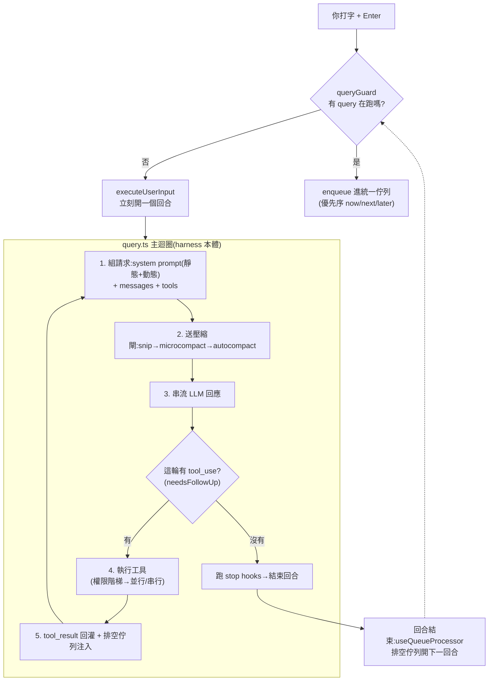

# Claude Code 原始碼徹底拆解:跟著一句 prompt 走完它的一生(附 CCB 二開版的群控/Remote/Web Search)

> 本筆記直接讀**外洩/復刻的 Claude Code 原始碼**整理而成,目標是讓你「看完就懂它的系統設計,而且有能力改它的 code」。素材是兩個 repo,都已 clone 到本機讀完再刪、未進本庫:
> 1. **官方原始碼(經 npm sourcemap 外洩)**:`yasasbanukaofficial/claude-code`(2026-03-31,Chaofan Shou 發現官方 npm 包忘了 `.npmignore` 掉 `.map`,`sourcesContent` 把整包 TS 原碼塞在裡面)。1900+ 檔、1300+ `.ts`。**這是理解架構的主體。**
> 2. **CCB(Claude Code Best / 踩踩背)**:`claude-code-best/claude-code`,社群把官方完整復刻並擴充企業/好玩功能(群控、ACP、Remote Control、Web Search、Poor Mode…)。3300+ 檔。**用來看「同一套引擎還能長出什麼」。**
>
> 為了精讀,動用了 **13 個 fan-out agent**(8 個讀官方各子系統 + 5 個讀 CCB 各功能群),每個 agent 把對應檔案讀完回傳結構化發現,再由我綜合。下面所有 `檔案:行號` 都是真的。

---

## 0. 先給你一張全景圖

Claude Code 的本體其實小得驚人:**一個 async generator 的 `while(true)` 迴圈**(`src/query.ts`,1729 行),外面包一層 driver(`QueryEngine.ts`)。所有你以為很神的東西——工具、skill、MCP、子 agent、壓縮——都只是「**餵給這個迴圈的東西不一樣**」而已。



> **一句話心法**:Claude Code = 「**把對話 + 工具結果反覆回灌給模型,直到模型不再要求工具**」的迴圈;難的全在「迴圈每一步餵什麼、什麼時候壓縮、工具怎麼安全並行、佇列怎麼排」。

---

## 1. 主線:一句 prompt 的一生(12 站)

我們用一個具體任務貫穿全場:你在某個 repo 裡輸入

> 「**幫我把這個專案所有測試從 jest 改成 vitest,跑一次確認綠燈**」

然後按 Enter。接下來發生的事,把 Claude Code 的每個巧思都會踩到一次。

### 站 1|按下 Enter 的瞬間:該立刻跑,還是排隊?

入口是 `REPL.tsx` 的 `onSubmit`。它算一個布林(`REPL.tsx:3343`):

```ts
const submitsNow = !isLoading || speculationAccept || activeRemote.isRemoteMode
```

現在沒有別的 query 在跑 → `submitsNow=true` → 直接走 `executeUserInput`。**但這裡藏了 Claude Code 全系統最關鍵的同步原語:`QueryGuard`(三態鎖)**。`executeUserInput` 在碰到第一個 `await` 之前就同步呼叫 `queryGuard.reserve()`,把狀態從 `idle` 推到 `dispatching`(還沒到 `running`)。為什麼要一個中間態?——因為「從佇列撈出指令」到「query 真的啟動」之間有一段 async 空窗,如果這段時間 guard 還是 `idle`,另一個並行進來的提交會誤判「現在沒事、我可以立刻跑」,於是同時啟動**兩個** query。`dispatching` 這個中間態讓 `isActive` 立刻回 `true`,把競爭者擋去排隊。**這就是「為什麼你狂按 Enter 不會跑出兩條對話」的根因。**

### 站 2|組裝 system prompt:靜態段、動態段,與那條神祕的 boundary

`getSystemPrompt()`(`constants/prompts.ts:444`)回傳一個 **string 陣列**,每個元素是一個 block。它刻意切成兩半,中間插一個 marker `SYSTEM_PROMPT_DYNAMIC_BOUNDARY`:

- **boundary 之前(靜態段)**:身份、`# System`、`# Doing tasks`、`# Executing actions with care`、`# Using your tools`、`# Tone and style`、`# Output efficiency`。這些**每個使用者、每個 session 都一樣**,被標成 `cacheScope: global/org`,可以跨使用者、跨組織共用 Anthropic 伺服器端的 **prompt cache**。
- **boundary 之後(動態段)**:memory 行為說明、output style、`# Environment`、語言、MCP 指令… 這些是 session 專屬的。

`splitSysPromptPrefix()`(`api.ts:321`)就靠這個 marker 把陣列切成「可全域快取的前綴」與「session 專屬的後綴」。**巧思**:動態段大多其實 session 內也不變(memory 行為、output style),所以用 `systemPromptSection()` 算一次快取到 `/clear`;只有「turn 之間真的會變」的(MCP server 可能斷線/重連)才用一個名字嚇人的 `DANGEROUS_uncachedSystemPromptSection()`,而且強制你傳 `_reason`——**用命名當 code-review 防呆**,一眼看出「這段會破壞快取」。

> 有趣的反直覺:身份字串**不是**寫死「You are Claude Code」。正常互動路徑是 `getSimpleIntroSection` 回的「You are an interactive agent that helps users...」;「You are Claude Code, Anthropic's official CLI」只出現在 `CLAUDE_CODE_SIMPLE` 捷徑和子 agent 的 `DEFAULT_AGENT_PROMPT`。這是為了讓自訂 **output style** 能徹底重塑人格。

### 站 3|你的 CLAUDE.md 去哪了?——它根本不在 system prompt 裡

這是最反直覺的一站。你的專案 `CLAUDE.md`、`MEMORY.md` 內容、今天日期,**統統不進 system prompt**,而是被包成一則「`<system-reminder>` 開頭的 user 訊息」塞到 `messages[0]`(`prependUserContext`,`api.ts:449`)。所以在模型眼裡,你的專案規則是**「對話的第一句 user 訊息」**,不是系統人格。

為什麼這樣設計?三個原因,全是工程取捨:
1. **保護快取**:CLAUDE.md 每個專案不同,放進 system prompt 會讓「可全域共用的前綴」碎裂成千千萬萬種。
2. **能被壓縮**:放在對話裡,它就能跟著 `/compact` 一起被摘要。
3. **可被當 attachment 餵**:未來改注入方式不必動 system 前綴。

而 `git status` 走的是**另一條路**:它確實在 system prompt 裡——`getGitStatus()` 組好字串後由 `appendSystemContext()` 接到 system prompt **陣列尾端**(`query.ts:450`)。所以記住這個對照:**git status 在 system prompt 尾巴,CLAUDE.md 在對話開頭。**

### 站 4|進迴圈前的「壓縮三連閘」

`messagesForQuery` 在每輪送 API 前,依序過四關(`query.ts:379→454`):`applyToolResultBudget`(限制工具結果總量)→ `snip` → `microcompact` → `autocompact`。第一輪對話很短,這四關全是 no-op。**我們先跳過,等對話變長(站 11)再回來看它的精妙。**

### 站 5|串流 + 「迴圈何時停」的真正訊號

主迴圈核心是 `for await (const message of deps.callModel({...}))`(`query.ts:659`)。模型一邊吐 token,Claude Code 一邊處理。這裡有個容易誤會的點:**判斷「這一輪要不要繼續」靠的不是 API 的 `stop_reason`**。原始碼直接註明(`query.ts:554`)`stop_reason==='tool_use'` 不可靠;真正的訊號是一個叫 `needsFollowUp` 的布林——**串流中只要出現任何一個 `tool_use` 區塊,就把它設 `true`**。串流結束後:

- `needsFollowUp === true` → 去執行工具,然後組下一輪(站 6→站 1)。
- `needsFollowUp === false` → 模型沒要求工具 → 跑 stop hooks → `return {reason:'completed'}`,回合結束。

我們的 vitest 任務,模型第一輪會先想「我得看看現在測試長怎樣」,於是吐出 `Grep` / `Read` 的 tool_use → `needsFollowUp=true`。

> **另一個藏在串流裡的把戲**:模型還在吐後面的 token 時,前面已經 parse 出來的 tool_use **已經開始執行了**(`StreamingToolExecutor`)。等模型講完,工具可能也跑完了——**把工具延遲藏進串流延遲**。同理,`generateToolUseSummary`(Haiku)、memory prefetch、skill prefetch 都採「回合開頭 fire-and-forget,工具跑完才非阻塞收割」,把它們的延遲藏在下一輪模型串流的 5–30 秒底下,主鏈路零等待。

### 站 6|工具要跑了:三段式權限階梯

模型要 `Read package.json`、`Grep "jest"`、最後 `Bash "npm run test"`。每個工具呼叫都過一條管線(`toolExecution.ts`):`inputSchema.safeParse`(zod 型別)→ `validateInput`(語意驗證)→ **`canUseTool`(權限)** → `call()` → 把結果序列化回 model。

權限階梯(`permissions.ts:hasPermissionsToUseToolInner`)是一條短路梯子,順序大致是:**整工具 deny rule → 整工具 ask rule → 工具自己的 `checkPermissions` → bypass/acceptEdits 放行 → 內容級 ask rule → safetyCheck(`.git`/`.claude`/shell config 等敏感路徑)**。最精妙的是「**哪些東西連 `--dangerously-skip-permissions` 都擋不住**」分得極細:`.git`、`.claude`、shell 設定檔這類 safetyCheck **即使在 bypass 模式也強制問你**;`acceptEdits` 的快速放行只在路徑落在工作目錄內、且排在 safetyCheck 之後。所以「我全部放行」不會誤傷到「改你自己的 git 設定」這種高危操作。

`Bash "npm run test"` 還有一手:`preparePermissionMatcher` 會把 compound command(`a && b && c`)**拆成各 subcommand** 分別比對 permission pattern——`ls && git push` 裡只要 `git push` 命中 `Bash(git *)` 規則就會觸發確認。

### 站 7|並行還是串行?一條「唯讀 ⇒ 可並行」的不變式

模型一次吐了三個唯讀工具(`Read`×2 + `Grep`)。Claude Code 怎麼決定它們能不能同時跑?答案是每個 Tool 都有 `isConcurrencySafe(input)`,而它的預設實作直接是 **`return this.isReadOnly(input)`**——**唯讀就是並行安全**。注意這是**吃 input 的函式**,不是靜態旗標:同一個 Bash 工具,`ls` 唯讀可並行、`rm` 不可並行,粒度細到單次呼叫。

`partitionToolCalls`(`toolOrchestration.ts:91`)把**連續的** safe 工具併成一批並行跑(上限 10,可用 `CLAUDE_CODE_MAX_TOOL_USE_CONCURRENCY` 改),其餘各自串行。並行用一個叫 `generators.all` 的小工具,以 `Promise.race` 做到「**誰先好誰先吐**」。

> **兄弟中止的巧思**:並行批次裡,只有 **Bash 出錯**才會去殺掉同批的其他工具(`siblingAbortController.abort('sibling_error')`)。理由寫在註解裡:bash 常有隱含依賴鏈(`mkdir` 失敗→後面都沒意義),但 `Read`/`WebFetch` 彼此獨立,一個失敗不該牽連其他。

### 站 8|Skill 的「漸進揭露」:每回合只花 1% context 講有哪些 skill

假設這個 repo 有一個 `migrate-tests` 的 SKILL.md。Claude Code **不會**把它整份內文塞進 context,而是分兩段揭露(progressive disclosure):

- **第一段(只露名字)**:每回合產生一個 `skill_listing` 的 `<system-reminder>`,裡面只有「`- 名稱: 一行描述`」,而且**硬性限制在 context 視窗的 1%**(`SKILL_BUDGET_CONTEXT_PERCENT=0.01`),每條描述上限 250 字。預算不夠時分層降級:官方 bundled skill 永不截斷,第三方先截短描述、再只剩名字。還用一個 per-agent 的 `sentSkillNames` Set 做 **delta**——只送沒送過的新 skill,不每回合重貼整份清單。
- **第二段(展開內文)**:模型看到 listing 覺得有用,才呼叫那個唯一的 `Skill` 工具,這時 `getPromptForCommand` 才把整份 markdown 注入。

**安全細節**:skill 內文裡的 `` !`shell` `` 內嵌指令,**只有非 MCP 來源才執行**(`if (loadedFrom !== 'mcp')`)——遠端 MCP 來的 skill markdown 視為不可信,杜絕遠端 server 靠 skill 內文注入 shell。

### 站 9|MCP 工具:預設「藏起來」,要用再搜

如果你接了 MCP server(比如一個有 60 個 API 的 OpenAPI server),Claude Code **預設把所有 MCP 工具 defer(延遲載入)**——`isDeferredTool` 對 `isMcp` 直接回 `true`。它們不進初始 prompt(否則 15–60KB 的工具描述直接灌爆),而是模型先呼叫 `ToolSearchTool`(query 形如 `select:Name` 或關鍵字),拿回一個 `tool_reference`,API 才把完整 schema 展開。MCP 工具命名空間是 `mcp__<server>__<tool>`。

連線本身也很有韌性:`connectToServer` 與各 `fetch*ForClient` 全 memoize/LRU;一旦 `onclose` 就清掉所有相關快取,**下次呼叫自動重連**——把「重連」隱藏成「快取失效」,呼叫端根本不用感知連線狀態。

### 站 10|「這事很大,我派個分身去做」——subagent 與 fork

模型決定先派一個子 agent 去把測試檔逐一改寫。它呼叫 `Agent` 工具。**最關鍵的設計決策**:子 agent **沒有自己的 harness,它用的是和主迴圈完全相同的 `query()`**(`runAgent.ts:748`)。差異全部外化到「傳進去的 `ToolUseContext` + 工具池 + system prompt」。

- **工具池獨立組**:用 `workerPermissionContext` 重新 `assembleToolPool`,刻意不繼承父層限制;且把 `Agent` 工具本身放進子 agent 的禁用清單,**防止無限遞迴 spawn**。
- **背景化的精妙**:同步代理其實先註冊成前景,迴圈裡用 `Promise.race([下一則訊息, backgroundPromise])`。使用者或一個 120 秒計時器一觸發 `backgroundAll()`,**剩下的迴圈被接到另一個 detached closure 繼續跑**,立刻回傳 `async_launched`。執行到一半無痛切背景而不中斷推論——這段是整個子系統最巧的地方。
- **結果怎麼回來**:背景代理完成時,父層那一輪可能早結束了。所以結果**不走 tool_result,而是包成 `<task-notification>` XML 當一則 user 訊息**重新注入主迴圈,coordinator 的 prompt 再教模型「這看起來像 user 訊息但其實是系統通知,別把它當對話對象」。

至於 **fork**(不指定 `subagent_type`):它的存在幾乎只為了 **prompt cache**。`buildForkedMessages` 讓所有 fork child 的 API 請求前綴**位元組完全相同**(整則父 assistant + 固定占位 tool_result),只有最後一段 directive 因 child 而異;system prompt 直接塞父層「已 render 的位元組」而不重算(重算會因 GrowthBook 冷/熱漂移而 cache miss)。所以官方還警告「fork 別設 model」——換模型就無法共用 cache。

### 站 11|context 滿了:壓縮三連閘的真面目

改了 20 個檔、跑了幾次測試,對話到了 ~167K token。現在站 4 跳過的壓縮閘開始發威。Claude Code 有**兩種完全不同**的壓縮,且都發生在「送 API 之前」:

**(A) microcompact —— 不叫 LLM、極輕量。** 它只把舊的 `tool_result` 內容換成佔位字串。聰明在它**分冷熱兩條路**:
- 快取**冷**了(距上一則 assistant 超過設定分鐘數,server cache 反正過期了):直接改本地訊息內容,把舊 tool result 清成 `[Old tool result content cleared]`,趁機縮小重寫量。
- 快取**暖**著:**絕不改本地訊息**(改了會白白破壞暖快取),而是 queue 一個 `cache_edits` block 叫 **API 在伺服器端**刪掉 tool result。

**(B) full compact —— 重量級,fork 一個 summarizer。** `shouldAutoCompact` 用 `tokenCount` 比閾值。閾值怎麼算很講究(`autoCompact.ts`):200K 視窗先扣「為摘要輸出保留的 20K」(實測 p99.99 摘要要 17,387 token,所以選 20K),再扣 13K 安全邊際,**所以實際約在 167K 觸發**。觸發後 fork 一個 `maxTurns=1` 的 agent,用 9 段式 prompt 把對話摘要成一段文字(本筆記開頭那種「Primary Request / Key Concepts / Files / Errors / Pending Tasks / Next Step」就是它),原始訊息全丟、只留摘要,再**重新注入最近 5 個檔案 + 用過的 skill/plan**。

這裡有三個真實事故換來的設計:
- **fork summarizer 重用主對話 cache**:壓縮請求的前綴跟主對話一致才命中快取(實驗:不這樣做 98% cache miss)。為此 fork 路徑刻意不設 `maxOutputTokens`(設了會經 `Math.min` 改動 thinking budget 而 cache 失效)。
- **circuit breaker**:`MAX_CONSECUTIVE_AUTOCOMPACT_FAILURES=3`。背景是真實事故——「1279 個 session 連續壓縮失敗 3272 次、一天浪費 25 萬次 API call」。連 3 次失敗就停手。
- **`<analysis>` 草稿欄**:讓模型先寫 `<analysis>` 把思路鋪開(提升摘要品質),但事後用 regex 整段刪掉只留 `<summary>`——**用 output token 換品質、零 context 成本**。

### 站 12|綠燈:回合結束

模型最後跑 `npm run test` 看到全綠,吐出一段純文字總結、**沒有再要求工具** → `needsFollowUp=false` → 跑 stop hooks → 回合結束 → `QueryGuard` 回 `idle`。如果你在它工作時又打了字,現在輪到佇列登場(下一章)。

---

## 2. 專章:Claude Code 怎麼處理 queue prompt(你的問題)

> 你的觀察:「**有時候它會 queue 住等上一個指令,有時候上一個還在跑它就把下一個 prompt 接進來處理了。**」這不是隨機,是兩條明確的消費路徑 + 一個優先序佇列決定的。以下每一行都從原始碼驗證過。

### 2.1 一個 module 級的「統一指令佇列」

核心是 `utils/messageQueueManager.ts`:一個**完全獨立於 React** 的 module-level 陣列 `commandQueue`,所有東西(你的輸入、任務通知、群控訊息)都進這一個佇列。React 端用 `useSyncExternalStore` 訂閱——**刻意不放進 React state**,因為註解明說要「繞過 Ink 的 React context 傳遞延遲造成的漏通知」(Ink 的 render 排程不可靠,external store 的同步 emit 才能保證 dequeue 後 effect 必定 re-run,不然排隊的 prompt 會永久卡住)。

三個優先級(`PRIORITY_ORDER`):

| 優先級 | 數字 | 誰用 |
|---|---|---|
| `now` | 0 | 需要**中斷當前回合**的緊急訊息(遠端 chat client、steering) |
| `next` | 1 | **你在輸入框打的 prompt** |
| `later` | 2 | 任務通知、系統訊息(`enqueuePendingNotification` 預設值) |

`dequeue` 不是純 FIFO,是**優先序感知**:掃整個陣列挑「priority 數字最小、同級最早進」的那個。`later` 給通知是刻意的——註解寫「user input is never starved by system messages」(你的輸入永遠不會被系統訊息餓死)。

### 2.2 兩條消費路徑 = 你看到的兩種行為

**路徑 A|回合「之間」排空(= queue 住等上一個跑完)**
`hooks/useQueueProcessor.ts` 是個 React effect,開頭三道 early-return:

```ts
useEffect(() => {
  if (isQueryActive) return            // ← 有 query 在跑就什麼都不做
  if (hasActiveLocalJsxUI) return
  if (queueSnapshot.length === 0) return
  processQueueIfReady({ executeInput: executeQueuedInput })
}, [queueSnapshot, isQueryActive, ...])
```

只有整個 query 結束、`QueryGuard` 變回 `idle`、`isQueryActive` 翻成 `false`,這個 effect 才會 re-run 並排空佇列、**開一個全新回合**。`processQueueIfReady` 還會把「同一個 mode 的多則排隊訊息」一次 drain 合併成單一回合(slash 與 bash 例外,逐一處理以保留錯誤隔離/exit code)。

**路徑 B|回合「中途」即時注入(= 上一個還在跑就接手)**
主迴圈每跑完一輪工具、要發下一次 model 請求前,會做這件事(`query.ts:1570`):

```ts
const queuedCommandsSnapshot = getCommandsByMaxPriority(sleepRan ? 'later' : 'next')
  .filter(cmd => isSlashCommand(cmd) ? false : (isMainThread ? cmd.agentId === undefined : ...))
// ↓ 把它們當 attachment 塞進「當前這個回合」
for await (const attachment of getAttachmentMessages(..., queuedCommandsSnapshot, ...)) {
  yield attachment; toolResults.push(attachment)
}
```

也就是說:**只要 Claude 還在多步工具迴圈中(下一個 tool 迭代邊界還沒到回合結束),你插的那句 prompt 會在下一個邊界被撈出來、當成一則 user attachment 注入當前回合**,Claude 直接讀到並回應,不必等下一回合。`getQueuedCommandAttachments` 把它包成 `type:'queued_command'`,只接受 `prompt` 與 `task-notification` 兩種 mode(bash 排除)。

### 2.3 所以「排隊 vs 立刻」到底取決於什麼

| 你輸入的當下,Claude 正在… | 行為 | 為什麼 |
|---|---|---|
| **多步工具迴圈中間**(還會再叫工具) | **幾乎立刻接手**(路徑 B) | 下一個 tool 迭代邊界把它注入當前回合 |
| **最後一段純文字回覆**(不再叫工具了) | **排隊等回合結束**(路徑 A) | 沒有後續迭代邊界可注入,只能等 `useQueueProcessor` |
| 你打的是 **slash command**(`/model` 等) | **排隊等回合結束** | 中途注入明確排除 slash(它得走 `processSlashCommand`,不能當文字送模型) |
| 指令是 **`now` 優先級**(遠端/steering) | **直接 abort 當前操作插隊** | `REPL.tsx:4100` 與 `print.ts:1858` 偵測到 `now` 就 `abortController.abort('interrupt')` |
| 你按 **Esc** | 看情況:有 task 在跑→中斷 query;Claude idle 但佇列有料→把可編輯的排隊指令拉回輸入框 | `useCancelRequest.ts` 的兩段優先序 |

> **補充兩個冷知識**:
> - **互動模式幾乎不做「真正的 mid-turn steering」**——TUI 裡你打的 prompt 一律 `next` 優先級、等回合結束(路徑 A 為主);路徑 B 的「注入當前回合」是發生在「回合本來就還沒結束(還在叫工具)」時順手 drain。真正「打斷正在進行的回合插話」是 headless/print 模式 + `now` 優先級才有(`print.ts` 訂閱佇列、一見 `now` 就 abort)。
> - **agent scoping**:這個佇列是整個 process 共享(主執行緒 + 同進程子 agent)。每個迴圈只撈「給自己的」——主執行緒撈 `agentId===undefined`,子 agent 撈自己的 id。**子 agent 永遠看不到你的 prompt 串流。**

### 2.4 想改它的話(改 code 指南)

- **改「何時排隊 vs 立即」**:`handlePromptSubmit.ts:313` 的 `if (queryGuard.isActive || isExternalLoading)`。陷阱:`isActive` 涵蓋 `dispatching`+`running` 兩態,別只檢查 `running`,否則會在 async 空窗啟動第二個 query。
- **讓互動模式也支援「插話打斷」**:仿 `print.ts:1858` 在 REPL 訂閱 `subscribeToCommandQueue`,偵測 `now` 時 abort,並給使用者一個把訊息標成 `now` 的入口(目前 `enqueue` 預設 `next`)。
- **改優先序/新增一級**:`messageQueueManager.ts:151` 的 `PRIORITY_ORDER` + `textInputTypes.ts` 的 `QueuePriority`。注意 `dequeue` 用嚴格 `<` 保證同級 FIFO,改成 `<=` 會破壞 FIFO。
- **鐵律**:任何 mutation 函式都必須呼叫 `notifySubscribers()` 重建 frozen snapshot,漏掉會讓排隊的 prompt 永久不被處理。

---

## 3. 把這些巧思收斂成「設計模式」

讀完整個 codebase,會發現它反覆用同幾招:

1. **「藏延遲」模式**:任何能提前啟動、晚點收割的東西(工具串流執行、tool-use summary、memory/skill prefetch),都「回合開頭 fire-and-forget,工具跑完才非阻塞收割」,把延遲藏進別的延遲底下。
2. **「為快取而生」模式**:靜態/動態 system prompt boundary、fork 的位元組級相同前綴、microcompact 的冷熱分流、autocompact fork 不設 maxOutputTokens——**整個系統都在伺候 Anthropic 伺服器端的 prompt cache**,因為 cache 命中=省錢省延遲。
3. **「fail-closed 預設」模式**:`buildTool` 的 `TOOL_DEFAULTS` 把沒宣告的工具一律當「會寫入、不可並行、跳過分類器」;skill 權限用 allowlist(`SAFE_SKILL_PROPERTIES`)而非 blocklist——**新功能預設要使用者確認**,而非默默放行。
4. **「真實事故驅動」模式**:circuit breaker(25 萬 call/天事故)、子 agent 的 `setAppStateForTasks` 必須通根(否則背景 bash 變殭屍)、Langfuse 用全域 `startObservation`(否則 TTFT 變負)——大量設計旁邊都掛著一個 BQ 查詢或 issue 編號。
5. **「單一可變 State + transition」模式**:主迴圈把跨輪狀態收斂成一個 `State` 物件,每條續跑路徑都寫 `state = {...}` 再 `continue`,刻意為未來抽成純函式 reducer 鋪路。

---

## 4. CCB 擴充篇:把同一具引擎開出終端機

CCB(踩踩背)證明了上面那具引擎有多通用——它幾乎不動核心迴圈,只在**輸入/輸出邊界**接上新管線,就長出一整排企業/好玩功能。全部用編譯期 `feature('XXX')` flag 門控。

### 4.1 群控:一台變一群(Pipe IPC + LAN 零配置)

**同機**:每個實例開一個 NDJSON 的 Unix domain socket(Windows 用 Named Pipe);靠 `~/.claude/pipes/registry.json` + 檔案鎖(`writeFile` 的 `wx` flag = `O_CREAT|O_EXCL`)選出誰是 main、誰是 sub。**main 角色綁穩定的 `machineId`(Win 讀 registry 的 MachineGuid、Linux 讀 `/etc/machine-id`)而非啟動順序**,所以 main 崩了同機 sub 能無縫 `main-recover` 接管。

**跨機(LAN)**:用 **UDP multicast beacon**——綁多播組 `224.0.71.67`(`CC`=Claude Code)埠 `7101`,每 3 秒廣播自己 `{pipeName, machineId, ip, tcpPort, role}`,15 秒沒收到就判定 peer 丟失。**零配置、不用填 IP**。巧思:明確 `setMulticastInterface(localIp)` 綁真實網卡,避開 Windows 上 WSL/Docker 虛擬網卡劫持多播的坑;`TTL=1` 只在同網段不跨路由器。

**操作**:`/pipes` 開面板勾選目標,之後你打的一般 prompt 就被 `routeToSelectedPipes` 廣播到選中的 slave 執行,本地不跑;slave 的 AI 輸出、工具事件 stream 回 master 顯示;slave 要用需授權工具時,`permission_request` 送回 master 彈出帶 `[角色 主機/IP]` 標籤的確認框。**這整套就是把站 2.1 那個優先序佇列接上 socket**——群控進來的 prompt 也走 `now/next/later`,`now` 級會 abort 當前回合插隊。

### 4.2 ACP:接進 Zed / Cursor

`ccb --acp` 把自己變成一個 stdio + NDJSON 的 **ACP(Agent Client Protocol)agent 子進程**。IDE 寫 NDJSON 請求進 stdin、讀通知出 stdout(`console.*` 全導去 stderr 以免污染協定)。每個 ACP session 對應一個**獨立的 `QueryEngine` 實例**;入站 prompt 經 `promptToQueryInput` 攤平成字串餵 `submitMessage`,出站 `SDKMessage` 經 `forwardSessionUpdates` 轉成 ACP 的 `sessionUpdate`(agent_message_chunk / tool_call / plan…)推回 IDE。權限統一走 `hasPermissionsToUseTool`,只有 `ask` 才 `conn.requestPermission` 讓 IDE 彈窗。

### 4.3 Remote Control:手機看 CC

三種「遠端」拓撲共用同一套 `stream-json` 子進程協定:
- **Bridge(手機/瀏覽器看)= pull 模型**:本機 CC 用 **HTTP 長輪詢**向一台 server(雲端或自托管 Docker RCS)註冊環境、領取會話工作,收到就 spawn 一個 `claude --print --output-format stream-json` 子進程跑,stdout NDJSON 串回 server,手機開 Web UI 就能看與控。**控制面走 HTTP REST(好穿反向代理),資料面才走 WebSocket/SSE。** 自托管只要設 `CLAUDE_BRIDGE_BASE_URL` + `CLAUDE_BRIDGE_OAUTH_TOKEN`,`isSelfHostedBridge()` 就讓 `isBridgeEnabled` 直接回 true、跳過所有訂閱/GrowthBook 檢查。
- **Daemon**:把 bridge 變常駐服務(supervisor 管多個 worker、崩潰指數退避重啟、PID 寫檔讓別的 CLI `status/stop`)。
- **SSH Remote**:`ccb ssh host`——在沒裝 CC、沒 API key 的遠端主機上跑 CC,**憑據完全不出本機**:遠端的 `ANTHROPIC_BASE_URL` 指向經 `ssh -R` 反向隧道回本機的 `SSHAuthProxy`,由本機注入真實憑據。

### 4.4 Web Search / Poor Mode / Channels / Langfuse

- **Web Search**:adapter 工廠,在官方 server tool 與自抓的 **Bing / Brave / Exa** 之間切換(優先序:`WEB_SEARCH_ADAPTER` 環境變數 > 第三方 provider→bing > 第一方→api > 其餘→exa)。
- **Poor Mode(穷鬼模式)**:`/poor` 切換、寫進 `settings.json`(用 `active || undefined` 讓關閉時直接刪 key 保持乾淨)。它**不是一個總開關,而是散在各處的 early-return 守衛**——`isPoorModeActive()` 被「記憶提取、鍵入建議、子 agent 摘要、attachment 側查詢、驗證 agent、auto-mode 模型降級」各自查一次,把這些「不直接服務當前回答、卻額外燒 token 的背景 LLM 副查詢」全關掉。因為每個背景任務觸發點不同,所以刻意分散成多個 guard。
- **Channels**:讓一個 MCP server 把外部 IM(Telegram/Discord/飛書/微信)訊息**推進正在跑的會話**——server 發 `notifications/claude/channel`,handler `wrapChannelMessage` 包成 `<channel>` 標籤(meta key 過 `SAFE_META_KEY` 正則防 XML 注入)→ `enqueue` 進那個統一佇列(`priority:'next'`)→ `SleepTool` 1 秒內醒來處理。權限核准改成**結構化事件**(server 解析 `yes tbxkq` 後發 `{request_id, behavior}`),`shortRequestId` 把 toolUseID 雜湊成「去掉 l 的 5 個字母 + 過髒字 blocklist」,手機輸入不用切鍵盤又不會拼出社死的字。
- **Langfuse**:純觀測旁路,用 OpenTelemetry 把每輪 agent loop 變成 trace(根 trace=一個 turn,底下掛 LLM generation + tool observation)。`isLangfuseEnabled()` 只看兩把 key 在不在,沒設就零開銷 no-op。

### 4.5 token-budget:`+500k` 自動跑到底

CCB 給 prompt 加了個語法:結尾寫 `+500k` 或 `spend 2M tokens`,agent 就**自動持續工作到 output token 達預算的 90%**,不用一直按 Enter 催「繼續」。`checkTokenBudget`(每輪結束跑)在 `turnTokens < budget*0.9` 且非收益遞減(連 3 輪 delta<500 token)時注入一個 nudge 續跑。停在 90% 而非 100% 是避免最後一輪衝過頭。(官方原始碼裡也有 `query/tokenBudget.ts` 的對應 `TOKEN_BUDGET` feature。)

---

## 5. 「我要改 code」總速查表

| 你想改的行為 | 動這個檔/函式 | 最大的陷阱 |
|---|---|---|
| 主迴圈終止/續跑條件 | `query.ts` 的 `if(!needsFollowUp)` 區(L1062)與底部 `state=next`(L1715) | 防死循環的旗標(`maxOutputTokensRecoveryCount` 等)務必正確帶進新 State |
| 工具並行上限 | `toolOrchestration.ts:getMaxToolUseConcurrency`(預設 10)或 env | 只影響非串流路徑;串流路徑要改 `StreamingToolExecutor` |
| 某工具能否並行 | 該工具的 `isConcurrencySafe(input)`(`Tool.ts:402`) | 在 partition 與 streaming executor 兩處被呼叫,`throw` 即視為不安全 |
| 新增內建工具 | 在 `src/tools/MyTool/` 用 `buildTool({...})`,再到 `tools.ts:getAllBaseTools()` 加入 | 有安全意義一定要覆寫 `toAutoClassifierInput`;唯讀要顯式 `isReadOnly()=true` |
| 某工具要不要問使用者 | 該工具的 `checkPermissions()` 回 `allow/ask/deny/passthrough` | 整工具/路徑層的 deny/ask rule 會先短路,你的 `checkPermissions` 可能根本不被呼叫 |
| 強制 prompt 的敏感路徑(bypass 也擋) | `filesystem.ts:checkPathSafetyForAutoEdit`,回 `{safe:false, classifierApprovable:false}` | 設 `classifierApprovable:true` 則 auto 模式分類器仍可放行 |
| system prompt 文字 | `constants/prompts.ts` 對應 `get*Section()` | boundary **之前**的任何改動會 bust 全體 global cache |
| 自動壓縮觸發時機 | `autoCompact.ts:AUTOCOMPACT_BUFFER_TOKENS`(13K)或 env `CLAUDE_AUTOCOMPACT_PCT_OVERRIDE` | 閾值同時被多處用,改一個常數會牽動 UI 的 percentLeft |
| 壓縮後保留幾個檔案 | `compact.ts:POST_COMPACT_MAX_FILES_TO_RESTORE`(5)等 | 調太大會讓壓縮後立刻又觸發壓縮 |
| 摘要 9 段內容 | `compact/prompt.ts:BASE_COMPACT_PROMPT` | 改 `<summary>` 包裝要同步 `formatCompactSummary` 的 regex |
| skill listing 預算/截斷 | `SkillTool/prompt.ts:SKILL_BUDGET_CONTEXT_PERCENT`(0.01) | bundled skill 走「永不截斷」分支 |
| 子 agent 可用工具 | `constants/tools.ts` 的四個 Set | 背景代理要加進 `ASYNC_AGENT_ALLOWED_TOOLS` 才生效 |
| queue「排隊 vs 立即」 | `handlePromptSubmit.ts:313` | `isActive` 涵蓋 dispatching+running,別只檢查 running |
| (CCB)群控傳輸/協定 | `utils/pipeTransport.ts` / `lanBeacon.ts` | LAN 路徑用 `feature('LAN_PIPES')` 包,跨模組相依要 lazy require 避免 Bun 循環依賴崩潰 |
| (CCB)Poor Mode 多關一個背景功能 | 在該功能觸發點加 `isPoorModeActive()` early-return | 不必動 `poorMode.ts` 本體 |

---

## 6. 應用案例 / 你可以拿這份筆記做什麼

- **debug「為什麼我的 prompt 卡住了」**:對照第 2 章——多半是你在 Claude 的「最後純文字回覆」階段或打了 slash command,落到路徑 A 等回合結束。想要插話打斷,得用 `now` 優先級(目前只 headless/遠端有,互動模式要自己接)。
- **自己接一套「手機看 Claude Code」**:CCB 的 Remote Control 自托管(`docker build` RCS + 設兩個 env)是現成藍圖;原理就是「本機 CC 長輪詢領工作 + spawn `--print stream-json` 子進程串回 server」。
- **寫一個會自動觸發、不爆 context 的 skill**:照站 8 的 progressive disclosure——描述壓在 250 字內、把重內容放進 SKILL.md 本體讓模型用 `Skill` 工具才展開;要「跟著你碰的檔案才現身」就加 `paths` frontmatter(conditional skill)。
- **改 Claude Code 行為**:第 5 章速查表直接給你「改哪個檔、踩哪個雷」。最該記住的元規則:**任何 boundary 之前的 system prompt 改動、任何破壞 fork/壓縮前綴位元組一致性的改動,都會 bust prompt cache 而暴漲成本。**
- **理解「為什麼 Claude Code 這麼省 token 又這麼快」**:不是模型特別,是這具 harness 把「藏延遲 + 伺服快取命中 + 漸進揭露 + 兩段式壓縮」這四件事做到了極致。對照本庫 [[loop-engineering]]、[[ai-harness-explained]]、[[harness-engineering-evolution]]、[[self-harness]]、[[markdown-agent-memory]],這份是它們的「官方實作對照組」。

---

## 來源

- **官方原始碼(npm sourcemap 外洩)**:`yasasbanukaofficial/claude-code`,<https://github.com/yasasbanukaofficial/claude-code>(2026-03-31,Chaofan Shou @Fried_rice 發現;本筆記已 clone 全部 1900+ 檔讀完再刪,未進本庫)。
- **CCB(Claude Code Best / 踩踩背)**:`claude-code-best/claude-code`,<https://github.com/claude-code-best/claude-code>;功能文檔 <https://ccb.agent-aura.top/>。
- 本筆記由 **13 個 fan-out subagent** 分頭精讀各子系統(harness/queue/tools/skills/MCP/multi-agent/system-prompt/compaction + CCB 的群控/ACP/Remote/WebSearch/Poor)的結構化發現綜合而成;關鍵檔案行號均引自上述原始碼。**僅供學習研究;Claude Code 一切權利屬 Anthropic。**
