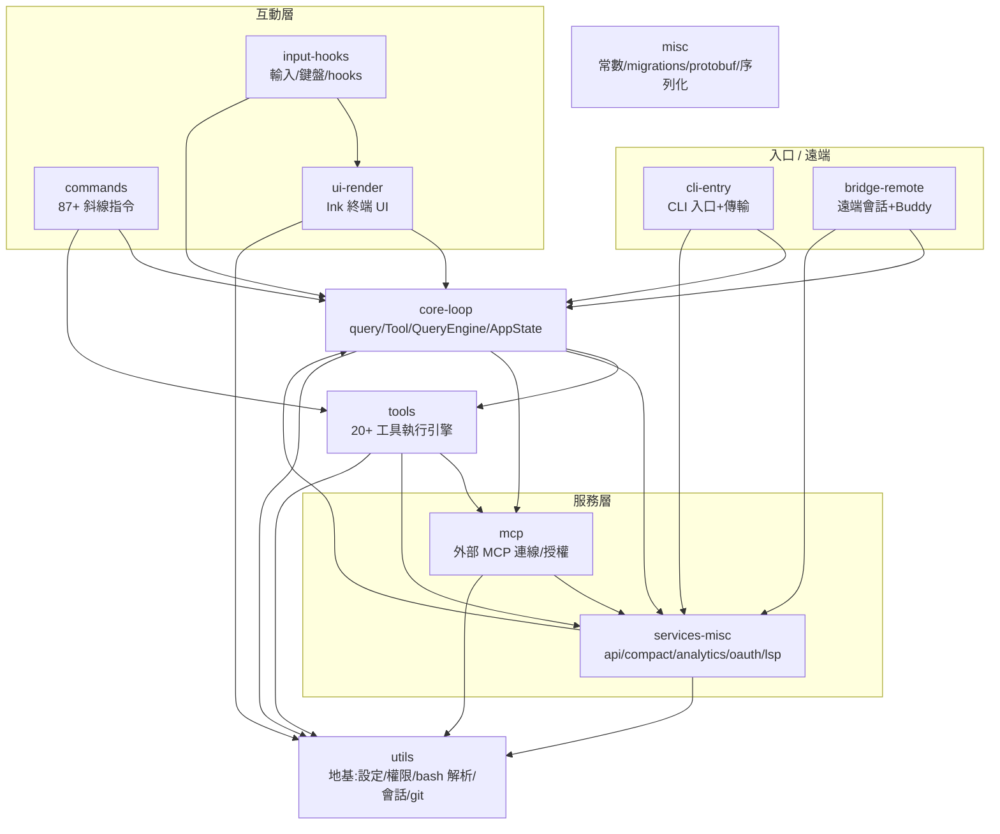

# Claude Code 原始碼全覽地圖:11 個子系統與它們怎麼咬合

> 這份是「**整本書的索引與鳥瞰**」,跟敘事版 [[claude-code-architecture-deep-dive]](跟著一句 prompt 走一遍)互補:敘事版講「熱路徑上一句話怎麼跑」,**這份把整個 `src` 一檔不漏地分區、整理成子系統地圖**,讓你知道「程式碼全貌長怎樣、哪塊負責什麼、彼此怎麼依賴」。
>
> **怎麼做出來的**:對外洩的官方原碼(`yasasbanukaofficial/claude-code`)用 **72 個 Haiku subagent 兩層 fan-out**——第一層 **61 個 reader**,把整個 `src`(**1902 檔、約 51.3 萬行**)均衡切成 61 桶、每桶精讀每一個檔,整理出「每檔職責 + 對外依賴」;第二層 **11 個 aggregator**,按子系統群集把第一層往上收斂成「這個子系統做什麼、內部結構、依賴誰、被誰用、對外介面」。共讀完 **1730/1902 檔有逐檔職責**(其餘在桶級摘要涵蓋)。**僅供學習研究;Claude Code 一切權利屬 Anthropic。**

---

## 全景:11 個子系統與依賴方向

把整個 codebase 收斂成 11 個子系統,依賴大致是「**上層用下層**」的分層:`utils` 是地基,`services` 與 `mcp` 是服務層,`core-loop` 是引擎,`tools` 是執行層,UI/input/commands 是互動層,cli/bridge 是入口與遠端層。

> **三條要記住的線**:① **所有人都踩在 `utils` 上**(設定、權限、bash 解析、會話存儲、git);② **`core-loop` 是樞紐**——它呼叫 `services`(API/壓縮)、`tools`(執行)、`mcp`(外部工具),而 UI/commands/入口都圍著它轉;③ **`services-misc` 與 `core-loop` 互相餵**:services 的 `api/claude` 餵串流給 query 迴圈,query 迴圈又呼叫 services 的壓縮/分析。

---

## 1. core-loop — 引擎與運行時樞紐

**做什麼**:Claude Code 的核心執行迴圈與運行時基礎設施。整合 CLI 入口、多輪對話代理迴圈、可擴展工具系統、會話管理、狀態持久化、任務協調。職責:① CLI 啟動/設定/初始化;② 多輪 AI 對話編排(串流、工具執行、自動壓縮、錯誤恢復);③ 無狀態 SDK 與有狀態互動兩種會話生命週期抽象;④ 權限檢查、訊息佇列、任務隊列;⑤ 內嵌 Agent/Shell/遠端/狀態存儲的多層任務協調。

**內部結構**:`main.tsx`(CLI 入口)→ `query.ts`(多輪迴圈核心:串流 API → 工具執行 → 自動壓縮 → 迴圈)→ `QueryEngine.ts`(SDK 抽象)→ `Tool.ts`(工具合約+權限)→ `commands.ts`(內建命令)。運行時協調層:`state/AppState.ts`(Redux 風格全域狀態)、`Task.ts`/`tasks.ts`(任務框架)、`AgentTool`/`SkillTool`(銜接 agents/skills)、`messageQueueManager`、`autoDream`。

**關鍵檔**:`query.ts`(迴圈狀態機)、`main.tsx`、`QueryEngine.ts`、`Tool.ts`、`state/AppState.ts`、`services/tools/StreamingToolExecutor.ts`、`tools/AgentTool/runAgent.ts`、`services/compact/autoCompact.ts`、`utils/task/framework.ts`。
**依賴**:`services/api`、`services/compact`、`services/mcp`、`services/tools`、`utils/{config,permissions,plugins,auth,model}`。**被誰用**:所有 `tools/`、`services/analytics`、`coordinator`、`keybindings`。
**對外介面**:`QueryEngine` 類、`Tool` 基類、`AppState`、`Task` 框架、`StreamingToolExecutor`、內建 commands。

> 這一塊正是敘事版 [[claude-code-architecture-deep-dive]] 整篇在拆的東西。

## 2. tools — 20+ 工具的執行引擎

**做什麼**:核心工具執行層,含 20+ 工具(Bash、PowerShell、File Read/Write/Edit、Glob/Grep、WebFetch/WebSearch、Agent、Skill、Task 管理、SendMessage、Team、ToolSearch…)。負責驗證與執行指令、檔案操作、權限與沙箱隔離、多代理工作流協調、整合 MCP/LSP。
**內部結構**(6 桶分層):代理核心(Agent/AskUserQuestion + 內建 agent 定義 general-purpose/explore/plan/verify)→ BashTool(shell AST 解析 / bashClassifier 權限 / sandbox-adapter)→ 檔案工具群(Read/Write/Edit/Glob)→ 搜尋與服務整合(Grep/LSP/MCPTool/PowerShell)→ 高階調度(REPL/RemoteTrigger/Schedule/SendMessage/Skill/Sleep)→ 任務管理(Task CRUD/Output/Stop)+ Team + Web。
**關鍵檔**:`Tool.ts`(基類)、`BashTool/BashTool.ts`、`FileReadTool`/`FileEditTool`、`AgentTool/runAgent.ts`、`TaskCreateTool` 等、`utils/permissions/*`、`utils/bash/*`、`PowerShellTool`、`utils/sandbox/sandbox-adapter`。
**依賴**:`services/{mcp,lsp,analytics,oauth}`、`tasks`、`utils/{bash,permissions,sandbox,powershell}`。**被誰用**:AgentTool(spawn 子代理)、REPL 命令分派、hooks、skills、主迴圈。
**對外介面**:`Tool.ts` 基類 + 各工具獨立 export;`constants/tools.ts` 列舉所有可用工具。

## 3. mcp — 外部 MCP 連線、授權、工具暴露

**做什麼**:管理 MCP server 連線(stdio/SSE/HTTP/WebSocket/SDK 多傳輸)、OAuth 2.0 與 XAA 認證、權限政策,把外部 MCP 工具/命令/資源暴露成 Claude Code 一等公民。
**內部結構**(6 層):① 連線與傳輸(`client.ts` 3348 行,中央協調器)② 設定與發現(`config.ts` 52KB,讀 `.mcp.json`、Zod 驗證、env 展開)③ 認證授權(`auth.ts` 91KB:OAuth PKCE+JWT;`xaa.ts` RFC 8693/7523 XAA)④ 權限與頻道(channel relay 到 Telegram/iMessage/Discord)⑤ 工具與命令(`useManageMCPConnections.ts` 46KB:React 生命週期、狀態同步、自動重連、auth 工具注入)⑥ 工具函式(過濾、config hash、scope/transport 解析、env 展開)。
**關鍵檔**:`client.ts`、`config.ts`、`auth.ts`、`useManageMCPConnections.ts`、`xaa.ts`、`types.ts`、`channelPermissions.ts`、`MCPConnectionManager.tsx`、`tools/MCPTool/MCPTool.ts`。
**依賴**:`services/analytics`(growthbook flags)、`utils/{auth,config,permissions,secureStorage}`、`@modelcontextprotocol/sdk`。**被誰用**:`commands/mcp`、`tools/MCPTool`/`McpAuthTool`、`components/mcp/*`、`AppState.mcp.clients`。
**對外介面**:`connectToServer`、`ensureConnectedClient`、`fetchTools/Commands/ResourcesForClient`、`reconnectMcpServerImpl`、`MCPConnectionManager`。

> 對應敘事版步驟 9(MCP 預設 defer、要用才搜)。

## 4. commands — 87+ 個斜線指令引擎

**做什麼**:CLI 命令引擎,註冊/路由/執行 87+ 命令:高層規劃(`ultraplan`)、工作流(`commit`/`review`/`push-pr`)、配置(`config`/`model`/`keybindings`)、開發工具(`agents`/`branch`/`bridge`)、插件(`plugin`/`mcp`)。
**內部結構**:延遲加載架構——每命令 `index.ts`(metadata)+ `call.tsx`/`call.ts`(實現,多為 React/Ink UI)。三桶:命令定義+路由核心 / 認證+配置 UI(login/logout/model/output-style)/ 插件系統+隱私整合(plugin tree、privacy-settings、rate-limit)。
**關鍵檔**:`commands/index.ts`(元數據索引)、`ultraplan/call.tsx`、`commit-push-pr/call.tsx`、`plugin/`、`agents/call.tsx`、`review/call.tsx`、`config/call.tsx`、`bridge/call.tsx`、`login/call.tsx`、`mcp/call.tsx`。
**依賴**:`commands.js`(主機制)、`Tool`/`tools`、`AppState`、`components/design-system`、`services/{analytics,oauth,mcp,plugins,api/grove}`、`utils/{ultraplan,git,auth,model,permissions}`、`tasks/RemoteAgentTask`。**被誰用**:CLI 路由層、UI 層渲染各 `call.tsx`、RemoteAgentTask、快捷鍵。
**對外介面**:`commandRegistry`/`getCommand`/`listCommands`、`invoke(name,args,ctx)`;支援 `~/.claude/commands/` 自訂命令。

> 對應敘事版步驟 1f(slash 不進 query、走獨立流水線)。

## 5. ui-render — Ink 終端 UI 渲染與交互層

**做什麼**:把 React 元件樹轉成 ANSI 終端輸出、處理鍵盤/滑鼠事件。含訊息虛擬滾動/篩選、使用者輸入(文字/選項/語音)、對話框/模態、程式碼高亮/diff、權限/任務 UI、視覺回饋動畫。基於 Ink + Yoga Flexbox,增量渲染、ANSI 高效解析。
**內部結構**(11 層):Ink 核心引擎(reconciler、render-node-to-output、Box/Text/Button/ScrollBox、ANSI 解析)→ 事件與鍵盤系統 → 核心元件(Message/PromptInput/佈局)→ 功能元件(建議/下拉/onboarding/設定/語法高亮/Logo/agent 嚮導/design-system/MCP 配置)→ 訊息與權限層(54 個訊息元件、權限對話)。各層靠共用 hooks(`useTerminalSize`/`useSettings`/`useKeybinding`)與 `AppState` 協調。
**關鍵檔**:`ink/reconciler`、`ink/render-node-to-output`、`components/PromptInput`、`components/Message`、`components/CustomSelect/select`、`hooks/useKeybinding`、`hooks/useTerminalSize`、`ink/termio`、`design-system/Dialog`。
**依賴**:`AppState`、`utils/{theme,settings,format,markdown,git}`、`services/{api/claude,analytics,mcp,oauth}`、`tools/*`(結果渲染)、`permissions/*`、`tasks/*`、`commands`。**被誰用**:主 CLI 迴圈、工具結果渲染、AppState 變化監聽、串流回應顯示、權限對話、任務進度。
**對外介面**:`reconciler.render()`、`termio`、`PromptInput`(onSubmit)、`Message`(多型分派)、`CustomSelect`、`Dialog`/`Pane`、`useKeybinding`/`useTerminalSize`。

## 6. input-hooks — 互動輸入層(92+ React hooks)

**做什麼**:REPL 的互動輸入層,92+ React custom hooks 與事件處理:文字/語音輸入捕捉、命令 typeahead、檔案自動補全、鍵盤綁定、SSH/WebSocket 遠端連線、task/agent 生命週期、檔案監看、cron 排程、UI 狀態同步(本地與 swarm 多代理)。橋接終端 UI 與後端服務。
**內部結構**(3 桶):核心 hooks(typeahead/voice/inbox poll/file autocomplete/repl bridge/virtual scroll)→ 組合 hooks 與通知(keybinding/SSH/WebSocket 遠端/task-agent 狀態/file watch/cron/通知)→ 權限 context + 多 handler 編排(interactive/swarm/coordinator)+ Ink 渲染子系統。
**關鍵檔**:`hooks/useTypeahead`、`useVoiceInput`、`useReplBridge`、`useKeybinding`、`useRemoteSession`、`handlers/usePermissionHandler`、`ink/reconciler`、`ink/render-to-screen`、`ink/focus`、`ink/events/keyboard-event`。
**依賴**:`context/{notifications,voice,mailbox}`、`services/{analytics,voiceStreamSTT,notifier,mcp,lsp,oauth}`、`commands`、`keybindings`、`vim/*`、`AppState`、`tools/AgentTool`、`utils/{suggestions,permissions,swarm,ide}`、`remote/*`、`bridge/*`、`tasks/*`。**被誰用**:`components/PromptInput`、`components/permissions`、`ink/components/App`、AppState 訂閱者、CLI 主事件迴圈、多代理 REPL coordinator。
**對外介面**:各 hook export + Ink 渲染 export;中心整合點 `ink/components/App`(渲染到終端的根元件)。

## 7. cli-entry — CLI 入口、子命令 handler、傳輸層

**做什麼**:CLI 基礎設施——命令 handler(auth/plugins/MCP/agents/auto-mode)、傳輸層抽象(WebSocket/SSE/Hybrid)、事件上傳(序列批次、worker state 合併)、session insights。把 CLI 子命令橋接到底層服務,管理雙向串流(session 追蹤、認證、重試、背壓)。
**內部結構**:`cli/remoteIO`(SDK 模式雙向串流)、`cli/handlers/*`(各子命令 lazy-loaded handler)、`cli/transports/*`(`WebSocketTransport` 自動重連、`SSETransport`、`HybridTransport` WS 讀+HTTP POST 寫、`SerialBatchEventUploader`、`WorkerStateUploader`、`transportUtils` 傳輸工廠)。
**關鍵檔**:`cli/remoteIO.ts`、`cli/handlers/{auth,plugins,mcp,agents,autoMode}.ts`、`cli/transports/{HybridTransport,WebSocketTransport,SSETransport,ccrClient}.ts`、`commands/insights.ts`。
**依賴**:`services/{analytics,mcp,oauth,api,plugins}`、`utils/{auth,config,sessionStorage,permissions}`、`tools/AgentTool`、`ink`、`AppState`、`entrypoints/{mcp,sdk}`。**被誰用**:`main.tsx`/`entrypoints`(啟動分派)、SDK/headless 呼叫者。
**對外介面**:`transportUtils`(傳輸工廠)、各 handler、`remoteIO`(SDK 串流)。

## 8. bridge-remote — 遠端會話層 + Buddy 終端伴侶

**做什麼**:把 CLI 連到 claude.ai 推理後端、編排雙向通訊(WebSocket/SSE)、路由入站控制訊息、spawn 子進程當會話 worker、認證授權、故障恢復。整合終端 UI 伴侶(Buddy)與結構化 I/O。支援兩種實現:環境輪詢(v1)與環境外直連(v2 OAuth→JWT→CCRClient)。這就是敘事版步驟 4 提到的 Remote Control(手機看 CC)的本體。
**內部結構**(3 層):Bridge 遠端會話層(`workSecret`/`pollConfig`/`inboundMessages`/`flushGate`/`bridgeConfig`/`replBridgeHandle`)→ Buddy 終端伴侶(sprites/CompanionSprite/useBuddyNotification)→ CLI 基礎設施(print/structuredIO/update 增量重繪)。
**關鍵檔**:`cli/transports/HybridTransport.ts`、`bridge/bridgeConfig.ts`、`bridge/inboundMessages.ts`、`bridge/workSecret.ts`、`buddy/CompanionSprite.ts`、`cli/output/structuredIO.ts`、`bootstrap/state.ts`、`cli/transports/ccrClient.ts`、`bridge/replBridgeHandle.ts`。
**依賴**:`services/{analytics,oauth,mcp,settingsSync,remoteManagedSettings}`、`utils/{auth,config,sessionStorage,secureStorage,concurrentSessions,autoUpdater}`、`constants/{oauth,product}`、`entrypoints/sdk`。**被誰用**:`commands.js`、`tools.js`、`Tool.ts`、`QueryEngine.ts`、`AppState`、`context/notifications`。
**對外介面**:`HybridTransport`、`BridgeConfig`、`WorkerProcess`/`SessionHandle`、`InboundMessageRouter`、`CompanionSprite`/`useBuddyNotification`、`StructuredIO`。

## 9. services-misc — 服務基礎設施(api/compact/analytics/oauth/lsp)

**做什麼**:核心服務層,統合 UI/會話生命週期、API 通訊、分析遙測、會話管理、上下文壓縮、autoDream(記憶整合)、LSP/MCP 協議。涵蓋「使用者輸入→API 呼叫」完整請求流,以及記憶整合、配額追蹤、診斷恢復等自動化。
**內部結構**(6 桶):UI/會話(REPL 螢幕、Doctor 診斷、會話恢復、直連遠端、語音 I/O、配額)→ 智慧自動化(代理摘要、Magic Docs、提示建議、SessionMemory 抽取、分析核心)→ 分析+API 設計(Datadog/第一方事件、Claude SDK 包裝、重試、prompt cache 偵測、Files API)→ 後台編排(API 初始化/OAuth/推薦、autoDream、Compact、extractMemories、LSP)→ 協議層(LSP 診斷、MCP 客戶端/認證、OAuth)→ 遠端同步與技能(設定同步、團隊記憶、提示排程、技能登錄)。
**關鍵檔**:`services/analytics/index.ts`(遙測核心)、`services/api/claude/index.ts`(SDK 包裝:重試/錯誤/cache 偵測)、`services/mcp/client`、`services/compact/autoCompact.ts`、`services/api/client`(HTTP/代理/OAuth)、`services/lsp/LSPServerManager`、`services/SessionMemory`、`services/oauth/client`、`services/compact/extractMemories.ts`。
**依賴**:`utils/{config,auth,log,model,billing}`、`bootstrap/state`、`constants`、`types`、`components`、`hooks`、外部(anthropic SDK/aws-sdk/OpenTelemetry/GrowthBook)。**被誰用**:`screens/REPL`、`tools/*`、`commands/*`、`hooks/*`、`tasks/*`、`entrypoints/agentSdk`、bootstrap、整個應用根層(認證/配額/錯誤恢復)。
**對外介面**:`analytics.logEvent`、`api/claude.createMessage`、`mcp/client.listResources/readResource`、`SessionMemory.extract/save/load`、`compact.autoCompact`、`oauth.getToken`、`lsp.getDiagnostics`。核心是 `api/claude` 與 `analytics`。

> 對應敘事版步驟 11(壓縮 compact)與「總覽 B」的 token 估算/門檻——都住在這。

## 10. utils — 地基(60+ 模組,約 18 萬行)

**做什麼**:全應用共享的基礎設施層,60+ 模組:會話持久化(JSONL)、Hook 執行引擎、訊息附件、OAuth/AWS 認證、全域配置、會話存儲、檔案抽象、Git 整合、Bash 解析與安全驗證、權限管理、Shell 環境隔離、diagnostics、跨平台 UI 狀態。
**內部結構**(9 桶,bucket 40–50):會話存儲(sessionStorage,JSONL transcript)/ Hook 執行引擎(AsyncHookRegistry:匹配/權限/超時/plugin 整合)/ 附件+認證+配置(attachments/auth/oauth/config/claudemd)/ 文本測量+worktree+IDE+記憶+遠端 / 隊友通訊+檔案歷史+結果存儲 / 任務協調+prompt 快取+工具發現+檔案抽象+診斷 / 檔案發現+會話復原+shell+cron / Tmux 隔離+HTTP/Proxy+Markdown+JSON / 上下文分析+除錯+MCP 傳輸+信號原語+平台檢測。
**關鍵檔**:`sessionStorage.ts`、`hooks/AsyncHookRegistry.ts`、`attachments.ts`、`config.ts`、`claudemd.ts`、`bash/bashParser.ts`、`bash/ast.ts`(走 AST、fail-closed 拒絕擴展/替換)、`permissions/permissions.ts`、`log.ts`、`errors.ts`。
**依賴**:`bootstrap/state`、`services/{analytics,api,oauth,mcp}`、`types`、`constants`、少量回呼 `tools`。**被誰用**:**幾乎所有東西**——bootstrap、services、tools(全量依賴)、hooks、plugins、commands、entrypoints、components。
**對外介面**:按責任域分組的大量 export(會話/Hook/附件/認證/記憶/Bash 安全/權限/檔案/Git/日誌/設定/跨平台)。**這是整個系統的地基,改它牽一髮動全身。**

> 敘事版裡的 `permissions`(步驟 5)、`bash` 解析(步驟 6)、`attachments`/`claudemd`(步驟 2)、`messageQueueManager`(步驟 1)、`analyzeContext`(總覽 B)其實都住在 utils。

## 11. misc — 常數、初始化、序列化、遷移等雜項基礎設施

**做什麼**:雜項運行時基礎設施:命令路由、初始化 bootstrap、assistant bridge、狀態管理、上下文追蹤、任務排程、成本分析、會話歷史;UI 系統元件、React context provider、多代理協調;以及配置遷移、檔案索引、output style、protobuf 序列化、訊息正規化、upstream proxy。
**內部結構**(4 層):核心業務(assistant/bootstrap/bridge:命令/初始化/成本/上下文/任務/會話歷史/REPL)→ 基礎設施(UI wizard、23 個常數模組、React context、多代理協調、SDK 入口)→ 工具(配置遷移、模型別名升級、檔案索引、output style、token budget、遠端會話)→ 序列化(protobuf 事件 schema、WebSocket relay、訊息處理庫)。
**關鍵檔**:`assistant/`(命令路由)、`bootstrap/state`、`services/analytics`、`constants/`(23 模組)、`sdk/runtimeTypes`、`contexts/`、`utils/messages`、`upstreamproxy/`、`utils/zodToJsonSchema`、`migrations/`。
**依賴**:`commands`、`services/{mcp,lsp,oauth,policyLimits,SessionMemory}`、`utils/*`、`state/AppState`、`components/*`、`skills/`、`plugins/`。**被誰用**:`entrypoints/cli`、bootstrap、`services/api`、所有 UI 渲染層、多代理 coordinator、插件系統、遠端會話。
**對外介面**:`entrypoints/sdk/runtimeTypes`(Agent SDK 型別)、`constants/*`、`utils/messages`、`assistant/commands`、React Contexts、`services/analytics`、`bootstrap/`。

---

## 怎麼用這份地圖

- **想找「某功能在哪」**:先用上面的關係圖定位子系統 → 看該節的「關鍵檔」→ 去原碼那個路徑。例如「權限怎麼判」→ utils 的 `permissions/permissions.ts` + tools 的 `bashClassifier`;「外部工具怎麼接」→ mcp 的 `client.ts`。
- **想改某子系統**:看該節的「依賴 / 被誰用」就知道改它會牽動誰。最該小心的是 **utils**(地基,人人都用)與 **core-loop**(樞紐)。
- **配合敘事版讀**:這份是「靜態地圖」,[[claude-code-architecture-deep-dive]] 是「動態走一遍」。地圖告訴你「有哪些區、誰連誰」;敘事版告訴你「一句 prompt 進來時這些區怎麼依序動起來」。
- **全檔逐一職責**:這次 61 個 reader 已對 **1730 個檔**整理出逐檔職責(在 workflow 輸出裡),需要某子系統的逐檔清單可再撈;這份地圖收的是子系統級的鳥瞰。

---

## 來源

- 官方原始碼(npm sourcemap 外洩):`yasasbanukaofficial/claude-code`,<https://github.com/yasasbanukaofficial/claude-code>。本地圖由 **72 個 Haiku subagent(61 reader + 11 aggregator)兩層 fan-out** 全覆蓋精讀 `src`(1902 檔、~51.3 萬行)後綜合,逐檔職責覆蓋 1730/1902 檔。
- 互補:敘事版 [[claude-code-architecture-deep-dive]]。**僅供學習研究;Claude Code 一切權利屬 Anthropic。**
