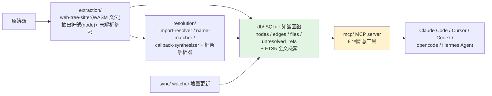

# CodeGraph 原始碼深讀:架構、語意工具,與它的 shimmer TUI 怎麼做

> CodeGraph(`colbymchenry/codegraph`,MIT)是給 **Claude Code 等 AI agent** 用的「語意程式碼智能」工具:
> 把整個 codebase 抽成 **SQLite 知識圖譜**,讓 agent **查圖**而不是 grep/讀整檔,號稱 **少 94% 工具呼叫、快 77%、100% 本地**。
> 它在 GitHub Weekly #115 被收錄過;本篇 **clone 下來把原始碼讀完**,重點放在**它的整體架構與 TUI 是怎麼做的**(使用者特別問)。
>
> 版本 0.9.9;TypeScript(186 個 .ts);依賴 `web-tree-sitter` + `tree-sitter-wasms`、`better-sqlite3`、`@clack/prompts`、`sisteransi`、`commander`。

---

## 一、整體架構:Tree-sitter → SQLite 圖譜 → MCP



- **抽取(extraction/tree-sitter.ts,3242 行)**:用 **web-tree-sitter 載入各語言 WASM 文法**(對照本庫 [[tree-sitter]]),把函式/類別/變數抽成 `node`,並把「呼叫了某個還不知道是誰的名字」記成 `unresolved_refs`。
- **儲存(db/schema.sql)**:SQLite。核心兩張表——
  - `nodes`(符號):`id, kind, name, qualified_name, file_path, language, start/end line/col, docstring, signature, visibility, is_exported/async/static…`。
  - `edges`(關係):`source → target, kind`(如 calls / imports / extends),帶 `metadata`、`line`、`provenance`。
  - 另有 `files`(內容雜湊,供增量)、`unresolved_refs`;以及 **FTS5 虛擬表 `nodes_fts`** + 觸發器,對 name/docstring/signature 做全文檢索;大量複合索引(如 `idx_edges_source_kind`)。
- **解析(resolution/,最重的一塊)**:抽取只先建節點與「待解析參考」,之後再跑解析пас——`import-resolver`(1353 行)、`name-matcher`(712 行)、`callback-synthesizer`(1233 行),外加**框架專屬解析器**(react / react-native / python / java / nestjs / drupal / swift / fabric…),把參考解析成真正的 `edges`。這是「跨檔精準連線」的關鍵。
- **MCP(mcp/tools.ts,3264 行)**:把圖譜包成 MCP server,暴露 **8 個語意工具** 給 agent。
- **同步(sync/watcher.ts)**:檔案變動時靠 `content_hash` 做**增量**重建,不必整包重掃。

### 暴露給 agent 的 8 個語意工具
`codegraph_search`(找符號)、`codegraph_node`(看某符號詳情)、`codegraph_callers`(誰呼叫它)、`codegraph_callees`(它呼叫誰)、`codegraph_explore`(探索鄰居)、`codegraph_impact`(改它會影響什麼)、`codegraph_files`(檔案結構)、`codegraph_status`。
> **省 token 的原理**:agent 問「誰呼叫 `foo`?改它影響哪些測試?」時,**查 SQLite 圖譜一次回答**,而不是 grep 全庫 + 讀十幾個檔——這就是「少 94% 工具呼叫」的來源(對照 [[understand-anything-vs-graphify]]、[[grep-vs-vector-agentic-search]]、[[context-engineering-processing-vs-thinking]] 的「索引取代吞整包」)。

### CLI 指令(commander)
`init / index / sync / status / query / files / serve(起 MCP)/ callers / callees / impact / affected / install / uninstall`。`install` 會把自己註冊進 Claude Code、Cursor、Codex CLI、opencode、**Hermes Agent**(見 [[hermes-main-agent-orchestration]])。

### 幾個硬派工程細節
- **擋 Node 25**:V8 turboshaft 的 WASM JIT 有 Zone allocator bug,編譯 tree-sitter 大文法時必崩 → 直接 hard-exit(可用 `CODEGRAPH_ALLOW_UNSAFE_NODE` 覆蓋)。
- **`--liftoff-only` 重啟**:Node≥22 編大 WASM 文法會 `Zone` OOM,於是進程自我 re-exec 帶上這個 V8 旗標再跑。
- **ESM 動態載入技巧**:tsc 在 CJS 模式會把 `import()` 編譯成 `require()`,載不動 ESM-only 的 `@clack/prompts`;於是用 `new Function('specifier','return import(specifier)')` 繞過轉譯、保留真正的動態 `import()`。

---

## 二、TUI 怎麼做的(重點)

CodeGraph **沒有用 Ink/blessed 那種全螢幕 TUI 框架**,而是兩層:

### (1) 流程骨架:`@clack/prompts`
互動流程(init/index 等)用 clack 的 `intro() / outro() / log.success|error|info|warn() / note()`,做成「一條 rail」式的循序輸出,簡潔、好讀。例如 init:
```ts
const clack = await importESM('@clack/prompts');
clack.intro('Initializing CodeGraph');
// ...建好索引...
clack.log.success(`Indexed ${n} files`);
clack.outro('Done');
```

### (2) 真正的亮點:**shimmer 進度條跑在 worker thread**
索引時主執行緒會**同步阻塞在 better-sqlite3**(SQLite 寫入)。問題是:**Node worker thread 的 `process.stdout` 是「代理」回主執行緒的 event loop 的**——主執行緒一卡住,worker 的 stdout 寫入就排隊、動畫凍結。CodeGraph 的解法非常巧:

> **進度動畫整個放進一個 worker thread,並直接 `fs.writeSync(1, …)` 寫 fd 1(stdout),用一次直達 kernel 的 syscall 繞過那層代理** → 即使主執行緒卡在 SQLite,動畫照樣流暢。

```ts
// src/ui/shimmer-worker.ts —— 直寫 fd 1,而非 process.stdout
function writeStdout(s: string): void { writeSync(1, s); }
// 自己的 render loop,獨立於主執行緒
const tickInterval = setInterval(render, 50);
```

主執行緒只負責把進度 `postMessage` 給 worker;worker 自己跑 50ms 的 render loop:
```ts
// shimmer-progress.ts(主執行緒側)
worker.postMessage({ type: 'update', phase, phaseName, percent, count });
```

**shimmer 視覺效果**(truecolor ANSI):進度條上有一道**會掃動的高光**。每一格依「距離高光中心 `shimmerPos` 的遠近」對 RGB 做插值(`\x1b[38;2;r;g;bm`),高光隨 frame 移動;spinner 字元另用 sin 波做顏色脈動。frame 由 `Date.now() - startTime` 算出:
```ts
const shimmerPos = ((frame % 24) / 24) * (filled + 6) - 3;   // 高光位置隨時間掃過
for (let i = 0; i < filled; i++) {
  const t = Math.max(0, 1 - Math.abs(i - shimmerPos) / 3);    // 越靠近高光越亮
  const r = lerp(160, 251, t), g = lerp(100, 191, t), b = lerp(9, 36, t);
  bar += `\x1b[38;2;${r};${g};${b}m\x1b[1m${G.barFilled}`;
}
writeStdout(`\r\x1b[K${line}`);   // \r 回行首、\x1b[K 清到行尾,再重畫
```
四個階段(`scanning → parsing → storing → resolving`)各自有進度;切階段時印一行「`◆ <phase> — done`」收尾。

### (3) 跨平台字形:`glyphs.ts`(被 `fs.writeSync` 反咬一口的代價)
因為 `fs.writeSync(1,…)` **繞過了 Node 的 TTY 編碼轉換**,在 Windows OEM 代碼頁(CP437/CP936…)上 UTF-8 位元組會變**亂碼**(issue #168)。所以它做了一層字形回退:
- 預設:**Windows 與 `TERM=linux` → ASCII 字形**;其餘 → Unicode。
- 環境變數覆蓋:`CODEGRAPH_ASCII=1` / `CODEGRAPH_UNICODE=1`。

| 用途 | Unicode | ASCII 回退 |
|---|---|---|
| spinner | `· ✢ ✳ ✶ ✻ ✽` | `. * + x o O` |
| 進度條 | `█` / `░` | `#` / `-` |
| rail / 完成 | `│` / `◆` | `\|` / `*` |
| 樹狀 | `├──` `└──` `│  ` | `\|--` `` `-- `` `\|  ` |

> 這是很真實的工程取捨:為了「主執行緒被 SQLite 卡住時動畫不凍」而直寫 fd 1,代價是失去 TTY 編碼轉換,於是再用 ASCII 回退把跨平台亂碼補回來。

---

## 應用案例

- **想讓 coding agent 在大 repo 上少燒 token:** `codegraph install` 進 Claude Code/Cursor,agent 改用 `codegraph_callers/impact/search` 查圖,而非 grep+讀整檔——這正是 GitHub Weekly #115 收錄它的理由。
- **學「CLI 動畫不被同步阻塞凍住」的招:** 把動畫放進 worker thread + `fs.writeSync(1,…)` 直寫 stdout,主執行緒只負責 `postMessage` 進度。這招對任何「主執行緒會長時間同步忙(DB/壓縮/解析)、又想要流暢進度條」的 CLI 都適用。
- **學跨平台終端輸出:** 直寫 fd 繞過編碼轉換要小心 Windows OEM 代碼頁亂碼;用「能力偵測 + ASCII 回退 + 環境變數覆蓋」是穩的做法。
- **學「兩階段解析」:** 先抽節點 + 記下未解析參考,再跑一個 resolution pass(import 解析、名稱比對、框架專屬規則)把參考連成邊——比邊抽邊連更能處理跨檔/跨框架。

---

## 一句話總結

> CodeGraph = **Tree-sitter(WASM)抽符號 → SQLite 知識圖譜(含 FTS5)→ MCP 8 個語意工具**,讓 agent「查圖」取代「grep 吞檔」而省 94% 工具呼叫。
> 它的 TUI 不靠重框架,而是 **@clack/prompts 排版 + 一個跑在 worker thread、直寫 fd 1 的 shimmer 進度條**——
> 用「worker + `fs.writeSync(1)`」繞過主執行緒被 SQLite 阻塞時 stdout 代理凍結的問題,再用 ASCII 字形回退補上直寫 fd 帶來的 Windows 亂碼。**一個把「結構化省 token」和「終端工程細節」都做得很講究的範例。**

---

## 來源

- GitHub:[colbymchenry/codegraph](https://github.com/colbymchenry/codegraph)(MIT)。重點檔:`src/db/schema.sql`、`src/extraction/tree-sitter.ts`、`src/mcp/tools.ts`、`src/bin/codegraph.ts`、`src/ui/shimmer-worker.ts`、`src/ui/glyphs.ts`。
- 延伸:本庫 [[tree-sitter]]、[[understand-anything-vs-graphify]]、[[grep-vs-vector-agentic-search]]、[[context-engineering-processing-vs-thinking]]、[[hermes-main-agent-orchestration]];GitHub Weekly 第 115 期(CodeGraph 首次收錄)。
