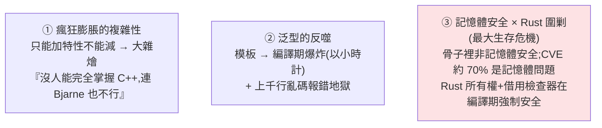

# C++ 演進史:複雜性詛咒、記憶體危機,與 AI 時代的絕地反擊

> C++ 走過近半個世紀:從「破局的屠龍少年」長出沉重新鱗片、遭新銳語言(Rust)圍剿,
> 卻又在 **AI 的算力狂飆**中再次加冕。這支影片把它的**起源 → 三座冰山 → AI 時代翻身**講成一條故事線。
>
> 整理自「安枫的叶」影片(中文)。

---

## 一、起源與崛起

- **1979** 貝爾實驗室,**Bjarne Stroustrup** 想要 C 的極致速度 + 更優雅的程式組織 → 「**帶類的 C(C with Classes)**」。
- **1983** 改名 **C++**(借 C 的遞增運算子 `++`,定調為「C 的演進、一個更好的 C」)。**1998** 首個國際標準 **C++98** → 工業界霸主。
- 但它背上**沉重歷史包袱**:必須**向下相容 C 的底層邏輯** → 變成「兼具防彈衣與重型火炮的龐然大物」。Bjarne 自己的名言:
  > 「用 C 很容易一槍打中自己的腳;用 C++ 很難觸發,但**一旦走火,它會把你的整條腿炸飛**。」
- **RAII(資源獲取即初始化)** 是它與生俱來的優雅基因:**資源綁定物件生命週期**(物件生則資源生、物件死則資源自動回收)。但 C++98 時代**缺好用的標準工具**,十多年裡程式員只能在指標迷宮手動排雷、在記憶體洩漏的泥潭掙扎。C++03 只是小修補,甚至**連原生多執行緒概念都沒有**;新標準代號 C++0x 一路跳票成業界老梗(十進位的 x 熬成十六進位的 B)。

### C++11:像一門全新的語言
千呼萬喚的 **C++11** 是分水嶺(Bjarne:「**感覺就像一門全新的語言**」):
- **移動語義(move semantics)**:解決拷貝帶來的效能開銷。
- **現代智慧指標**:徹底激活 RAII、擺脫手動釋放記憶體的夢魘。
- **記憶體模型 + 並發支援**:駕馭多核硬體。
- **Lambda**(函數式)、**`auto` 型別推導**(泛型史詩級增強)。

自此進入「現代 C++」+ **嚴格三年一發**(Concepts、Coroutines、Ranges…)。

---

## 二、三座冰山(挑戰與危機)

1. **複雜性詛咒**:絕對向後相容是最大優勢也是最重包袱——**特性幾乎只能做加法不能做減法**,於是雜糅了 C 底層控制 + OOP + 函數式 + 深奧的模板元編程。新手靈魂拷問「我到底該學哪種 C++?」;Linus Torvalds 炮轟臃腫;Google C++ 規範開篇就**限制使用某些特性**以保持簡單。
2. **泛型的反噬**:現代 C++ 大量依賴模板(C++20 Ranges 後更甚)。代價是 **① 編譯期爆炸**(模板實例化 → 大型專案編譯以小時計)**② 報錯地獄**(模板參數型別寫錯 → 吐出成百上千行亂碼級報錯;Bjarne 自承「模板錯誤訊息極其冗長費解而臭名昭著」)。C++20 的 **Modules + Concepts** 想減負,但在龐大舊碼庫前落地極慢。
3. **記憶體安全 × Rust 圍剿**(目前最大生存危機):C++11 智慧指標緩解了洩漏,但**骨子裡仍非記憶體安全**(懸掛指標、資料競爭、未定義行為防不勝防)。微軟 MSRC(2019):每年 CVE 約 **70%** 仍是記憶體安全問題;**2024 初美國白宮國家網路辦公室發報告呼籲轉向記憶體安全語言**。**Rust** 用獨創的**所有權 + 借用檢查器**在編譯期強制記憶體安全、又有媲美 C++ 的效能,已殺入 **Linux 核心**、底層系統、高效能網路、遊戲引擎等 C++ 的傳統領地。

---

## 三、AI 時代的絕地反擊

正當人們以為 C++ 巨輪將沉沒,**生成式 AI 大模型革命**改變了戰局——C++ 不僅沒退場,反而成了不可替代的核心。

- **AI 時代屬於 Python?是美麗的錯覺。** Python 只是「AI 汽車的方向盤」,**引擎蓋下那台狂暴的 V8 發動機幾乎全由 C++ 手工打造**:PyTorch、TensorFlow 本質都是龐大的 **C++ 程式庫**,Python 只是包在外面的易用接口。你在 Python 敲 `loss.backward()` 時,真正在 GPU 上瘋狂吞吐資料的是底層被壓榨到極致的 C++。
  > Chris Lattner(LLVM 核心):「AI 世界目前嚴重依賴 C++……Python 本質上只是覆蓋在龐大 C++ 程式庫之上的一層**語法糖**。」
- **算力底層,C++ 是王者**:NVIDIA GPU 壟斷算力基礎設施,而 **CUDA 編程模型本質就是對 C++ 的擴展**;要榨乾 GPU 的每一次算力,必須做極底層的記憶體對齊、執行緒調度、快取優化——**這正是 C++ 的統治區**。Rust 雖安全,卻撼動不了 **C++ 與 CUDA 超過 15 年的深度生態綁定**;在算力狂飆中,**運行速度戰勝了絕對安全**(對照 [[deepseek-v4-engineering]] 的 fused kernel、[[nvidia-n1x-vs-x86]] 的 CUDA 護城河)。
- **端側推理,C++ 的主場**:2023 年 **llama.cpp**(Georgi Gerganov)完全拋棄臃腫的 Python 框架,**純 C/C++、零外部依賴**讓 Llama 在普通 MacBook 流暢跑,把「零開銷抽象」發揮到極致。**Karpathy** 也共鳴,親手用 C/CUDA 寫 **llm.c**,宣告「在精簡純粹的 C 和 CUDA 裡訓練大模型,根本不需要 245MB 的 PyTorch 或 107MB 的 CPython」(對照 [[microgpt-karpathy]] 的「其餘都是效率」)。再加 TensorRT、ONNX Runtime 等工業級 C++ 推理引擎。
- **AI 反過來幫 C++ 解決歷史痛點**:那些讓新手絕望的**上千行模板亂碼報錯**,現在複製給 ChatGPT/Claude,一秒就告訴你「**你只是在第 42 行少寫了一個 `const`**」。**AI 編程助手極大削平了現代 C++ 的學習門檻**,讓這門「防彈衣 + 重型火炮」的語言變得前所未有地平易近人。

---

## 應用案例

- **理解「為什麼 AI 不是 Python 的天下」**:Python 是接口、C++ 是引擎——做高效能 ML/推理、想榨乾 GPU,逃不掉 C++/CUDA(這也是 [[nvidia-n1x-vs-x86]] 說 CUDA 是 NVIDIA 護城河的底層原因)。
- **端側/本地跑大模型**:看 llama.cpp / llm.c 的「純 C/C++ 零依賴」路線——把模型塞進 MacBook/手機/樹莓派,靠的是 C++ 的零開銷抽象,而非堆框架。
- **選語言:安全 vs 極致效能**:要記憶體安全選 Rust(編譯期擋整類漏洞);要榨乾硬體最後一滴效能、且綁 CUDA 生態,C++ 仍無可取代——這是場景取捨,不是誰淘汰誰。
- **學 C++ 不再那麼可怕**:遇到天書般的模板報錯,直接丟給 AI 翻譯成人話;把 AI 當「削平學習曲線」的工具。

---

## 一句話總結

> C++ 的終極意義,是**拒絕用保姆式的安全圍欄限制你的想像**,把「駕馭底層硬體的最高權力」連同「匹配的巨大風險」毫無保留地交到開發者手中。
> 它不完美、晦澀龐雜、至今保留著炸飛整條腿的危險;被 Rust 圍剿、被白宮點名,卻又在 AI 的算力狂飆中再次加冕——
> 因為**只要人類對極致效能的渴望沒停、晶片的潛能還需被一次次榨乾,C++ 引擎的轟鳴就不會沉寂**。它或許不再是每個初學者的必修課,但注定是支撐人類科技攀登物理極限的那塊最堅硬的基石。

---

## 來源

- YouTube:[C++ 演进史 复杂性诅咒 内存危机与 AI 时代的绝地反击(安枫的叶)](https://youtu.be/dVRFSzbLR7M)
- 涉及:Bjarne Stroustrup、C++98/03/11/20、RAII、移動語義/智慧指標、Concepts/Coroutines/Ranges/Modules、Rust 所有權與借用檢查、微軟 MSRC 70%、白宮記憶體安全報告、CUDA、PyTorch/TensorFlow、llama.cpp(Georgi Gerganov)、llm.c(Karpathy)、Chris Lattner。
- 延伸:本庫 [[deepseek-v4-engineering]]、[[microgpt-karpathy]]、[[nvidia-n1x-vs-x86]]、[[tree-sitter]]。
