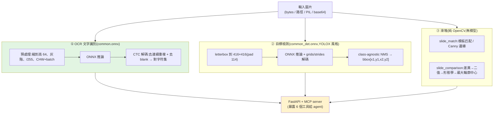

# ddddocr 原始碼深讀:離線驗證碼識別 SDK(OCR + 目標檢測 + 滑塊 + MCP)

> **ddddocr**(`sml2h3/ddddocr`,MIT)是一個 **通用驗證碼「離線本地」識別 Python SDK**——靠大批量隨機資料訓練的
> **ONNX 模型**,可識別數字字母、中文、滑塊、特殊字元等驗證碼。設計理念「**最簡依賴**」,API 簡單到 `ddddocr.classification(img)` 一行。
> 本篇 **clone 下來把核心原始碼讀完**,看它三大能力怎麼實作、以及它如何用 **MCP** 把自己暴露給 AI agent。
>
> **⚠️ 使用聲明(雙面刃工具):** 驗證碼識別僅供 **合法授權** 的用途——自動化測試**自家**系統、無障礙輔助、學術研究。
> **繞過他人網站的人機驗證可能違反其服務條款或當地法律**,請自行確認授權與合規。本筆記為技術研究整理。

---

## 整體架構

純 Python + ONNX Runtime + OpenCV/Pillow,內建三個 ONNX 模型(`common.onnx` OCR、`common_det.onnx` 檢測、`common_old.onnx` 舊版)。



**模組樹**:`core/`(ocr_engine / detection_engine / slide_engine / base)、`models/`(model_loader、charset_manager、`charsets.py` 1.6 萬行字符集資料)、`preprocessing/`(image_processor、color_filter)、`api/`(FastAPI app/routes + **mcp.py**)、`compat/v1.py`(舊版 API 相容)、`utils/`。

---

## ① OCR 文字識別:ONNX + CTC 解碼

`OCREngine.predict()` 流程(`core/ocr_engine.py`):

1. **預處理**:預設模型把圖**縮到高 64**(寬等比例)、轉**灰階**、`/255` 標準化、`HWC→CHW` 再加 batch 維。
2. **推論**:`session.run(None, {input_name: img_array})`。
3. **CTC 解碼**(關鍵,文字辨識的核心):模型輸出每個時間步的字元機率,取 `argmax` 後做 CTC ——**去掉連續重複的索引**、**去掉 blank(索引 0)**,再把剩下的索引對到字符集:
   ```python
   for idx in predicted_indices:
       if idx != prev_idx:      # 去連續重複
           if idx != 0:         # 去 blank
               decoded_indices.append(idx)
       prev_idx = idx
   ```
4. **可選功能**:
   - `probability=True`:回傳 softmax 機率 + `confidence`(各位置最大機率的平均)。
   - `charset_range`:**限制字符集範圍**(只允許數字/小寫/自訂清單…),大幅提升特定場景準確率(無效索引直接跳過)。
   - `color_filter`:用 **HSV 顏色過濾**只留某色文字(對抗彩色干擾)。
   - `png_fix`:修復 PNG 透明背景(RGBA→黑底)。
   - **自訂模型導入**:`import_onnx_path` + `charsets_path`,可載入你自己訓練的 OCR 模型(讀 charset/word/image/channel 設定)。

---

## ② 目標檢測:YOLOX 風格(common_det.onnx)

`DetectionEngine.get_bbox()`(`core/detection_engine.py`)是標準 **YOLOX** 推論流程:
- **letterbox** 把圖 pad 到 **416×416**(填充值 114)、`transpose` 成 CHW。
- 推論後 `demo_postprocess` 用 **strides 8/16/32** 生成 grid、解碼出 `(cx,cy,w,h)` → 轉 `xyxy`。
- **class-agnostic NMS**(`nms_thr=0.45`、`score_thr=0.1`,純 NumPy 實作)→ 回傳一串 `[x1,y1,x2,y2]` 邊界框。
- 用途:**「點選文字/物件」類驗證碼**——先用它框出每個目標的位置,再決定點擊順序。

---

## ③ 滑塊驗證碼:純 OpenCV,不用模型

`SlideEngine`(`core/slide_engine.py`)兩個演算法,**完全是 OpenCV、無 ONNX**:
- **`slide_match`(邊緣/模板匹配)**:把滑塊當模板在背景做 `cv2.matchTemplate(TM_CCOEFF_NORMED)`;`simple_target=False` 時先對兩張做 **Canny 邊緣檢測**再匹配(更抗背景干擾),回傳缺口中心座標 + `confidence`。
- **`slide_comparison`(差異比較,帶坑位圖)**:`absdiff(帶坑圖, 完整背景)` → 灰階 → 二值化(thr 30)→ **形態學去噪(close+open)** → `findContours` 取**最大輪廓**的 bounding box 中心。

> 滑塊只需要算「缺口的 x 位移」就能拖動,所以用傳統 CV 又快又準,不必上模型。

---

## API 與 MCP:把 ddddocr 暴露給 AI agent

`api/` 用 **FastAPI** 起 HTTP 服務,並有一個 **MCP(Model Context Protocol)handler**(`api/mcp.py`),讓 **AI agent 直接呼叫 ddddocr**:
- `GET /mcp/capabilities` 宣告 6 個工具:`ddddocr_initialize`、`ddddocr_ocr`、`ddddocr_detection`、`ddddocr_slide_match`、`ddddocr_slide_comparison`、`ddddocr_status`。
- `POST /mcp/call` 用 **base64 圖片** 帶參數呼叫,回 `MCPResponse`(result / error)。
- 等於把「識別驗證碼」變成 agent 工具箱裡的一個 MCP 工具——對照 [[codegraph-code-and-tui]](也是本地工具經 MCP 給 agent)、[[function-calling-mcp-a2a]](MCP 是工具邊界)。

> 設計上：**離線本地推論**(隱私、可內網部署)、ONNX Runtime 可選 **CPU/GPU provider**、`compat/v1.py` 保留舊版 `classification/detection/slide_match` API 不破壞既有用法。

---

## 應用案例

- **測試自家系統的 OCR/驗證流程**:對**你自己**的圖形驗證碼做端到端自動化測試,或在 CI 驗證「人類可讀性」。
- **無障礙輔助**:幫視障者把圖形驗證碼/圖片文字轉成文字(在合規前提下)。
- **文件/圖片 OCR**:`classification` 對短文字圖、票券號碼等做離線識別,不必上雲(隱私)。
- **接進 agent 工具箱**:用它的 MCP server,讓 agent 在「需要讀圖上的字/框出目標」時呼叫——例如自動化測試 agent。
- **自訓模型導入**:用 `import_onnx_path`+`charsets_path` 換上你自己訓練的 OCR 模型,沿用整套預處理/CTC 解碼管線。

---

## 一句話總結

> ddddocr 把驗證碼識別拆成三條離線管線:**OCR(ONNX + CTC 解碼,可限字符集/顏色過濾/機率)**、
> **目標檢測(YOLOX 416×416 + NMS 回傳 bbox)**、**滑塊(純 OpenCV 模板匹配/差異輪廓)**,
> 並用 **FastAPI + MCP** 把這些能力變成 agent 可呼叫的工具。技術乾淨、最簡依賴、可離線可自訓——
> 但它是**雙面刃**:只該用在合法授權的測試/無障礙/研究,別拿去繞過他人網站的人機驗證。

---

## 來源

- GitHub:[sml2h3/ddddocr](https://github.com/sml2h3/ddddocr)(MIT)。核心檔:`ddddocr/core/{ocr_engine,detection_engine,slide_engine}.py`、`ddddocr/api/mcp.py`、`ddddocr/models/{model_loader,charset_manager}.py`。
- 作者:sml2h3 與 kerlomz。內建模型:`common.onnx`(OCR)、`common_det.onnx`(檢測)、`common_old.onnx`。
- 延伸:本庫 [[codegraph-code-and-tui]]、[[function-calling-mcp-a2a]]、[[hermes-main-agent-orchestration]]。
