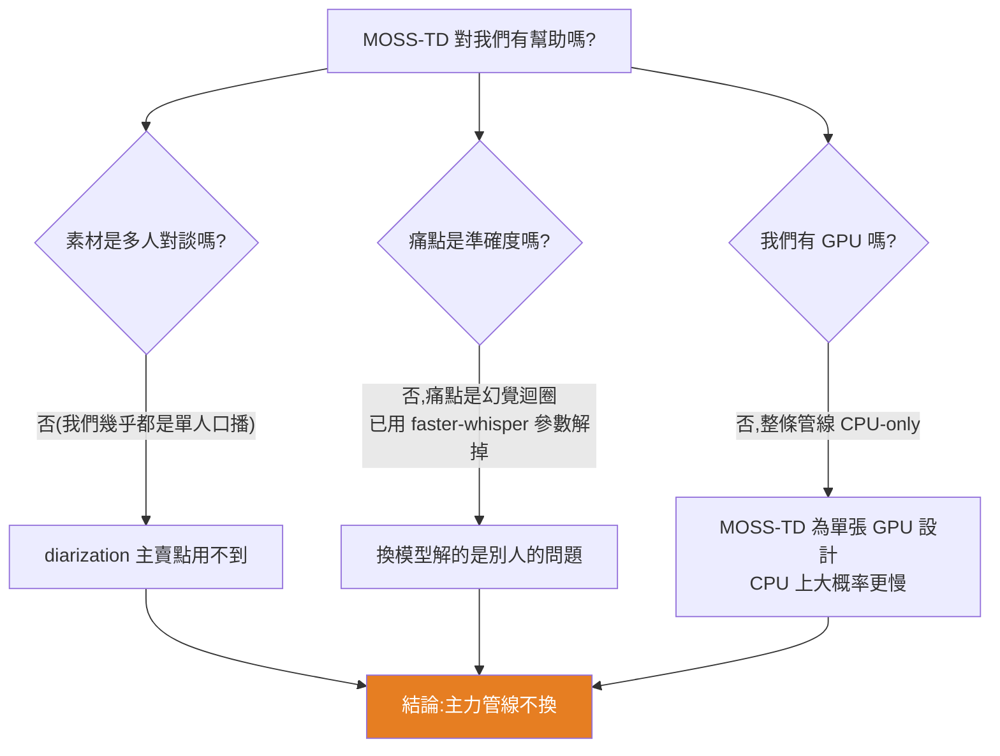

# MOSS-Transcribe-Diarize 0.9B 評估:端到端「轉錄+分辨說話者」開源模型,對我們的管線是否值得換?

> 一個 0.9B 開源音訊模型,一次推論同時產出**逐字稿 + 時間戳 + 說話者標籤 + 聲學事件**,主打免去 Whisper + PyAnnote 的拼接。本篇是**採用評估**:針對本倉庫既有的 YouTube 逐字稿工作流(CPU 版 faster-whisper,見 [[whisper-cpp-vs-faster-whisper-benchmark]])判斷值不值得導入。
> **結論(先講):對我們目前的主力管線幫助有限,但值得為「多人對談 + 有 GPU」的場景留一手。**

---

## 一、它是什麼(查證後,宣傳大致屬實)

**MOSS-Transcribe-Diarize**(OpenMOSS / MOSI 團隊,2026-07-09 開源)是一個**端到端**的長音訊理解模型:傳統上要「在一大段錄音裡找出誰在什麼時候說了什麼」,你得先跑 **Whisper 轉錄**再跑 **PyAnnote 分辨說話者(diarization)**,拼接兩系統邊界繁雜、時間軸和標籤常對不上。這個模型把兩件事合成**單次推論**,直接吐出帶說話者標籤的時間對齊逐字稿。

**輸出格式**(相鄰片段串成單一串流):
```text
[0.48][S01]Welcome everyone[1.66][12.26][S02]The new transcription pipeline is ready[13.81]
```

### 規格與架構

| 項目 | 內容 |
|---|---|
| 參數量 | **0.9B**(輕量) |
| 架構 | **Whisper-Medium encoder** + **Qwen3-0.6B style causal decoder**;4× temporal merge + MLP adaptor 橋接;audio feature 用 `masked_scatter` 取代 `<\|audio_pad\|>` embedding |
| 音訊前端 | `WhisperFeatureExtractor`,16 kHz、80 mel bins、30s chunk |
| 語言 | **50+ 種** |
| 音訊長度 | 單次最長 **~90 分鐘**,128k 長上下文 |
| 功能 | 轉錄 + diarization(`[S01][S02]…`)+ 時間戳 + **聲學事件**(笑聲/掌聲)+ 自訂熱詞(hotwords) |
| 授權 | **Apache 2.0**(可商用) |
| 依賴 | Python 3.12、Transformers 5.x、`trust_remote_code=True` |
| 速度 | README 標 **~100 tok/s on RTX 4090**(GPU 數字) |
| 成績 | 2026 INTERSPEECH 第二屆 MLC-SLM 挑戰賽**第一名**(14 語言) |

### 準確度(客觀評測,CER 越低越好)

0.9B 版在多個資料集上**贏過 Doubao、Gemini 2.5/3 Pro、ElevenLabs、GPT-4o、VIBEVOICE**:

| 資料集 | MOSS-TD 0.9B (CER↓) | 對照(較好的商用) |
|---|---|---|
| **Podcast(中文)** | **5.97** | Gemini 2.5 Pro 7.38 / Doubao 7.93 |
| AISHELL-4 | 14.84 | Doubao 18.18 |
| Movies | 6.36 | Gemini 3 Pro 8.62 |

> 準確度是真的好,尤其它還**同時**做了 diarization——這是它拿第一名的底氣。另有更強的 **Pro 版**(將以 API 形式提供)。

---

## 二、為什麼對我們的主力管線幫助有限

我們的實際情境見 CLAUDE.md 與 [[youtube-whisper-fallback]]:**抓 YouTube 單人口播影片 → CPU faster-whisper 轉逐字稿 → 整理成繁中筆記**。逐項對照:



1. **我們的素材幾乎都是單人**:股癌、美投君、Gary Chen、極簡經濟學都是一人口播/講評。**MOSS-TD 最大的賣點 diarization(分辨誰在說話)對單人內容完全用不到**——那正是我們不需要的功能。
2. **我們的痛點不是準確度,是幻覺迴圈**:「同句重複數十/數百行」的問題,已用 faster-whisper 的 `condition_on_previous_text=False` + `no_repeat_ngram_size=3` 解掉。換一個準確度更高的模型,解的是我們沒有的問題。
3. **⚠️ 最關鍵:CPU 速度大概率退步**。我們整條管線是 **CPU-only**(faster-whisper `small`/`int8`,底層 CTranslate2,20–30 分鐘影片幾分鐘轉完)。MOSS-TD 換到 CPU 有三重不利:
   - **無量化**:官方 code `dtype = torch.bfloat16 if cuda else torch.float32` → CPU 走 **float32**,吃滿記憶體與算力。
   - **更大的 encoder**:Whisper-**Medium** encoder,比我們用的 `small` 重。
   - **自迴歸逐 token 解碼**:走 vanilla `transformers.generate`,一段 25 分鐘逐字稿要吐數千 token,CPU 逐 token 生成很慢;README 的 ~100 tok/s 是 **RTX 4090** 的成績,CPU 沒有可比性。90 分鐘 + 128k context 在 CPU 更是 RAM/時間雙殺(易 OOM)。
4. **聲學事件(笑聲/掌聲)對寫知識筆記沒價值**:反而是整理時要濾掉的雜訊。

---

## 三、什麼情況它才真的有用

- **多人對談 / 訪談類素材**——例如本庫的**硅谷101(陳茜訪談)、風傳媒下班經濟學(對談)**這種「誰講了什麼」有意義的格式。此時 MOSS-TD 的**單次 diarization** 才勝過 Whisper + PyAnnote 拼接(省掉時間軸對齊地獄)。
- **前提是有 GPU**。純 CPU 跑它實用性很差。
- 附帶好處:**自訂熱詞**可加強專有名詞(股票代號、公司名),對投資類逐字稿的同音錯字或許有幫助——但同樣要有 GPU 才划算。

---

## 四、決策建議

| 場景 | 用什麼 | 理由 |
|---|---|---|
| **單人口播(我們的 95%)** | **維持 faster-whisper** | CPU 友善、已解幻覺迴圈、夠準;沒有換的理由 |
| 乾淨單人人聲(演講/純口播) | whisper.cpp(賺速度) | 見 [[whisper-cpp-vs-faster-whisper-benchmark]] |
| **多人對談 + 有 GPU** | **可試 MOSS-TD** | diarization 單次直出,勝拼接 |
| 多人對談 + 只有 CPU | 仍用 faster-whisper,人工標說話者 | MOSS-TD 在 CPU 太慢 |

**行動守則:** 主力管線**不動**。真要在多人對談上用 MOSS-TD 前,先拿一支 ~25 分鐘素材 **benchmark CPU 秒數**,確認不是比現況慢一個數量級再說。

**⚠️ 安全提醒:** 載入需 `trust_remote_code=True`(執行模型 repo 內的自訂 Python)。這在跑未驗證程式碼時有潛在風險,務必在**隔離環境**執行(呼應本庫 [[prompt-injection-5-techniques-defenses]] 一貫的「別無腦信任外部程式/內容」立場)。

---

## 五、重點回顧(TL;DR)

- **MOSS-TD 0.9B**:端到端一次吐「文字+時間戳+說話者+聲學事件」,Apache 2.0,準確度 SOTA(Podcast 中文 CER 5.97,勝 Gemini/Doubao/ElevenLabs),MLC-SLM 挑戰賽第一。
- **對我們幫助有限**:①素材幾乎單人 → diarization 用不到 ②痛點是幻覺迴圈(已解)非準確度 ③**CPU-only 管線 + 它為 GPU 設計**,CPU 上大概率更慢。
- **值得留一手**:多人對談(訪談/對談)+ 有 GPU 時,單次 diarization 勝過 Whisper+PyAnnote 拼接。
- **主力管線維持 faster-whisper**;要換先 benchmark CPU 秒數;`trust_remote_code` 隔離跑。

---

## 來源

- Repo:[OpenMOSS/MOSS-Transcribe-Diarize(GitHub)](https://github.com/OpenMOSS/MOSS-Transcribe-Diarize)
- 模型:[OpenMOSS-Team/MOSS-Transcribe-Diarize(HuggingFace)](https://huggingface.co/OpenMOSS-Team/MOSS-Transcribe-Diarize)
- 論文:[arXiv 2601.01554](https://arxiv.org/abs/2601.01554)
- 本庫相關:[whisper.cpp vs faster-whisper 本機 CPU 轉錄 Benchmark](./whisper-cpp-vs-faster-whisper-benchmark.md)
