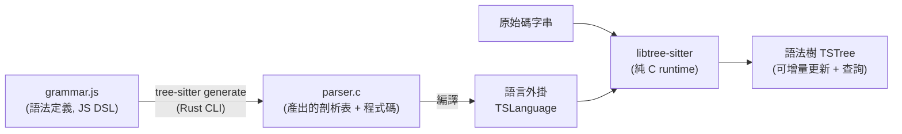

# Tree-sitter:給程式工具用的「增量解析」引擎

> Tree-sitter 是一個 **parser generator(剖析器產生器)** 加上一個 **incremental parsing(增量解析)函式庫**。
> 它能把一份原始碼建成 **具體語法樹(Concrete Syntax Tree, CST)**,並在你每敲一個鍵時 **只重算被改動的部分**、
> 高效更新整棵樹。它幾乎是現代編輯器(Neovim、Helix、Zed、Atom)、GitHub 程式碼高亮/導航,
> 以及越來越多 **AI coding agent** 的「讀懂程式碼結構」底層。
>
> 本筆記基於 2026-05 的官方 repo(`tree-sitter/tree-sitter`,commit `17125ce`)原始碼整理。

---

## 一句話價值

把「一坨文字檔」變成「一棵可以精準查詢、且改一個字不必重剖整檔」的語法樹。它刻意做到四件事:

| 目標 | 意思 |
|---|---|
| **General(通用)** | 同一套引擎能剖析任何程式語言,只要餵它一份語法定義 |
| **Fast(夠快)** | 快到可以「每一次按鍵」都重剖,編輯器才能即時上色/導航 |
| **Robust(耐錯)** | 即使程式有語法錯誤,仍能產出有用的部分語法樹(不會整個爆掉) |
| **Dependency-free(零依賴)** | runtime 是純 C11、無第三方依賴,可內嵌進任何應用程式 |

---

## 兩個元件:CLI(產生器)+ libtree-sitter(runtime)

Tree-sitter 實際上是兩塊東西,**職責完全分開**:



- **CLI(`tree-sitter`,Rust 寫成)**:吃一份 context-free grammar(放在 `grammar.js`),產出一個 C 檔 `parser.c`。
  它是 **build-time 工具**——parser 一旦產生好,執行期就不再需要 CLI。可從 crates.io / npm / GitHub Releases 取得。
- **libtree-sitter(`lib/`,純 C11)**:把「產生好的 parser」+「原始碼」變成語法樹,並在原始碼變動時更新樹。
  介面定義在單一標頭檔 `tree_sitter/api.h`。這塊是要 **內嵌進你應用程式** 的部分。

> 設計上的關鍵:語言定義(grammar)與引擎(runtime)解耦。所以一份引擎能跑上百種語言,
> 各語言的 grammar 各自獨立維護(`tree-sitter-python`、`tree-sitter-rust`…)。

---

## 核心一:增量解析(為什麼能「每次按鍵都重剖」)

傳統剖析器改一個字就要把整檔從頭剖一次;檔案一大,編輯器就會卡。Tree-sitter 用的是
**GLR(Generalized LR)+ 增量重用** 的演算法,源自 Tim Wagner 等人的研究(見文末)。

運作直覺:

1. 你先剖出一棵樹 `T`。
2. 編輯時,你告訴它「哪段 byte 範圍被改了」(`TSInputEdit`:start/old-end/new-end 的 byte 與 row/col)。
3. 重剖時把舊樹 `T` 一起傳進去 → 引擎 **重用沒被影響的子樹(subtree)**,只重算改動波及的節點。
4. 產出新樹 `T'`,可用 `ts_tree_get_changed_ranges()` 問「哪些範圍的語意真的變了」,
   讓編輯器只重新上色那幾行。

> 原始碼對應:`lib/src/parser.c`(主迴圈)、`lib/src/stack.c`(GSS,Graph-Structured Stack,
> 讓 GLR 能同時保留多條剖析路徑)、`lib/src/subtree.c`(子樹節點,含重用判斷)、
> `lib/src/reusable_node.h`(可重用節點)、`lib/src/get_changed_ranges.c`(算變動範圍)。

**耐錯(error recovery)**:遇到語法錯誤時不會放棄,而是用「錯誤成本」(`error_costs.h`)挑一條代價最小的
復原路徑,把壞掉的片段包成 `ERROR` 或 `MISSING` 節點,其餘部分照常成樹。所以你打到一半、語法還不完整時,
編輯器仍能上色與導航。

### 具體語法樹長什麼樣

以這段 Go 為例:

```go
func increment(a int) int {
    return a + 1
}
```

剖出來的樹(S-expression 表示):

```scheme
(source_file
  (function_declaration
    name: (identifier)
    parameters: (parameter_list
      (parameter_declaration
        name: (identifier)
        type: (type_identifier)))
    result: (type_identifier)
    body: (block
      (return_statement
        (expression_list
          (binary_expression
            left: (identifier)
            right: (int_literal)))))))
```

- **named node vs anonymous node**:`identifier`、`binary_expression` 是 *named*(有語意);
  像 `{`、`+` 這種字面 token 是 *anonymous*。
- **field(欄位)**:`name:`、`parameters:`、`left:`、`right:` 是「具名欄位」,讓你不必數第幾個 child,
  直接 `ts_node_child_by_field_name(node, "name")` 取到要的子節點。
- 每個節點都帶 **start/end 的 byte 位移與 (row, column)**,所以樹能精準對回原始碼位置。

---

## 核心二:Tree Query(用 S-expression 在語法樹上做 pattern matching)

光有樹還不夠,你需要「在樹上找東西」。Tree-sitter 內建一套 **查詢語言**(查詢引擎在 `lib/src/query.c`,
近 4700 行,是 runtime 裡最大的一塊)。查詢用類似 Lisp/Scheme 的語法寫,副檔名慣用 `.scm`。

**基本款**——找出 Python 的函式定義並抓出名字:

```scheme
(function_definition
  name: (identifier) @name) @definition.function
```

- `@name`、`@definition.function` 是 **capture(捕捉)**:把匹配到的節點貼上標籤,之後就能取出來用。
- 可以用 `[ ... ]` 表示「擇一(alternation)」、`.` 表示「相鄰(anchor)」、`*` `+` `?` 表數量、
  `(_)` 表「任意 named 節點」、`field: (...)` 限定欄位。

**進階款**——JavaScript 各種寫法都算「函式定義」:

```scheme
(assignment_expression
  left: [
    (identifier) @name
    (member_expression
      property: (property_identifier) @name)
  ]
  right: [(arrow_function) (function)]
) @definition.function
```

**predicate(述詞)** 可在匹配後再過濾文字,例如 Ruby 把註解的 `#` 去掉、只留與類別定義相鄰的 docstring:

```scheme
((comment)* @doc
  .
  (class name: (constant) @name) @definition.class
  (#strip! @doc "^#\\s*")
  (#select-adjacent! @doc @definition.class))
```

常見內建述詞:`#eq?`(相等)、`#match?`(正則)、`#strip!`、`#select-adjacent!`。

---

## 三大應用(都建構在「樹 + 查詢」之上)

### 1. 語法高亮(Syntax Highlighting)

GitHub.com 現在就用 `tree-sitter-highlight` 幫多種語言上色。原理:寫一份 **highlights query**,
把節點 capture 成標準高亮名(`keyword`、`function`、`type`、`string`、`function.builtin`…),
再由主題把名字對到顏色。配套還有:

- **locals query**:辨識作用域與區域變數,讓「同一個變數」上色一致。
- **injections query**:**語言注入**——例如 Markdown 裡的程式碼區塊、JS 字串裡的 SQL,
  能在一份文件中切換用不同語言的 parser 上色。

語言設定放在 grammar repo 的 `tree-sitter.json`(`scope`、`file-types`、`highlights`/`locals`/`injections` 路徑)。

### 2. 程式碼導航 / Tagging(Code Navigation)

`tree-sitter tags` 會吐出檔案裡「可命名的實體」(類別、函式、方法、呼叫點…)。
GitHub 的 **search-based code navigation**(點一下函式跳到定義)就是這套。

慣例用 `@role.kind` 命名 capture:`@definition.function`、`@definition.class`、`@reference.call`…,
再配一個 `@name` 抓名字、`@doc` 抓文件字串。**只要某語言有 Tree-sitter grammar,就能用同一套方法替它加上跳轉/搜尋。**

### 3. AI Coding Agent 的「程式碼理解」底層

這是近年最重要的新應用:agent 要對大型 codebase 做 **語意切塊(semantic chunking)**、
**抽取符號表/呼叫圖**、**精準定位要改的節點** 時,Tree-sitter 提供「比正則可靠、比編譯器輕量」的中間地帶。

- **檢索/RAG 前處理**:把檔案按「函式/類別」邊界切塊(而非按行數硬切),讓 embedding/檢索的單位有語意。
- **精準編輯**:agent 想改某個函式,用 query 定位該 `function_definition` 的 byte 範圍,精準替換而不誤傷他處。
- **跨語言一致**:同一套抽取邏輯套上不同 grammar 就能支援數十種語言——這正是許多 agent harness
  選它做 code map 的原因。(可對照本庫 ai-agents 中「Grep vs 向量檢索」的討論:
  Tree-sitter 常是「結構化檢索」那一側的基礎設施。)

---

## 公開 API 速覽(`tree_sitter/api.h`,純 C)

runtime 的核心型別與生命週期:

| 型別 | 角色 |
|---|---|
| `TSParser` | 剖析器物件(`ts_parser_new` / `ts_parser_set_language` / `ts_parser_parse`) |
| `TSLanguage` | 某語言的剖析表(由產生的 `parser.c` 提供) |
| `TSTree` | 一棵語法樹(`ts_tree_root_node` / `ts_tree_edit` / `ts_tree_get_changed_ranges`) |
| `TSNode` | 樹上的節點(`ts_node_type` / `ts_node_child_by_field_name` / `ts_node_start_point`…) |
| `TSTreeCursor` | 高效走訪樹的游標(比反覆 `ts_node_child` 省力) |
| `TSQuery` / `TSQueryCursor` | 編譯好的查詢 + 執行查詢的游標 |

典型流程(Rust 綁定,讀起來最直觀):

```rust
use tree_sitter::{Parser, Point, InputEdit};

let mut parser = Parser::new();
parser.set_language(&tree_sitter_rust::LANGUAGE.into()).unwrap();

// 1) 初次剖析
let src = "fn test() {}";
let mut tree = parser.parse(src, None).unwrap();
assert_eq!(tree.root_node().kind(), "source_file");

// 2) 編輯後「增量」重剖:把舊樹一起傳進去,快很多
let new_src = "fn test(a: u32) {}";
tree.edit(&InputEdit {
    start_byte: 8, old_end_byte: 8, new_end_byte: 14,
    start_position: Point::new(0, 8),
    old_end_position: Point::new(0, 8),
    new_end_position: Point::new(0, 14),
});
let new_tree = parser.parse(new_src, Some(&tree)); // ← Some(&tree) 觸發重用
```

文字輸入可給字串,也可給 callback(`parse_with`),回傳指定 byte/位置起的切片——
這讓它能直接接編輯器的 rope/gap buffer,不必先把整檔湊成一個字串。輸入可為 UTF-8 或 UTF-16。

**官方語言綁定**:C#、Go、Haskell、Java、Node.js、Python、Rust、Swift、Zig、Kotlin,以及 **Wasm**
(`binding_web`,讓 Tree-sitter 能跑在瀏覽器/JS,線上 playground 就靠它)。

---

## CLI 常用子指令

| 指令 | 用途 |
|---|---|
| `tree-sitter init` / `init-config` | 建立 grammar 專案骨架 / 使用者設定 |
| `tree-sitter generate` | **最重要**:把 `grammar.js` 產成 `parser.c` |
| `tree-sitter build` | 編譯產出的 parser |
| `tree-sitter parse <file>` | 剖析檔案,印出語法樹(可 `--cst` / `--xml` / `--dot`) |
| `tree-sitter test` | 跑 grammar 的語料測試 |
| `tree-sitter query <q> <file>` | 在檔案上執行一段查詢 |
| `tree-sitter highlight <file>` | 命令列語法高亮 |
| `tree-sitter tags <file>` | 吐出可命名實體(供導航) |
| `tree-sitter playground` | 開瀏覽器互動式 playground(Wasm) |

---

## 怎麼寫一份 grammar(概念)

`grammar.js` 是一份 JS DSL,用一組 **rule** 描述語法節點如何由其他節點組成。
規則型別有:symbol(引用其他規則)、string、regex、`seq(...)`(序列)、`choice(...)`(擇一)、
`repeat(...)`(重複)等,內部以 Rust 的 `Rule` enum 表示。CLI 的處理流程:

1. 用 `node` 執行 `grammar.js` → 轉成 JSON(schema 有正式定義)。
2. `prepare_grammar` 一系列轉換,最後把 grammar 拆成兩半:
   - **syntax grammar**:非終端符號如何由其他符號組成。
   - **lexical grammar**:終端符號(字串/正則 token)如何由字元組成。
3. 由這兩份建出 **parse tables**(LR 狀態機),寫進 `parser.c`。

> 對應 `crates/generate/`(`parse_grammar.rs`、`rules.rs`、`prepare_grammar/`)。

---

## 應用案例

- **Neovim / Helix / Zed 的即時高亮與縮排**:每次按鍵增量重剖,只重新上色變動行——這是 regex 高亮做不到的
  (regex 無法理解巢狀結構,字串裡的 `//` 會被誤判成註解;Tree-sitter 因為有真語法樹而不會)。
- **GitHub 的程式碼高亮與「點函式跳定義」**:分別用 `tree-sitter-highlight` 與 `tree-sitter tags` 的 query,
  且因為是查詢驅動,新增一種語言只需補一份 grammar + queries,不必改主程式。
- **AI agent 修改大型 repo**:先用 grammar 把每個檔案切成「函式/類別」層級的 chunk 餵檢索;
  要動手時用 query 定位目標 `function_definition` 的 byte 範圍,做外科手術式替換,避免「字串取代」誤傷同名片段。
- **語言注入場景**:一份 Markdown 內含 Python 程式碼塊、HTML 內含 `<script>` 的 JS——用 injections query
  在同一份檔案裡切換 parser,各區塊用各自語言正確上色。
- **lint / codemod 工具**:用 query 找出「所有 `assignment_expression 的箭頭函式」之類的模式,做靜態檢查或批次改寫,
  比寫 AST 走訪程式更短、比正則更可靠。

---

## 小結:它解決的根本問題

> 程式工具想「理解程式碼」時,正則太笨(不懂結構)、完整編譯器太重(慢、依賴多、不耐錯)。
> Tree-sitter 卡在中間甜蜜點:**夠通用(任何語言)、夠快(每次按鍵)、夠耐錯(壞檔也能用)、夠輕(純 C 零依賴)**,
> 並用一套 **S-expression 查詢語言** 把「語法樹」變成所有上層功能(高亮、導航、檢索、改寫)的共同地基。

---

## 來源

- [tree-sitter/tree-sitter(GitHub)](https://github.com/tree-sitter/tree-sitter) — 原始碼(`lib/src/parser.c`、`query.c`、`stack.c`、`subtree.c`;`lib/include/tree_sitter/api.h`)。
- [官方文件 · Introduction / Implementation](https://tree-sitter.github.io) — 設計目標、CLI 與 runtime 分工。
- [Syntax Highlighting 文件](https://tree-sitter.github.io/tree-sitter/3-syntax-highlighting) — highlights / locals / injections 三種 query。
- [Code Navigation Systems 文件](https://tree-sitter.github.io/tree-sitter/4-code-navigation) — tagging 與 `@role.kind` 慣例。
- [Rust binding README](https://github.com/tree-sitter/tree-sitter/blob/master/lib/binding_rust/README.md) — 增量編輯與 callback 輸入範例。
- 影響其設計的論文:Tim Wagner《Efficient and Flexible Incremental Parsing》、《Incremental Analysis of Real Programming Languages》(GLR 增量解析)。
