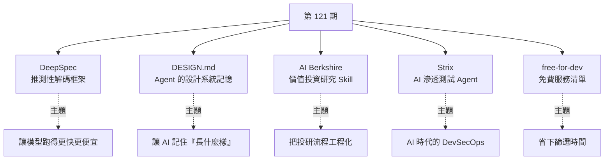

# 第 121 期:DeepSeek 推理加速、Google 設計記憶規範、AI 投研技能包、AI 滲透測試與免費開發者清單

> GitHub 一週熱點第 121 期(2026/6/28 – 2026/7/4)。本期主軸:**大模型推理加速**、**給 AI Agent 的設計系統記憶格式**、**價值投資研究 Skill 合集**、**AI 滲透測試 Agent**,以及一份老牌的**開發者免費服務清單**。

---

## 本期速覽

---

## 1. DeepSpec —— DeepSeek 的推測性解碼訓練與評估框架

- **用途:** 解決大模型**推理速度**問題。模型品質再強,使用者最有感的還是「太慢」——尤其長回答、程式生成、Agent 連續呼叫工具時。
- **背景:** DeepSeek 與北京大學團隊發表論文提出推理加速框架 **DSpark**,並同步開源支撐該版本的全棧推測性解碼(speculative decoding)框架 DeepSpec。
- **核心思路:** 讓一個**更小更快的 draft model 先往前猜幾個 token**,再由大模型檢查確認——猜對就省很多步,猜錯就回退修正。關鍵不只是「有個小模型幫忙猜」,而是**小模型猜得準不準、訓練穩不穩、和目標模型配合得好不好**。
- **亮點:**
  - 支援 **DSpark、DFlash、Eagle3** 三種 draft model,含資料準備、訓練、評估腳本與已發布的 checkpoint。
  - **實測數據(線上真實流量、系統總吞吐相同的前提下)**:DeepSeek-V4-Flash 單用戶生成速度提升 **60%–85%**;DeepSeek-V4-Pro 提升 **57%–78%**。
  - ⚠️ README 提醒**預設資料快取極大**(如 Qwen3-4B 的預設設定可能到數十 TB)——這不是隨手體驗的專案,而是給研究者、推理基礎設施團隊、模型服務團隊用的。
- **產業訊號:** DeepSeek 於 6/15 完成 A 輪融資約 510 億元、估值近 4000 億元(騰訊、寧德、網易、京東參投)。週報作者的觀察:**大模型競爭後段不只比 benchmark,更要比誰能把模型跑得更便宜、更快、更穩**;在算力與高階 GPU 受限的背景下,**推理優化不是錦上添花,而是生存能力的一部分**。
- 🔗 https://github.com/deepseek-ai/DeepSpec

> 🔎 **對照本庫:** 概念可對照 [[kv-cache]](推論加速的另一個經典把戲)與 [[deepseek-v4-engineering]](DeepSeek 用不夠的資源做頂尖模型的工程思路)。

---

## 2. DESIGN.md —— 給 AI 編程 Agent 的設計系統規範

- **用途:** 給 AI 編程 Agent 一個**描述設計系統的標準檔案**。Google Labs Code 開源,已累積兩萬多 star。
- **解決的痛點:** 用 AI 做前端時,這輪做得不錯,下輪加個彈窗它換了一套按鈕樣式,再下輪改表格、間距圓角字體又開始飄——**不是模型不會設計,而是它沒有穩定的「品牌與視覺記憶」**。
- **設計:** 把產品的視覺身份寫成一個 Markdown 檔:
  - **前面用 YAML front matter** 放機器可讀的 **design tokens**(顏色、字體、圓角、間距、元件樣式);
  - **後面用 Markdown 正文**解釋這些設計**為什麼**這麼用(這品牌該是嚴肅的、年輕的,還是偏工具感的)。
- **亮點:**
  - 可與 Google **Stitch**(AI UI 生成工具)匯入匯出,讓設計規則**跨 session、跨工具復用**——目標是通用規範而非私有格式。
  - 提供 CLI:`npx @google/design.md lint DESIGN.md` 檢查格式、token 引用與 **WCAG 對比度**;也能 `diff` 比較兩個設計系統檔的變化。
  - **關鍵洞察:** 如果 DESIGN.md 只是寫給人看的,它就是份設計說明;但**能 lint、能 diff、能被 Agent 結構化讀取**,它就更像 `package.json` 或 `tailwind.config`——**把「審美偏好」變成可被版本管理的工程資產**。
  - 現階段仍是 **alpha**,離行業標準還早,但方向對。
- **週報作者的預測:** 未來 AI 原生專案裡可能都會有這兩個檔——**AGENTS.md 管工程原則**(怎麼協作、測試、提交)、**DESIGN.md 管視覺原則**(這產品該長什麼樣)。
- 🔗 https://github.com/google-labs-code/design.md

> 🔎 **對照本庫:** 正好呼應 [[claude-design-review]] 與 [[ai-website-building-claude-code]] 談的「AI 設計工具與設計師的品味」——品味要能被寫下來、被機器讀,才不會每輪都飄。

---

## 3. AI Berkshire —— AI 時代的價值投資研究框架

> ⚠️ **投資相關,非投資建議。** 以下為專案功能介紹,不構成任何買賣建議;股市有風險,投資需謹慎。

- **用途:** 一套**同時相容 Claude Code 與 Codex** 的投資研究 **Skill 合集**(中文專案)。把巴菲特、蒙格、段永平、李錄四位價值投資代表人物的方法論,拆成 **18 個可被 AI Agent 執行的研究技能**。
- **安裝:** 在 Codex 等工具裡把專案地址給它、請它安裝 Skill 即可。
- **能做什麼:** 公司深度研究、財報精讀、行業篩選、持倉管理、投資論文追蹤、新聞異動歸因。
- **亮點(把投研過程工程化):**
  - **不讓 AI 隨口說「有增長潛力但也有風險」**,而是**強制按固定流程輸出**結論、價格區間、否決理由、風險清單與多視角衝突。
  - **四個 Agent 分工獨立研究**(商業模式 / 財務估值 / 行業競爭 / 風險與管理層),再由 **Team Lead 綜合**。
  - 要求**關鍵財務數據交叉驗證**,計算**用 Python 精確處理**,避免模型自己心算 PE、市值與匯率。
- **一個很到位的觀點:** 直接問 AI 分析一家公司,**最大的問題不是它不會寫,而是它太會寫了**——它能寫出看起來很平衡的分析,最後補一句「投資有風險請自行判斷」。這種回答讀起來沒錯,**但很難用來做決策**。
- 🔗 https://github.com/xbtlin/ai-berkshire

> 🔎 **對照本庫:** 與 [[using-ai-for-stock-analysis]](該怎麼問 AI)、[[ai-algo-trading-claude-jesse]](重點是驗證流程不是策略)同一條線;「多 Agent 分工 + Team Lead 綜合」則對應 [[five-agent-patterns]] 的 Orchestrator-Workers 模式。

---

## 4. Strix —— 開源 AI 滲透測試 Agent

- **用途:** 讓 AI Agent **像真實駭客一樣去發現、驗證並修復**你的應用漏洞。
- **解決的痛點:** 傳統安全掃描工具**誤報很多**——它說這裡可能有 SQL 注入、那裡可能有 XSS,但能不能利用、怎麼復現、影響多大,還要安全工程師繼續驗證。Strix 要補的就是這個中間地帶:**不只掃描,而是動態執行程式碼、嘗試利用漏洞,並生成真實的 PoC(proof-of-concept)**。
- **內建能力:** 偵察、漏洞利用、驗證、瀏覽器自動化、HTTP 代理、Shell 命令執行、Python 沙箱、靜態與動態程式碼分析。可掃本地程式庫、GitHub 倉庫,或做黑箱 Web 應用測試。
- **用法:** 安裝腳本 → 設定 LLM provider → `strix --target ./app-directory`。支援 **headless 模式與 GitHub Actions**,可放進 CI/CD 在 Pull Request 階段做快速安全檢查;PR 場景還能**自動把掃描範圍收窄到變更檔案**。
- **趨勢觀察:** 程式生成越來越快,**漏洞產生的速度也會變快**;人工安全評審成本太高、老式掃描容易誤報——這類一體化安全測試 Agent 可能成為未來 DevSecOps 的常見工具。
- 🔗 https://github.com/usestrix/strix

> ⚠️ 這類工具是雙面刃,**僅限於你有授權的目標**(自有系統、合法委託的滲透測試、CTF)。對照本庫 [[ddddocr-captcha-ocr]] 同屬「雙面刃工具」的討論。

---

## 5. free-for-dev —— 開發者免費服務清單

- **用途:** 整理各種對開發者有**免費額度**的 SaaS / PaaS / IaaS 與開發工具。老牌專案,已接近 **13 萬 star**。
- **涵蓋:** 雲伺服器、物件儲存、資料庫、CI/CD、日誌、監控、郵件、身分認證、CDN、搜尋、AI API、Web Hosting……做專案會用到的服務基本都能找到一類。
- **真正的價值不是「免費」兩個字,而是省下大量篩選時間:** 現在很多服務都有 free tier,但限制五花八門(每月多少請求 / 多少 GB 流量 / 一年免費 / 永久免費 / 只給開源專案),一個個官網去看很浪費時間。
- **適合誰:** 獨立開發者、學生、開源作者、side project——先從裡面找免費的資料庫、託管平台、郵件服務與監控;等專案真的有用戶、有收入再升級付費。
- **⚠️ 代價:** 免費服務的額度、地區、穩定性、風控策略都可能變化,**真正重要的專案不要完全依賴免費層**,要預留遷移準備。
- 🔗 https://github.com/ripienaar/free-for-dev

---

## One more thing:兩份資料

1. **羅蘭貝格《跨越 AI 價值鴻溝:AI 落地速度緣何遠超商業變現速度?企業又當如何破局?》** —— 很多企業 AI 部署速度很快、預算也在漲,但**真正賺到錢、提升利潤的速度沒跟上**。報告把這現象稱為「**AI 價值鴻溝**」,甚至有點像一場「**無利潤繁榮**」。
2. **德勤《物理 AI:開啟加速新紀元》** —— 報告提到,現在真正廣泛把物理 AI 融入營運的企業比例還不高,但未來幾年預期會明顯提升。(時事背景:宇樹科技過會,即將上市。)

> 🔎 **第一份報告與本庫高度相關:** 「AI 價值鴻溝 / 無利潤繁榮」正是 [[ai-adoption-electricity-revolution-analogy]] 講的同一件事——企業都在用 AI 卻沒有生產力質變,因為**組織架構還圍繞人而非 AI 搭建**。

---

## 來源

- [GitHub 一周热点第 121 期(itcoffee66/githubweekly)](https://github.com/itcoffee66/githubweekly/blob/main/_weekly/121.md)
- 專案連結:[DeepSpec](https://github.com/deepseek-ai/DeepSpec) · [DESIGN.md](https://github.com/google-labs-code/design.md) · [AI Berkshire](https://github.com/xbtlin/ai-berkshire) · [Strix](https://github.com/usestrix/strix) · [free-for-dev](https://github.com/ripienaar/free-for-dev)
