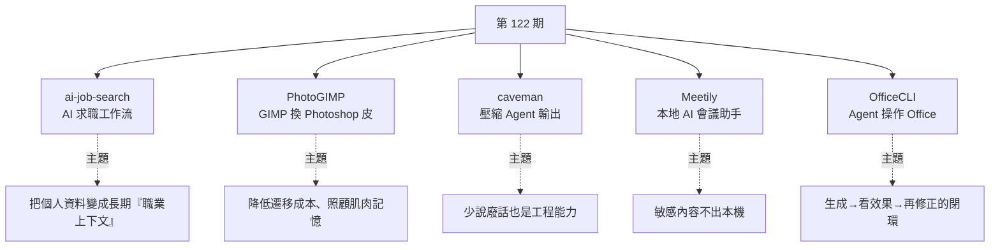

# 第 122 期:AI 求職助手、Photoshop 版 GIMP、Agent 省 Token 外掛、本地會議助手與 Office 文件 CLI

> GitHub 一週熱點第 122 期(2026/7/5 – 2026/7/11)。本期主軸:把**找工作**拆成完整工作流的 Claude Code 框架、把 **GIMP 變 Photoshop** 的補丁、讓 Agent **少說廢話**的外掛、**隱私優先的本地會議助手**,以及給 Agent 用的 **Office 文件 CLI**。

---

## 本期速覽

---

## 1. ai-job-search —— 基於 Claude Code 的 AI 求職工作流

- **用途:** 不是單純優化履歷的提示詞,而是**把找工作拆成一套完整工作流**。Star 增長極快(「看來全球的人都愁著找工作」)。
- **用法(clone 到本地後用 Claude Code 進入):**

| 指令 | 作用 |
|---|---|
| `/setup` | 依履歷、經歷、技能、目標職位建立**個人檔案**(預設像是基於 LinkedIn 履歷模板;資料不全會提問補全) |
| `/scrape` | 依個人檔案搜尋職位,拿到職缺列表(中國預設支援 LinkedIn) |
| `/rank` | 批次給職缺打分做**初篩** |
| `/apply <url>` | 針對某職位生成**客製版 CV 與 Cover Letter** |
| `/interview` | 做**面試準備** |

- **最值得借鑑的地方:** 它把個人求職資料變成一個**長期維護的「職業上下文」**——原始碼裡可見它把資訊放到 `.agent` 資料夾維護自己的記憶體系,各種職位搜尋也用**獨立的 skill** 管理。
- **⚠️ 侷限:** 預設職缺搜尋工具主要面向丹麥市場(如 Jobindex),但核心求職流程與語言/國家無關。可用 `/add-portal` 新增搜尋源(專案會嘗試自動建立一個 skill),不過 **BOSS 直聘、獵聘、智聯等中國主流招聘網站風控與反自動化限制很嚴,通常不行**。
- **相關專案:** [Lujie CareerKit](https://github.com/Chozzc/Lujie-Careerkit)(網友投稿)——完整求職工作台,支援履歷編輯、JD 匹配、投遞追蹤、模擬面試與復盤,資料可本地保存;但沒有自動搜尋職位,需手動錄入。
- 🔗 https://github.com/MadsLorentzen/ai-job-search

> 🔎 **對照本庫:** 「把個人資料變成長期可維護的上下文 + 用獨立 skill 管理」正是 [[markdown-agent-memory]]、[[llm-wiki-karpathy]] 的實作範例;求職面向可搭 [[leetcode-0-to-200-grinding-experience]]。

---

## 2. PhotoGIMP —— 把 GIMP 改造成 Photoshop 風格的補丁

- **用途:** 把開源圖片編輯軟體 **GIMP** 的介面、快捷鍵與預設佈局,調整成更接近 **Adobe Photoshop** 的樣子。
- **解決的痛點:** GIMP 是免費開源的 Photoshop 替代品,功能上能做修圖、合成、平面設計;但從 Photoshop 遷移過來的使用者**最不適應的就是介面和快捷鍵**——工具位置不一樣、面板邏輯不一樣、快捷鍵不一樣,剛打開有點勸退。
- **做了什麼:** 重排工具佈局讓位置更接近 Photoshop;把常用快捷鍵改成 Photoshop 風格;調整視窗、面板與畫布空間;附自己的啟動圖與應用圖示。**它不是重做一個編輯器,而是給 GIMP 換一套更適合 Photoshop 用戶的配置。**
- **安裝:** 新版對應 **GIMP 3.0+**,支援 Linux / Windows / macOS。本質是覆蓋 GIMP 的設定檔,所以官方特別提醒:**先打開一次 GIMP 讓它生成設定目錄,再安裝 PhotoGIMP**;若已有自己的 GIMP 設定,**最好先備份**。
- **值得思考的點:** 這專案不提升功能,而是解決一個很現實的問題——**開源軟體很多時候不是能力不夠,而是預設體驗和使用者習慣不匹配**。對設計師來說**肌肉記憶很重要**,快捷鍵和工具位置變了效率會明顯下降。PhotoGIMP 用很輕的方式把遷移門檻降下來。
- 🔗 https://github.com/Diolinux/PhotoGIMP

---

## 3. caveman —— 讓 AI Agent 少說廢話的 skill / plugin

- **用途:** 讓你的 AI 編程 Agent **說話更短**。
- **解決的痛點:** 很多 AI 編程工具的共同問題是「幹活可以,但太愛解釋」——明明只改一行程式碼,它先來三段背景、再說「我很樂意幫你」、最後再總結一遍。**浪費時間,也佔用輸出 token。**
- **做法:** 作為 skill/plugin 安裝到 **Claude Code、Codex、Gemini、Cursor、Windsurf、Cline、Copilot** 等 Agent,要求 Agent **保留技術內容、程式碼、命令與錯誤訊息**,但把表達壓縮成更短的風格。專案自稱同樣答案平均**減少約 65% 的輸出 token**。
- **功能:**
  - 不同壓縮等級:`lite`、`full`、`ultra`,甚至有**文言模式**。
  - 配套命令:`/caveman-commit`(更短的 Conventional Commit)、`/caveman-review`(一行式 PR 評論)、`/caveman-compress`(壓縮記憶檔,例如把 `agents.md` 這類長期上下文改短)。
- **⚠️ 與其他省 token 專案的差異(重要):** caveman **只壓縮輸出**——**不會減少模型的思考 token,也不會讓輸入上下文變小**。而且**如果你的任務本來就很短,加一個 skill 反而可能不划算**。
- **週報作者的感想:** 「我就是想知道哪裡錯了、怎麼改、命令是什麼、結果是什麼。**少說廢話,本身就是一種工程能力**。」
- 🔗 https://github.com/JuliusBrussee/caveman

> 🔎 **對照本庫:** 與 [[rtk-rust-token-killer-report]](在 I/O 邊界確定性壓縮工具輸出)是不同層的省 token 策略;也呼應 [[gpt-5-6-prompting-guide-openai]] 的 `text.verbosity` 與「GPT-5.6 天生更簡潔」。

---

## 4. Meetily —— 隱私優先的本地 AI 會議助手

- **用途:** 在**本機**捕捉會議音訊、即時轉錄並生成會議總結。
- **解決的痛點:** 現在 AI 會議助手很多(自動進 Zoom、Teams 幫你錄音轉寫總結),但:①有些**會議內容很敏感**(公司機密),不允許上傳第三方服務商;②很多會議助手**限量**,不買會員用不了多少。
- **做法:** 把處理盡量放回本地——**轉錄可用 Whisper**;**總結可用 Ollama 這類本地模型**,也可接自己的線上大模型。**錄音、轉錄文本與會議資料都存在本機**,不需要預設上傳雲端。
- **功能:** 即時轉錄、AI 總結、匯入既有音訊重新轉寫、**麥克風與系統音訊同時捕捉**、多平台(macOS / Windows / Linux)。
- **技術架構:** **Tauri 桌面應用 + Rust 後端 + Next.js 前端**(這組合在本地 AI 工具裡挺常見)。
- **週報作者的觀察:** 從實作上說它**沒有什麼特別創新的點**,但很多人構思 AI 創業思路時都不選這個方向,因為「不夠新穎」——**而它的火熱說明:有實際應用價值的東西,還是受大家歡迎。**
- **⚠️ 本地方案的代價:** 轉錄品質、速度與模型大小受你的機器效能影響;想要更強的團隊協作、進階匯出、自動識別發言人,專案有 **PRO 版**。
- 🔗 https://github.com/Zackriya-Solutions/meetily

> 🔎 **對照本庫:** 本地 Whisper 轉錄的實務(含幻覺迴圈的坑)見 [[whisper-cpp-vs-faster-whisper-benchmark]]。

---

## 5. OfficeCLI —— 給 AI Agent 用的 Office 文件命令列工具

- **用途:** 讓 AI Agent 直接**建立、讀取、修改 Word / Excel / PowerPoint** 檔案。
- **定位:** 重點**不是給人寫腳本,而是給 AI Agent 用**。單一二進位工具,不需一堆 runtime 依賴,命令列就能建立、修改、驗證 Office 檔案。
- **最關鍵的能力——內建渲染與預覽:** 可把 docx / xlsx / pptx **渲染成 HTML 或 PNG**,也能用 `watch` 開本地預覽,讓 Agent 形成「**生成 → 看效果 → 再修正**」的閉環。
- **功能:** Word/Excel/PowerPoint 的讀取、建立、修改;輸出**結構化 JSON**;**用路徑定位元素**(第幾頁、第幾個 shape、第幾行儲存格);模板 merge、批次 batch、resident mode、**MCP server**、Excel 公式計算與 pivot table。這些對 Agent 很重要——**它不需要猜屬性名,也不需要硬解析一堆 XML**。
- **為什麼是需要的方向:** 真正的辦公場景**不是只有 Markdown**,更多時候要接觸 Word、Excel、PPT。
- **⚠️ 侷限:** Office 文件格式非常複雜,完全相容不容易;**越複雜的模板、動畫、圖表與企業格式,越需要實際測試**——所以「能預覽」這點就格外重要。
- 🔗 https://github.com/iOfficeAI/OfficeCLI

> 🔎 **對照本庫:** 「渲染出來再檢查」正是 [[gpt-5-6-prompting-guide-openai]] 對視覺產物的驗證要求(render → inspect → revise);MCP server 面向可對照 [[function-calling-mcp-cli-tool-evolution]]。

---

## One more thing:兩份資料

1. **清新研究團隊《循環工程研究報告:AI 編程從「人提示 Agent」走向「循環提示 Agent」》** —— 關於 **Loop engineering**。AI 編程正從「人一輪輪提示 Agent」,變成「**人設計循環,讓 Agent 在循環裡持續執行**」;現在更重要的是能不能設計一個**可停止、可驗證、可治理**的持續作業閉環。
2. **NOURISH《回歸真實:2026 趨勢報告》** —— 不是純技術報告,講消費、食品與品牌趨勢。核心:AI 和演算法越來越強,**人反而更想要真實體驗、真實連接和不那麼完美的東西**;AI 能做很多事,但**不能真正替代人的文化判斷、直覺和現場感**。

> 🔎 **第一份與本庫的 loop 系列直接對上:** 「可停止、可驗證、可治理」正是 [[loop-engineering-when-and-how-gary-chen]]、[[claude-code-loop-types-official]]、[[gpt-5-6-prompting-guide-openai]](停止條件)反覆講的同一件事;而 [[loop-engineering-buzzword-critique]] 則提供了對這個名詞的反方視角。

---

## 來源

- [GitHub 一周热点第 122 期(itcoffee66/githubweekly)](https://github.com/itcoffee66/githubweekly/blob/main/_weekly/122.md)
- 專案連結:[ai-job-search](https://github.com/MadsLorentzen/ai-job-search) · [Lujie CareerKit](https://github.com/Chozzc/Lujie-Careerkit) · [PhotoGIMP](https://github.com/Diolinux/PhotoGIMP) · [caveman](https://github.com/JuliusBrussee/caveman) · [Meetily](https://github.com/Zackriya-Solutions/meetily) · [OfficeCLI](https://github.com/iOfficeAI/OfficeCLI)
