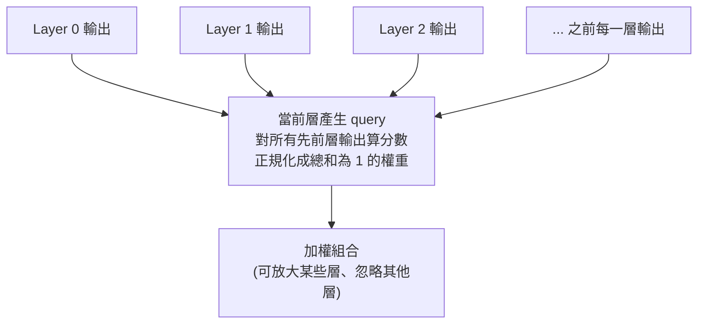

# Attention Residuals:把注意力「轉 90 度」用在網路深度上

**主題分類:** AI / LLM 架構
**研究對象:** Kimi(Moonshot AI)論文〈Attention Residuals(注意力殘差)〉
**來源:** YouTube 影片〈An Insanely Elegant LLM Architecture Breakthrough Just Dropped〉(bycloud,2026-05-18,約 14 分;本筆記依完整逐字稿整理)
**整理日期:** 2026-05-25

---

## 1. 摘要

2026 年前三個月就出現了近期最重要的 LLM 架構突破之一。Kimi(Moonshot AI)提出 **Attention Residuals(注意力殘差)**,並已在自家模型上 **大規模驗證**。核心想法極為乾淨直覺:既然「注意力」解決了 RNN 在 **序列維度** 上把資訊壓成單一狀態的問題,那為什麼不把同樣的招式用在 **網路深度(層與層之間)**?作者形容這像是 **把注意力旋轉 90 度**。(影片補充花絮:關鍵作者之一是一位 16 歲高中生。)

---

## 2. 它要解決的問題:Pre-norm Dilution(預正規化稀釋)

標準 Transformer 把 N 層疊起來,展開後像一根又細又長的棍子。但堆疊有天花板:

- 每多一層,前面所有層的輸出就被 **不斷壓縮進單一表示**,且是 **等權相加**。
- 結果:**早期資訊被逐步稀釋**,且無法回頭選擇性存取。
- 後面的層為了「被聽見」,必須產生 **越來越大的輸出量(magnitude)** 來蓋過累積訊號 → 表示越長越大,卻不一定更精準。

> **類比:** 每堂課後把所有筆記丟給 ChatGPT 摘要,下一堂再拿「摘要+新筆記」再摘要……到學期末,你只剩一份「摘要的摘要」,早期細節全沒了。

這正是 RNN 當年在序列維度上垮掉的原因(把所有先前資訊壓進單一狀態),而注意力機制在序列上避開了它——**深度維度卻一直沒這麼做。**

---

## 3. 解法:Attention Residuals(對深度做注意力)

- 不再 **被迫繼承一個混好的單一表示**;當前層可以 **直接看到每一個先前層的輸出**,並依當前輸入賦予不同權重。
- 機制:當前層形成 **query**,與所有更早層輸出比對得到分數 → 正規化成 **總和為 1 的權重** → 輸出是這些過去表示的 **加權組合**。
- 等於把「固定的加法捷徑(殘差)」升級成 **可訓練、隨輸入動態調整的深度路由**:把深度從「盲目累加」變成「**選擇性檢索**」。

---

## 4. 效率問題與 Block Attention Residuals

純做法有 **二次方擴張** 問題:128 層就要保留 128 個向量並在每層做注意力,最後一層約需 8,000 次注意力運算。

**Block Attention Residuals(分塊版)**:
- 把層分成 **區塊**(例如每塊約 12 層)。
- 區塊內:層照常注意自己之前的層;區塊結尾:把輸出合併成 **單一摘要表示**。
- 跨區塊:只注意各區塊的 **摘要**(例如 8 個),而非每一層。
- 把記憶體與計算從「隨總層數擴張」降到「隨區塊數擴張」——用一點點粒度換來巨大效率。

---

## 5. 實測成果

- 驗證損失 vs 計算量:**full 與 block 兩版都壓在 baseline 曲線之下**(同樣計算量、更低損失);且 **block 幾乎與 full 重疊**,代價極小。
- Block 版可在 **少用約 1.25 倍計算量** 的情況下追平 baseline——等於 **訓練打 25% 折扣**,卻只多約 **4% 訓練負擔**。
- 向量量級(magnitude):block 版維持穩定,baseline 則指數成長(Figure 5),證實緩解了「靠放大輸出搶話語權」的負回饋。
- **48B 參數、1.4 兆 token** 的模型上,**每一項下游任務都進步**;**多步推理(GPQA Diamond、數學)漲幅最大**——因為後面的層能選擇性回取早期表示。

---

## 6. 為什麼有效(三個理由)

1. **資訊保存:** 早期層仍可被個別存取,有用訊號不必在反覆混合中掙扎求生。
2. **修正量級問題:** 各層改用「相關性」競爭,而非靠「輸出量級」競爭。
3. **提升深度表達力:** 從固定線性累加,變成隨輸入動態組合所有層,更靈活。

---

## 7. 與 MHC 的關係

| | MHC | Attention Residuals |
|---|---|---|
| 作用位置 | **層內**(多條平行串流互相混合,等於把網路「加寬」) | **跨層**(沿深度連接,各層回看並選取先前層) |
| 方向 | 擴大表示,減少資訊流失 | 讓資訊事後更容易被回取 |

兩者 **正交**,理論上可組合(每層多串流 + 跨層注意),但實務上多半 **報酬遞減**,還會犧牲注意力殘差的簡潔與效率優勢、實作變噩夢。作者框架傾向:**Attention Residuals 是更乾淨、更優雅的解。**

---

## 8. 工程落地

- 直接插進 Kimi 最新的 **Kimi Linear** 架構(其餘不動),在訓練、scaling law、下游基準上 **一致受益**。
- 論文約 **2/3 篇幅在談效率**:除 block 設計外,還有 **兩階段計算策略、跨 pipeline 階段的快取**。
- 最終 **訓練負擔僅幾個百分點、推理延遲增加 < 2%**,幾乎可忽略。

> 啟示:如今前沿實驗室不只要想出漂亮架構,還得 **在大規模上實作並證明可行**。

---

## 來源

- [YouTube:An Insanely Elegant LLM Architecture Breakthrough Just Dropped(bycloud)](https://youtu.be/iw1VF8HOCrk)
