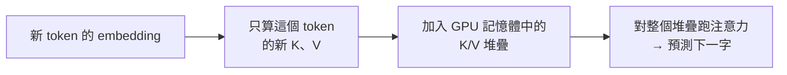

# KV Cache:每個 LLM 背後那個看不見的把戲

**主題分類:** AI / LLM 架構與推論
**來源:** YouTube 影片〈KV Cache: The Invisible Trick Behind Every LLM〉(Adam Rosler,2026-05-03,約 6.5 分;本筆記依完整逐字稿整理)
**整理日期:** 2026-05-25

---

## 1. 開場謎題

同一個 prompt、同一個模型:**第一次呼叫花 $1,第二次只花 5 美分(便宜 20 倍)**。原因是現代 AI 推論最重要的把戲之一,而它的底層概念 **比 Transformer 還老**。

---

## 2. 背景:訓練平行、推論卻是循序的

- 2017 年前,語言模型 **一個字一個字** 處理句子,訓練很慢。
- 〈Attention is all you need〉(2017)讓 **每個字能平行地看所有其他字**,訓練大幅加速。
- **但代價:推論(生成回應時)仍是循序的**——每個新字都依賴前面的字。所以推論時 Transformer 失去了它被設計出來的平行性。

---

## 3. 三個必備詞彙

1. **Token:** 文字的片段(有時整個字、有時碎片)。送 prompt 時模型先切成 tokens。
2. **Embedding:** 每個 token 轉成約 **4,000 個數字**。這些數字來自模型檔裡的一張大表(每個詞一列),值是 **預訓練** 學來的。所以對模型而言,「cat」不是文字,是 4,000 個數字。
3. **點積(dot product):** 把 embedding 想成 4,000 維空間裡的箭頭;兩箭頭點積得一個數——**對齊→大正值、垂直→0、相反→負值**。預訓練會把相關概念推到相似方向(cat≈kitten,cat≠yacht),於是「兩字多相關」就化簡成「箭頭多對齊」。(向量相似度搜尋引擎從 1970 年代就在用。)

---

## 4. 注意力機制:Key 與 Value

每個 token 從自己的 embedding 算出兩個向量,因為它扮演兩種角色:

- **Key:** 「如果你看我,我宣傳什麼」。
- **Value:** 「如果你選我,我實際貢獻什麼」。

兩者各由一個 **預訓練學到的矩陣** 乘上 embedding 得到(注意力有兩個矩陣,一個產 K、一個產 V)。拆成兩角色,讓模型能「宣傳的」與「貢獻的」不同。

**預測下一個字:** 拿新的 **query** 去和先前每個 key 做點積 → 得分數 → 用分數加權對應的 values → 加總,這個總和就是預測下一字的輸入。

> 例「the cat sat」:cat·the=0.2、cat·cat=0.8、cat·sat=0.7。

---

## 5. 隱藏成本與浪費

- 4,000 維 embedding × (4,000×4,000) 矩陣 = **1,600 萬次乘法**;模型有 **40 層**疊起來,每層各做注意力 → 光算 keys 就 **每 token 6 億次乘法**,values 同樣多 → **設定一個 token 的注意力約 20 億次運算**。
- **天真做法:** 每生成一個新 token,就把 **整段前文的 K、V 全部重算**——同樣的輸入過同樣的矩陣產同樣的輸出。到第 1,000 個 token,「the」的 key 已被重算約 1,000 次 → **數千億次相同的乘法**。

---

## 6. 解法:Memoization → KV Cache

- 這種浪費在 **1968 年** 就被注意到,Donald Michie 稱解法為 **memoization**:存下答案,別算第二次。
- 套到注意力上就是 **KV Cache**:把先前 tokens 的 K、V **存在 GPU 記憶體** 的堆疊裡。每生成一個 token 就把它的 K、V 加進堆疊;下一個 token **只算新的那一對**,再對整個堆疊跑注意力。
- **為何快取 K、V 而不是 embedding?** embedding 很便宜,貴的是把 embedding 變成 K、V 的矩陣乘法——**快取昂貴的中間產物,而非輸入**。沒有這招,生成成本大約要 **多 1,000 倍**。

---

## 7. 新瓶頸:記憶體牆(Memory Wall)

- 快取住在 GPU 記憶體,**每生成一個 token 就多一筆**。70B 模型約 **0.5 MB/token**;生成 10 萬 tokens → 背著 **50 GB** 快取;且 **每個並行使用者各有一份**。
- 1995 年 Wulf & McKee 提的 **memory wall**:**算力一直翻倍,記憶體頻寬卻沒有**。
- **結論金句:** 你的推論供應商賣的不是算力,是 **GPU 記憶體頻寬**。

---

## 8. Prompt Caching 與「順序」的省錢心法

- **Anthropic 2024 年** 讓快取能 **跨 API 呼叫重用**,稱為 **prompt caching**:送出與近期請求 **相同的前綴**,供應商就把你的 KV cache 留在 GPU 記憶體,只對它跑注意力——**免矩陣乘法、免設定成本**。第一次呼叫付錢建快取,第二次只是「租用」→ 這就是 5 美分 vs $1 的由來。
- **實務鐵則:順序很重要。**
  - 把 **穩定的東西放最前(底部)**:system prompt、工具定義、檢索到的文件。
  - 把 **使用者真正的問題放最後**。
  - 原因:**後面位置的 K/V 依賴模型對前面每個位置、每一層的處理**;只要改動前綴的任何東西,從那點往上的所有快取都 **失效**。
  - 把使用者問題放最前 → 每次請求都炸掉快取;放最後(tail-load)→ 快取免費重用。**相同 tokens、不同順序,agent 迴圈推論可便宜 10 倍。**
- **長上下文為何慢?** 不是模型「想得更用力」,而是 **快取更大**。

> 與本 repo 關聯:這解釋了 [[claude-md-12-rules]] 為何強調 token 預算、[[markdown-agent-memory]] 的「漸進式上下文披露」與 [[12-factor-agents]] 的「掌握上下文窗口」——穩定前綴 + 尾載查詢能大幅省下推論成本。

---

## 來源

- [YouTube:KV Cache — The Invisible Trick Behind Every LLM(Adam Rosler)](https://youtu.be/tGp6Ns9GtSU)
