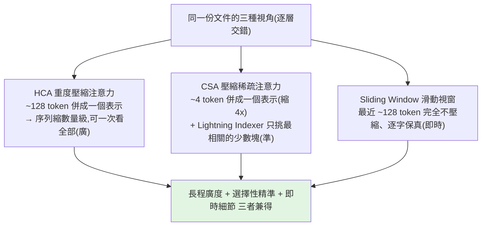

# DeepSeek V4 的瘋狂工程:用「不夠的資源」做出頂尖模型

> DeepSeek 在**算力極度受限**(沒有最頂的 NVIDIA 晶片、團隊比 OpenAI 小約 40 倍)的情況下,做出了
> **1.6 兆參數、1M token context**、且與頂級閉源模型(Opus 4.6 Max、Gemini 3.1 Pro)平起平坐的 **V4**——
> 還**開源 + 發論文**把怎麼做的全講出來。它的厲害不是「單一突破」,而是**數十個精巧工程解法疊在一起**,把幾乎不可能變可能。
>
> 整理自 AI Search 影片(英文)對 DeepSeek V4 論文的拆解。屬深水區,本筆記用白話講清楚每個關鍵設計。

---

## 規格與兩大難題

- **1.6 兆(trillion)參數**:參數=模型腦中的旋鈕,越多理論上越強,但**越大越難訓練**。
- **1M token context**(約 75 萬字,等於餵整套哈利波特還能答出某頁細節;對 agent 則是能跑數小時不迷失)。

但這兩者各自都極難實現:

1. **注意力的 O(n²) 瓶頸**:模型每讀一個 token,要和**前面所有 token** 比對相關性(源自《Attention is all you need》)。第 10 個字=10 次比對,第 10 萬個字=10 萬次……到 100 萬 token,比對量天文數字,硬體直接窒息。
2. **KV cache 爆炸**:為維持上下文,要把「每個過去 token 的語境資訊」存進 **KV cache**(GPU 記憶體裡的巨大查找表)。100 萬 token 時,光一段對話就要存好幾 GB 在昂貴的 GPU 記憶體裡。

DeepSeek 沒有用蠻力堆算力(因為沒有),而是問了更優雅的問題:**「如果模型一開始就不必看所有東西呢?」**

---

## 解法一:Hybrid Attention(壓縮過去 + 忽略大部分)

核心直覺:**讀書時你不會每答一題就重讀整本書**——你略讀、摘要、只在相關時跳回去。V4 用**三條平行路徑**模擬這件事,逐層交錯穿插:

- **CSA(Compressed Sparse Attention)**:把小塊(約 4 個 token)併成一個更密的表示 → 序列長度直接縮 4 倍(更少比對、更少記憶體)。但光壓縮不夠,還要**稀疏化**:用一個快速內建機制 **Lightning Indexer**(像內建搜尋引擎)替所有壓縮塊評分,**只選出最相關的一小撮**、其餘整個跳過。關鍵轉變:**模型不再追求「完美記住一切」,而是「在對的時間記住對的東西」。**
- **HCA(Heavily Compressed Attention)**:壓得更狠,把約 **128 個 token(一整段)** 併成單一表示 → 序列縮小好幾個數量級,短到模型**可以一次看全部**,取得「全局的高層理解」。
- **Sliding Window**:對抗壓縮的資訊損失——**最近約 128 個 token 完全不壓縮、逐字保真**,保住即時上下文的精確細節(你問半百萬 token 前的某句精確措辭,靠這條與 Lightning Indexer 找回)。

> 比喻(學生備考):眼前攤開最近幾頁(滑動視窗)、靠各章摘要掌握大局(HCA)、需要特定資訊時翻畫過重點的段落(Lightning Indexer)。DeepSeek 把這套人類直覺**變成精確的數學系統**。

**效率回報(vs 已經很高效的 V3.2):**
- **FLOPs(算力)低 3.7 倍** → V4 只用約 **27%** 的算力。
- **KV cache 小約 10 倍** → 只要 **10%** 記憶體(短期記憶體足跡砍 90%),直接改變部署這種巨型模型的硬體門檻。

---

## 解法二:mHC —— 不讓 1.6 兆參數的訊號「爆掉」

層數一多、參數到兆級,網路裡的訊號會像**麥克風太靠近喇叭的尖嘯回授**一樣自我放大 → 數值爆炸、loss 發散、訓練崩潰,稱為 **signal explosion(訊號爆炸)**。

- 傳統用 **residual connections(殘差連接)** 當「旁通車道」讓訊號跳過某些層保持穩定;後來業界改用更寬的 **hyperconnections**。但論文明說:**超過一兆參數,連標準 hyperconnections 都會出現災難性尖峰。**
- DeepSeek 的新架構 **mHC(manifold-constrained hyperconnections,流形約束超連接)**:把殘差**約束在「雙隨機矩陣(doubly stochastic matrix)」的流形上**——**每一列和=1、每一行也=1** → **總訊號守恆、永遠不會放大**,數學上直接禁止爆炸(**事前防止**,而非事後抑制)。
- 怎麼落實:每層處理前用 **Sinkhorn-Knopp 演算法**做約 20 次行/列正規化,直到矩陣滿足約束。聽起來很貴(兆參數每層加 20 步迴圈),但靠**激進的底層優化**(fused GPU kernels、selective recomputation 等)把整個開銷壓到**只佔 6.7% 執行時間**——相較訓練崩潰,這是很划算的保險。

---

## 解法三:Muon 優化器(取代 AdamW)

優化器=決定「答錯時旋鈕該怎麼調」的演算法。業界標準多年是 **AdamW**,V4 換成自家的 **Muon**:兩階段——**先猛力推向收斂、再小心穩定**。比喻像調吉他:先大幅把弦調到接近音高,再用微調對準。讓模型學得更快又保持穩定。

---

## 基礎設施:瓶頸其實是「通訊」不是「計算」

1.6 兆參數的模型大到一張晶片、甚至一個機架都裝不下,層被分散到資料中心的不同機架。此時最大瓶頸變成**資料在機架間的傳輸**——GPU 若在等資料,每一毫秒空轉都是燒錢。

- 解法:**把資料傳輸編排成一波波的小序列**——第 1 波資料一到,GPU 立刻開算;同時第 2、3、4 波資料已在網路線上背景傳輸。**計算與通訊完美重疊,網路延遲幾乎消失**,GPU 永不閒置。
- 實作用 **TileLang** 寫 **fused kernels**(把多個數學運算融成一條指令,省去反覆讀寫中間結果);並用 **Z3 SMT solver 數學上證明** kernel 程式 100% 正確(此規模下,十億分之一的錯誤都會持續且無聲地腐蝕模型)。連這部分都**開源到 GitHub**。

---

## 訓練:33 兆 token + 兩個穩定化技巧

- **資料量 33 兆 token**(超過任何人窮盡一生閱讀量)。
- **Curriculum(課程式學習)**:不要一次全丟。先看短序列(~4K token)學文法/語法/基本結構,訓練穩定後再逐步拉長 16K → 64K → 1M token,像慢慢擴張大腦的工作記憶。
- **Anticipatory Routing(預判式路由)** 對抗 **loss spike**(數學突然爆掉、訓練崩潰):不看「現在」,而是用**稍早的歷史參數快照**(類似看股價「移動平均」忽略每日雜訊、鎖定底層趨勢)。且**只在偵測到 loss spike 早期徵兆時才啟動**,危險過去再交還即時路由 → **模型訓練時自我穩定**,不必像傳統那樣崩潰後回滾重來。

---

## 成績(SOTA)

- 知識/推理/agentic 各 benchmark 與 **Opus 4.6 Max、Gemini 3.1 Pro** 平起平坐;對 **Opus 4.6 Max 的平均勝率更高**、且全任務勝出。
- **Putnam 2025**(最難的大學數學競賽之一)拿下**滿分 120/120**。
- 推到 1M token 極限時,**檢索準確度勝過 Gemini 3.1 Pro**。
- Artificial Analysis 榜上**第二強開源模型**(僅次於 Kimi K2.6),逼近頂級閉源。

---

## 補充(bycloud 對論文的拆解):成本、MoE、後訓練、量化

這支由 bycloud 對 58 頁技術報告的拆解,補上不少 AI Search 沒談到的點:

### 成本經濟學(這次發布的真正主軸)
V4 把**單 token 成本砍了近 75%**(對 V3.2)。DeepSeek API(75% 折扣、現已永久):約 **$0.435 / 百萬 input、$0.87 / 百萬 output**,cache hit $0.3625。對照:GLM 5.1 $1.4/$4.4、Gemini 3.1 Pro $2/$12、**Opus 4.6 $5/$25**。
> 同樣預算:用 DeepSeek 可撐 **7 年**,用 Claude 只能 **4 個月**。而 DeepSeek 估計仍有 50–70% 毛利。**這是一次「性價比發布」,不是 benchmark maxing。**

### 模型家族(6 個變體)
- **V4 Pro**:1.6 兆總參數 / **49B 活躍**(史上最大開源)。**Flash**:284B 總 / **13B 活躍**。皆 1M context。
- 變體:**Pro / Pro Base / Pro Max、Flash / Flash Base / Flash Max**——**Max 不是不同架構**,只是「最高推理 effort」設定(更長 context、更弱長度懲罰、不同 system prompt)。Base = 純預訓練未微調。
- 推理模式:non-thinking / thinking-high / **think-max**。Pro Max 自稱**最強開源**(贏 Terminal Bench Hard),但坦承推理仍落後 GPT 5.4 / Gemini 3.1 Pro **約 3–6 個月**。

### KV cache 壓縮的家族史
MLA(V2/V3,比 GQA 小 3.6x)→ DSA(V3.2,稀疏只讀 ~248 個 KV,128k 時少讀 ~64x)→ **V4 = DSA + 真正縮小記憶體**:Pro 用約 10% KV(9.5x)、Flash 約 7%(13.7x);**對 GQA baseline 總共縮 34x(Pro)/ 49x(Flash)**。注意:**仍是二次方注意力,只是慢很多,不是線性注意力。**

### MoE 細節
DeepSeek MoE:**256 個細粒度 router experts + 共享 experts**;router 激活從 Sigmoid 改 **Square Root SoftPlus** + 加序列級平衡損失(避免長序列塌縮到少數 expert)。**把前幾層的 dense 層改成 hash routing**(由 token ID 決定 expert,給 token 級模式穩定路徑,不浪費容量學路由)。

### 後訓練的大決定:最終模型「不直接 RL」
不對最終模型直接做 RL,而是:**複製 base model → 各領域(數學/程式/agent/指令)分別訓練 specialist**(可驗證任務用 GRPO,不可驗證用 generative reward model 按 rubric 評分)→ 再用 **on-policy distillation** 把多個 specialist 老師的能力**蒸餾回一個統一模型**。好處:避免混合 RL 目標互相衝突,讓最終模型不被單一 RL 目標主導。(對照 [[grpo-vs-gepa]] 的 GRPO。)

### 圍繞「推理瓶頸」重設計整個 stack
- 訓練資料 32–33T token(雙倍於以往);用 token splitting、fill-in-the-middle、**DSML(XML 工具呼叫格式,讓 tool use 結構化)**、document packing + **sample-level attention masking**(避免無關文件互相 attend)。
- **FP4 量化感知訓練(QAT)** for MoE expert 權重(訓練時就模擬 FP4,而非事後量化);**對華為晶片 day-zero 推理支援**(中國 NVIDIA 受限)。
> 主題:**「怎麼讓 100 萬 token context 真的便宜?」**——當注意力變便宜,瓶頸就轉移到 expert 權重的搬運與計算,於是連這層都量化。整份論文「讀起來更像系統工程論文」。

> 🔸 排名小差異:AI Search 說「第二強開源(僅次 Kimi K2.6)」,bycloud 說「第三(在 Kimi K2.6 與 Mimo V2.5 Pro 之後)」——以實際榜單為準,總之是**開源前段班、逼近頂級閉源**。

---

## 應用案例 / 為什麼值得讀

- **理解「為什麼長 context 這麼貴、以及怎麼壓」**:CSA/HCA/Sliding Window 三路徑是「**多解析度注意力**」的具體範例——對照本庫 [[kv-cache]](KV cache 是什麼、為何爆炸),V4 正是把 KV cache 砍 90% 的實作。
- **資源受限反而逼出工程創新**:沒有頂級 GPU → 不堆算力而是「少算還能懂全部」;這對任何**算力預算有限的團隊**都是啟發(和本庫一再出現的「省 token / 結構化壓縮」主線同源)。
- **1M context 對 agent 的意義**:能跑數小時長任務不迷失,呼應 [[long-running-agents-goal-evaluation]];但要注意「能塞 1M」不等於「該塞 1M」(context engineering 仍重要,見 [[context-engineering-processing-vs-thinking]])。
- **開源價值**:連 infra(閉源實驗室視為機密的部分)都公開,等於把「如何在受限條件下訓練兆級模型」的 know-how 攤開給所有人。

---

## 一句話總結

> DeepSeek V4 的主題是「**約束逼出工程**」:用 **hybrid attention(CSA + HCA + 滑動視窗)** 解 1M context 的記憶體與算力爆炸、
> 用 **mHC(雙隨機矩陣約束)** 數學上禁止兆級模型的訊號爆炸、用 **Muon** 加速且穩定學習、用**通訊計算重疊 + 形式化驗證的 fused kernel** 榨乾資料中心、
> 用 **curriculum + anticipatory routing** 讓訓練自我穩定——**數十個解法疊起來**,讓一個小而窮的團隊做出與頂級閉源並肩、且完全開源的模型。

---

## 來源

- YouTube:[The insane engineering of Deepseek V4(AI Search)](https://youtu.be/XJUpuOBpT-4)
- YouTube:[How DeepSeek V4 Broke AI's Cost Curse(bycloud,論文 part 1)](https://youtu.be/gC76aeibdFA) — 成本、MoE、後訓練蒸餾、FP4 等細節來源。
- [DeepSeek V4 官方說明](https://api-docs.deepseek.com/news/news260424);DeepSeek V4 論文與開源(Hugging Face / GitHub,含 mHC 論文與 fused kernel repo)。
- 延伸:本庫 [[kv-cache]]、[[context-engineering-processing-vs-thinking]]、[[long-running-agents-goal-evaluation]]。
