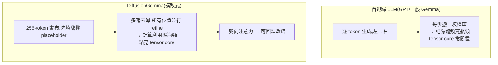

# DiffusionGemma:把「擴散」搬進語言模型,並行生成、可自我修正

> 來源:Google for Developers 官方部落格〈DiffusionGemma: the developer guide〉。DiffusionGemma 是建立在 **Gemma 4 骨幹**上的**實驗性擴散式(diffusion)文字生成模型**——不像一般 LLM 一個 token 一個 token 往下吐,而是**並行地在一塊 256-token「畫布(canvas)」上同時生成、再反覆 refine**。本筆記整理它與自迴歸 LLM 的根本差異、架構方法、效能、開發者用法與侷限。

---

## 一句話總結

自迴歸 LLM 逐字生成,卡在**記憶體頻寬瓶頸**(每步都要把整個模型權重從記憶體搬一次);DiffusionGemma 改成**並行生成 + 多輪去噪 refine 一整塊畫布**,把瓶頸從「記憶體頻寬」移到「**計算利用率**」——點亮本地推論時原本閒置的 GPU tensor core,換來**最高 4× 的生成速度**(H100 上 1000+ tokens/秒),還因為**雙向注意力**而能**自我修正**、解像數獨這種非序列問題。

---

## 自迴歸 vs 擴散式:差在哪



- **自迴歸**:一次只產一個 token,本地單機服務時 GPU 的張量核常常閒著等記憶體。
- **DiffusionGemma**:從一塊填滿隨機 placeholder 的 256-token 畫布開始,**多次去噪(denoising)讓所有位置同時收斂**——把計算量拉滿、反而更有效率。

---

## 架構與方法

**模型本體**:基於 **Gemma 4**,是一個 **26B 的 MoE(Mixture of Experts)**,推論時**只啟用約 3.8–4B 參數**(故命名 **26B-A4B**,A4B = active ~4B,非 4-bit);可在 **18GB VRAM** 內部署,**Apache 2.0** 授權、權重在 Hugging Face。

兩種生成機制:

| 機制 | 怎麼運作 |
|---|---|
| **Uniform State Diffusion(均勻狀態擴散)** | 不依序預測 token,而是從隨機 placeholder 開始,跨多輪去噪反覆 refine;**高信心的 token 幫忙把相鄰位置定下來**,直到整段序列收斂 |
| **Block Autoregressive Diffusion(分塊自迴歸擴散)** | 超過 256 token 的長序列:一個 block 去噪完成後**先 commit 進 KV cache**,再處理下一塊畫布——結合「分塊並行的速度」與「序列推進的穩定性」 |

注意力在兩種模式間**交替**:
- **Prefill 階段(因果/causal attention)**:吃進 prompt 上下文。
- **Denoising 階段(雙向/bidirectional attention)**:畫布上每個 token **同時注意所有位置**來 refine——這正是它能「全局思考」與「自我修正」的關鍵。

---

## 效能與基準

- **最高 4× 的 token 生成速度**(GPU 上)。
- **NVIDIA RTX 5090:700+ tokens/秒**;**單張 H100:1000+ tokens/秒**。
- **數獨微調實驗**:用 SFT(監督式微調)在數獨上微調後,**成功率 80%**(base 模型 ~0%),同時把推論步數從 **48 步降到 12 步**——展示雙向注意力對「非序列、需全局約束」問題的優勢。

---

## 關鍵特性

1. **Compute-bound 並行生成**:瓶頸移到計算,壓榨出 GPU 效率(本地單機尤其有感)。
2. **雙向上下文 + 自我修正**:同時評估整塊文字 → 能**即時改錯**(把低信心的 token「重新加噪」再替換掉),而自迴歸模型一旦吐錯就只能將錯就錯。
3. **全局上下文覺察**:不像自迴歸只能往回看,雙向注意力能解**數獨**這類非序列問題。
4. **長上下文有效擴展**:分塊機制讓 >256 token 的序列保持穩定。
5. **開發者友善尺寸**:量化部署塞得進消費級 GPU。

---

## 開發者怎麼用

**用 vLLM 起服務:**
```bash
vllm serve google/diffusiongemma-26B-A4B-it \
  --max-model-len 262144 \
  --max-num-seqs 4 \
  --gpu-memory-utilization 0.85 \
  --attention-backend TRITON_ATTN \
  --generation-config vllm \
  --hf-overrides '{"diffusion_sampler": "entropy_bound", "diffusion_entropy_bound": 0.1}' \
  --diffusion-config '{"canvas_length": 256}' \
  --enable-chunked-prefill
```
> 注意幾個擴散專屬參數:`diffusion_sampler: entropy_bound`(以熵為界決定哪些 token 已夠確定)、`canvas_length: 256`(畫布長度)。

**推論框架支援**:vLLM、Hugging Face Transformers、SGLang、MLX;另有 Google Cloud Model Garden 與 NVIDIA NIM 部署選項。

**微調**:官方提供 **Hackable Diffusion**(JAX 研究工具箱)的訓練 recipe,並支援 **Unsloth** 與 **NVIDIA NeMo** 做高效微調。

---

## 侷限

- **base 模型在受約束問題上幾乎 0 分**(如未微調的數獨 ~0%)→ 要在特定領域發揮,通常**需要領域專屬的微調**(數獨例子是 0%→80%)。
- 仍是**實驗性(experimental)**模型。

---

## 應用案例 / 為什麼值得關注

- **本地單機高吞吐生成**:在自家的 RTX 5090 / H100 上要「快」,擴散式把閒置的 tensor core 用起來,適合對延遲/吞吐敏感、又想本地部署的場景(隱私、成本)。
- **需要「全局約束 / 回頭改錯」的任務**:程式碼填空、結構化輸出、解謎(數獨)、版面/表格生成等「不是純左→右」的問題,雙向去噪比自迴歸更對味——可對照本庫 [[pddl-instruct-llm-planning]](規劃需要回頭驗證)與 [[sdar-agentic-rl]](擴散式 token 生成在 agent RL 的應用)。
- **理解「LLM 不一定要自迴歸」**:它和 [[llm-explained-3blue1brown]] 講的「下一字機率預測」是兩種生成範式的對照——同樣是 Transformer + attention,把「逐字採樣」換成「整塊去噪」,就換來並行與自我修正。也和 [[deepseek-v4-engineering]] 同屬「MoE 只啟用部分參數」的省算力路線。

---

## 來源

- Google for Developers,〈DiffusionGemma: the developer guide〉:<https://developers.googleblog.com/en/diffusiongemma-the-developer-guide/>
- 模型權重(Apache 2.0):<https://huggingface.co/google/diffusiongemma-26B-A4B-it>;文件:<https://ai.google.dev/gemma/docs/diffusiongemma>;訓練 recipe:<https://github.com/google-deepmind/gemma/tree/main/gemma/diffusion>
- 部署:vLLM、Hugging Face Transformers、SGLang、MLX、Google Cloud Model Garden、NVIDIA NIM。
