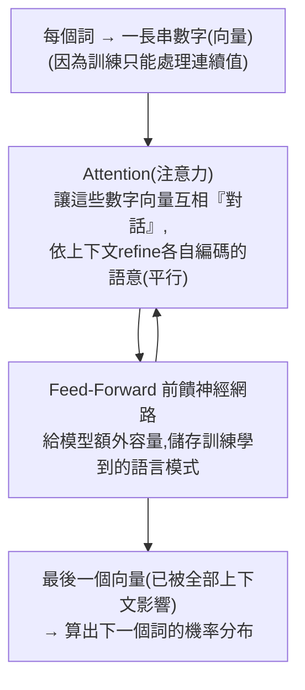

# 大型語言模型,簡單講(3Blue1Brown)

> 來源:3Blue1Brown〈Large Language Models explained briefly〉(為電腦歷史博物館展覽製作)。用最白話、最少數學的方式講清楚:LLM/聊天機器人到底在做什麼、怎麼訓練出來、以及 Transformer 為何是關鍵。是「先建立正確直覺」的最佳入門,適合在讀 [[microgpt-karpathy]]、[[kv-cache]] 這類深入筆記之前墊底。

---

## 一句話總結

**大型語言模型就是一個極其龐大的數學函式,它對「任何一段文字,下一個詞會是什麼」給出機率。** 聊天機器人不過是反覆呼叫這個函式來「續寫劇本」;它之所以「大」,是因為有**數千億個沒人親手設定、全靠資料調出來的參數**;而讓它能用如此驚人算力訓練的關鍵,是 2017 年的 **Transformer**——能平行「一次吸進整段文字」並靠 **attention** 讓詞與詞互相refine 語意。

---

## 1. 聊天機器人在做什麼:續寫劇本

想像你撿到一段「人與 AI 助手」的劇本,但 AI 的回答被撕掉了。如果你有一台「能對任何文字,合理預測下一個詞」的魔法機器,你就能:把現有文字餵進去 → 看它預測 AI 回答的第一個詞 → 把這個詞接上去再餵回去 → 不斷重複,把對話補完。**你跟聊天機器人互動時,發生的正是這件事。**

- LLM 不是「確定地」預測一個詞,而是**對所有可能的下一個詞各給一個機率**。
- 建聊天機器人:鋪一段描述「使用者 vs 假想 AI 助手」互動的文字,接上使用者輸入,然後讓模型反覆預測「這個假想助手接下來會說的詞」,呈現給使用者。
- **為什麼同一個問題每次答案不同?** 因為讓它**偶爾隨機選一個機率較低的詞**,輸出會自然得多——所以模型本身雖是確定性的(deterministic),同一個 prompt 通常每次跑出不同答案。

## 2. 訓練 = 調一台巨大機器上的旋鈕

- 模型的行為完全由許多連續數值決定,這些值叫**參數(parameters)/ 權重(weights)**。改變參數,就改變它對「下一個詞」給出的機率。
- 「**大**型」語言模型的「大」,就在於它能有**數千億個參數**。
- **沒有人刻意設定這些參數**:它們一開始是隨機的(模型只會輸出亂碼),再靠大量範例文字反覆refine——

> **訓練的核心動作:** 拿一個範例,把「最後一個詞以外」的全部餵進模型,比較它的預測與「真正的最後一個詞」;用一個叫 **反向傳播(backpropagation)** 的演算法微調所有參數,讓它**更可能**選對那個真詞、更不可能選其他詞。對數兆個範例做這件事,模型不只在訓練資料上更準,**在沒看過的文字上也開始給出合理預測**。

- **算力大到難以想像**:讀完訓練 GPT-3 用的文字量,一個人 24 小時不停讀要超過 **2600 年**;而訓練最大模型涉及的運算,即使你每秒能做 10 億次加乘,也要 **超過 1 億年** 才做得完。

## 3. 從「自動補全」到「好助手」:RLHF

> 上述整個過程叫**預訓練(pre-training)**。但「把網路上隨機段落自動補全」這個目標,和「當一個好 AI 助手」很不一樣。

為了補這個落差,聊天機器人還要做另一種同樣重要的訓練:**RLHF(基於人類回饋的強化學習)**——人工標記出沒幫助或有問題的回答,這些修正進一步改變參數,讓模型更可能給出使用者偏好的回答。

## 4. 為什麼是 Transformer

- 預訓練的天文算力,只有靠**為「大量平行運算」最佳化的特殊晶片 GPU** 才可能。但不是所有語言模型都好平行化:**2017 年之前,多數模型一次處理一個詞**;直到 Google 一隊研究者提出 **Transformer**。
- **Transformer 不從頭讀到尾,而是「一次平行吸進整段文字」。**

- **第一步**:把每個詞對應到一長串數字(向量),這些數字某種程度編碼了該詞的意義。
- **Attention(注意力)**——Transformer 的獨特之處:讓所有向量有機會**互相對話**,依周圍上下文refine 各自的意義(全部平行)。例:「bank」的編碼會因上下文被改成更接近「河岸(riverbank)」的意思。
- **Feed-forward 前饋網路**:給模型額外容量,儲存訓練中學到的更多語言模式。
- 資料反覆流過這兩種操作的許多層,每個向量被不斷豐富;最後對序列中最後一個向量做一個函式,產出「下一個詞」的機率分布。

## 5. 為什麼「沒人完全懂它為何這樣答」

> 研究者設計的是「每一步**怎麼運作的框架**」,但**具體行為是一種「湧現現象(emergent phenomenon)」**,取決於那數千億參數在訓練中被怎麼調出來。這使得「**為什麼模型做出這個確切預測**」極難判定——你能看到的是:用 LLM 的預測來自動補全 prompt 時,生成的文字流暢、迷人、甚至好用得不可思議。

---

## 應用案例:用這套直覺看懂日常現象

- **為什麼會「幻覺」**:模型本質是「給下一個詞配機率」,不是查資料庫——它追求「聽起來合理的續寫」,所以會自信地補出看似通順卻錯誤的內容。理解這點,就知道為何要外接檢索/驗證(對照 [[pddl-instruct-llm-planning]] 的外部驗證、[[vectorless-rag-structure-navigation]] 的 RAG)。
- **為什麼同問題答案會變**:因為刻意的隨機取樣(temperature)。要穩定輸出就降隨機性。
- **為什麼「大」有用、又貴**:參數越多能記越多模式,但預訓練算力是「上億年級」的天文數字——這也是算力與成本經濟學的根源(對照 [[ai-compute-token-economics]])。
- **想再深入**:本庫 [[microgpt-karpathy]](200 行純 Python 講完 GPT 演算法)、[[kv-cache]](推論為何能便宜 10 倍)、[[attention-residuals]](對「層」做注意力)是這支影片的進階續篇。

---

## 來源

- 3Blue1Brown(Grant Sanderson),〈Large Language Models explained briefly〉,YouTube:<https://youtu.be/LPZh9BOjkQs>(2024-11-20;為 Computer History Museum 展覽製作)
- 延伸:3B1B 的深度學習系列(visualize attention 與 transformer 各步驟)。
