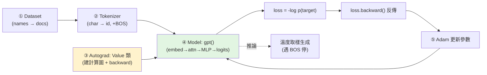

# microGPT(Karpathy):200 行純 Python 講完整個 GPT 演算法

> Karpathy 的教學藝術品:**一個 Python 檔、剛好 200 行、零外部依賴**,從頭實作一個完整的 GPT——
> 資料、tokenizer、autograd 引擎、GPT-2 式架構、Adam 優化器、訓練迴圈、推論,**不多不少**。
> 他的核心哲學一句話:**「This file is the complete algorithm. Everything else is just efficiency.」**
> (這個檔就是完整演算法,其餘一切都只是效率。)
>
> 本筆記基於實際 clone 下來讀完的原始碼(gist `microgpt.py`,199 行)整理,含真實程式片段。

---

## 它的脈絡:十年簡化之路

microGPT 是 Karpathy 教學系列的集大成:**micrograd(autograd)→ makemore(字元級生成)→ nanoGPT(極簡 GPT)→ microGPT**。
前面各教一個零件,microGPT 把它們**合併成一個最大化簡化的端到端系統**——他說它甚至「完美跨印刷頁三欄排版」,還做成三聯畫藝術品在賣。「I cannot simplify this any further.」

**規格(刻意小到能在 MacBook 上 1 分鐘跑完):**

| 項目 | 值 |
|---|---|
| 參數量 | **4,192** 個(對比 GPT-4 的數十億) |
| 架構 | `n_layer=1`、`n_embd=16`、`n_head=4`、`block_size=16` |
| 資料 | makemore 的 **3.2 萬個小寫人名**(一行一個) |
| Tokenizer | 字元級:26 字母 + 1 個 BOS = **vocab 27** |
| 訓練 | 1,000 步、Adam(lr=0.01, β1=0.85, β2=0.99)、線性衰減、每步一個文件 |
| 結果 | loss 從 ~3.3(27 token 亂猜的 baseline)降到 **~2.37**;溫度取樣生出 `kamon`、`karai`、`yeran` 之類「幻覺」人名 |

> 架構是 **GPT-2,但有幾個小改**:LayerNorm → **RMSNorm**、GeLU → **ReLU**、**無 bias**、用學習式位置嵌入(無 rotary)。

---

## 五個支柱(對照真實程式碼)



### ③ Autograd:一個 `Value` 類就是反向傳播的全部

每個 `Value` 存:`data`(前向算出的純量)、`grad`(loss 對它的導數)、`_children`(計算圖的子節點)、`_local_grads`(對各子節點的局部導數)。每個運算都同時記下「結果 + 局部導數」:

```python
def __mul__(self, other):
    other = other if isinstance(other, Value) else Value(other)
    return Value(self.data * other.data, (self, other), (other.data, self.data))  # 乘法的局部導數就是對方的值
def __pow__(self, other): return Value(self.data**other, (self,), (other * self.data**(other-1),))
def log(self): return Value(math.log(self.data), (self,), (1/self.data,))
def relu(self): return Value(max(0, self.data), (self,), (float(self.data > 0),))
```

`backward()` 就是**拓樸排序 + 鏈式法則**:從 loss(grad=1)反向走,把 `child.grad += local_grad * v.grad` 累加上去:

```python
def backward(self):
    topo = []; visited = set()
    def build_topo(v):
        if v not in visited:
            visited.add(v)
            for child in v._children: build_topo(child)
            topo.append(v)
    build_topo(self)
    self.grad = 1
    for v in reversed(topo):
        for child, local_grad in zip(v._children, v._local_grads):
            child.grad += local_grad * v.grad
```

> 整個深度學習的「魔法」就這 10 幾行——其餘都是把這套鏈式法則套用在更大的圖上。

### ④ 模型 `gpt()`:一次處理「一個」token,讓 KV cache 變顯式

最具教學價值的設計:**它一次只前向一個 token**(不是批次平行),於是 **KV cache 直接出現在計算圖裡**——`keys[li].append(k)`、`values[li].append(v)` 把當前 token 的 key/value 存進去,注意力只看「已存的過去」,**因果性(causal)自然成立、不需要 mask**:

```python
def gpt(token_id, pos_id, keys, values):
    x = [t + p for t, p in zip(state_dict['wte'][token_id], state_dict['wpe'][pos_id])]  # token+位置嵌入
    x = rmsnorm(x)
    for li in range(n_layer):
        x_residual = x; x = rmsnorm(x)                    # pre-norm
        q = linear(x, wq); k = linear(x, wk); v = linear(x, wv)
        keys[li].append(k); values[li].append(v)          # ← KV cache 顯式 append
        x_attn = []
        for h in range(n_head):                           # 多頭:切片 head_dim
            attn_logits = [sum(q_h[j]*k_h[t][j] for j in range(head_dim)) / head_dim**0.5
                           for t in range(len(k_h))]       # 只對「過去到現在」算分數 → 因果
            attn_weights = softmax(attn_logits)
            head_out = [sum(attn_weights[t]*v_h[t][j] for t in range(len(v_h))) for j in range(head_dim)]
            x_attn.extend(head_out)
        x = [a + b for a, b in zip(linear(x_attn, wo), x_residual)]   # 殘差
        # MLP:rmsnorm → fc1(4x) → relu → fc2 → 殘差
        x_residual = x; x = rmsnorm(x)
        x = linear(x, mlp_fc1); x = [xi.relu() for xi in x]; x = linear(x, mlp_fc2)
        x = [a + b for a, b in zip(x, x_residual)]
    return linear(x, state_dict['lm_head'])               # logits over 下一個 token
```

`linear`/`softmax`/`rmsnorm` 都是幾行的純 Python(softmax 有減 max 的數值穩定技巧;rmsnorm 用均方根縮放)。

### ⑤ 訓練迴圈 + Adam

每步取一個文件、前後包 BOS、逐位置算 **cross-entropy**(`loss_t = -probs[target_id].log()`)、平均成 loss、`loss.backward()`、再做帶 bias 校正的 **Adam** + 線性 lr 衰減:

```python
tokens = [BOS] + [uchars.index(ch) for ch in doc] + [BOS]
# ...逐 pos 前向、累積 losses、loss = 平均、loss.backward()...
lr_t = learning_rate * (1 - step / num_steps)             # 線性衰減
for i, p in enumerate(params):
    m[i] = beta1*m[i] + (1-beta1)*p.grad                  # 一階動量
    v[i] = beta2*v[i] + (1-beta2)*p.grad**2               # 二階動量
    m_hat = m[i]/(1-beta1**(step+1)); v_hat = v[i]/(1-beta2**(step+1))   # bias 校正
    p.data -= lr_t * m_hat / (v_hat**0.5 + eps_adam)
    p.grad = 0
```

### 推論:溫度取樣

從 BOS 開始,逐位置前向、softmax(除以 temperature)、`random.choices` 抽樣,遇到 BOS 就停:

```python
probs = softmax([l / temperature for l in logits])
token_id = random.choices(range(vocab_size), weights=[p.data for p in probs])[0]
```

---

## 核心哲學:同一套演算法,從人名到 ChatGPT

Karpathy 強調:**同樣這 200 行,既驅動 microGPT 生人名,也驅動 ChatGPT 對話**。差別只在三件「效率/規模」的事:

| | microGPT | GPT-4 / ChatGPT |
|---|---|---|
| 參數 | 數千 | 數十億～兆 |
| 資料 | 3.2 萬 token | 數兆 token |
| 工程 | 純 Python、一次一 token | GPU 平行、混合精度、複雜排程 |

> 但「**核心演算法與整體佈局完全沒變**」。連「幻覺」都一樣:兩者都是**從學到的機率分布取樣**,沒有任何「對照真相」的機制——
> 所以 microGPT 生出不存在的人名,和 ChatGPT 編出不存在的事實,是**同一個現象**。
> 「If you understand microgpt, you understand the algorithmic essence.」

這正好呼應本庫的兩條線:
- **KV cache**:microGPT 把它寫成顯式的 `keys.append/values.append`,是理解 [[kv-cache]] 「為什麼推論要快取過去」的最小範例。
- **「其餘都是效率」**:[[deepseek-v4-engineering]] 整篇講的(hybrid attention、mHC、FP4…)**就是那個「效率」**——把同一套演算法推到 1.6 兆參數、1M context 還跑得起、跑得便宜。microGPT 是「演算法本質」,DeepSeek V4 是「效率工程」的另一極。

---

## 應用案例

- **真正搞懂 LLM 在做什麼:** 把這 200 行讀一遍、最好手抄/重打一次——autograd、attention、Adam、取樣全在眼前,沒有框架黑箱。比讀十篇 attention 文章更有效。
- **理解 KV cache:** microGPT 的 `keys[li].append(k)` 讓你看到「快取過去的 K/V、新 token 只算自己的 Q 去比對」——這就是 [[kv-cache]] 省 10 倍推論成本的本質,只是這裡沒做批次與優化。
- **教學/面試:** 用它解釋「為什麼注意力是因果的(只看過去)」「殘差 + pre-norm 怎麼接」「cross-entropy 與取樣溫度」,每個概念都能指到具體幾行碼。
- **看清「幻覺」不是 bug 是特性:** 它本質就是從機率分布取樣;溫度越高越「有創意」也越容易胡謅——對非技術者解釋幻覺的最佳教具。

---

## 一句話總結

> microGPT 用 **200 行純 Python、零依賴**把整個 GPT 演算法(autograd → 架構 → Adam → 訓練 → 取樣)攤在桌上,
> 並用「一次一個 token」讓 **KV cache、因果注意力、殘差** 全變顯式可讀。
> 它的訊息很重:**LLM 的「本質」很小很簡單,大模型多出來的一切——規模、資料、GPU、量化——「都只是效率」。**
> 讀懂它,你就懂了現代 LLM 的演算法核心;再去看 [[deepseek-v4-engineering]],你看到的就是那個「效率」被推到極致的樣子。

---

## 來源

- Karpathy 部落格:[microGPT(2026-02-12)](http://karpathy.github.io/2026/02/12/microgpt/)
- 原始碼 Gist:[karpathy/microgpt.py](https://gist.github.com/karpathy/8627fe009c40f57531cb18360106ce95)(199 行,零依賴);亦有 [web 版](https://karpathy.ai/microgpt.html) 與 Colab。
- 脈絡:micrograd / makemore / nanoGPT(Karpathy 教學系列)。
- 延伸:本庫 [[kv-cache]]、[[deepseek-v4-engineering]]、[[attention-residuals]]。
