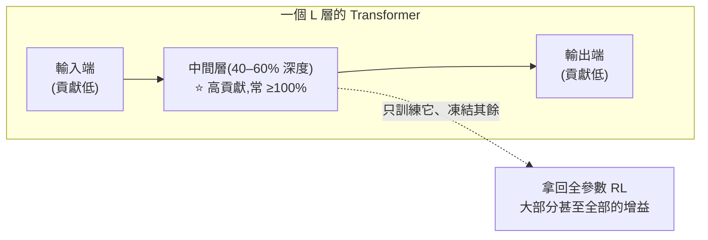

# 一層就夠了?RL 後訓練的收益高度集中在單一「中間層」transformer

> 整理自論文〈Is One Layer Enough? Training A Single Transformer Layer Can Match Full-Parameter RL Training〉(Zijian Zhang、Rizhen Hu、Athanasios Glentis、Dawei Li、Chung-Yiu Yau、Hongzhou Lin、Mingyi Hong,University of Minnesota / Peking University / Amazon,2026-07,arXiv:2607.01232)。RL 已是 LLM 後訓練的核心,但**「RL 的增益到底發生在網路的哪裡」幾乎沒人研究**——現有做法一律**均勻更新所有層**,隱含假設每層貢獻相同。這篇系統性地逐層拆解,得到一個反直覺的發現。
>
> 一句話:**只訓練「一個」transformer 層,常常就能拿回全參數 RL 大部分(有時甚至超過 100%)的增益;而且這些高貢獻層穩定地集中在網路「中間」。**

---

## 一句話總結

- **常規假設被推翻**:RL 的好處不是「整個網路協調適應」出來的,而是**高度集中在一小撮、甚至單一 transformer 層**。
- **穩定的結構**:高貢獻層一致地在**網路中段**;靠近輸入/輸出的兩端貢獻明顯較小。
- 這在 **7 個模型 × 2 個模型家族(Qwen3、Qwen2.5)× 3 種 RL 演算法(GRPO、GiGPO、Dr. GRPO)× 3 個任務域(數學推理、程式生成、agentic 決策)** 上都成立。

---

## 1. 怎麼量:Layer Contribution(層貢獻)

把每一層**單獨訓練**(凍結其餘所有層——但梯度仍會反向傳播經過整個網路,只是**參數更新**限制在這一層),再和標準的**全參數 RL** 比較。定義第 k 層的貢獻:

$$C(k) = \frac{S_k - S_{\text{base}}}{S_{\text{full}} - S_{\text{base}}}$$

- `S_base` = 原始預訓練模型、`S_k` = 只訓練第 k 層後、`S_full` = 全參數 RL 後的表現。
- **C=1.0**:單層訓練完全追平全參數;**C>1.0**:超過全參數;**C≈0**:這層學不到有意義的 RL 改善。

---

## 2. 兩個驚人發現

### ① 各層貢獻差異巨大
最好的層能拿回高達 **114%** 的全參數 RL 增益,最差的層 **<30%**,**最好的層是最差層的 4 倍以上**。例:
- Qwen3-1.7B:Layer 10 **C=1.14**(超過全參數),Layer 24 只有 0.28;28 層中 5 層 >1.0、7 層 <0.5。
- Qwen3-8B:Layer 16 **C=1.07**,但 **Layer 0 竟是負的(C=−0.51)**——單獨訓練它反而讓數學表現掉到比 base 還差。

> **弦外之音**:單一層就能吃下整個 RL 增益 → RLVR 造成的有效改變,可以被壓縮進**一層的參數子空間**;而某些層單獨訓練還能**超過**全參數 → 代表全部一起訓時,**有些層學得沒那麼好、反而稀釋了整體改善**。

### ② 變異是「有結構」的,不是隨機——高貢獻層集中在中間
所有 7 個模型都呈現同一結構:**貢獻在網路中段升高、在兩端下降**。而且這個排序極其穩定:
- **跨資料集**:NuminaMath-CoT vs DeepScaleR(都數學)Spearman **ρ=0.76**。
- **跨任務**:數學 vs 程式(DeepCoder)**ρ=0.59**——連訓練目標從數學換成寫程式,最高貢獻的還是那幾層。
- **跨模型家族 / 演算法 / 任務域**都保持中段集中(Qwen2.5-Math + Dr.GRPO、Qwen2.5-Instruct + GiGPO 的 agentic ALFWorld、DeepSeek-Distilled-Qwen-7B 都一樣)。
- **agentic 任務增益極大**(ALFWorld 漲 66–84 分,遠大於數學的 6–10 分),中段集中結構**照樣成立** → 不限於小幅度適應。

> **結論:層貢獻是預訓練模型的「內在屬性」**,由預訓練權重決定,而非訓練資料或任務決定。實務含意:**用小/易取得的資料集算出的層選擇,可以可靠地遷移去指導其他資料的訓練。**

### ③ 高貢獻層帶來的是「廣義能力」,不是過擬合
高貢獻層不只把 in-domain(數學)練好,也同時**改善 out-of-distribution**(程式、推理、語言);整體貢獻 `C_all` 與數學貢獻 `C_math` 高度同步(Pearson r>0.6)→ 單層訓練捕捉的是**真實、廣泛的能力提升**,不是對訓練目標的過擬合。

### ④ 關鍵澄清:高貢獻 ≠ 權重變動大
會不會「中間層只是變動比較多」的 trivial 結論?**不是**。全參數訓練時各層權重變動其實**相當均勻**(和高度不均的貢獻曲線形成對比);單層訓練時各層變動幅度也差不多、與其貢獻無關。→ **層貢獻反映的是「這一層參數子空間的『有效性』」,而非「參數改變的幅度」。**

---

## 3. 拿來改進 RL 後訓練的三招(都勝過全參數 RL)

| 策略 | 做法 | 結果 |
|---|---|---|
| **① 提高高貢獻層的學習率** | 只給高貢獻層更大 lr | 一致勝過全參數;而給低貢獻層加 lr 反而變差(證明是「選對層」而非「調 lr」本身) |
| **② 只訓練最佳 k 層、凍結其餘** | Only-Best-k | Qwen3-8B「Only B10」**69.11 vs 全參數 66.43**(+32% 的總 RL 增益);規模越大越明顯,凍結低貢獻層反而讓最佳化更乾淨 |
| **③ 免剖析啟發式:只訓練「中間 k 層」** | 按位置取中段、**完全不需逐層剖析** | 三個規模都**贏過全參數**(+8–21% 的 RL 增益);當連一輪逐層剖析都負擔不起時,「訓練中間層」就是很強的預設 |

**額外:層專化模型的 ensemble(分析工具,非實用訓練法)**——不同層訓練出的模型解的是**不同的題**(top-7 高貢獻層的模型,平均 Jaccard 重疊只有 34.1%),知識互補而非冗餘。用 majority voting 集成 top-7:**33.6% vs 最佳單層 28.3% vs 全參數 26.9%**,且勝過同一模型抽 7 次的 self-consistency 投票(31.3%)→ **「訓練不同層」帶來的結構性多樣性,比「重複取樣」的多樣性更有效。**

---

## 應用案例 / 怎麼用這個發現

- **省算力做 RL 後訓練**:與其全參數 RL,不如**只訓練中間幾層**(甚至只中間 5 層)——更便宜、還常常更準。最省事的是**免剖析啟發式**:直接取 `[L/2−k/2, L/2+k/2)` 這段中間層來訓。要更好就先做一輪逐層剖析,挑真正的高貢獻層(排序可跨資料/任務遷移,不必每次重算)。
- **別均勻對待所有層**:RL 的有效學習集中在少數中間層,低貢獻層(尤其最靠輸入的第 0 層)不但幫助有限、甚至可能拖累——**凍結它們反而讓最佳化更乾淨**。
- **要衝準確率就集成「不同層」而非「多抽幾次」**:同一模型重複取樣的多樣性有限;訓練不同層得到的模型解不同題、互補性強,majority vote 增益更大(但這是分析用,成本高)。
- **判斷「哪層重要」看有效性、不看變動幅度**:權重動得多 ≠ 貢獻大;層貢獻是預訓練權重決定的內在屬性——這對「要改哪層、剪哪層、微調哪層」的決策是一個乾淨的先驗。

> 延伸對照:本庫 [[grpo-vs-gepa]](GRPO 等 RL 後訓練訊號)、[[microgpt-karpathy]](transformer 內部)、[[bitter-lesson-cut-old-patterns]] 與 [[self-harness]](模型/harness 的結構性槓桿);此文把「該動哪裡」的槓桿從「調演算法/獎勵」移到了「選對層」。

---

## 來源

- Zijian Zhang, Rizhen Hu, Athanasios Glentis, Dawei Li, Chung-Yiu Yau, Hongzhou Lin, Mingyi Hong,〈Is One Layer Enough? Training A Single Transformer Layer Can Match Full-Parameter RL Training〉,arXiv:2607.01232(2026-07,University of Minnesota / Peking University / Amazon):<https://arxiv.org/abs/2607.01232>
- 實驗:7 模型(Qwen3-1.7B/4B/8B、Qwen2.5-Math-1.5B、Qwen2.5-1.5B/3B-Instruct、DeepSeek-Distilled-Qwen-7B)、RLVR + GRPO/GiGPO/Dr. GRPO、資料集 NuminaMath-CoT / DeepScaleR / DeepCoder / Skywork / ALFWorld;本文依論文 §2–§5 與圖表整理。
