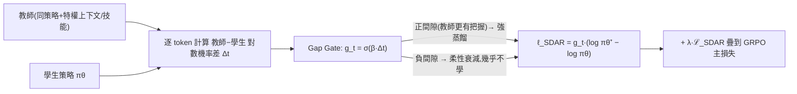

# SDAR:用「逐 token 門控」穩住多輪 Agent 的強化學習後訓練

**主題分類:** AI / LLM 架構與訓練 — Agent 後訓練(RL)
**研究對象:** 論文〈Self-Distilled Agentic Reinforcement Learning (SDAR)〉(arXiv:2605.15155v1,2026-05-14;作者來自浙江大學、美團、清華大學)
**整理日期:** 2026-05-30

---

## 1. 要解決的問題

訓練 **多輪(multi-turn)LLM agent** 時,常想把 RL(探索)和「**監督式蒸餾(OPSD)**」結合——讓一個 **特權教師**(其實是 **同一個策略 + 訓練時的特權上下文**,例如檢索到的技能/skill)逐 token 指導學生。但有兩個致命問題:

1. **多輪 OPSD 不穩定:** 學生軌跡一旦 **偏離教師軌跡**,token 級監督信號就不可靠 → **KL 散度暴衝、性能崩潰**。
2. **特權指導的不對稱:** 教師不是獨立更強的模型,只是「同策略 + 特權上下文」。出現 **負間隙(教師機率 < 學生)** 時,可能只是因為技能品質差或多輪漂移,**不該和「正面認可」同等對待**。

> 實測崩潰:純 OPSD 在 Search-QA 幾乎歸零;朴素 GRPO+OPSD 在 Qwen3-1.7B 從 46.1% **掉到 32.0%**。

---

## 2. 核心方法:把蒸餾當「門控輔助項」,RL 仍是主幹

```
總損失 = ℒ_GRPO(θ)  +  λ_SDAR · ℒ_SDAR(θ)      # λ_SDAR = 0.01
```
**RL(GRPO)維持無偏主骨幹;蒸餾只是「選擇性注入」的輔助信號。** 關鍵是給每個 token 一個 **可學習門控** `g_t ∈ [0,1]`,決定「這個 token 要不要、以及多強地」接受教師指導:



- **Gap Gate(差異門控,實驗證實最佳):** `g_t = σ(β·Δt)`,`Δt` 是 **detached(不回傳梯度)** 的教師-學生對數機率差。**正間隙 → 強蒸餾;負間隙 → 柔性衰減**(避免被劣質/漂移信號帶歪)。`β=5.0`(sigmoid 銳度)。
- **三種門控比較:** 熵門控(高不確定處)< Soft-OR(不確定+差異)< **差異門控**。
- **用反向 KL(reverse KL)而非前向 KL:** 反向 KL 的「尋模(mode-seeking)」特性會 **排除教師低機率 token**,與顯式門控相輔相成(目標函數:反向 KL > 前向 KL > JS 散度)。

**自動課程(automatic curriculum):** 門控啟動比例 **早期 <50%、隨訓練遞增**——理論上門控單調遞增(導數上界 β/4),等於自動從少到多地放開蒸餾;且輔助梯度被有界門控調節、**無法超過未加權的似然梯度**,保證穩定。

---

## 3. 主要結果

基礎模型 Qwen2.5(3B/7B)、Qwen3(1.7B);基準 ALFWorld(家務)、Search-QA(單/多跳 QA)、WebShop(電商互動);8×H800、150 步。

| 環境 | 模型 | 改進 |
|---|---|---|
| ALFWorld | Qwen2.5-3B | **+9.4%**(84.4% vs 75.0%) |
| Search-QA | Qwen2.5-3B | **+7.0%** |
| WebShop-Acc | Qwen2.5-7B | **+10.2%**(82.8% vs 72.6%) |

關鍵發現:
- **避免崩潰:** 純 OPSD 崩、朴素 GRPO+OPSD 退步,**SDAR 全程穩定增益**。
- **技能內化:** SDAR **推理時不需要技能**,仍勝過「有技能版」的 Skill-GRPO*(ALFWorld-1.7B:53.9% vs 28.1%)——把訓練時的特權上下文「內化」進策略。
- **強韌性:** 即使 **檢索品質差(隨機檢索)** 仍有正增益(門控自動過濾噪聲);關鍵字匹配檢索下 ALFWorld +4.7%、WebShop-Acc +10.2%。
- **訓練動態:** 平均教師-學生間隙 **始終為負、逐漸收斂到零**(學生追上教師)。

**消融要點:** 差異門控最佳;`β=5.0`(0 無門控→不穩、過大→變二值失去平滑);`λ=0.01`(0.1 主導更新→暴跌、0.001 信號不足);反向 KL 最佳。

---

## 4. 應用案例 / 何時用

- **訓練「會用工具/檢索」的多輪 agent(搜尋問答、網購操作、家務規劃)時想結合 RL + 教師蒸餾,但一直崩:** SDAR 的「逐 token 門控 + RL 為主幹」能 **穩住訓練**,讓你把「訓練時才有的特權上下文(skill/檢索結果)」內化進模型,**推理時不必再帶那些技能**也更強。
- **教師信號品質不穩(檢索時好時壞):** 門控會 **自動只在教師真的更有把握(正間隙)時才學**,劣質信號被柔性衰減——比「無條件逐 token 對齊」穩健。
- **可遷移觀念:** 「**讓每個 token 自己決定監督強度**」是處理「教師不完美 / 學生會漂移」的通用思路——呼應本 repo [[long-running-agents-goal-evaluation]](評測/驗證才是關鍵)、[[grep-vs-vector-agentic-search]](agent 行為對訓練/評測細節敏感);與 [[attention-residuals]] 同屬「讓模型自己加權選擇性信號」的精神。

**限制:** 只在文字任務驗證(多模態待測);門控仍需調 `β/λ`;教師品質對性能上限的影響未充分分析。**有開源程式碼。**

---

## 來源

- [arXiv:2605.15155v1 — Self-Distilled Agentic Reinforcement Learning](https://arxiv.org/html/2605.15155v1)
