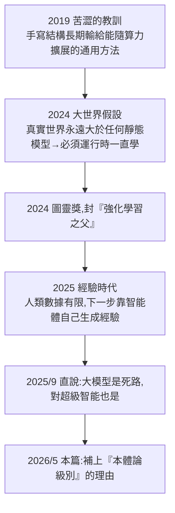

# Sutton 的「行動認知 AI(enactive AI)」:一張自相矛盾的反大模型藍圖

> 來源:基地〈七頁論文,零算法零跑分,卻讓紅杉英偉達谷歌一起下注 11 億!什麼是"行動認知 AI"?能淘汰生成式 AI?〉。2026 年 5 月,**Richard Sutton**(2024 圖靈獎得主、強化學習之父、《強化學習導論》與〈苦澀的教訓〉作者)在 arXiv 掛出一篇**七頁、零實驗、零跑分、零新算法**的哲學立場文,給整條「反大模型」路線補哲學地基。本筆記拆解它在主張什麼、為何被全世界讀錯、以及它**自身埋的兩根會自爆的柱子**,和押在它身上的三桌商業賭注。

> ⚠️ 本片為無字幕影片,逐字稿以 CPU Whisper 轉錄,**人名/公司名/數字可能有聽寫誤差**(已盡量校正),細節請以原始論文與報導為準。

---

## 一句話總結

這篇論文同時是兩樣東西:**一記有先見之明的警告**(準確點出今天生成式 AI 缺了什麼——扎根的、能動的、自主的經驗),**也是一張自相矛盾的藍圖**——Sutton 借來反大模型的兩根哲學柱子,一根砸在他自己的「獎勵假設」上,另一根直接撞穿他喊了一輩子的「苦澀的教訓」。**一個人反對大模型的全部底氣,最後踩中的是他自己立的兩條鐵律。**

---

## enactive ≠ generative(這是最大的誤讀)

`enactive`(行動認知/生成認知)這個詞極易「望文生義」被和 `generative`(生成式)混為一談,但**它講的恰恰是生成式的反面**:

| | 生成式(GPT / Sora) | enactive(行動認知) |
|---|---|---|
| 在做什麼 | 把一段畫面/文字**順著往下預測下一幀/下一詞** | 當腦中現成模式**撞上真實環境被打破**時,當場決定下一步做什麼 |
| 本質 | 續寫已有的 | 在互動裡**現成生真知** |

- enactive 出自認知科學(**Varela、Thompson、Noë**),講的是「認知怎麼從**身體與環境的互動**裡長出來」。
- 核心要害:**感知與行動纏死在一起**。「你想伸手去夠杯子,不是眼睛先拍張靜態照片再讓大腦算出『這是杯子、距離多少』;而是你手一探、角度一變、光影一移,杯子的形狀與遠近**在這個動作裡才一點點長出來**。你不動,世界就是一團沒分化的可能性,躺在那不向你顯形;你一動,它才向你顯形。」
- 背後還有更激進的一層——**自主性(autonomy)/ 自創生(autopoiesis)**:智能體被當成像生物一樣**自我維持、自我組織**的東西,「什麼算好、什麼算成功」這套**規範性必須從它自己脆弱、隨時會崩解的物理組織裡長出來**,不是等外部權威拿鞭子操控的輸入輸出機器。

---

## Sutton 憑什麼:一條打了好幾年的路線,這是最後一塊拼圖

- 前面這一路**全是『算帳』**:算力的帳、數據的帳、複雜度的帳——能證明大模型**不夠高效**,卻始終證明不了大模型**在原理上就不可能**。
- 這篇論文補的就是最後一塊:第一次把強化學習那套機制,接到「**通過行動來感知**」的認知科學血脈上,給出一個**本體論級別**的理由——經驗時代不只是「算法上更省」,而是「**認識世界這件事本身,就只能這麼發生**」。

**商業下注已下:** 經驗時代論文的共同作者去倫敦開了一家公司,目標是「造一個完全靠自己學、一行人類數據都不用的 AI」。**還沒產品、沒收入,光憑這套哲學敘事就融資 11 億美元、估值 51 億美元**,掏錢的是**紅杉、英偉達、Google**——等於矽谷半個錢袋子都壓在「Sutton 是對的」這一邊。(公司名 Whisper 聽寫不確定。)

---

## 地基上的兩根裂柱(論文的自相矛盾)

### 柱子一：砸在「自主性」上 —— 撞自己的獎勵假設

- Sutton 信奉**獎勵假設(reward hypothesis)**:所有目標、意圖、衝動,歸根結底都能寫成一句話——「**最大化期望累積的標量獎勵**」(最大化一個分數)。搭檔 **David Silver** 2021 還推到極致喊出「**獎勵就夠了(Reward is Enough)**」。
- 但 enactive 的**自主性**咬定:規範性必須從智能體**自己內部**長出來,不能外部給。
- **撞點**:標準強化學習(含 Sutton 主推的 Actor-Critic 架構)裡,那個獎勵函數是**人從外面一行代碼硬塞進去的**;算法只負責把這個外部分數頂高,它不知道、也不在乎為什麼這樣打分。**論文自己白紙黑字承認:「評估標準仍由外部獎勵函數定義」**→ enactive 意義上的完全自主**並未實現**。自己立的廟自己拆。
- **補救無效**:有人會說「加個內在動機(好奇心驅動 RL、認識論驅動)不就好了?」——但那只是把外部性**往內又推一層**:那個內在目標(最大化新穎度/資訊增益、最小化預測誤差)的規矩**還是人在架構層定死的**,不是從「我會不會死」這種生存攸關裡自己冒出來。enactive 哲學家早堵死這條路:**沒有真正的生物學脆弱性、沒有性命攸關,就沒有真正的意義生成**。

### 柱子二：撞穿「苦澀的教訓」—— 他自己最有名的那句話

- 〈苦澀的教訓〉(2019,他最有名的短文)主張:**把『我們以為自己是怎麼思考的』硬編碼進系統,長期一定行不通**;能隨海量算力與數據無縫擴展的**通用方法**,終將碾壓所有手工結構(他當年舉例:手寫啟發式規則、句法樹、手工特徵檢測器,短期見效、長期被深度學習碾)。
- **撞點**:enactive 恰恰是**一套關於「認知該怎麼組織」的理論**,而且規矩特別細——要求感知與動作必須焊成一個迴環、要求「先看一個東西能拿來幹嘛而非長什麼樣」、要求腦子裡別存世界的內部模型。Sutton 現在主張 AI 架構要跟這套概念對齊——**這正是他當年痛罵的「理論硬編碼」**。自己定的規矩,自己第一個破。
- **唯一的辯護活路**:Sutton 擁抱 enactive **不是在規定「內容」(答案/邏輯/寫死的世界模型),而是在規定「元結構/拓撲」**——他不告訴智能體該想什麼,只規定「你必須去互動、必須通過行動感知、必須持續適應」。給最低限度的具身腳手架,別的全靠自己經驗學;這樣擴展時膨脹的是**世界的複雜度**而非**人類代碼的複雜度**,反而是苦澀教訓的「終極實現」。**但這套辯護只擺平了一半人。**

---

## 認知科學的兩把刀:連在「人」身上都先過不了關

哲學圈還有一波根本不接 enactive 的底層假設,手裡兩把刀比上面更狠——**就算 Sutton 這套完全自洽,它在人身上都先過不了一道坎**:

1. **向上擴展問題(scaling-up problem)**:enactive 最拿手的是**第一階感覺運動**(接快抽的乒乓球、昆蟲在亂地形導航、嬰兒學走路)——全靠連續身體互動,行動感知咬成迴環,不需腦中先畫軌跡圖。但人腦遠不只接球走路:算積分、寫一句沒人寫過的話、盤算一件還沒發生的未來——這類**「表徵飢渴(representation-hungry)」**的離線、抽象任務,處理的東西當下不在眼前、摸不著,只能在腦中操作「表徵」(替某東西站著的內部影子)。**enactive 解釋不了**。最能說明問題的是激進派自己的退讓:**Hutto & Myin** 搞的激進 enactivism 要清除一切心理表徵,最後也得承認高階認知終究得靠某種符號/語言的腳手架——**連最激進的清除派都得給表徵留後門**。那憑什麼假設「enact 優先」的架構是通往 AGI 的最優路?**AGI 注定要幹高度抽象的活,地基連第一層樓都沒蓋上,就指望它直接升起摩天樓。**
2. **耦合-構成謬誤(coupling-constitution fallacy)**:**Adams & Aizawa** 批延展心智。恆溫器的雙金屬片與空氣溫度**耦合**,但空氣不是恆溫器的一部分(只是它感應的對象)。**耦合是一回事,構成是另一回事**;一個東西跟環境緊密互動,不等於環境就變成它本身的一部分。套到 Sutton:**身體是 AI 學習的來源,不是智能本身的材料**。而且這條路有現成繞法——VLA 可以靠**離線視頻數據**把物理世界的動力學整個內化(看一萬段別人接球的錄像,照樣學會接球的物理規律),enactive 要求的「實時感覺運動耦合」當場被切掉,智能照樣鏟出來。

---

## 工程派根本不聽哲學:VLA 已經在疊衣服了

- 2026 年 **ICLR**(機器學習頂會)收到約 **164 篇 VLA(Vision-Language-Action,視覺-語言-動作)模型**投稿——**前一年只有 9 篇,再前一年 1 篇,一年 18 倍。** 玩家:**NVIDIA(GR00T)、Google(Gemini Robotics)、史丹佛、Physical Intelligence**。
- 它們在沒專門訓練過的環境零樣本上手幹活。**怎麼實現「行動-感知耦合」?** 不是靠自創生、不是靠內在規範性、更不是靠運行時邊幹邊學,而是靠**海量、離線、有人標註的數據集映射**——把「具身」這件天大的事,當成一道**複雜的序列預測題**來解。NVIDIA GR00T 餵的是數千小時真人遙控操作數據,再丟進仿真器生成幾十萬條合成軌跡。靠的是**數據基礎設施、乾淨標註、品質把控,沒有一行架構是為了承諾 enactive 的自主性**。
- 按 Sutton/Rafi 的嚴格定義,這些 VLA 至今仍是**「脫離身體的模式識別」,根本不算具身**。可就是這些「不算具身」的東西,已經在**疊衣服、分揀物流、在動態零售貨架間穿行**——動作還笨拙(抓空、卡格),但方向對、能力曲線一年一個台階,**而且一條 enactive 架構約束都沒採納,結果自己長出來,哲學一個字沒要**。

> **但有一種更要命的讀法**:VLA 成功的前提是「數千小時真人操作的物理數據=身體在世界裡反覆互動的痕跡」。換句話說,**Sutton「必須具身、必須有互動數據」那一半,恰恰被 VLA 證明是對的**——VLA 是**踩著它那一半**成功的,只是不需要它配套的「內在規範 + 運行時持續學習」那層哲學外殼。所以這把刀砍掉的,到底是 Sutton 整個論證,還是只砍掉了哲學外殼、反而把「具身才是出路」的硬核插得更亮?

---

## 歷史早演過一回:Brooks 的 30 年前

- **Rodney Brooks** 旗上寫過「**無表徵的智能(Intelligence without Representation)**」:智能不需腦中裝世界模型,機器人不用先在中央 CPU 畫地圖、推演一遍再行動,而是**一層層簡單行為疊上去**,複雜智能從身體跟物理世界的硬碰硬裡自己長出來。他給這套起名「**包容架構(subsumption architecture)**」——這不就是 enactive「身體即模型」的工程版?同路還有動態視覺、形態計算。
- 這是深度學習稱霸前最硬的具身派工程實踐,**然後輸了**:2000 年代 AI 寒冬,手工搭的感覺運動迴環,被表徵繁重、數據驅動的機器學習碾過去,輸的原因特別直接——**動態擴展能力干不過**。
- 30 年前因「擴展不動」而失敗的路,今天 Sutton 要借強化學習**原封不動請回來**,把深度神經網絡「能擴展」的本事,跟行為主義機器人「腳踩實地的物理現實」焊到一塊。**失敗→邊緣化→回歸,同一個思想繞了 30 年又佔回舞台中央。**

---

## 更尷尬的:就連具身圈,強化學習也未必是最配的那個

- Sutton 框架最強的理論對手是 **主動推理(Active Inference)**(**Karl Friston**,根子是**自由能原理**)。
- 對比:**強化學習**目標=最大化外部塞進來的累積獎勵(貝爾曼方程);**主動推理**目標=最小化智能體自己內部的自由能。RL 把感知歸感知、行動歸行動兩段分開;主動推理裡**感知與行動相互耦合、為的是同一個目標**。**最關鍵在評估標準**:RL 的好壞是外面那個獎勵函數硬定死的;**主動推理的好壞,是從智能體「自己想活下去」的需求裡自然長出來的**,求知與求生在數學上統一在同一個自由能裡,不用外掛任何啟發式。
- 而 enactivism 那根柱子要的**恰恰就是自主性**——按這標準量,**主動推理比強化學習貼 enactivism 優雅太多**。
- **那 Sutton 為何不選它?** 大半是歷史關係 + 一點倔強的實用主義:**強化學習在算力密集環境擴展得漂亮極了(AlphaGo、AlphaZero 是活證據);主動推理塞進深度神經網絡架構,計算一擴展就跑不順。** 於是局面變成:一個哲學上更不蠢、卻擴展不動的主動推理被晾在一邊;一個哲學上沒那麼乾淨、卻擴展飛起的強化學習被選上台。**Sutton 選了後者——寧可要那個能擴展的。而這選擇本身,不正是他〈苦澀的教訓〉的全部邏輯?** 繞了一大圈,他給反大模型路線補的哲學地基,最後還是踩在他自己那條老規矩上。

---

## 三桌人、三筆賭注、三個年份

| 桌 | 誰 | 押什麼 | 賭哪年見分曉 |
|---|---|---|---|
| **第一桌** | Sutton & Silver(那家融資 11 億的新創) | 靜態數據堆規模是死路;超級智能得靠**持續、親身經歷的學習**,讓智能體鑽進複雜多變的世界自己採數據 | **2028**:大模型與傳統 VLA 撞硬牆(樣本效率、適應性,一碰嚴重超出訓練分布的物理現場就抓瞎);該新創的智能體在全新環境展示碾壓式零樣本適應力 |
| **第二桌** | OpenAI、Anthropic 等 | enactive 那套批評是歷史短視、過度悲觀;龐大大模型已從人類文本 + 合成數據編碼足夠世界知識,**體驗式學習不是認知根本地基**,只是疊在龐大表徵模型上的一層 | **2028**:純數字的離線預訓練 + 合成仿真數據,最終能解高度複雜的交互物理任務(高級機器人操作、生成全新數學證明);一旦解出,Sutton 的具身與生物學自主性對 AGI「是否必須」就被徹底否定 |
| **第三桌** | NVIDIA、Google、Physical Intelligence(機器人派) | 乾脆**繞開整場哲學辯論**:承認物理具身與行動-感知耦合必要,但「必須內在自主、必須運行時持續學習」徹底不認;物理智能就是另一道統計題,**擴散 Transformer + 海量離線遙操作數據**就能解 | **2030**:成功部署在高度動態真實環境(亞馬遜倉庫、無結構家庭)的機器人,會完全跑在**靜態、後訓練好的 VLA** 上,頂多配一點淺空間世界模型;「自我維持、運行時持續學習」這套生物學需求,會被**中心化、雲端的整隊更新**徹底取代——直接正面否定 enactive「本地自創生才是真正意義生成所必須」的核心主張 |

> **答案不會在 arXiv 上吵出來,只會在 2020 年代末的商業部署戰場上真刀真槍決出來。牌已攤在桌上,剩下的就看到 2030 年,哪一桌的籌碼還在。**

---

## 應用案例 / 對投資與技術判斷的啟示

- **看懂這波「反大模型」投資在賭什麼**:當你看到「不用人類數據、完全自學」的 AI 新創拿到天價估值(11 億融資、51 億估值),它賣的是 Sutton 這套**本體論敘事**而非產品——要評估它,就看「2028 大模型撞牆 vs 大模型繼續吃下物理任務」這個賭局,而不是看它當下有沒有跑分。
- **辨識「自相矛盾的權威」**:即使是圖靈獎得主的立場文,也可能踩中自己立的鐵律。判斷一條技術路線,**看它的論證能不能自洽**(獎勵假設 vs 自主性、苦澀教訓 vs 硬編碼認知理論),比看作者頭銜重要。
- **具身/世界模型路線的座標**:這篇與本庫 [[jepa-lecun-world-models]](LeCun 的 JEPA,另一條反 LLM 的路)同屬「大模型之外還有沒有別條路」之爭——LeCun 押非生成式世界模型、Sutton 押 enactive 強化學習、主動推理押自由能,三者都在挑戰「scale LLM 就能到 AGI」。
- **務實派的提醒**:工程派 VLA「哲學一個字沒要、東西已經在疊衣服」這件事說明——**能擴展 + 有數據基礎設施,往往先把哲學爭論甩在身後**;但別忘了它成功**踩著的正是「必須具身、必須有互動數據」那一半**。

相關筆記:[[jepa-lecun-world-models]]、[[bitter-lesson-cut-old-patterns]](苦澀教訓在 prompt 工程的應用)、[[rsi-recursive-self-improvement-anthropic]]、[[pddl-instruct-llm-planning]](外部獎勵/驗證的角色)。

---

## 來源

- 基地,〈七頁論文,零算法零跑分,卻讓紅杉英偉達谷歌一起下注 11 億!什麼是"行動認知 AI"?能淘汰生成式 AI?〉,YouTube:<https://youtu.be/VD9zEKQEJxo>(2026-06-07)
- 評論對象:R. Sutton 等,enactive AI 哲學立場文(arXiv,2026-05);相關背景:Sutton〈The Bitter Lesson〉(2019)、〈The Era of Experience〉、Silver & Sutton "Reward is Enough"(2021);認知科學:Varela/Thompson/Noë(enactivism)、Hutto & Myin(激進 enactivism)、Adams & Aizawa(耦合-構成謬誤)、Rodney Brooks(subsumption architecture)、Karl Friston(主動推理/自由能原理)。
- **該片無字幕,逐字稿以 CPU 版 faster-whisper 轉錄取得,非官方字幕;人名、公司名、投稿數字與年份可能有聽寫誤差**,關鍵數據請以原始論文/報導查證。
