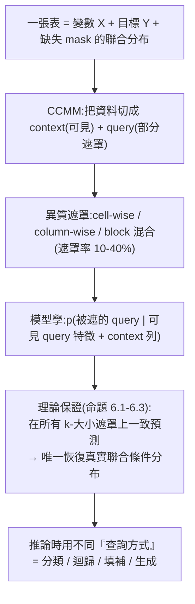

# LimiX:用「遮罩聯合分布」打造的結構化資料(表格)基礎模型

> 來源:LimiX 論文〈Unleashing Structured-Data Modeling Capability for Generalist Intelligence〉(arXiv:2509.03505,Stable AI × 清華)與其開源程式碼 <https://github.com/limix-ldm-ai/LimiX>(Apache 2.0)。本筆記依慣例 clone repo 讀完原始碼後整理:LimiX 是**第一個面向通用智能的結構化資料基礎模型**——把表格資料當成「變數 + 缺失」的聯合分布,**單一模型不改網路結構就涵蓋分類、迴歸、缺失值填補、表格生成**,在 10 個主流基準上勝過 XGBoost、傳統表格深度學習與既有表格基礎模型(TabPFN-v2、TabICL)。

---

## 一句話總結

LimiX 把「表格學習」從「每個任務一條專用管線」變成「一個基礎模型查不同的條件分布」:用 **Context-Conditional Masked Modeling(CCMM)** 在合成的因果資料上學「給定可見資料,預測被遮罩格子」的聯合條件分布;推論時是 **in-context learning(無需梯度更新)**——丟進 `x_train / y_train / x_test` 就直接出預測。架構關鍵是 **axis-wise attention**:每層交錯做「特徵維 self-attention」與「樣本維 cross-attention(test 看 train)」。

---

## 問題:表格學習為什麼一直「碎片化」

- 傳統上,分類、迴歸、缺失值填補、資料生成各用**不同模型、不同管線**;近期 TabPFN 等基礎模型有潛力,但通用性仍受限、常需 per-task 架構。
- LimiX 要做一個**真正統一**的基礎模型:同一套訓練與推論流程,涵蓋分類、迴歸、缺失值填補、特徵選擇、樣本選擇、因果推論——**從「客製管線」轉向「基礎模型式的表格學習」**。

---

## 核心思想:把表格當「聯合分布」,用隨機遮罩學它



- **與 BERT 式遮罩不同**:CCMM 把每個資料集切成 **context 子集**與 **query 子集**,學「在可見的 query 特徵 + context 列的條件下,預測被遮罩的 query 格子」。這種 **episodic** 形式讓模型在推論時能「**快速、免訓練地適應**」新資料集(無梯度更新)。
- **理論基礎**:論文證明「在所有 k 元素遮罩模式上做一致的條件預測,可唯一恢復聯合分布 `p(X_query | X_context)`」——這替「一個模型查不同條件就能做所有下游任務」提供了數學依據。
- **訓練資料全是合成的**:用**階層式結構因果模型(SCM)**——有局部因果結構的有向無環圖(DAG),邊的函式有三種(MLP、卷積層、決策樹),搭配 graph-aware + solvability-aware 取樣,讓模型見過多樣的因果結構、函式族、稀疏度與噪聲。

---

## 架構(讀原始碼)

`model/transformer.py` 的 `FeaturesTransformer.forward` 揭示了完整流程:

1. **輸入**:`x`(含 train+test,形狀 `[batch, seq, feature]`)、`y`(train+test)、`eval_pos`(train/test 分割點)。
2. **缺失即一等公民**:`x = {'data':x, 'mask':torch.isnan(x)}`——缺失值用 mask 標記;**test 的 y 直接設為 NaN**(`y["data"][:, eval_pos:] = torch.nan`),模型要去「填」它。
3. **特徵分組**:每 `features_per_group=2` 個欄位打包成一個 token group。
4. **DFE / 特徵位置嵌入**:`subortho` 模式下,用**正交初始化**的低秩碼經線性層升維後加到特徵上(`add_embeddings`),確保不同欄位**可區分**(欄位無自然順序,需要可區分但不強加順序的識別)。
5. **cls/reg 混合嵌入**:`mixed_y_embedding` 依 `y_type` 把分類目標走 `cls_y_encoder`、迴歸目標走 `reg_y_encoder`,再合併——所以**同一模型天然支援分類與迴歸**。
6. **過 12 層 axis-wise attention**,最後取 test 位置輸出,分別過 `cls_y_decoder` / `reg_y_decoder`(分類出 logits、迴歸出純量);`mask_prediction=True` 時還會用 `feature_decoder` 還原特徵(=缺失值填補)。

### Axis-wise Attention(`model/layer.py` 的核心)

每個 `EncoderBaseLayer` 的 `layer_arch='fmfmsm'` 把一層拆成 6 步:**feature-attn → MLP → feature-attn → MLP → sample-attn → MLP**(2 次特徵注意力 + 1 次樣本注意力 + 3 個 MLP,殘差連接)。兩種注意力本質不同:

| | Feature attention | Sample(sequence)attention |
|---|---|---|
| 作用維度 | 特徵維 `[B, S, F, E]` 對 F | 樣本維 `[B, F, S, E]` 對 S(transpose 後) |
| 型態 | `qkv_combined=True`(self-attention,欄位互看) | `qkv_combined=False`(cross-attention) |
| 關鍵 | 讓同一列的欄位互相refine | **train 樣本自己 self-attention;test 樣本用 train 當 KV 做 cross-attention** |

> **這就是 in-context learning 的心臟**(`call_sequence_attention`):
> ```python
> # train 樣本彼此 self-attention
> x_train = seq_attn[0](x[:, :eval_pos].transpose(1,2), x_kv=x[:, :eval_pos].transpose(1,2))...
> # test 樣本「檢索」train 樣本:用 train 當 key/value 做 cross-attention
> x_test = seq_attn[1](x=x[:, eval_pos:].transpose(1,2),
>                      x_kv=x[:, :eval_pos].transpose(1,2), ...)
> ```
> 測試樣本透過注意力「看」訓練樣本來形成預測——**所以給新表格不用重新訓練,把 train 當 context 餵進去就能預測**。

- **工程細節**:優先用 **FlashAttention**(`flash_attn_varlen_*`),OOM 時自動 fallback 到 `chunked_flash_attention` 分塊、再不行轉 CPU;`embed_dim<512` 時 LayerNorm 用半精度提速。
- **attention 分數可導出**:`caculate_attention_score` 算出 sample/feature 的注意力分數 → 用於下面的 retrieval。

---

## 推論:in-context + 注意力導引的檢索集成

- **介面極簡**(`inference/predictor.py` 的 `LimiXPredictor`):`predict(x_train, y_train, x_test)` 直接回預測,**沒有 `.fit()` 訓練步**。
- **Attention-Guided Retrieval Ensemble**:用學到的注意力分數**檢索資訊量大的 in-context 樣本與特徵**,做可選的輕量集成(分類 4 條管線、迴歸 8 條),**不需額外訓練**就提升表現;有 / 無 retrieval 由 config 切換(retrieval 較準、no-retrieval 較快省記憶體)。retrieval 集成需 ≥ RTX 4090,並可用 Optuna 調檢索超參。
- **兩種尺寸**:**LimiX-16M**(分類/迴歸/缺失填補)、**LimiX-2M**(更省顯存、更快,retrieval 機制加強;已被 **ICML 2026** 接收)。

**最小用法(README 範例):**
```python
from inference.predictor import LimiXPredictor
clf = LimiXPredictor(device=torch.device('cuda'), model_path=ckpt,
                     inference_config='config/cls_default_retrieval.json')
prediction = clf.predict(X_train, y_train, X_test)   # 乳癌資料集,直接出機率
```
迴歸同理(california housing,記得先把 y 標準化)。

---

## 結果

- **分類**(BCCO-CLS 106 個資料集、TALENT、OpenML-CC18、TabArena、PFN 等 5 個基準):LimiX-16M 在 ROC AUC / accuracy / F1 平均排名最佳,**顯著勝過 AutoGluon、TabPFN-v2、TabICL**。
- **迴歸**(BCCO-REG 50 個資料集、TALENT、CTR23、PFN):LimiX-16M 在 R² 與 normalized RMSE 都領先,且在不同樣本量、類別特徵密度下都穩定。
- 另外展示:**缺失值填補、資料生成(迭代遮罩取樣)、分布外(OOD)穩健性**,以及**首個系統性的表格基礎模型 scaling law**(模型與資料規模共同影響表現)。

---

## 應用案例

- **一張表四件事,一個模型搞定**:你有一份含缺失的客戶表,想 ① 預測流失(分類)② 估計客單價(迴歸)③ 補齊缺失欄位 ④ 生成合成資料做隱私保護——過去要四套管線,LimiX 用**同一個 checkpoint、查不同條件**就全包。
- **小資料 / 免調參的強基線**:因為是 in-context(`predict(X_train, y_train, X_test)` 免訓練),很適合當「資料量不大、不想煉 XGBoost 超參」時的**開箱即用 SOTA 基線**——尤其論文顯示在高維、類別特徵多的情境仍穩,而這正是傳統方法常退化的地方。
- **缺失值填補當前處理**:`mask_prediction=True` 時用 `feature_decoder` 還原被遮的格子,把「填補」和「預測」統一在同一遮罩機制下。
- **與 LLM 路線的對照**:LimiX 證明「**基礎模型 + in-context learning + 注意力**」這套範式不只屬於文字——把模態換成表格、把「下一詞預測」換成「遮罩聯合分布」,同樣能長出通用能力。可對照本庫 [[llm-explained-3blue1brown]](LLM 的下一字預測與 attention)、[[jepa-lecun-world-models]] / [[sutton-enactive-ai]](非 LLM 的基礎模型路線之爭)。

---

## 關鍵檔案地圖(repo)

| 檔案 | 內容 |
|---|---|
| `model/transformer.py` | `FeaturesTransformer`:embedding、cls/reg 混合、forward 主流程 |
| `model/layer.py` | `EncoderBaseLayer`(fmfmsm)、`MultiheadAttention`(flash/chunked)、feature vs sample attention |
| `model/encoders.py` | x/y 編碼器、缺失值處理 |
| `inference/predictor.py` | `LimiXPredictor.predict(x_train, y_train, x_test)` 對外介面 |
| `inference/inference_method.py`、`utils/retrieval_utils.py` | retrieval 集成推論 |
| `config/*.json` | 16M/2M × 有無 retrieval × MVI 的推論設定 |
| `examples/demo_*.py` | 分類 / 迴歸 / 缺失值填補範例 |

---

## 來源

- LimiX Team(Stable AI × 清華),〈LimiX: Unleashing Structured-Data Modeling Capability for Generalist Intelligence〉,arXiv:<https://arxiv.org/abs/2509.03505>(2025-09;HTML v2)。
- 開源程式碼(Apache 2.0):<https://github.com/limix-ldm-ai/LimiX>;模型權重 LimiX-16M / LimiX-2M 於 HuggingFace `stableai-org`。LimiX-2M 已被 ICML 2026 接收(arXiv:2606.04485)。
- 本筆記架構與程式碼片段係 clone repo 讀 `model/`、`inference/` 原始碼後整理(暫存 clone 已於整理後刪除)。
