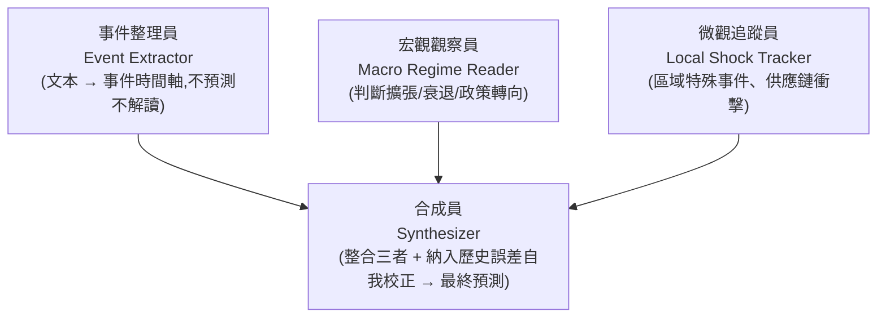

# Nexus:用四代理分工,把「事件」帶進時間序列預測

**主題分類:** AI / 多代理系統 × 時間序列預測
**研究對象:** Google × 賓州州立大學的 Nexus 論文(經 ai-coding.wiselychen.com 文章解讀)
**整理日期:** 2026-05-25

---

## 1. 核心主張

> **「有些模式是事件造成的,不是時間造成的。」**

傳統時間序列模型(ARIMA、Prophet、TSFM)只讀數字、外推歷史曲線,讀不懂背後的事件與因果。例如 2020 年房屋庫存暴跌,模型看不懂封城與供應鏈斷裂。反過來,LLM 懂事件卻不擅長數值計算——存在 **「理解能力」與「計算能力」的分離**。Nexus 用多代理分工把兩者接起來。

---

## 2. 四代理架構

1. **事件整理員:** 把新聞、公告、報告轉成事件時間軸,純整理,不預測。
2. **宏觀觀察員:** 判斷市場體制——擴張、衰退、政策轉向。
3. **微觀追蹤員:** 追蹤偏離大趨勢的區域/局部異常。
4. **合成員:** 整合前三者輸出,並把 **歷史預測誤差** 納入 context 自我校正,產生最終預測。

---

## 3. 成果與限制

**成果:**
- 相比直接 CoT prompt,在房地產資料集 **MAPE 降低 86.6%**。
- 與最優 TSFM 持平或更佳。

**論文自述限制(務必留意):**
- 測試集窄(2 領域、數十條序列)、單次評估、未平均化。
- 未提供成本分析(token / 延遲)。
- 使用訓練截止後的資料,未必代表真實部署表現。

---

## 4. 三個可遷移的工程原則

1. **分工明確化:** 角色定義比模型選擇更重要。(呼應 [[12-factor-agents]] Factor 10「小型聚焦代理」)
2. **誤差記憶化:** 把歷史預測失敗放進 context,實現「免微調」的自適應。
3. **任務拆解:** 「結構幫助 LLM 使用 context,而不是讓它在 context 裡迷失。」

> 適用場景:房地產、股票、電商等 **事件驅動波動** 的預測。預測範式應從「純外推」轉向「討論是什麼讓曲線移動」。

---

## 來源

- [ai-coding.wiselychen.com:Nexus 多代理時間序列預測解讀](https://ai-coding.wiselychen.com/nexus-google-time-series-forecasting-multi-agent/)
