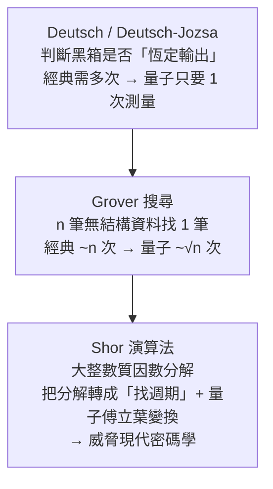

# 量子計算:量子效應如何突破計算的邊界

**主題分類:** 科技 / 量子計算(科普)
**來源:** YouTube〈【漫士】量子計算:量子效應如何突破計算的邊界〉(Meditation Math 漫士沉思錄,清華 AI 博士生科普;2025-09-06,約 39 分;依逐字稿整理)
**整理日期:** 2026-05-30

---

## 0. 一句話

量子計算 **不是「同時試遍所有答案的影分身」**,而是用 **疊加 + 干涉** 操控一個巨大的機率向量,讓「正確答案的本征態」測得的機率盡量大——最後測一次,大機率得到答案。

---

## 1. 三個量子基礎現象

- **疊加態(superposition):** 測量前粒子可同時「是 0 也是 1」。測自旋可能正可能負,測前無法得知。
- **坍縮(collapse):** 一旦測量,結果就 **永遠定格** 在第一次的值,不再變動。
- **量子糾纏(entanglement):** 兩粒子狀態關聯——測一個,另一個 **瞬間** 坍縮成對應值(如「自旋永遠相同」)。

---

## 2. 怎麼描述一個量子位元(qubit)

關鍵洞見:**疊加態不能只用「兩個機率」描述**(影片例:兩個看似相同的疊加態,過相同磁場後一個變全正、一個變全負 → 它們其實不同)。要用 **向量**:

$$|\psi\rangle = a|0\rangle + b|1\rangle,\quad a^2+b^2=1$$

- `|0>`、`|1>` 是兩個本征態(Dirac 的 bra-ket 記法);量子態 = 單位圓上的向量。
- `a²`、`b²` = 測得 0 / 1 的機率。磁場之類的操作 = **旋轉這個向量**(例:旋轉 45° 把「一半一半」轉成確定的 0 或 1)。

**為什麼量子計算「空間大」:** n 個粒子有 **2ⁿ 個系統本征態**,整個量子態是這 2ⁿ 個機率的分布——**n 個粒子就能承載 2ⁿ 維空間的運算**。

> ⚠️ **常見誤解澄清:** 「n 個 qubit = 取代 2ⁿ 個經典 bit」是 **錯的**。你 **無法讀出** 任一本征態的係數,只能「測量」並以係數平方的機率得到某個結果。量子計算的藝術是:**用糾纏與操控,讓某個(類)本征態的機率盡量大**,再測量。

---

## 3. 經典計算 vs 量子門

- **經典:** bit(0/1)+ 邏輯門(AND/OR/NOT/XOR)串成電路。一切 **確定性**(輸入定→輸出定),這在某些問題反成短板。
- **量子門:** 操作 qubit,且 **輸入幾個就輸出幾個**(可逆),數學上是 **幺正變換(unitary)**——只允許對量子態空間做 **旋轉/反射**、保持長度、可逆。
  - **Hadamard(H)門:** 把確定態打散成疊加態(幾何上是對 22.5° 軸的反射);過兩次 H 又變回原狀。
  - **CNOT(受控非)門:** 控制位為 1 才翻轉目標位。對「疊加態」作用會 **製造糾纏**(H + CNOT → 得到 √½(|00⟩+|11⟩) 的糾纏態)。
  - **線性疊加:** 量子門對「每個本征態」分別作用,再把原係數賦給新本征態。

---

## 4. 三個經典量子演算法(能力來源)

- **Deutsch-Jozsa:** 用 H 門把輸入打散成疊加、過量子黑箱(用「輔助位係數互為相反數」的技巧,讓「翻轉 y」等價於「翻轉 x 的係數符號」)、再過 H 門反射 → **一次測量** 就知道黑箱輸出是否恆定。經典做不到。
- **Grover:** 反覆對「初始向量」與「正確答案維度」做兩次反射,向量每輪旋轉 2θ(θ≈1/√n)逐漸對齊正確答案 → **約 √n 次** 就能高機率找到(經典要 ~n 次)。
- **Shor:** 把質因數分解轉化為 **找函數週期**,用 **量子傅立葉變換** 快速求週期 → 高效分解。**直接威脅以「大整數分解難」為基礎的加密(銀行、傳輸)**,逼出「後量子密碼學」。

> **加速的本質(澄清):** 不是平行試所有解。把解想成 n 維超立方體的頂點:經典一次只能走一條邊(平均 ~n/2 步);量子態能在歐式空間裡沿 **對角線(長度 √n)** 直線前進 → 這就是「√n 加速」的根源。能不能比 √n 更快?**nobody knows。**

---

## 5. 為什麼還沒有「好用的通用量子電腦」:五座大山(DiVincenzo 準則)

可擴展的物理系統、可靠初始化、**夠長的退相干時間**、通用量子門、高保真測量。最難的兩項:
- **可擴展載體:** 超導電路(Google/IBM)、囚禁離子、光量子(九章)等;難在 **高品質擴展到幾千幾萬個** qubit。
- **退相干(最大敵人):** 疊加/糾纏態極脆弱,溫度、振動、電磁場的微擾都會破壞它(像「隨時會醒的夢」);必須在退相干前算完並測量。目前相干時間多半只有幾百微秒。

---

## 6. 應用案例

- **一家三口決定出遊(經典邏輯門):** 孩子同意 **AND**(父母至少一人同意 **OR**)→ 用 OR 門 + AND 門串成電路,對應「要不要出遊」。展示「計算=用邏輯門一步步處理 0/1」。
- **密碼學威脅(Shor):** 你能秒算 3×5=15,但把大數重新分解回兩個質數極難——現代加密正是靠這個難題;Shor 把它從「天文時間」壓到「以天計」,所以全球在發展 **後量子密碼**。
- **無結構搜尋(Grover):** n 筆資料找特定一筆、無法二分,經典要逐一檢查 ~n 次;量子用 ~√n 次高機率命中。
- **九章 / 高斯玻色取樣(展示量子優越性):** 中科大光量子機,針對「積和式 permanent」這個經典極難問題(行列式只需 n³,積和式本質上得枚舉 n! 種排列),讓光子在分光迷宮中自然演化、直接在出口測得分布——**九章 1 分鐘的結果,經典電腦要算約 1 億年**。意義在於「費曼夢想 40 年後,首次造出量子計算優越性的工程樣機」。

---

## 7. 關鍵 takeaways

1. qubit 要用 **向量(a|0⟩+b|1⟩)** 描述,不是兩個機率;n 個 qubit 承載 2ⁿ 維空間。
2. 你 **讀不出係數**,只能「測量並坍縮」;所以量子計算是 **操控機率幅度 + 干涉**,不是平行試所有解。
3. 已知優勢:Deutsch-Jozsa(常數判定)、Grover(√n 搜尋)、Shor(分解→威脅密碼)。
4. 真正卡關在 **物理實作**(退相干、可擴展),不是理論。
5. 「量子能否對一般問題做指數加速」**至今未知**。

---

## 來源

- [YouTube:【漫士】量子計算:量子效應如何突破計算的邊界(Meditation Math)](https://youtu.be/h7RA7yyMBYY)
