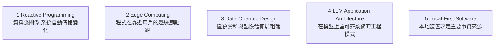

# 現在正在主導的 5 個程式設計概念

> 來源:Shade of Code〈programming concepts that are DOMINATING right now〉。不是 X 上炒兩週就消失的熱點,而是**正在成為「嚴肅工程師如何思考建構軟體」基礎**的概念。影片點出 5 個現在真正主導的範式——不熟悉它們,很快就會感受到能力落差。

---

## 一句話總結

這 5 個概念有個共通主軸:**重新思考「資料/邏輯在哪裡、以什麼方式流動」**——反應式(資料怎麼流)、邊緣運算(程式在哪跑)、資料導向設計(資料在記憶體怎麼排)、LLM 應用架構(怎麼在模型上蓋可靠系統)、本地優先(事實來源在哪)。它們都不是「某個框架的功能」,而是**心智模型(mental model)的轉變**。

---

## 1. Reactive Programming(反應式程式設計)

- **常見誤解:** 多數人以為「懂 reactive」只是「知道 RxJS 存在、會讓 code 看起來很複雜」。
- **真正的意思:** 一種**根本不同的心智模型**——不再用命令式(imperative)一步步告訴程式做什麼,而是**定義資料流(data streams)之間的關係,讓系統自動傳播變化**。
- **為什麼主導:** 現代應用本質上是 **event-driven**——使用者互動、即時資料、WebSocket 連線、並發狀態,全都是 stream 問題。React、SolidJS、Angular 都在積極往這個模型靠。

> **應用案例:** 一個即時儀表板,股價/訂單/通知同時湧入。命令式寫法要手動協調「哪個事件來了要更新哪幾塊 UI」;reactive 則宣告「這塊 UI = 這條資料流的函式」,來源一變,畫面自動跟著更新,不必手動接線。

## 2. Edge Computing Patterns(邊緣運算模式)

- **心智模型的改變:** 「你的程式在哪裡執行」變化得比多數人追蹤的還快。傳統 **client-server 二分**正被一個光譜取代,其中包含**地理上靠近使用者的邊緣節點**,在請求抵達你的 origin server 之前就先做輕量運算。
- **讓它變可行的:** Cloudflare Workers、Vercel Edge Functions、Deno Deploy。
- **冒出來的核心架構模式:** request coalescing(請求合併)、cache invalidation(快取失效策略)、partial personalization(局部個人化)。
- **重點:** 這**不是雲服務商的一個功能,而是「邏輯在哪裡執行」的範式轉移**——任何想讓應用「在全球都感覺很快」的人,這都成了核心架構知識。

> **應用案例:** 全球用戶的電商,把「依地區顯示貨幣/語言、A/B 測試分流、擋惡意請求」放到邊緣節點處理,使用者在當地節點就拿到個人化結果,不必每次繞回美國的 origin server,延遲大降。

## 3. Data-Oriented Design(資料導向設計)

- **從哪來:** 遊戲開發,正快速滲入主流工程。
- **挑戰的假設:** 多數開發者從不質疑「**圍繞物件與行為(OOP)** 組織程式碼是最自然的方式」。資料導向設計主張:**圍繞資料本身、以及它如何在記憶體中流動**來組織,會產生**效能大幅更高、而且往往更簡單**的系統。
- **為什麼主導:** AI workloads + Rust 帶動的系統程式設計復興,讓「**資料佈局(data layout)如何影響效能**」變成主流知識。

> **應用案例:** 要處理百萬個粒子/實體,OOP 把每個物件的所有欄位包在一起(陣列的結構,AoS),走訪時 cache miss 連連;資料導向改成「結構的陣列(SoA)」,把同類欄位連續排放,CPU cache 命中率大增、可向量化,速度數倍提升。

## 4. LLM Application Architecture(LLM 應用架構)

- **不是**「怎麼用 chat」,而是**在語言模型之上建構可靠系統**的實際工程模式:**RAG 架構、agent orchestration(代理編排)、evaluation pipelines(評估管線)、prompt versioning(提示詞版本控管)、context window management(上下文視窗管理)**。
- **為什麼主導:** 這些模式正快速穩定下來。**把它們當「工程問題」而非「API 呼叫」來理解的開發者,才是能做出「在生產環境真的能用」的 AI 產品的人。**
- **重點:** 「會呼叫 LLM API 的人」和「能架構出可靠 LLM 系統的人」——現在這兩者的差距**極其巨大**。

> **應用案例:** 客服 AI。只串 API 的版本一上線就幻覺、回答不一致、改 prompt 沒人知道改了什麼;有架構的版本用 RAG 接知識庫、用 eval pipeline 持續量測準確率、prompt 進版控、管理 context 視窗避免爆掉——對照本庫 [[pddl-instruct-llm-planning]] 的「外部驗證」與 [[claude-dynamic-workflows]] 的編排思路。

## 5. Local-First Software(本地優先軟體)

- **主張:** 應用應該**完全離線可用、有網路時再同步**,並把**本地裝置當成主要的事實來源(source of truth)**,而不是一個等伺服器回應的薄客戶端(thin client)。
- **技術基礎:** **CRDTs(無衝突複製資料型別)、衝突解決、透過 WASM 在瀏覽器裡跑的 SQLite**。
- **為什麼主導:** Linear、Figma 已證明 local-first 架構產生的體驗**從根本上就比傳統 client-server 更好**——**延遲消失了**,使用者不再注意到網路,因為網路不再位於「他們每個操作」的關鍵路徑上。
- **重點:** 這**不是一個效能優化,而是整個應用架構的重新思考**。

> **應用案例:** 協作筆記/設計工具,進地鐵沒網也能繼續編輯,出站連上網自動把本地變更與雲端合併(靠 CRDT 解衝突),全程不轉圈圈——這正是 Figma/Linear 體感「快得不像網頁 app」的原因。

---

## 為什麼值得現在就補

> 影片開頭點題:每隔幾年,最強的開發者實際花時間學的東西就會位移一次——**不是被炒作兩週就消失的,而是成為「如何思考建構軟體」之基礎的概念**。這 5 個共同指向一件事:現代軟體的競爭力,越來越取決於你對「資料與邏輯在何處、以何種方式流動」的心智模型,而非熟悉某個特定框架的 API。

相關筆記:[[scaling-web-architecture-bubble-tea]](架構擴展)、[[css-view-transitions]](前端)、[[claude-dynamic-workflows]] / [[pddl-instruct-llm-planning]](LLM 系統工程)。

---

## 來源

- Shade of Code,〈programming concepts that are DOMINATING right now〉,YouTube:<https://www.youtube.com/watch?v=yVvW0NaWe40>(2026-06-05)
- 影片提及技術:RxJS、React/SolidJS/Angular、Cloudflare Workers/Vercel Edge Functions/Deno Deploy、Rust、RAG/agent orchestration、CRDTs、SQLite+WASM、Linear、Figma。(英文影片,內容以自動字幕整理為繁中。)
