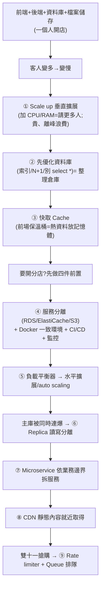

# 為什麼 AI 寫的網站一上線就掛?用手搖飲店看懂網站架構擴展

**主題分類:** 科技 / 系統設計與架構(科普)
**來源:** YouTube〈為什麼你用 AI 寫的網站,一上線就掛?〉(Debug Tuboshu,2026-05-24,約 12 分;依逐字稿整理)
**整理日期:** 2026-05-30

---

## 0. 核心命題

用 Claude Code 兩天做出 SaaS、自己測很順,**一上線就變慢/圖載不出/直接當掉**——因為 **「能動」和「能撐住一千人同時用」是兩件完全不同的事**。

> **AI 時代真正稀缺的能力:看得出「網站到底慢在哪裡」。** 快取、優化資料庫這些 AI 都能幫你做,**前提是你要知道現在該解決的問題是什麼。** 每一個技術都不是第一天就堆上去的,而是 **遇到新問題後,系統「被逼」長出來的**。

用「丁丁泡沫紅茶」從一人小店開到全臺 500 間連鎖的故事,對應網站每一次架構升級:

---

## 1. 升級階梯(每一步都是被問題逼出來的)

| # | 飲料店比喻 | 網站對應 | 重點 |
|---|---|---|---|
| 起點 | 一人小店:櫃臺+後場倉庫+一臺電腦系統 | 前端 + 後端(API)+ 資料庫 + 檔案儲存 | 簡單但脆弱 |
| ① | 請更多人(兔姐搖飲、猴弟拿料) | **Scale up 垂直擴展**(加 CPU/RAM) | 最快但 **貴**,離峰時人力閒置=花冤枉錢 |
| ② | 整理散亂倉庫,拿料變快 | **資料庫優化**:建 **索引**、修 **N+1 query**、別 **select \*** | **第一步不是升級機器,是先優化 DB**(量小沒感覺、量大就崩) |
| ③ | 前場放保溫桶/冰桶,擺熱門料 | **快取 Cache**(熱資料放記憶體,讀取快硬碟 10 倍以上) | 記憶體貴且小 → 只放 **最常用**(熱門貼文/最新消息);要 **定期更新**(讚數/留言會變),避免顯示過舊資料 |
| ④ | 倉庫與系統分離、餐點/管理 SOP 化、加監控 | 服務抽離:DB→**RDS**、快取→**ElastiCache**、圖片→**S3**;**Docker** 保證環境一致(ECS);**CI/CD**(CodePipeline 接 GitHub,push main 自動建置測試部署);**監控**(health check + 抓 log) | 開分店(水平擴展)的 **前置作業** |
| ⑤ | 客人自己去最近的店 | **負載平衡器**(輪流分配流量)→ **水平擴展 / auto scaling**(CPU/記憶體超過門檻自動加機器) | 「現實開分店」很難,但數位世界 **改個數字就水平擴展** |
| ⑥ | 主倉庫被各分店同時連爆 → 加副本倉庫分散讀取 | **Replica 讀寫分離**:主庫負責寫(保一致性)、**讀都走副本庫**,主副定期同步 | 適合「**多人查、少人改**」;DB 為一致性通常只有一臺主庫,別開兩個主庫記帳 |
| ⑦ | 茶葉生意拆成「丁丁茶業」,飲料店歸「丁丁泡沫紅茶」 | **Microservice** 依業務邊界拆獨立服務(圖片/金流/通知各自部署擴展) | 故障被限制在單一服務,不拖垮全系統 |
| ⑧ | 把活動海報/DM 配送到各門市,別塞爆總公司電話 | **CDN** 靜態內容(圖/影片/CSS/JS)就近從最近節點取得 | Vercel/Cloudflare 自帶 CDN,推上去就有 |
| ⑨ | 雙十一一元搶珍奶:門口拉紅龍排隊 | **Rate limiter**(控同時進來人數)+ **Queue**(請求依序處理,先回「已收到處理中」,後臺一筆筆處理) | 搶票/秒殺每筆都要 **寫** DB,不能讓十萬請求同秒打爆 |

> **大多數網站到 ③(優化 DB + 快取)就夠了**;後面是規模再大才會被逼出來。

---

## 2. 應用案例:你的 SaaS 一上線就卡,怎麼按階梯 debug

1. **先盤點「慢在哪一步」**(別急著升級機器)——這正是影片強調、AI 取代不了的判斷力。
2. **第一刀先砍資料庫**:請 AI「檢查索引、找 N+1 query、別 select *」。
3. **熱資料上快取**(Redis/ElastiCache),記得設過期/更新策略。
4. 流量再大 → 服務抽離 + Docker + **水平擴展 + 負載平衡 + auto scaling**。
5. 讀多 → **Replica 讀寫分離**;業務變複雜 → **microservice**;靜態資源慢 → **CDN**(Vercel/Cloudflare 直接有);搶購尖峰 → **rate limiter + queue**。

> **關鍵心法(AI 時代版):** 寫程式變便宜了,你可以直接叫 AI「幫我做快取、優化資料庫」——**但你得先知道現在該解決的是哪個瓶頸**。功能能上線 ≠ 能擺著睡覺等收錢。呼應本 repo [[anthropic-html-work-pages]]「產出變便宜、理解變貴」、[[ai-website-building-claude-code]](同頻道,做網站的設計面)與 [[ai-compute-token-economics]](規模化的隱形成本)。

---

## 來源

- [YouTube:為什麼你用 AI 寫的網站,一上線就掛?(Debug Tuboshu)](https://youtu.be/t5CtfUWJjm4)
